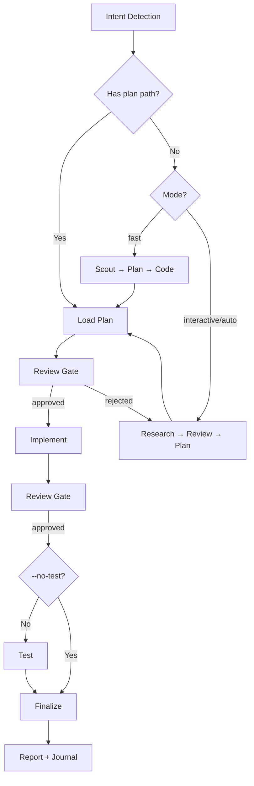

# Cook - Smart Feature Implementation

End-to-end implementation with automatic workflow detection.

**Principles:** YAGNI, KISS, DRY | Token efficiency | Concise reports

## Usage

```
/ck:cook <natural language task OR plan path>
```

**IMPORTANT:** If no flag is provided, the skill will use the `interactive` mode by default for the workflow.

**Optional flags to select the workflow mode:** 
- `--interactive`: Full workflow with user input (**default**)
- `--fast`: Skip research, scout→plan→code
- `--parallel`: Multi-agent execution
- `--no-test`: Skip testing step
- `--auto`: Auto-approve all steps

**Example:**
```
/ck:cook "Add user authentication to the app" --fast
/ck:cook path/to/plan.md --auto
```

<HARD-GATE>
Do NOT write implementation code until a plan exists and has been reviewed.
This applies regardless of task simplicity. "Simple" tasks are where unexamined assumptions waste the most time.
Exception: `--fast` mode skips research but still requires a plan step.
User override: If user explicitly says "just code it" or "skip planning", respect their instruction.
</HARD-GATE>

## Anti-Rationalization

| Thought | Reality |
|---------|---------|
| "This is too simple to plan" | Simple tasks have hidden complexity. Plan takes 30 seconds. |
| "I already know how to do this" | Knowing ≠ planning. Write it down. |
| "Let me just start coding" | Undisciplined action wastes tokens. Plan first. |
| "The user wants speed" | Fastest path = plan → implement → done. Not: implement → debug → rewrite. |
| "I'll plan as I go" | That's not planning, that's hoping. |
| "Just this once" | Every skip is "just this once." No exceptions. |

## Smart Intent Detection

| Input Pattern | Detected Mode | Behavior |
|---------------|---------------|----------|
| Path to `plan.md` or `phase-*.md` | code | Execute existing plan |
| Contains "fast", "quick" | fast | Skip research, scout→plan→code |
| Contains "trust me", "auto" | auto | Auto-approve all steps |
| Lists 3+ features OR "parallel" | parallel | Multi-agent execution |
| Contains "no test", "skip test" | no-test | Skip testing step |
| Default | interactive | Full workflow with user input |

See `references/intent-detection.md` for detection logic.

## Process Flow (Authoritative)



**This diagram is the authoritative workflow.** Prose sections below provide detail for each node. If prose conflicts with this flow, follow the diagram.

## Workflow Overview

```
[Intent Detection] → [Research?] → [Review] → [Plan] → [Review] → [Implement] → [Review] → [Test?] → [Review] → [Finalize]
```

**Default (non-auto):** Stops at `[Review]` gates for human approval before each major step.
**Auto mode (`--auto`):** Skips human review gates, implements all phases continuously.
**Claude Tasks:** Utilize `TaskCreate`, `TaskUpdate`, `TaskGet`, `TaskList` during implementation step. **Fallback:** These are CLI-only tools — unavailable in VSCode extension. If they error, use `TodoWrite` for progress tracking instead.

| Mode | Research | Testing | Review Gates | Phase Progression |
|------|----------|---------|--------------|-------------------|
| interactive | ✓ | ✓ | **User approval at each step** | One at a time |
| auto | ✓ | ✓ | Auto if score≥9.5 | All at once (no stops) |
| fast | ✗ | ✓ | **User approval at each step** | One at a time |
| parallel | Optional | ✓ | **User approval at each step** | Parallel groups |
| no-test | ✓ | ✗ | **User approval at each step** | One at a time |
| code | ✗ | ✓ | **User approval at each step** | Per plan |

## Step Output Format

```
✓ Step [N]: [Brief status] - [Key metrics]
```

## Blocking Gates (Non-Auto Mode)

Human review required at these checkpoints (skipped with `--auto`):
- **Post-Research:** Review findings before planning
- **Post-Plan:** Approve plan before implementation
- **Post-Implementation:** Approve code before testing
- **Post-Testing:** 100% pass + approve before finalize

**Always enforced (all modes):**
- **Testing:** 100% pass required (unless no-test mode)
- **Code Review:** User approval OR auto-approve (score≥9.5, 0 critical)
- **Finalize (MANDATORY - never skip):**
  1. `project-manager` subagent → run full plan sync-back (all completed tasks/steps across all `phase-XX-*.md`, not only current phase), then update `plan.md` status/progress
  2. `docs-manager` subagent → update `./docs` if changes warrant
  3. `TaskUpdate` → mark all Claude Tasks complete after sync-back verification (skip if Task tools unavailable)
  4. Ask user if they want to commit via `git-manager` subagent
  5. Run `/ck:journal` to write a concise technical journal entry upon completion

## Required Subagents (MANDATORY)

| Phase | Subagent | Requirement |
|-------|----------|-------------|
| Research | `researcher` | Optional in fast/code |
| Scout | `ck:scout` | Optional in code |
| Plan | `planner` | Optional in code |
| UI Work | `ui-ux-designer` | If frontend work |
| Testing | `tester`, `debugger` | **MUST** spawn |
| Review | `code-reviewer` | **MUST** spawn |
| Finalize | `project-manager`, `docs-manager`, `git-manager` | **MUST** spawn all 3 |

**CRITICAL ENFORCEMENT:**
- Steps 4, 5, 6 **MUST** use Task tool to spawn subagents
- DO NOT implement testing, review, or finalization yourself - DELEGATE
- If workflow ends with 0 Task tool calls, it is INCOMPLETE
- Pattern: `Task(subagent_type="[type]", prompt="[task]", description="[brief]")`

## References

- `references/intent-detection.md` - Detection rules and routing logic
- `references/workflow-steps.md` - Detailed step definitions for all modes
- `references/review-cycle.md` - Interactive and auto review processes
- `references/subagent-patterns.md` - Subagent invocation patterns
