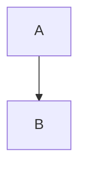

# Mermaid.js Configuration & Theming

Configuration options, theming, and customization for Mermaid.js v11.

## Configuration Methods

**1. Site-wide Initialization:**
```javascript
mermaid.initialize({
  theme: 'dark',
  startOnLoad: true,
  securityLevel: 'strict',
  fontFamily: 'Arial'
});
```

**2. Diagram-level Frontmatter:**
````markdown

````

**3. Configuration Hierarchy:**
Default config → Site config → Diagram config (highest priority)

## Core Options

**Rendering:**
- `startOnLoad`: Auto-render on page load (default: true)
- `securityLevel`: "strict" (default), "loose", "antiscript", "sandbox"
- `deterministicIds`: Reproducible SVG IDs (default: false)
- `maxTextSize`: Max diagram text (default: 50000)
- `maxEdges`: Max drawable edges (default: 500)

**Visual Style:**
- `look`: "classic" (default), "handDrawn"
- `handDrawnSeed`: Numeric seed for hand-drawn consistency
- `darkMode`: Boolean toggle

**Typography:**
- `fontFamily`: "trebuchet ms, verdana, arial, sans-serif" (default)
- `fontSize`: Base text size (default: 16)

**Layout:**
- `layout`: "dagre" (default), "elk", "tidy-tree", "cose-bilkent"

**Debug:**
- `logLevel`: 0-5 from trace to fatal
- `htmlLabels`: Enable HTML in labels (default: false)

## Theming

**Built-in Themes:**
- `default` - Standard colors
- `dark` - Dark background
- `forest` - Green tones
- `neutral` - Grayscale
- `base` - Fully customizable

**Theme Variables (base theme only):**
```javascript
mermaid.initialize({
  theme: 'base',
  themeVariables: {
    primaryColor: '#ff0000',
    primaryTextColor: '#fff',
    primaryBorderColor: '#7C0000',
    secondaryColor: '#006100',
    tertiaryColor: '#fff'
  }
});
```

**Customizable Variables:**
- Color families: primary, secondary, tertiary
- Node backgrounds and text colors
- Border and line colors
- Note background/text
- Diagram-specific (flowchart nodes, sequence actors, pie sections)

**Custom CSS:**
```javascript
mermaid.initialize({
  themeCSS: `
    .node rect { fill: #f9f; }
    .edgeLabel { background-color: white; }
  `
});
```

## Accessibility

**ARIA Support:**
```
accTitle: Diagram Title
accDescr: Brief description
accDescr {
  Multi-line detailed
  description
}
```

**Auto-generated:**
- `aria-roledescription` attributes
- `<title>` and `<desc>` SVG elements
- `aria-labelledby` and `aria-describedby`

**WCAG Compliance:**
Available for all diagram types (flowchart, sequence, class, Gantt, etc.)

## Icon Configuration

**Register Icon Packs:**
```javascript
import { registerIconPacks } from 'mermaid';
registerIconPacks([
  {
    name: 'logos',
    loader: () => import('https://esm.run/@iconify-json/logos')
  }
]);
```

**Usage:**
```
architecture-beta
  service api(logos:nodejs)[API]
```

**Loading Methods:**
1. CDN-based (lazy loading)
2. npm with dynamic import
3. Direct import

## Math Rendering

**KaTeX Support:**
```
graph LR
  A["$$f(x) = x^2$$"] --> B
```

**Configuration:**
- `legacyMathML`: Use old MathML rendering
- `forceLegacyMathML`: Force legacy even if browser supports native

## Security

**Security Levels:**
- `strict` - HTML encoding (default, recommended)
- `loose` - Some HTML allowed
- `antiscript` - Filter scripts
- `sandbox` - Sandboxed mode

**DOMPurify:**
Enabled by default for XSS protection. Customize via `dompurifyConfig` (use caution).

## Layout Algorithms

**dagre (default):**
Standard hierarchical layout for most diagrams.

**elk:**
Advanced layout with better handling of complex graphs.

**tidy-tree:**
Clean tree structures for hierarchies.

**cose-bilkent:**
Compound graph layout for nested structures.

**Per-diagram Configuration:**
````markdown

````

## Common Patterns

**Consistent Hand-drawn Style:**
```javascript
mermaid.initialize({
  look: 'handDrawn',
  handDrawnSeed: 42  // Same seed = consistent appearance
});
```

**Dark Mode Toggle:**
```javascript
const isDark = window.matchMedia('(prefers-color-scheme: dark)').matches;
mermaid.initialize({
  theme: isDark ? 'dark' : 'default'
});
```

**Performance Optimization:**
```javascript
mermaid.initialize({
  startOnLoad: false,  // Manual rendering
  maxEdges: 1000,       // Increase for complex graphs
  deterministicIds: true  // Caching-friendly
});
```

## Validation

**Parse without Rendering:**
```javascript
try {
  await mermaid.parse('graph TD\nA-->B');
  console.log('Valid syntax');
} catch(e) {
  console.error('Invalid:', e);
}
```

**Programmatic Rendering:**
```javascript
const { svg } = await mermaid.render('graphId', 'graph TD\nA-->B');
document.getElementById('output').innerHTML = svg;
```
