# Mermaid.js Practical Examples

Real-world patterns and use cases for common documentation scenarios.

## Software Architecture

**Microservices Architecture:**
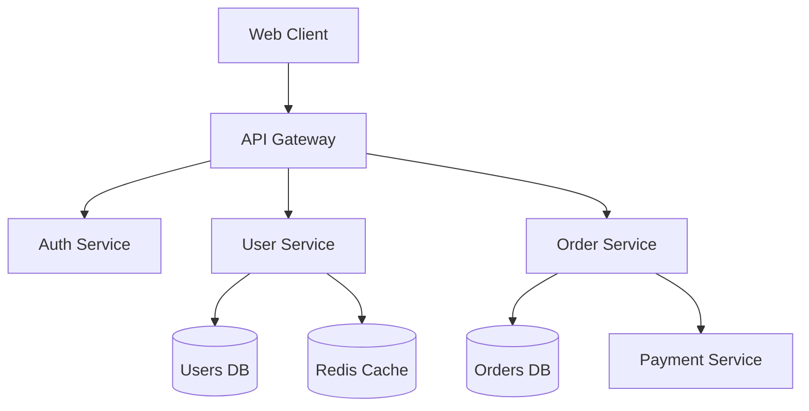

**System Components (C4):**
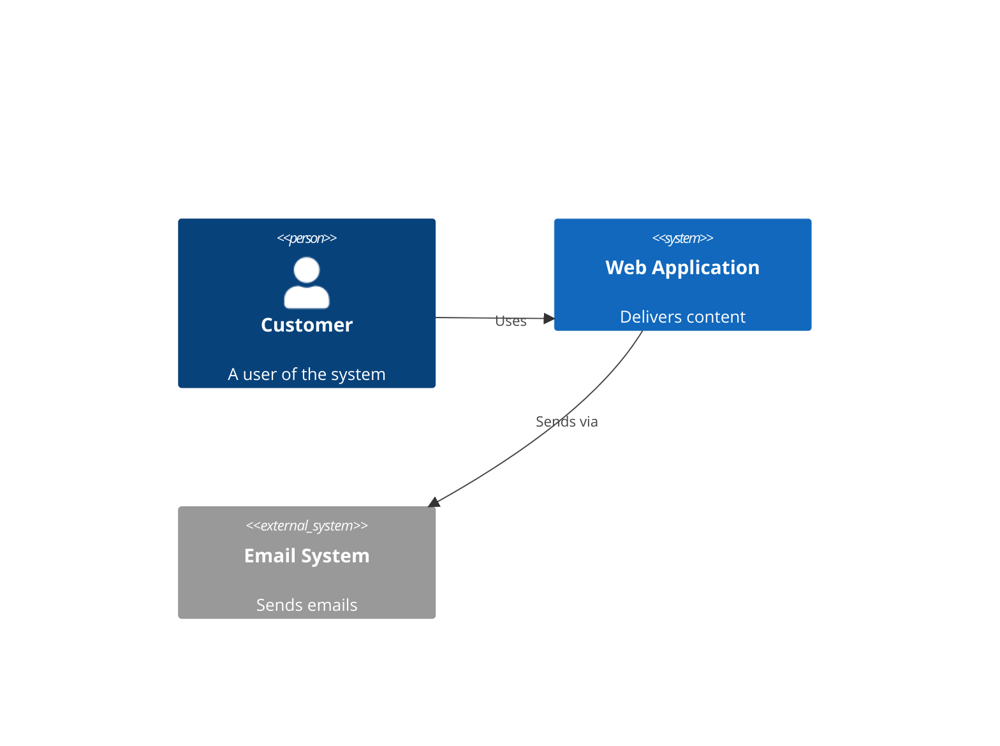

## API Documentation

**Authentication Flow:**
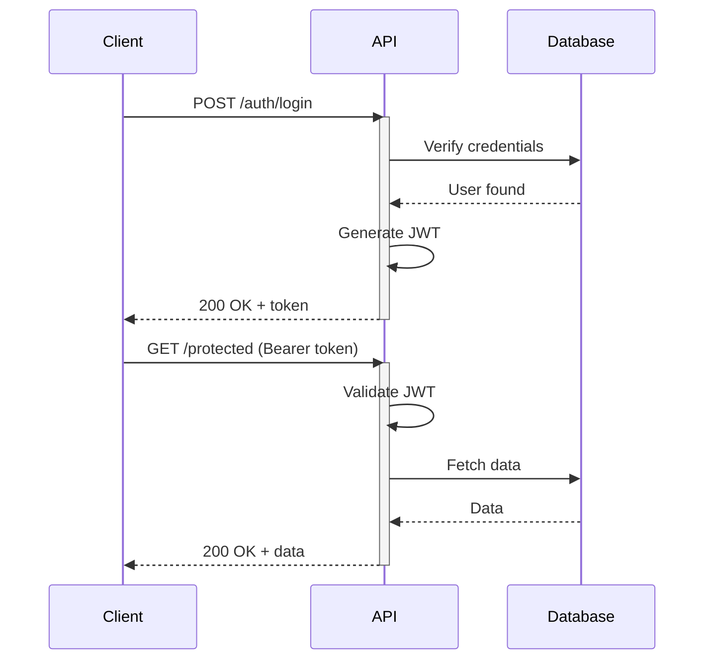

**REST API Endpoints:**
```mermaid
flowchart LR
  API[API]
  Users[/users]
  Posts[/posts]
  Comments[/comments]

  API --> Users
  API --> Posts
  API --> Comments

  Users --> U1[GET /users]
  Users --> U2[POST /users]
  Users --> U3[GET /users/:id]
  Users --> U4[PUT /users/:id]
  Users --> U5[DELETE /users/:id]
```

## Database Design

**E-Commerce Schema:**
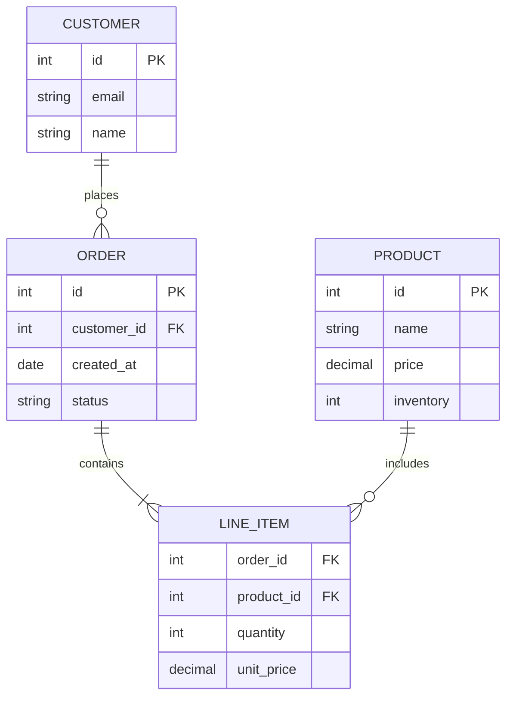

## State Machines

**Order Processing:**
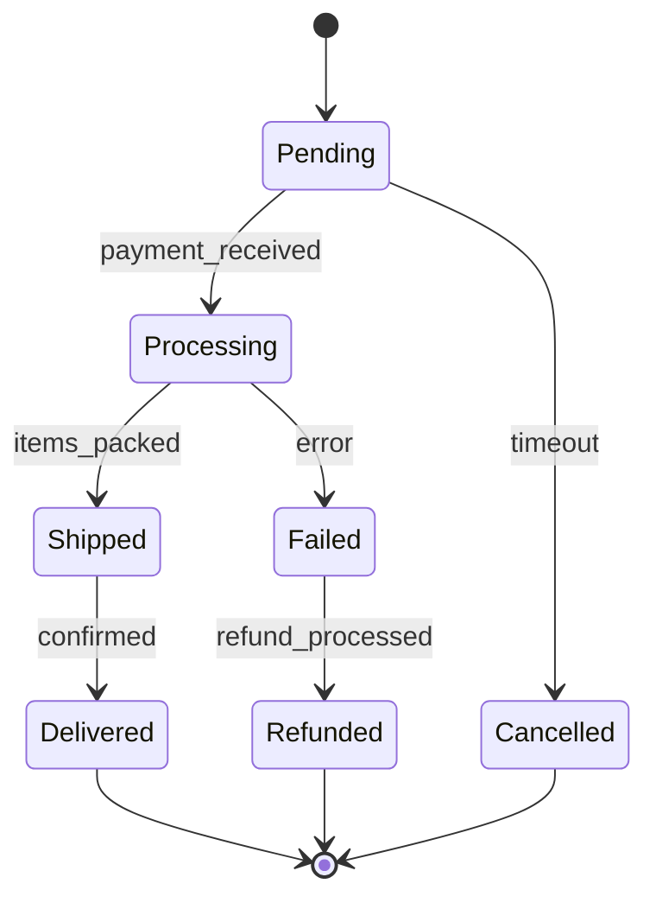

**User Authentication States:**
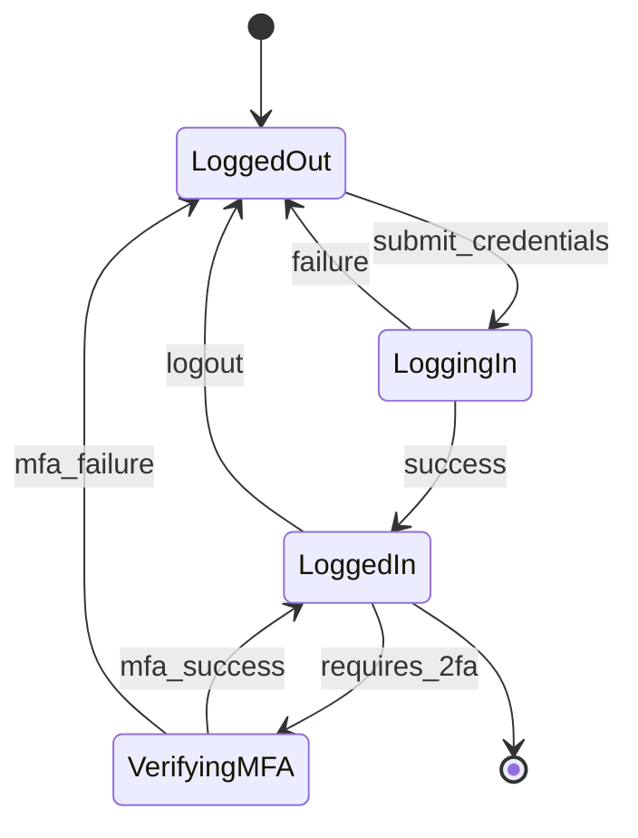

## Project Planning

**Sprint Timeline:**
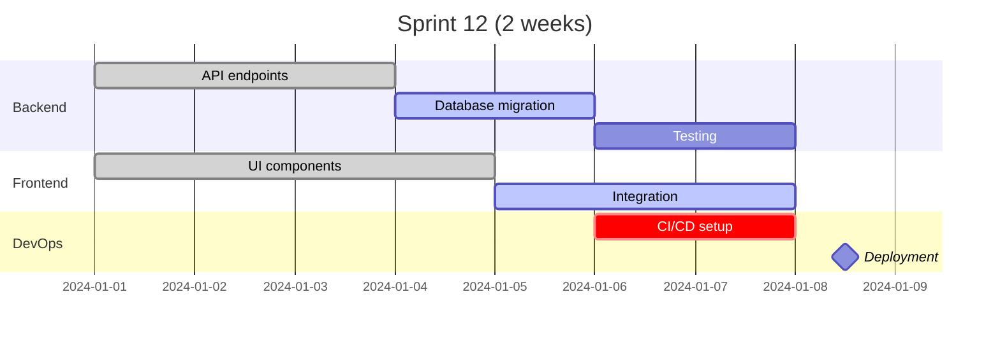

**Feature Development Journey:**
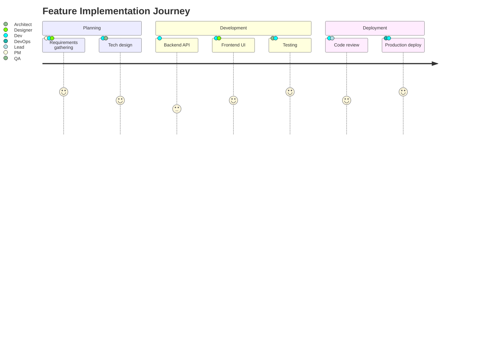

## Object-Oriented Design

**Payment System Classes:**
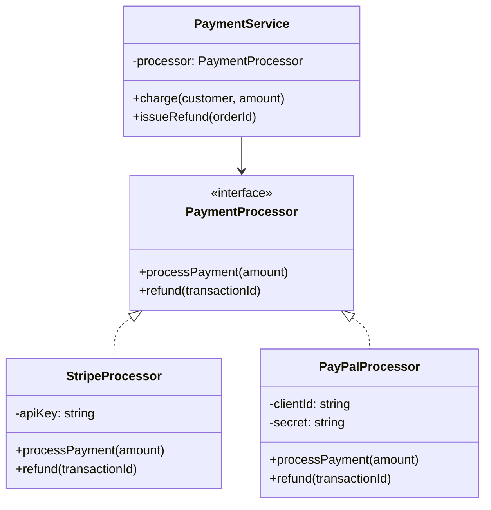

## CI/CD Pipeline

**Deployment Flow:**
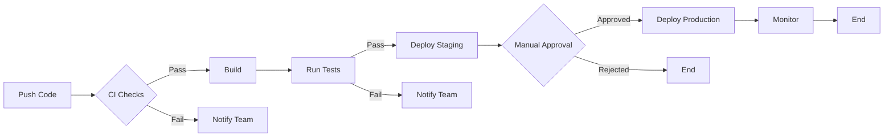

**Git Branching Strategy:**
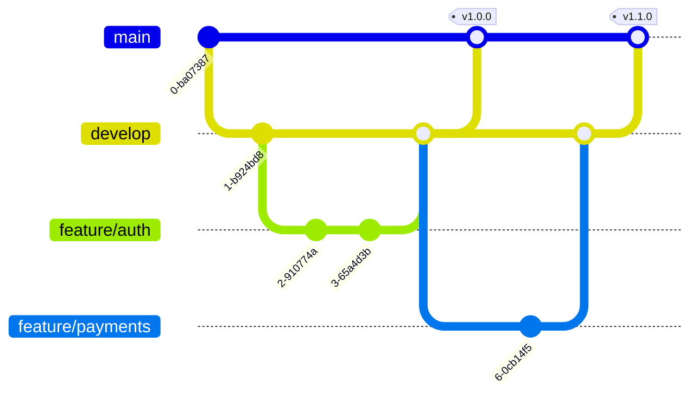

## User Experience

**Customer Onboarding:**
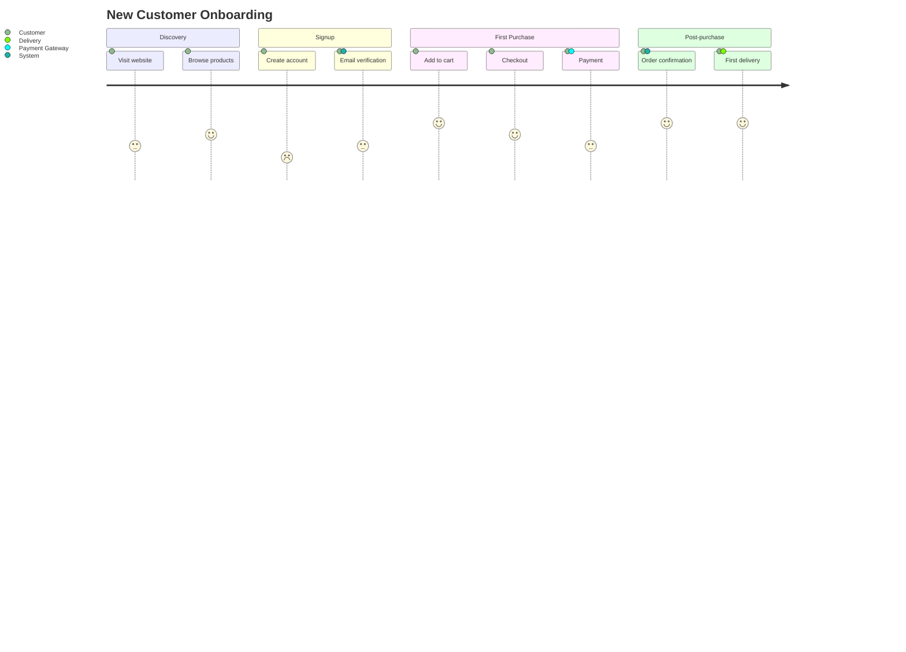

## Cloud Infrastructure

**AWS Architecture:**
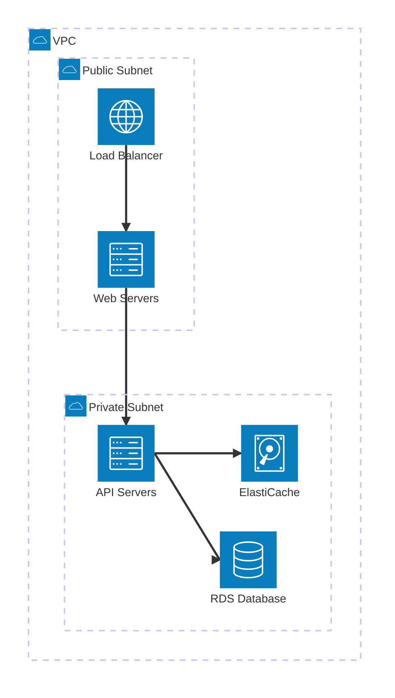

## Data Visualization

**Traffic Analysis:**
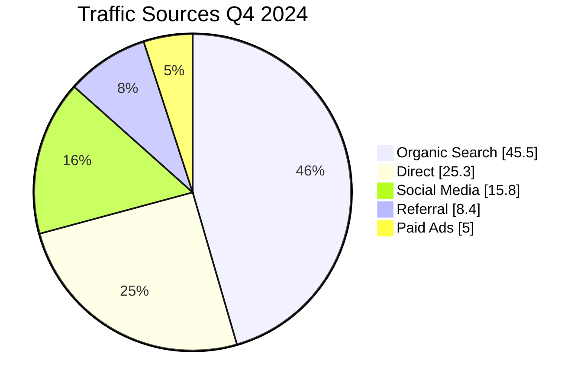

**Team Skills Assessment:**
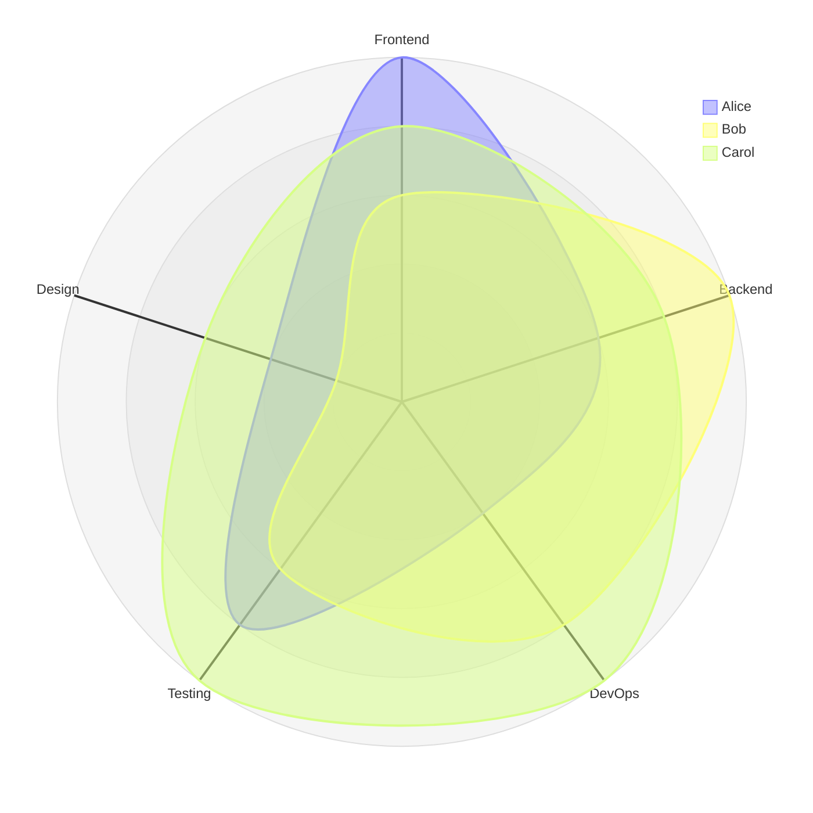

## Best Practices

**Naming Conventions:**
- Use descriptive node IDs: `userService` not `A`
- Clear labels: `[User Service]` not `[US]`
- Meaningful connections: `-->|authenticates|` not `-->`

**Styling Tips:**
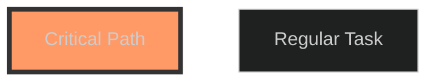

**Security:**
Use `securityLevel: 'strict'` to prevent XSS in user-generated diagrams.
