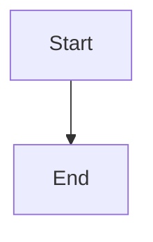
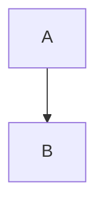

# Mermaid.js Integration Patterns

JavaScript API integration, HTML embedding, and platform-specific usage.

## HTML/Browser Integration

**Basic CDN Setup:**
```html
<!DOCTYPE html>
<html>
<head>
  <script src="https://cdn.jsdelivr.net/npm/mermaid@latest/dist/mermaid.min.js"></script>
</head>
<body>
  <pre class="mermaid">
    flowchart TD
      A[Client] --> B[Load Balancer]
      B --> C[Server 1]
      B --> D[Server 2]
  </pre>
  <script>
    mermaid.initialize({ startOnLoad: true });
  </script>
</body>
</html>
```

**ES Module (Modern):**
```html
<script type="module">
  import mermaid from 'https://cdn.jsdelivr.net/npm/mermaid@latest/dist/mermaid.esm.min.mjs';
  mermaid.initialize({ startOnLoad: true });
</script>
```

## NPM/Node.js Integration

**Installation:**
```bash
npm install mermaid
# or
yarn add mermaid
```

**Import and Initialize:**
```javascript
import mermaid from 'mermaid';

mermaid.initialize({
  startOnLoad: true,
  theme: 'dark',
  securityLevel: 'strict'
});
```

**Manual Rendering:**
```javascript
import mermaid from 'mermaid';

const graphDefinition = `
  graph TD
    A[Start] --> B[Process]
    B --> C[End]
`;

const { svg } = await mermaid.render('graphId', graphDefinition);
document.getElementById('container').innerHTML = svg;
```

## React Integration

**Component Wrapper:**
```jsx
import { useEffect, useRef } from 'react';
import mermaid from 'mermaid';

function MermaidDiagram({ chart }) {
  const ref = useRef(null);

  useEffect(() => {
    mermaid.initialize({ startOnLoad: false });
    if (ref.current) {
      mermaid.render('diagram', chart).then(({ svg }) => {
        ref.current.innerHTML = svg;
      });
    }
  }, [chart]);

  return <div ref={ref} />;
}

// Usage
<MermaidDiagram chart="graph TD\nA-->B" />
```

**Next.js (App Router):**
```jsx
'use client';
import dynamic from 'next/dynamic';

const Mermaid = dynamic(() => import('./MermaidDiagram'), {
  ssr: false
});

export default function Page() {
  return <Mermaid chart="flowchart TD\nA-->B" />;
}
```

## Vue Integration

**Component:**
```vue
<template>
  <div ref="container"></div>
</template>

<script setup>
import { ref, onMounted, watch } from 'vue';
import mermaid from 'mermaid';

const props = defineProps(['chart']);
const container = ref(null);

onMounted(() => {
  mermaid.initialize({ startOnLoad: false });
  renderDiagram();
});

watch(() => props.chart, renderDiagram);

async function renderDiagram() {
  const { svg } = await mermaid.render('diagram', props.chart);
  container.value.innerHTML = svg;
}
</script>
```

## Markdown Integration

**GitHub/GitLab:**
````markdown

````

**MDX (Next.js/Gatsby):**
```mdx
import Mermaid from './Mermaid';

# Architecture

<Mermaid chart={`
  flowchart LR
    Client --> API
    API --> Database
`} />
```

## API Reference

**mermaid.initialize(config)**
Configure global settings.
```javascript
mermaid.initialize({
  startOnLoad: true,
  theme: 'dark',
  logLevel: 3,
  securityLevel: 'strict',
  fontFamily: 'Arial'
});
```

**mermaid.render(id, graphDefinition, config)**
Programmatically render diagram.
```javascript
const { svg, bindFunctions } = await mermaid.render(
  'uniqueId',
  'graph TD\nA-->B',
  { theme: 'forest' }
);
```

**mermaid.parse(text)**
Validate syntax without rendering.
```javascript
try {
  await mermaid.parse('graph TD\nA-->B');
  console.log('Valid');
} catch(e) {
  console.error('Invalid:', e);
}
```

**mermaid.run(config)**
Render all diagrams in page.
```javascript
await mermaid.run({
  querySelector: '.mermaid',
  suppressErrors: false
});
```

## Event Handling

**Click Events:**
```javascript
const graphDefinition = `
  flowchart TD
    A[Click me] --> B
    click A callback "Tooltip text"
`;

window.callback = function() {
  alert('Node clicked!');
};

await mermaid.render('graph', graphDefinition);
```

**Interactive URLs:**
```
flowchart TD
  A[GitHub] --> B[Docs]
  click A "https://github.com"
  click B "https://mermaid.js.org" "Open docs"
```

## Advanced Patterns

**Dynamic Theme Switching:**
```javascript
function updateTheme(isDark) {
  mermaid.initialize({
    theme: isDark ? 'dark' : 'default',
    startOnLoad: false
  });

  // Re-render all diagrams
  document.querySelectorAll('.mermaid').forEach(async (el) => {
    const code = el.textContent;
    const { svg } = await mermaid.render('id', code);
    el.innerHTML = svg;
  });
}
```

**Lazy Loading:**
```javascript
const observer = new IntersectionObserver((entries) => {
  entries.forEach(async (entry) => {
    if (entry.isIntersecting) {
      const code = entry.target.textContent;
      const { svg } = await mermaid.render('id', code);
      entry.target.innerHTML = svg;
      observer.unobserve(entry.target);
    }
  });
});

document.querySelectorAll('.mermaid').forEach(el => observer.observe(el));
```

**Server-Side Rendering (SSR):**
```javascript
import { chromium } from 'playwright';

async function renderServerSide(code) {
  const browser = await chromium.launch();
  const page = await browser.newPage();

  await page.setContent(`
    <script src="mermaid.min.js"></script>
    <div class="mermaid">${code}</div>
    <script>mermaid.initialize({ startOnLoad: true });</script>
  `);

  const svg = await page.locator('.mermaid svg').innerHTML();
  await browser.close();
  return svg;
}
```

## Platform-Specific

**Jupyter/Python:**
Use mermaid.ink API:
```python
from IPython.display import Image
diagram = "graph TD\nA-->B"
url = f"https://mermaid.ink/svg/{diagram}"
Image(url=url)
```

**VS Code:**
Install "Markdown Preview Mermaid Support" extension.

**Obsidian:**
Native support in code blocks:
````markdown

````

**PowerPoint/Word:**
Use mermaid.live editor → Export → Insert image.
