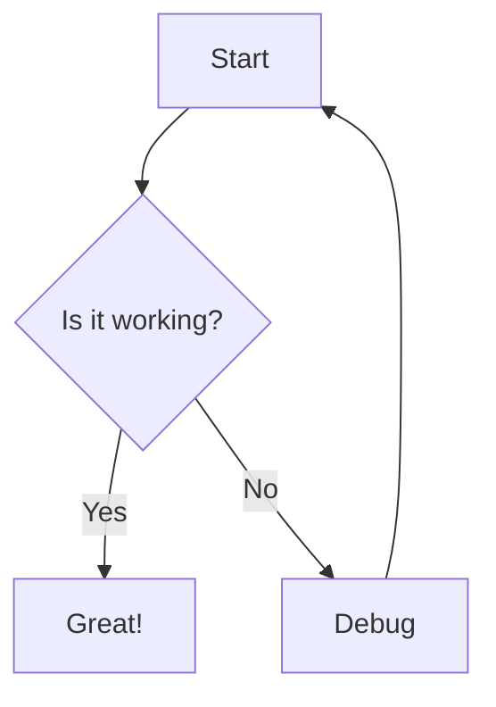
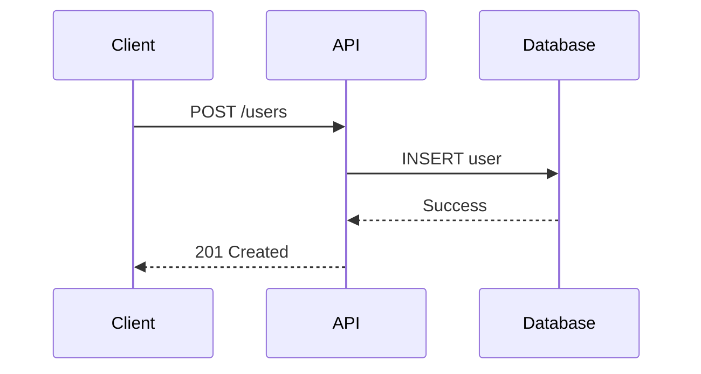

# MDX Components Reference

Complete reference for all 26+ Mintlify MDX components.

## Structure Content

### Tabs

Organize content into tabbed sections.

```mdx
<Tabs>
  <Tab title="JavaScript">
    JavaScript content here
  </Tab>
  <Tab title="Python">
    Python content here
  </Tab>
  <Tab title="Go">
    Go content here
  </Tab>
</Tabs>
```

### Code Groups

Display code examples in multiple languages with syntax highlighting.

```mdx
<CodeGroup>
```bash npm
npm install package
```

```bash yarn
yarn add package
```

```bash pnpm
pnpm add package
```
</CodeGroup>
```

### Steps

Create numbered step-by-step instructions.

```mdx
<Steps>
  <Step title="Install dependencies">
    Run `npm install` to install required packages.
  </Step>
  <Step title="Configure environment">
    Create `.env` file with your API keys.
  </Step>
  <Step title="Start the server">
    Run `npm start` to launch the application.
  </Step>
</Steps>
```

### Columns

Create multi-column layouts.

```mdx
<Columns>
  <Column>
    Content in first column
  </Column>
  <Column>
    Content in second column
  </Column>
  <Column>
    Content in third column
  </Column>
</Columns>
```

### Panel

Create bordered content panels.

```mdx
<Panel>
  This content appears in a bordered panel.
</Panel>
```

## Draw Attention

### Callouts

Four types of callouts for different message types.

```mdx
<Note>
  This is a general note or information.
</Note>

<Warning>
  This is a warning about potential issues.
</Warning>

<Tip>
  This is a helpful tip or best practice.
</Tip>

<Info>
  This is informational content.
</Info>

<Check>
  This indicates success or completion.
</Check>
```

### Banner

Display prominent banners at the top of pages.

```mdx
<Banner>
  Important announcement or message
</Banner>
```

### Badge

Add inline badges for labels or statuses.

```mdx
<Badge>New</Badge>
<Badge variant="success">Available</Badge>
<Badge variant="warning">Beta</Badge>
<Badge variant="danger">Deprecated</Badge>
```

### Update

Highlight recent updates or changelog entries.

```mdx
<Update date="2024-01-15">
  Added new authentication methods
</Update>
```

### Frames

Embed iframes or external content.

```mdx
<Frame>
  <iframe src="https://example.com/demo" width="100%" height="400px" />
</Frame>

<Frame caption="Interactive demo">
  
</Frame>
```

### Tooltips

Add hover tooltips to text.

```mdx
<Tooltip tip="This is additional context">
  Hover over this text
</Tooltip>
```

## Show/Hide

### Accordions

Create collapsible accordion sections.

```mdx
<AccordionGroup>
  <Accordion title="What is Mintlify?">
    Mintlify is a modern documentation platform that helps you create beautiful docs.
  </Accordion>
  <Accordion title="How do I get started?">
    Run `mint new` to create a new documentation project.
  </Accordion>
  <Accordion title="Can I use custom components?">
    Yes, you can use React components in your MDX files.
  </Accordion>
</AccordionGroup>
```

### Expandables

Create expandable content sections.

```mdx
<Expandable title="Click to expand">
  Hidden content that appears when expanded.
</Expandable>

<Expandable title="Advanced configuration" defaultOpen={true}>
  This content is expanded by default.
</Expandable>
```

### View

Show/hide content based on conditions.

```mdx
<View if="api">
  This content only shows for API documentation.
</View>

<View ifNot="mobile">
  This content is hidden on mobile devices.
</View>
```

## Document API

### ParamField

Document API parameters with type information.

```mdx
<ParamField path="id" type="string" required>
  Unique identifier for the resource
</ParamField>

<ParamField query="page" type="number" default="1">
  Page number for pagination
</ParamField>

<ParamField body="email" type="string" required>
  User's email address
</ParamField>

<ParamField header="Authorization" type="string" required>
  Bearer token for authentication
</ParamField>
```

**Attributes:**
- `path` / `query` / `body` / `header` - Parameter location
- `type` - Data type (string, number, boolean, object, array)
- `required` - Mark as required parameter
- `default` - Default value if not provided
- `enum` - Array of allowed values
- `enumDescriptions` - Descriptions for enum values

**With enum:**

```mdx
<ParamField
  body="status"
  type="string"
  enum={["active", "inactive", "pending"]}
  enumDescriptions={{
    active: "User is active and can access the system",
    inactive: "User account is disabled",
    pending: "User registration pending approval"
  }}
>
  Account status
</ParamField>
```

### ResponseField

Document API response fields.

```mdx
<ResponseField name="id" type="string" required>
  Unique identifier of the created resource
</ResponseField>

<ResponseField name="email" type="string">
  User's email address
</ResponseField>

<ResponseField name="created_at" type="timestamp">
  ISO 8601 timestamp of creation
</ResponseField>
```

**Nested responses:**

```mdx
<ResponseField name="user" type="object">
  User information

  <Expandable title="user properties">
    <ResponseField name="id" type="string">
      User ID
    </ResponseField>
    <ResponseField name="name" type="string">
      Full name
    </ResponseField>
  </Expandable>
</ResponseField>
```

### RequestExample

Show example API requests in multiple languages.

```mdx
<RequestExample>
```bash cURL
curl -X POST https://api.example.com/users \
  -H "Authorization: Bearer YOUR_TOKEN" \
  -H "Content-Type: application/json" \
  -d '{"email": "user@example.com"}'
```

```python Python
import requests

response = requests.post(
    "https://api.example.com/users",
    headers={"Authorization": "Bearer YOUR_TOKEN"},
    json={"email": "user@example.com"}
)
```

```javascript JavaScript
fetch("https://api.example.com/users", {
  method: "POST",
  headers: {
    "Authorization": "Bearer YOUR_TOKEN",
    "Content-Type": "application/json"
  },
  body: JSON.stringify({ email: "user@example.com" })
})
```
</RequestExample>
```

### ResponseExample

Show example API responses.

```mdx
<ResponseExample>
```json Success Response
{
  "id": "usr_123",
  "email": "user@example.com",
  "created_at": "2024-01-15T10:30:00Z"
}
```

```json Error Response
{
  "error": {
    "code": "invalid_email",
    "message": "The provided email address is invalid"
  }
}
```
</ResponseExample>
```

## Link Pages

### Cards

Create clickable cards that link to other pages.

```mdx
<CardGroup cols={2}>
  <Card title="Getting Started" icon="rocket" href="/docs/quickstart">
    Quick introduction to get up and running
  </Card>
  <Card title="API Reference" icon="code" href="/api/overview">
    Complete API documentation
  </Card>
  <Card title="Guides" icon="book" href="/guides">
    Step-by-step tutorials and guides
  </Card>
  <Card title="Examples" icon="lightbulb" href="/examples">
    Real-world implementation examples
  </Card>
</CardGroup>
```

**Attributes:**
- `title` - Card title
- `icon` - Icon name (Font Awesome or Lucide)
- `href` - Link destination
- `color` - Card accent color

**CardGroup attributes:**
- `cols` - Number of columns (1-4)

### Tiles

Compact tile layout for links.

```mdx
<TileGroup>
  <Tile title="Installation" href="/docs/installation" icon="download" />
  <Tile title="Configuration" href="/docs/config" icon="settings" />
  <Tile title="Deployment" href="/docs/deploy" icon="rocket" />
  <Tile title="Troubleshooting" href="/docs/troubleshoot" icon="wrench" />
</TileGroup>
```

## Visual Context

### Icons

Display icons inline using Font Awesome or Lucide.

```mdx
<Icon icon="rocket" size={24} />
<Icon icon="check-circle" color="green" />
<Icon icon="warning" iconType="solid" />
```

**Attributes:**
- `icon` - Icon name
- `size` - Icon size in pixels
- `color` - Icon color
- `iconType` - Icon style (solid, regular, light, duotone)

### Mermaid Diagrams

Create diagrams using Mermaid syntax.

````mdx

````

**Supported diagram types:**
- Flowcharts
- Sequence diagrams
- Class diagrams
- State diagrams
- Entity relationship diagrams
- Gantt charts
- Pie charts
- Git graphs

**Sequence diagram example:**

````mdx

````

### Color

Display color swatches with hex values.

```mdx
<Color color="#0D9373" name="Primary" />
<Color color="#55D799" name="Light" />
<Color color="#007A5A" name="Dark" />
```

### Tree

Display file tree structures.

```mdx
<Tree>
  <Folder name="src">
    <Folder name="components">
      <File name="Button.tsx" />
      <File name="Input.tsx" />
    </Folder>
    <Folder name="utils">
      <File name="api.ts" />
      <File name="helpers.ts" />
    </Folder>
    <File name="index.ts" />
  </Folder>
  <File name="package.json" />
  <File name="tsconfig.json" />
</Tree>
```

## Page Frontmatter

All MDX pages support frontmatter for metadata and configuration.

```mdx
---
title: "Page Title"
description: "SEO description"
icon: "rocket"
mode: "wide"
---

Page content here...
```

**Common frontmatter fields:**
- `title` - Page title
- `description` - SEO description
- `icon` - Page icon
- `mode` - Layout mode (default, wide, custom, frame, center)
- `sidebarTitle` - Custom sidebar title
- `openapi` - OpenAPI operation (e.g., "GET /users")

**Mode options:**
- `default` - Standard content width
- `wide` - Wider content area
- `custom` - Full-width custom layout
- `frame` - Embedded frame (Aspen/Almond themes only)
- `center` - Centered content (Mint/Linden themes only)

## React Components

Import and use custom React components in MDX.

```mdx
---
title: "Custom Components"
---

import { CustomButton } from '@/components/CustomButton'
import { Chart } from '@/components/Chart'

<CustomButton onClick={() => console.log('clicked')}>
  Click me
</CustomButton>

<Chart data={[1, 2, 3, 4, 5]} />
```

Place custom components in `/components` directory or configure import paths in your build setup.
