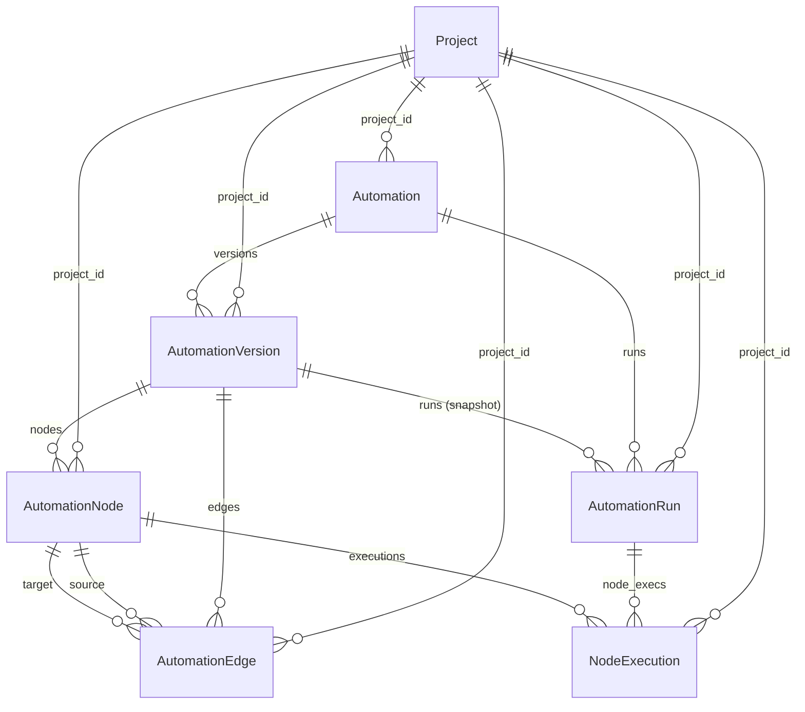

# Automation Engine Data Model

## Entity-Relationship Diagram

## Detailed Explanation

### Automation

Main container visible to users.

- `name`, `description`, `status`, `is_enabled`
- `scope` (char field, required) indicates which entity the automation runs on (e.g. _WorkItem_, _Cycle_, _Module_)
- `current_version` FK to latest published `AutomationVersion`

### AutomationVersion

Immutable workflow snapshot.

- Incrementing `version_number`
- Full graph JSON in `configuration` (GIN-indexed `autover_cfg_gin`)
- Publishing metadata (`is_published`, timestamps, `published_by`)

### AutomationNode

Graph node (Trigger / Action / Condition).

- `node_type` enum (`trigger | action | condition`)
- `handler_name` registry key (e.g. `record_created`)
- Dynamic `config` JSON (GIN-indexed `autonode_cfg_gin`)
- Partial index `autonode_trig_part_idx` for fast trigger lookup

### AutomationEdge

Directed link between nodes.

- Prevents self-loops via check constraint
- Optional `condition` JSON (GIN-indexed `autoedge_cond_gin`)
- Edge `label` for branching (`success / failure / custom`)

### AutomationRun

One execution instance of an automation.

- Stores triggering event JSON (`trigger_event`, GIN-indexed `autorun_trig_gin`)
- `result` summary JSON (GIN-indexed `autorun_res_gin`)
- Status lifecycle: _pending → running → success/failed/cancelled_

### NodeExecution

Per-node audit of a run.

- Captures `input_data`, `output_data`, `execution_context` (all GIN-indexed)
- `retry_count` for transient failures
- Unique `(run, node)` constraint ensures single record per node per run

### Index Strategy

All JSON fields have GIN indexes with `jsonb_path_ops` to accelerate containment (`@>`) and existence queries while keeping index size small. Index names are ≤ 30 characters to satisfy PostgreSQL limits.

---

_Last updated automatically._
