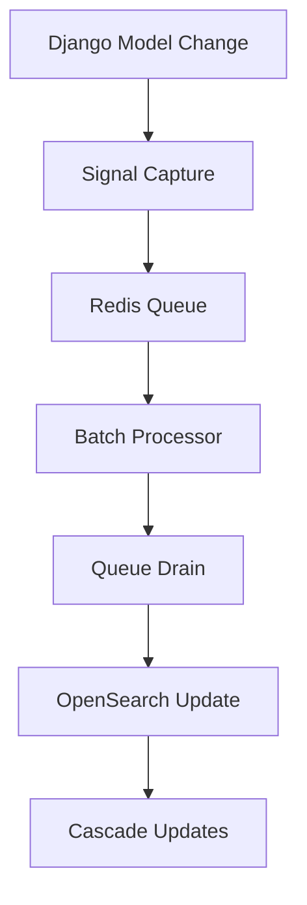

# OpenSearch Documents

A high-performance search infrastructure for Plane with batched updates, semantic search capabilities, and comprehensive monitoring.

## 📋 Table of Contents

- [📁 Directory Structure](#-directory-structure)
- [🚀 Quick Start](#-quick-start)
- [🔍 Document Types](#-document-types)
- [🏗️ Architecture](#️-architecture)
- [📚 Usage Guide](#-usage-guide)
- [⚙️ Configuration](#️-configuration)
- [🛠️ Development](#️-development)
- [🔧 Operations & Monitoring](#-operations--monitoring)

---

## 📁 Directory Structure

```
documents/
├── core/                       # 🔧 Infrastructure Components
│   ├── base.py                # BaseDocument class with optimizations
│   ├── fields.py              # Custom fields and analyzers
│   ├── signals.py             # Batched signal processing
│   ├── registry.py            # Model registry utilities
│   ├── queue.py               # Redis queue management
│   └── __init__.py
├── entities/                   # 📄 Document Definitions
│   ├── issue.py               # Issue & IssueComment documents
│   ├── project.py             # Project document
│   ├── workspace.py           # Workspace document
│   ├── module.py              # Module document
│   ├── cycle.py               # Cycle document
│   ├── page.py                # Page document
│   ├── issue_view.py          # IssueView document
│   ├── teamspace.py           # Teamspace document
│   └── __init__.py
├── README.md                   # 📖 This documentation
└── __init__.py
```

---

## 🚀 Quick Start

### Basic Import Patterns

```python
# Main module imports (recommended)
from plane.ee.documents import (
    BaseDocument,
    IssueDocument,
    ProjectDocument,
    is_model_search_relevant,
    get_batch_queue_stats,
)

# Direct imports for specific needs
from plane.ee.documents.core.fields import JsonKeywordField, KnnVectorField
from plane.ee.documents.core.registry import is_model_search_relevant
```

### Simple Search Example

```python
from plane.ee.utils.opensearch_helper import OpenSearchHelper
from plane.ee.documents import IssueDocument

# Create search helper
helper = OpenSearchHelper(
    document_cls=IssueDocument,
    filters=[{"workspace_slug": "my-workspace"}],
    query="bug fix",
    page_size=25
)

# Execute search
results = helper.execute_and_serialize()
```

---

## 🔍 Document Types

| Document               | Model        | Features                              | Semantic Search      |
| ---------------------- | ------------ | ------------------------------------- | -------------------- |
| `IssueDocument`        | Issue        | Full-text search, comments, relations | ✅ Name, description |
| `IssueCommentDocument` | IssueComment | Comment search within issues          | ❌                   |
| `ProjectDocument`      | Project      | Project discovery & filtering         | ❌                   |
| `WorkspaceDocument`    | Workspace    | Workspace search                      | ❌                   |
| `ModuleDocument`       | Module       | Sprint/module search                  | ❌                   |
| `CycleDocument`        | Cycle        | Cycle search & filtering              | ❌                   |
| `PageDocument`         | Page         | Page content with semantic search     | ✅ Name, description |
| `IssueViewDocument`    | IssueView    | Saved view search                     | ❌                   |
| `TeamspaceDocument`    | Teamspace    | Teamspace discovery                   | ❌                   |

---

## 🏗️ Architecture

### High-Performance Batched Updates

Significant reduction in OpenSearch requests through intelligent queue processing:



#### Key Features:

- **🎯 Complete Queue Draining**: Process ALL queued items per model every cycle
- **⚡ FIFO Processing**: Consistent data ordering with race-safe queue operations
- **🚀 LPOP Optimization**: ~25x performance improvement using atomic operations
- **📦 Compact Storage**: Epoch timestamps reduce element size by ~17%
- **🔄 Smart Deduplication**: Semantic vs. non-semantic field priorities
- **📊 Simple Monitoring**: Queue length tracking with minimal overhead

### Core Components

#### `BaseDocument` (`core/base.py`)

- Performance-optimized configuration
- Upsert behavior for reliability
- Semantic field management

#### `Custom Fields` (`core/fields.py`)

- `JsonKeywordField`: JSON data as searchable strings
- `KnnVectorField`: Vector embeddings for semantic search
- Text analyzers for autocomplete

#### `Batched Processing` (`core/signals.py`, `core/queue.py`, `core/registry.py`)

- Registry-powered cascade updates
- Complete queue draining every cycle
- N+1 query prevention
- Comprehensive error handling

#### `Performance Optimizations`

- **LPOP with Count**: Single atomic Redis operation instead of LRANGE + LTRIM
- **Epoch Timestamps**: Compact storage using `time.time()` seconds vs ISO strings
- **Optimized Elements**: ~113 bytes per queue item (down from ~135 bytes)
- **Memory Efficient**: 1,000 item chunks = ~113 KB memory usage
- **Redis 6.2+ Required**: For LPOP count feature (widely supported)

**Queue Element Example:**

```json
{
  "obj_id": "550e8400-e29b-41d4-a716-446655440000",
  "update_type": "update",
  "semantic_fields_changed": false,
  "timestamp": 1705327845
}
```

---

## 📚 Usage Guide

### Single Document Search

```python
from plane.ee.utils.opensearch_helper import OpenSearchHelper
from plane.ee.documents import IssueDocument
from plane.ee.serializers.app.search_serializers import IssueSearchSerializer

helper = OpenSearchHelper(
    document_cls=IssueDocument,
    filters=[
        {"workspace_slug": workspace_slug},
        {"active_project_member_user_ids": user_id},
        {"project_is_archived": False}
    ],
    query="bug fix",
    search_fields=["name", "description", "project_identifier"],
    source_fields=["name", "id", "sequence_id", "project_identifier"],
    page=1,
    page_size=25,
    boosts={"name": 1.25, "description": 1.0},
    serializer_class=IssueSearchSerializer
)

results = helper.execute_and_serialize()
```

### Multi-Document Search

Efficiently search across multiple document types in a single request:

```python
from plane.ee.utils.opensearch_helper import OpenSearchHelper

# Create helpers for different document types
issue_helper = OpenSearchHelper(
    document_cls=IssueDocument,
    filters=[{"workspace_slug": workspace_slug}],
    query="bug fix",
    result_key="issues",  # Required for multi-search
    serializer_class=IssueSearchSerializer
)

project_helper = OpenSearchHelper(
    document_cls=ProjectDocument,
    filters=[{"workspace_slug": workspace_slug}],
    query="bug fix",
    result_key="projects",  # Required for multi-search
    serializer_class=ProjectSearchSerializer
)

# Execute multi-search
results = OpenSearchHelper.execute_multi_search([
    issue_helper,
    project_helper
])

# Results organized by result_key:
# {
#   "issues": [...],
#   "projects": [...]
# }
```

### Monitoring Batch Processing

```python
from plane.ee.documents import get_batch_queue_stats

# Basic monitoring (just queue lengths)
stats = get_batch_queue_stats(detailed=False)
for model, model_stats in stats.items():
    print(f"{model}: {model_stats['queue_length']} pending")

# Detailed monitoring (with health analysis - use sparingly)
detailed_stats = get_batch_queue_stats(detailed=True)
for model, health_info in detailed_stats.items():
    print(f"{model}: {health_info['queue_length']} items, "
          f"status: {health_info['health_status']}")
```

---

## ⚙️ Configuration

### Environment Variables

```bash
OPENSEARCH_ENABLED=true
OPENSEARCH_INDEX_PREFIX=plane_dev
OPENSEARCH_SHARD_COUNT=1
OPENSEARCH_REPLICA_COUNT=0
OPENSEARCH_UPDATE_CHUNK_SIZE=1000  # Items processed per chunk (default: 1000)
```

### Django Settings

```python
# Signal processor configuration
OPENSEARCH_DSL_SIGNAL_PROCESSOR = "plane.ee.documents.core.signals.BatchedCelerySignalProcessor"

# Logging configuration
LOGGING = {
    'loggers': {
        'plane.api': {'level': 'INFO'},
        'django_opensearch_dsl': {'level': 'WARNING'}
    }
}
```

---

## 🛠️ Development

### Adding New Document Types

1. **Create Document Class**:

```python
# In entities/my_entity.py
from ..core import BaseDocument
from ..core.fields import JsonKeywordField
from plane.db.models import MyModel

@registry.register_document
class MyDocument(BaseDocument):
    name = fields.TextField(analyzer=edge_ngram_analyzer)
    custom_field = JsonKeywordField()

    class Index(BaseDocument.Index):
        name = f"{settings.OPENSEARCH_INDEX_PREFIX}_my_entities"

    class Django:
        model = MyModel
        fields = ["id", "created_at"]
        queryset_pagination = 5000
```

2. **Add to Module Exports**:

```python
# In entities/__init__.py
from .my_entity import MyDocument

__all__ = [
    # ... existing exports ...
    "MyDocument",
]
```

### Index Management

```bash
# Create indexes
python manage.py opensearch index create

# Populate indexes
python manage.py opensearch document index

# Rebuild specific index
python manage.py opensearch document index --models plane.db.models.Issue

# Run in background (recommended for production)
python manage.py manage_search_index --background document index
```

---

## 🔧 Operations & Monitoring

### Queue Monitoring

Monitor Redis queues for batch processing with the comprehensive monitoring command:

```bash
# Quick status check
python manage.py monitor_search_queue

# Real-time monitoring
python manage.py monitor_search_queue --watch

# Detailed information with health indicators
python manage.py monitor_search_queue --detailed

# JSON output for automation
python manage.py monitor_search_queue --json

# Clean up stale queue entries
python manage.py monitor_search_queue --cleanup
```

**Example output:**

```
OpenSearch Batch Update Queue Status
==================================================
Total queued items: 245
Active models: 3/9

Issue                   156 items [ACTIVE]
Project                  89 items [ACTIVE]
Workspace                 0 items [EMPTY]
Module                    0 items [EMPTY]
...

Health Indicators:
✅ All queues healthy
```

**Automated Metrics Logging:**

The system automatically logs essential metrics with minimal processing overhead:

- Individual model queue lengths for targeted alerting
- Aggregate system metrics for overview monitoring
- Critical size alerts (>5,000 items) for worker health monitoring
- Optimized to use basic queue length checks only

### Direct Redis Monitoring

```bash
# Check all queue lengths
redis-cli --scan --pattern "opensearch:batch_updates:*" | xargs -I {} redis-cli LLEN {}

# Monitor specific queue
redis-cli LLEN "opensearch:batch_updates:Issue"
```

### Programmatic Monitoring

```python
from plane.ee.documents import get_batch_queue_stats

def check_search_health():
    stats = get_batch_queue_stats()
    alerts = []

    for model, model_stats in stats.items():
        queue_length = model_stats['queue_length']
        if queue_length > 1000:
            alerts.append(f"{model} queue backing up: {queue_length} items")

    return alerts
```

### Common Issues & Solutions

| Issue                  | Symptoms                | Solution                                  |
| ---------------------- | ----------------------- | ----------------------------------------- |
| **Index Not Found**    | Search errors, 404s     | Run `opensearch index create`             |
| **Permission Errors**  | Empty results           | Check user permission fields              |
| **Performance Issues** | Slow queries            | Monitor logs, adjust pagination           |
| **Batch Delays**       | Outdated search results | Monitor queue with `monitor_search_queue` |
| **Large Queues**       | High queue lengths      | Check Celery workers, run cleanup         |
| **Redis Version**      | LPOP errors             | Upgrade to Redis 6.2+ for LPOP count      |

### Advanced Monitoring

For comprehensive monitoring setups, health checks, automation scripts, and integration with systems like Grafana/Prometheus, see the detailed [MONITORING.md](MONITORING.md) guide.

---

## 📦 Related Components

- **Search API**: `plane/ee/views/app/search/` - REST endpoints
- **OpenSearch Helper**: `plane/ee/utils/opensearch_helper.py` - Query builder
- **Serializers**: `plane/ee/serializers/app/search_serializers.py` - Data formatting
- **Background Tasks**: `plane/ee/bgtasks/batched_search_update_task.py` - Celery processing
- **Management Commands**: Enhanced CLI tools with background execution support
- **Queue Monitoring**: `monitor_search_queue` command and [MONITORING.md](MONITORING.md) guide

---

**The OpenSearch documents module provides a production-ready, high-performance search infrastructure with intelligent batching, Redis optimizations, comprehensive monitoring, and clean architecture.** 🚀
