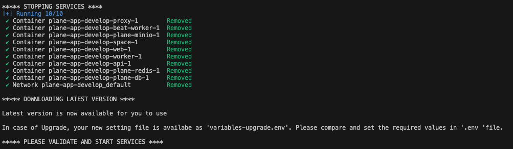

# Self Hosting

In this guide, we will walk you through the process of setting up a self-hosted environment. Self-hosting allows you to have full control over your applications and data. It's a great way to ensure privacy, control, and customization.

We will cover two main options for setting up your self-hosted environment: using a cloud server or using your desktop. For the cloud server, we will use an AWS EC2 instance. For the desktop, we will use Docker to create a local environment.

Let's get started!

## Setting up Docker Environment

<details>
  <summary>Option 1 - Using Cloud Server</summary>
  <p>Best way to start is to create EC2 maching on AWS. It must of minimum t3.medium/t3a/medium</p>
  <p>Run the below command to install docker engine.</p>

`curl -fsSL https://get.docker.com -o install-docker.sh`

</details>

---

<details>
  <summary>Option 2 - Using Desktop</summary>

#### For Mac

  <ol>
    <li> Download Docker Desktop for Mac from the <a href="https://hub.docker.com/editions/community/docker-ce-desktop-mac/" target="_blank">Docker Hub</a>. </li>
    <li> Double-click the downloaded `.dmg` file and drag the Docker app icon to the Applications folder. </li>
    <li>Open Docker Desktop from the Applications folder. You might be asked to provide your system password to install additional software.</li>
  </ol>

#### For Windows:

  <ol>
    <li>Download Docker Desktop for Windows from the <a href="https://hub.docker.com/editions/community/docker-ce-desktop-windows/" target="_blank">Docker Hub</a>.</li>
    <li>Run the installer and follow the instructions. You might be asked to enable Hyper-V and "Containers" Windows features.</li>
    <li>Open Docker Desktop. You might be asked to log out and log back in, or restart your machine, for changes to take effect.</li>
  </ol>

After installation, you can verify the installation by opening a terminal (Command Prompt on Windows, Terminal app on Mac) and running the command `docker --version`. This should display the installed version of Docker.

</details>

---

## Installing Plane

Installing plane is a very easy and minimal step process.

### Prerequisite

- Docker installed and running
- OS with bash scripting enabled (Ubuntu, Linux AMI, macos). Windows systems need to have [gitbash](https://git-scm.com/download/win)
- User context used must have access to docker services. In most cases, use sudo su to switch as root user
- Use the terminal (or gitbash) window to run all the future steps

### Downloading Latest Stable Release

```
mkdir plane-selfhost

cd plane-selfhost

curl -fsSL -o setup.sh https://raw.githubusercontent.com/makeplane/plane/master/deploy/selfhost/install.sh

chmod +x setup.sh
```

<details>
    <summary>Downloading Preview Release</summary>

```
mkdir plane-selfhost

cd plane-selfhost

export RELEASE=preview

curl -fsSL https://raw.githubusercontent.com/makeplane/plane/$BRANCH/deploy/selfhost/install.sh | sed  's@BRANCH=master@BRANCH='"$RELEASE"'@' > setup.sh

chmod +x setup.sh
```

</details>

---

### Proceed with setup

Above steps will set you ready to install and start plane services.

Lets get started by running the `./setup.sh` command.

This will prompt you with the below options.

```
Select a Action you want to perform:
   1) Install
   2) Start
   3) Stop
   4) Restart
   5) Upgrade
   6) Exit

Action [2]: 1
```

For the 1st time setup, type "1" as action input.

This will create a create a folder `plane-app` or `plane-app-preview` (in case of preview deployment) and will download 2 files inside that

- `docker-compose.yaml`
- `.env`

Again the `options [1-6]` will be popped up and this time hit `6` to exit.

---

### Continue with setup - Environment Settings

Before proceeding, we suggest used to review `.env` file and set the values.
Below are the most import keys you must refer to. _<span style="color: #fcba03">You can use any text editor to edit this file</span>_.

> `NGINX_PORT` - This is default set to `80`. Make sure the port you choose to use is not preoccupied. (e.g `NGINX_PORT=8080`)

> `WEB_URL` - This is default set to `http://localhost`. Change this to the FQDN you plan to use along with NGINX_PORT (eg. `https://plane.example.com:8080` or `http://[IP-ADDRESS]:8080`)

> `CORS_ALLOWED_ORIGINS` - This is default set to `http://localhost`. Change this to the FQDN you plan to use along with NGINX_PORT (eg. `https://plane.example.com:8080` or `http://[IP-ADDRESS]:8080`)

There are many other settings you can play with, but we suggest you configure `EMAIL SETTINGS` as it will enable you to invite your teammates onto the platform.

---

### Continue with setup - Start Server

Lets again run the `./setup.sh` command. You will again be prompted with the below options. This time select `2` to start the sevices

```
Select a Action you want to perform:
   1) Install
   2) Start
   3) Stop
   4) Restart
   5) Upgrade
   6) Exit

Action [2]: 2
```

Expect something like this.  


Be patient as it might take sometime based on download speed and system configuration. If all goes well, you must see something like this


This is the confirmation that all images were downloaded and the services are up & running.

You have successfully self hosted `Plane` instance. Access the application by going to IP or domain you have configured it (e.g `https://plane.example.com:8080` or `http://[IP-ADDRESS]:8080`)

---

### Stopping the Server

In case you want to make changes to `.env` variables, we suggest you to stop the services before doing that.

Lets again run the `./setup.sh` command. You will again be prompted with the below options. This time select `3` to stop the sevices

```
Select a Action you want to perform:
   1) Install
   2) Start
   3) Stop
   4) Restart
   5) Upgrade
   6) Exit

Action [2]: 3
```

If all goes well, you must see something like this


---

### Restarting the Server

In case you want to make changes to `.env` variables, without stopping the server or you noticed some abnormalies in services, you can restart the services with RESTART option.

Lets again run the `./setup.sh` command. You will again be prompted with the below options. This time select `4` to restart the sevices

```
Select a Action you want to perform:
   1) Install
   2) Start
   3) Stop
   4) Restart
   5) Upgrade
   6) Exit

Action [2]: 4
```

If all goes well, you must see something like this


---

### Upgrading Plane Version

It is always advised to keep Plane up to date with the latest release.

Lets again run the `./setup.sh` command. You will again be prompted with the below options. This time select `5` to upgrade the release.

```
Select a Action you want to perform:
   1) Install
   2) Start
   3) Stop
   4) Restart
   5) Upgrade
   6) Exit

Action [2]: 5
```

By choosing this, it will stop the services and then will download the latest `docker-compose.yaml` and `variables-upgrade.env`. Here system will not replace `.env` with the new one.

You must expect the below message



Once done, choose `6` to exit from prompt.

> It is very important for you to compare the 2 files `variables-upgrade.env` and `.env`. Copy the newly added variable from downloaded file to `.env` and set the expected values.

Once done with making changes in `.env` file, jump on to `Start Server`

## Upgrading from v0.13.2 to v0.14.x

This is one time activity for users who are upgrading from v0.13.2 to v0.14.0

As there has been significant changes to Self Hosting process, this step mainly covers the data migration from current (v0.13.2) docker volumes from newly created volumes

> Before we begin with migration, make sure your v0.14.0 was started and then stopped. This is required to know the newly created docker volume names.

Begin with downloading the migration script using below command

```

curl -fsSL -o migrate.sh https://raw.githubusercontent.com/makeplane/plane/master/deploy/selfhost/migration-0.13-0.14.sh

chmod +x migrate.sh

```

Now run the `./migrate.sh` command and expect the instructions as below

```
******************************************************************

This script is solely for the migration purpose only.
This is a 1 time migration of volume data from v0.13.2 => v0.14.x

Assumption:
1. Postgres data volume name ends with _pgdata
2. Minio data volume name ends with _uploads
3. Redis data volume name ends with _redisdata

Any changes to this script can break the migration.

Before you proceed, make sure you run the below command
to know the docker volumes

docker volume ls -q | grep -i "_pgdata"
docker volume ls -q | grep -i "_uploads"
docker volume ls -q | grep -i "_redisdata"

*******************************************************

Given below list of REDIS volumes, identify the prefix of source and destination volumes leaving "_redisdata"
---------------------
plane-app_redisdata
v0132_redisdata

Provide the Source Volume Prefix :
```

**Open another terminal window**, and run the mentioned 3 command. This may be different for users who have changed the volume names in their previous setup (v0.13.2)

For every command you must see 2 records something like shown in above example of `redisdata`

To move forward, you would need PREFIX of old setup and new setup. As per above example, `v0132` is the prefix of v0.13.2 and `plane-app` is the prefix of v0.14.0 setup

**Back to original terminal window**, _Provide the Source Volume Prefix_ and hit ENTER.

Now you will be prompted to _Provide Destination Volume Prefix_. Provide the value and hit ENTER

```
Provide the Source Volume Prefix : v0132
Provide the Destination Volume Prefix : plane-app
```

In case the suffixes are wrong or the mentioned volumes are not found, you will receive the error shown below. The image below displays an error for source volumes.


In case of successful migration, it will be a silent exit without error.

Now its time to restart v0.14.0 setup.
