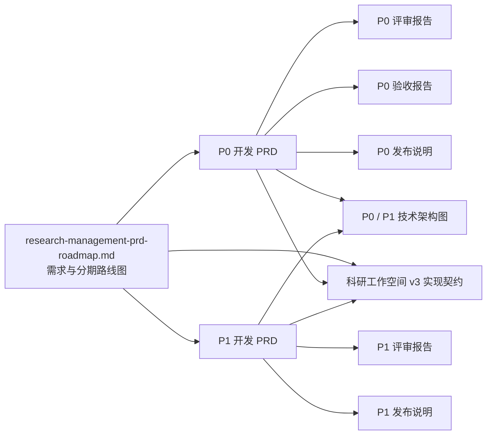

# PiLab 文档索引

本目录存放 PiLab 科研管理模块的产品、开发、评审、验收与发布文档。所有文档以仓库 `develop` 分支为准，代码实现与文档口径不一致时以代码为事实来源，并按下文「维护约定」回写文档。

## 1. 文档清单

| 文档                                                                                     | 定位                                                             | 状态                                     |
| ---------------------------------------------------------------------------------------- | ---------------------------------------------------------------- | ---------------------------------------- |
| [`research-management-prd-roadmap.md`](./research-management-prd-roadmap.md)             | 产品需求、生态边界、权限模型与 P0–P3 分期实施路线图              | v0.3，P0 / P1 已实施，P2 规划中，P3 暂缓 |
| [`research-p0-development-prd.md`](./research-p0-development-prd.md)                     | P0 开发规格：需求编号、数据模型、接口契约、阶段与验收清单        | v1.1，已实施（§16 实现回写记录）         |
| [`research-p0-development-prd-review.md`](./research-p0-development-prd-review.md)       | P0 开发规格评审结论与实现复核                                    | v1.1，复核通过                           |
| [`research-p0-acceptance-report.md`](./research-p0-acceptance-report.md)                 | P0 验收方法、需求逐条验收与回归安全结论                          | 已验收，89 条需求编号通过                |
| [`research-p0-release-notes.md`](./research-p0-release-notes.md)                         | P0 发布流程、环境变量、开关、回滚与已知限制                      | `2.0.1 → 2.1.0`                          |
| [`research-p1-development-prd.md`](./research-p1-development-prd.md)                     | P1 开发规格：阶段流程、评审、文献、实验、代码、集成与时间线      | v1.1，已实施（§16 实现回写记录）         |
| [`research-p1-development-prd-review.md`](./research-p1-development-prd-review.md)       | P1 开发规格评审结论与实现复核                                    | v1.1，复核通过                           |
| [`research-p1-release-notes.md`](./research-p1-release-notes.md)                         | P1 发布流程、环境变量、开关、回滚与发布门禁结果                  | `2.1.0 → 2.2.0`                          |
| [`research-p0-p1-architecture.md`](./research-p0-p1-architecture.md)                     | P0 / P1 功能清单整理与两期技术架构图                             | v1.0，随实现同步维护                     |
| [`research-system-management-prd.md`](./research-system-management-prd.md)               | 系统管理改进：双工作区、管理员标签、邀请码、批量导入、主PI看板   | v1.0，已交付（v2.4.0）                   |
| [`research-system-management-acceptance.md`](./research-system-management-acceptance.md) | 系统管理改进的验收方法与开发环境跑通记录                         | 已验收                                   |
| [`research-system-management-testing.md`](./research-system-management-testing.md)       | 系统管理改进测试手册：一键冒烟、自动化测试与界面走查             | v1.0，已交付（v2.4.0）                   |
| [`research-navigation-visibility.md`](./research-navigation-visibility.md)               | 科研目录分级可见：四档级别、菜单矩阵、强制点与验收方式           | v1.0，已交付（v2.5.0）                   |
| [`research-workspace-v3.md`](./research-workspace-v3.md)                                 | v3 权威实现契约：组织、权限、工作空间、项目、报告与 Agent 上下文 | v1.3，对应 `3.0.3`                       |
| [`research-test-fixtures.md`](./research-test-fixtures.md)                               | 科研测试夹具：多身份账号、P0/P1 数据清单与手工验证流程           | 持续维护（`seed_research_demo`）         |
| [`research-test-accounts.md`](./research-test-accounts.md)                               | 测试账号与身份速查：登录入口、各身份账号、可见范围与登录排错     | 持续维护（v2.5.1 实测复核）              |
| [`linting.md`](./linting.md)                                                             | 代码风格、静态检查与提交前检查约定                               | 持续维护                                 |

`ai4ms-plane-integration.png` 与 `ai4ms-plane-enhanced-integration.png` 是生态边界与集成架构的参考图，供产品文档引用。
`research-p0-architecture.png` 与 `research-p1-architecture.png` 是两期技术架构图的渲染产物，源码见
[`research-p0-p1-architecture.md`](./research-p0-p1-architecture.md) §2.1 与 §3.1。

## 2. 阅读顺序

按角色选择入口：

| 角色            | 建议顺序                                                                                                                                                                      |
| --------------- | ----------------------------------------------------------------------------------------------------------------------------------------------------------------------------- |
| 新加入的开发者  | 根 [`README.md`](../README.md) → 本索引 → 路线图 §1–§4 → 对应期次的开发 PRD → 该期发布说明                                                                                    |
| 参与 v3 开发    | [`research-workspace-v3.md`](./research-workspace-v3.md) → v2.4/v2.5 历史文档 → 对应代码和测试                                                                                |
| 参与 P0/P1 开发 | 路线图 §5.1 / §5.2 → 开发 PRD 的需求编号与接口契约 → 评审报告的决策项 → PRD §16 实现回写记录 → 验收报告 / 发布门禁结果                                                        |
| 部署与运维      | 根 README「启用科研模块」→ 各期发布说明的「环境变量清单」「开关层级」「回滚策略」                                                                                             |
| 手工测试与验收  | [`research-test-accounts.md`](./research-test-accounts.md)（选账号）→ [`research-test-fixtures.md`](./research-test-fixtures.md)（数据与流程）→ 对应期次的开发 PRD 与验收报告 |
| 产品与业务方    | 路线图 §1–§3（背景、目标、术语与角色）→ §5 需求优先级 → §6 功能需求 → §11 测试与验收要求                                                                                      |

## 3. 文档关系

- 路线图定义需求与分期，不直接修改业务代码。
- 开发 PRD 把路线图中的一期范围拆成可开发、可验收的规格，并登记实现回写记录（当前各期为 §16）。
- 评审报告记录一致性问题与技术决策的处理结论，并在实现完成后给出复核结论。
- 验收报告与发布说明记录验证结果、开关层级和回滚方式。
- `research-workspace-v3.md` 是 `3.0.0` 起组织、权限、双工作空间和只读 Agent 上下文的当前契约；`3.0.1` 收紧 Context 元数据、导入预检与用户档案隔离，`3.0.3` 统一科研前端状态反馈、高风险操作和列表导航体验；v2.4/v2.5 文档保留历史事实，冲突处由 v3 文档取代。

## 4. 维护约定

1. **实现以代码为准**：PRD 中与实现不一致的描述，先实现收敛、再回写文档，并在开发 PRD 的实现回写记录中登记差异原因。
2. **变更留痕**：每份文档末尾维护变更记录，注明版本、日期与变更摘要；评审结论变化需在评审报告中补记复核章节。
3. **版本号口径**：文档版本独立于软件版本；软件版本按语义化版本规则在根 `package.json` 与各应用/包同步，并在发布说明中记录起止版本。
4. **术语统一**：课题组负责人统一称「课题组主 PI」，禁止在代码、界面和文档中硬编码具体人名。
5. **边界统一**：知识库、高分子研发、湿实验管理、设备管理和谱学分析由 AI4MS 组织内其他系统提供，Plane 只做集成对接，判定依据见路线图 §1.4。
6. **文档与开关同步**：新增科研开关、门槛或环境变量时，需同步更新对应期次的发布说明与根 README 的「启用科研模块」。
