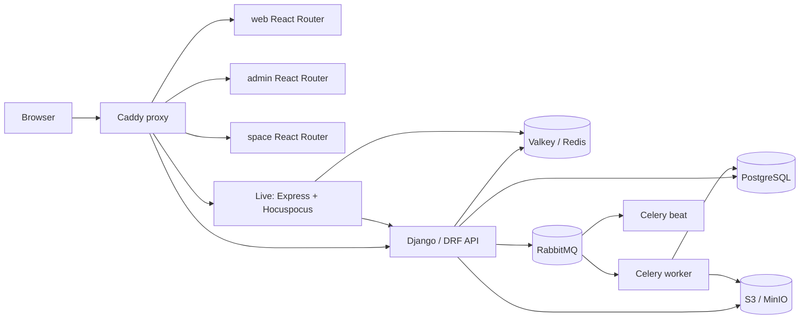
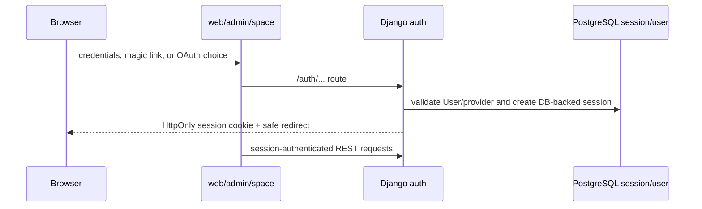
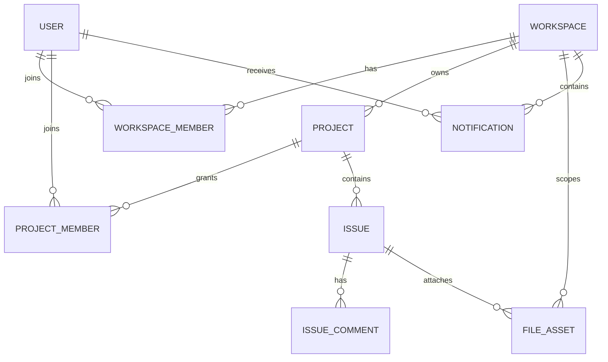

# System Architecture & Codebase Analysis

## 1. Executive Summary

Plane is a **modular monolith backend with several independently deployable services in a pnpm/Turborepo monorepo**. The primary API is a Django/DRF application backed by one shared PostgreSQL database. It is accompanied by Celery workers and scheduler, a RabbitMQ broker, Valkey/Redis, an S3-compatible object store, and a separate Node/Hocuspocus service for collaborative document editing. React Router applications provide the main product UI (`web`), instance administration (`admin`), and public spaces (`space`).

The checked-in deployment is Community Edition (`PLANE_COMMUNITY`). The repository contains frontend product-plan names, pricing data, and upgrade links, but this audit found **no server-side commercial subscription, seat, entitlement, or plan enforcement path** in this codebase. In particular, workspace invitations and acceptance create memberships without counting seats, and project/issue creation contains no plan/quota gate. This is an evidence-based statement about this repository, not about separately distributed editions or hosted services.

The meaningful active restrictions are operational or security safeguards: file/request size, API/authentication/asset throttles, API pagination, administrative workspace-creation disablement, retention jobs, field validation, and a telemetry reporting sample cap. They should remain safety controls and become deployment policy where operators need different values.

## 2. Technology Stack

| Area                   | Evidence                                                                              | Technology / use                                                                    |
| ---------------------- | ------------------------------------------------------------------------------------- | ----------------------------------------------------------------------------------- |
| Monorepo/build         | `package.json`, `pnpm-workspace.yaml`, `turbo.json`                                   | pnpm 11 and Turborepo; Node >=22.18 for TypeScript apps/packages.                   |
| Product UIs            | `apps/web/package.json`, `apps/admin/package.json`, `apps/space/package.json`         | React, React Router, Vite, MobX, SWR, Tailwind/shared `@plane/ui`.                  |
| API                    | `apps/api/pyproject.toml`, `apps/api/plane/settings/common.py`                        | Python/Django + Django REST Framework; WSGI/ASGI configured.                        |
| Data                   | `docker-compose.yml`, `apps/api/plane/db/models/base.py`                              | PostgreSQL 15.7 in Compose; Django ORM; UUID primary keys for `BaseModel` entities. |
| Async                  | `apps/api/plane/celery.py`, `apps/api/plane/settings/common.py`                       | Celery, RabbitMQ AMQP broker, django-celery-beat scheduler.                         |
| Cache/realtime fan-out | `apps/api/plane/settings/redis.py`, `apps/live/src/extensions/redis.ts`               | Valkey/Redis for cache/throttles and Hocuspocus Redis extension/pubsub.             |
| Collaborative editing  | `apps/live/src/hocuspocus.ts`                                                         | Node/Express, Hocuspocus, Yjs/Tiptap, Redis and API callbacks.                      |
| Object storage         | `apps/api/plane/settings/storage.py`                                                  | boto3/django-storages S3 API; Compose defaults to MinIO.                            |
| Edge/proxy             | `apps/proxy/Caddyfile.ce`                                                             | Caddy TLS and path routing.                                                         |
| Observability          | `apps/api/plane/settings/production.py`, `plane/license/bgtasks/telemetry_metrics.py` | JSON logs, optional Scout APM, OpenTelemetry metric exporter, telemetry task.       |

## 3. Repository Structure

```text
/
├── apps/
│   ├── api/       Django API, models, auth, Celery tasks and migrations
│   ├── web/       primary authenticated React application
│   ├── admin/     instance-administration React application
│   ├── space/     public/shareable-space React application
│   ├── live/      Hocuspocus/Yjs collaborative editing service
│   └── proxy/     Caddy reverse-proxy configuration
├── packages/      shared UI, types, constants, API clients, state and editor
├── deployments/   community Docker/AIO/Swarm/Kubernetes deployment material
├── docker-compose.yml
└── .github/workflows/  CI checks/builds/security scanning
```

`apps/api/plane/db` owns persistence models and migrations; `app`, `api`, and `space` are route families over those models. `packages/services` is the browser API-client layer, while `packages/shared-state`, `packages/ui`, `packages/editor`, and `packages/types` are shared by the React apps. The live service is independently deployable but relies on the API session and document endpoints.

## 4. System Architecture



The API is modular, not a collection of independently versioned business microservices: models, route families, and permission classes execute within one Django process and one database. `live` is the clear separate service.

## 5. Service Responsibilities

| Deployable               | Responsibility                                                                                  |
| ------------------------ | ----------------------------------------------------------------------------------------------- |
| `web`                    | Authenticated project-management UI.                                                            |
| `admin`                  | Instance setup, configuration, authentication-provider and workspace administration.            |
| `space`                  | Public/shared content UI and corresponding limited API route family.                            |
| `api`                    | Auth, authorization, REST APIs, persistence, uploads, integrations and webhook management.      |
| `worker` / `beat-worker` | Celery asynchronous jobs and schedules.                                                         |
| `live`                   | Authenticated Yjs collaborative document sessions; reads/writes documents through API services. |
| `proxy`                  | TLS termination, request-size protection and routing.                                           |

## 6. Runtime Request Flows

### Login



Credential, magic-link, password-reset, and Google/GitHub/GitLab/Gitea flows are registered in `apps/api/plane/authentication/urls.py`. `SessionMiddleware` selects the custom `plane.db.models.session` backend and secure/HttpOnly cookie settings are established in `apps/api/plane/settings/common.py`. OAuth availability is configuration-driven; SAML/OIDC/MFA were not confirmed in this tree.

### Workspace, project, and issue creation

`WorkSpaceViewSet.create` validates name/slug, honors `DISABLE_WORKSPACE_CREATION`, writes `Workspace`, creates an admin `WorkspaceMember`, and queues seeding/analytics (`apps/api/plane/app/views/workspace/base.py`). Project routes create a `Project` and project membership (`apps/api/plane/api/views/project.py`; equivalent app route family is `apps/api/plane/app/views/project/base.py`). Issue endpoints use project-member permissions, persist `Issue`, and queue activities/webhooks (`apps/api/plane/api/views/issue.py`, `apps/api/plane/app/views/issue/base.py`). `Issue.save()` serializes per-project sequence assignment with a PostgreSQL advisory transaction lock (`apps/api/plane/db/models/issue.py`).

### Workspace invitation

```mermaid
sequenceDiagram
  participant Admin as workspace admin
  participant API as WorkspaceInvitationsViewset
  participant DB as PostgreSQL
  participant Q as Celery/RabbitMQ
  participant Invitee as authenticated invitee
  Admin->>API: POST workspace invite emails/roles
  API->>DB: validate role and existing active members; bulk create invites
  API->>Q: workspace_invitation.delay per invite
  Invitee->>API: POST join with token
  API->>DB: verify session email equals invite email
  API->>DB: create/reactivate WorkspaceMember; delete invite
```

`apps/api/plane/app/views/workspace/invite.py` has no member-count, seat, plan, or entitlement check in either invitation creation or invitation acceptance. Invitation creation is limited only by administrator authority, role hierarchy, email validation, existing-member checks, and `bulk_create(..., batch_size=10)` batching (not an overall count cap).

### Attachments, notifications, and realtime

Assets are represented by `FileAsset`; API endpoints generate S3/MinIO presigned posts constrained to `FILE_SIZE_LIMIT`, then metadata collection is queued (`apps/api/plane/app/views/asset/v2.py`, `apps/api/plane/settings/storage.py`, `apps/api/plane/bgtasks/storage_metadata_task.py`). Activity jobs fan out database `Notification` records and scheduled email processing (`apps/api/plane/bgtasks/issue_activities_task.py`, `notification_task.py`, `email_notification_task.py`).

The repository does not show a general issue/comment WebSocket event bus. Realtime is specifically collaborative documents: browser connects to `/live`, Hocuspocus validates the API session via `UserService.currentUser`, coordinates connections through Redis, and saves converted Yjs content through API page/description services (`apps/live/src/lib/auth.ts`, `apps/live/src/extensions/database.ts`, `apps/live/src/extensions/redis.ts`).

## 7. Domain Model

Important tables/models are defined under `apps/api/plane/db/models/` and normally inherit UUID/audit fields from `BaseModel`/`AuditModel` (`base.py`, `mixins.py`). Main entities include `User`/`Profile`, `Workspace`, `WorkspaceMember`, `WorkspaceMemberInvite`, `Project`, `ProjectMember`, `Issue`, `IssueComment`, `Page`, `Cycle`, `Module`, `State`, `Label`, `FileAsset`, `Notification`, API tokens, webhooks and integrations.



`Workspace` is the tenant root; project-scoped models inherit `ProjectBaseModel` and carry both project and workspace references. Most business objects use soft deletion (`deleted_at`) through the mixin, while explicit hard-delete/cleanup jobs later remove eligible data. `FileAsset` also has `is_deleted`, `is_archived`, `is_uploaded`, size, and entity-scoping fields (`apps/api/plane/db/models/asset.py`). Important uniqueness constraints include workspace slug, unique membership combinations, and conditional active relation constraints in models/migrations.

## 8. Database Architecture

PostgreSQL is a single shared database/shared schema for all workspaces (`docker-compose.yml`, `apps/api/plane/settings/common.py`); no schema-per-tenant or database-per-tenant mechanism was found. Django migrations reside in `apps/api/plane/db/migrations` (through `0122`) and license migrations separately under `apps/api/plane/license/migrations`.

High-volume models include `issues`, comments/activity/version tables, `notifications`, `file_assets`, webhook logs, and API logs. The code includes indexes for notification receiver/status access and asset entity lookup (`notification.py`, `asset.py`), and recent migrations add indexes such as `notif_receiver_status_idx`. Queries must nevertheless keep filtering by workspace/project before pagination; shared-schema isolation depends on that discipline.

## 9. Multi-Tenancy

Tenant identity is the workspace UUID/slug. API route patterns commonly accept `<str:slug>` and query `workspace__slug=slug`; project models also carry `workspace` and `project`. Membership-based permissions query the user, workspace slug, active status, project ID, and roles (`apps/api/plane/app/permissions/base.py`, `workspace.py`, `project.py`). Object-storage paths include a workspace UUID (`get_upload_path` in `asset.py`). The frontend chooses workspace context by slug.

This is query-level isolation in a shared database. It is robust only where every object lookup applies its workspace/project predicate and endpoint permission class. Contract tests explicitly cover several cross-workspace/project-scope cases under `apps/api/plane/tests/contract/`. A future security audit should systematically test every detail endpoint, asynchronous task, signed asset URL, and live document API callback; this report did not find a tenant bypass but cannot prove absence across all code paths.

## 10. Authentication

Authentication is session/cookie based for browser APIs; DRF defaults to `SessionAuthentication` (`settings/common.py`). `User` is the custom Django auth model (`db/models/user.py`); API keys are a separate model/authentication middleware (`apps/api/plane/api/middleware/api_authentication.py`, `db/models/api.py`). Password auth, magic links, reset/change password, email checks, and four OAuth providers are implemented in `authentication/views/{app,space}`. Password reset and magic emails are asynchronous. No JWT access/refresh lifecycle, service accounts beyond API-token facilities, MFA, SAML, or OIDC server implementation was confirmed.

## 11. Authorization & RBAC

Roles are integer values Admin=20, Member=15, Guest=5 (`apps/api/plane/app/permissions/base.py`; model choices in `db/models/workspace.py` and `project.py`). Backend permission decorators/classes are the authority; frontend checks are usability controls, not security boundaries.

| Scope     | Admin                     | Member                                        | Guest                                                               |
| --------- | ------------------------- | --------------------------------------------- | ------------------------------------------------------------------- |
| Workspace | management/invites        | normal workspace access where endpoint allows | read/allowed access where endpoint allows                           |
| Project   | can administer as allowed | create/edit where endpoint permits            | limited project access; some issue access explicitly includes guest |

`allow_permission` checks active workspace membership and, for project operations, active project membership with a workspace-admin fallback. `WorkSpaceAdminPermission`, `ProjectMemberPermission`, `ProjectAdminPermission`, and page permission classes protect route families. Route-specific decorators mean the exact operation matrix varies; do not infer access from the UI alone.

## 12. Feature Flag System

No general remote, per-workspace, or per-plan feature-flag service/evaluator was found. `utils/permissions/page.py` contains extension points/comments for feature flags, not a demonstrated entitlement evaluator. `InstanceConfiguration` is a generic instance key/value configuration store and `get_configuration_value` reads either database configuration or environment values (`apps/api/plane/license/models/instance.py`, `license/utils/instance_value.py`). The confirmed gate is `DISABLE_WORKSPACE_CREATION`, an operator administrative setting.

## 13. Subscription / Billing Architecture

There is no backend billing provider, webhook consumer, subscription table, invoice model, or seat synchronization found in `apps/api`. Frontend-only constants describe Free/One/Pro/Business/Enterprise packaging, display pricing, features, and upgrade/sales URLs (`packages/constants/src/subscription.ts`, `packages/constants/src/payment.ts`). The self-hosted upgrade modal only opens those external URLs (`apps/web/core/components/license/modal/upgrade-modal.tsx`); the web application also exposes a billing settings route. These are marketing/presentation data in this Community repository; no API or model consumes them to authorize business operations.

## 14. Licensing / Edition Architecture

`plane.license` is an instance administration/configuration/telemetry module, not evidence of an active commercial entitlement check here. `Instance.edition` defaults to `PLANE_COMMUNITY`; a historical migration removed `license_key` and `user_count` fields (`apps/api/plane/license/models/instance.py`, migration `0005_rename_product_instance_edition_and_more.py`). Instance administrator authentication is implemented in `license/api/views/admin.py`. Telemetry can be disabled per instance. Separate proprietary editions or external license services are not present in this checkout and must be treated as license-controlled functionality requiring authorization if introduced elsewhere; this analysis does not recommend bypassing them.

## 15. Limitation & Quota Architecture

### 15.1 Member/User Limits

No user/member/seat cap is enforced in the examined backend, frontend, model constraints, environment examples, or invitation tests. Member counts are calculated for display/annotations (`WorkSpaceViewSet` in `app/views/workspace/base.py`) but not compared to a cap. No billing quantity or provider webhook was found.

### 15.2 Project, Team, and Issue Limits

No project-, team-, or issue-count quota/plan gate was found. The code uses `Project` and membership concepts, not a distinct team model in the database. Issue creation has a per-project advisory lock for sequence correctness, not a count limit (`db/models/issue.py`).

### 15.3 Storage Limits

`FILE_SIZE_LIMIT` defaults to 5,242,880 bytes and is enforced by Caddy, Django request-memory settings, model validation, and presigned S3 post conditions. It is configurable and operational/safety related; no workspace aggregate storage quota was found.

### 15.4 API Limits

Anonymous requests default to 30/minute, API keys default to 60/minute, authentication defaults to 10/minute, email verification is hard-coded to 3/hour, and asset endpoints are 5/minute by asset ID. Pagination has a `MAX_LIMIT` of 1,000 results per request. These are anti-abuse/resource controls, not plan restrictions.

### 15.5 Feature Restrictions and Other Limits

`DISABLE_WORKSPACE_CREATION=1` deliberately prohibits workspace creation. Name/slug lengths, field validators, search result slices, recent-item slices, cleanup retention, and telemetry's 1,000-workspace reporting sample are functional/safety/data-shape controls—not commercial quotas. Preserve intent when making them configurable.

## 16. Complete Limitation Inventory

| Limitation                 | Type                       |             Current limit | Enforcement layer           | Source file                                                 | Function/Class                       | Configurable?    | Recommended action                                               |
| -------------------------- | -------------------------- | ------------------------: | --------------------------- | ----------------------------------------------------------- | ------------------------------------ | ---------------- | ---------------------------------------------------------------- |
| Workspace members/seats    | None found                 |                         — | —                           | `app/views/workspace/invite.py`                             | create/join flows                    | N/A              | Add regression tests; no removal work needed in this edition.    |
| Projects/teams/issues      | None found                 |                         — | —                           | project/issue views/models                                  | creation flows                       | N/A              | Preserve authorization; add scale tests.                         |
| Workspace creation         | Administrative restriction |         disabled when `1` | API                         | `app/views/workspace/base.py`                               | `WorkSpaceViewSet.create`            | Yes              | Retain as operator policy; document it separately from quotas.   |
| File upload                | Operational/safety         |             5 MiB default | proxy + API + S3 conditions | `Caddyfile.ce`, `settings/common.py`, `settings/storage.py` | request middleware/presigned post    | Yes              | Keep; expose a validated deployment policy value.                |
| Request body memory        | Operational/safety         | `FILE_SIZE_LIMIT` default | Django                      | `settings/common.py`                                        | `DATA_UPLOAD_MAX_MEMORY_SIZE`        | Yes              | Keep aligned with proxy/storage.                                 |
| Anonymous API              | Security                   |                 30/minute | DRF                         | `settings/common.py`                                        | `DEFAULT_THROTTLE_RATES`             | Not shown as env | Keep; make deployment-configurable only with abuse controls.     |
| API key requests           | Security                   |         60/minute default | DRF/cache                   | `api/rate_limit.py`, `settings/common.py`                   | `ApiKeyRateThrottle`                 | Yes              | Keep/configure.                                                  |
| Authentication attempts    | Security                   |         10/minute default | DRF/cache                   | `authentication/rate_limit.py`                              | `AuthenticationThrottle`             | Yes              | Keep/configure.                                                  |
| Email verification         | Security                   |                    3/hour | DRF/cache                   | `authentication/rate_limit.py`                              | `EmailVerificationThrottle`          | No               | Retain; centralize as security configuration if needed.          |
| Asset endpoint access      | Security/operational       |                  5/minute | DRF/cache                   | `settings/common.py`, `throttles/asset.py`                  | `AssetRateThrottle`                  | Not shown as env | Retain and evaluate workload effects.                            |
| API page size              | Operational                |                 1,000 max | API                         | `utils/paginator.py`                                        | `MAX_LIMIT`/`OffsetPaginator`        | No               | Keep bounded; use cursor pagination for bulk work.               |
| Search response slices     | Operational UX             |             typically 100 | API                         | `app/views/search/base.py`, `search/issue.py`               | query slices                         | No               | Keep bounded, document/search-index strategy at scale.           |
| Recent workspace items     | Operational UX             |                        20 | API                         | `app/views/workspace/recent_visit.py`                       | serializer slice                     | No               | Keep as UI response bound.                                       |
| Activity export            | Operational safeguard      |               10,000 rows | API                         | `app/views/workspace/base.py`                               | activity query slice                 | No               | Make explicit export/stream policy rather than silently raising. |
| Telemetry workspace detail | Observability payload      |                     1,000 | worker                      | `license/bgtasks/telemetry_metrics.py`                      | `WORKSPACE_METRICS_LIMIT`            | No               | Keep sampling or configure independently; not product access.    |
| Metrics schedule input     | Safety                     |      1–10,000,000 minutes | scheduler                   | `celery.py`                                                 | `_get_metrics_push_interval_minutes` | Yes              | Retain validation.                                               |
| Issue estimate/auto-close  | Domain validation          |                      0–12 | model                       | `db/models/issue.py`, `project.py`                          | validators                           | No               | Do not classify as a commercial quota.                           |

## 17. Feature Entitlement Matrix

| Feature               | Restriction found        | Backend gate            | Frontend gate     | Entitlement source            | Recommendation                                      |
| --------------------- | ------------------------ | ----------------------- | ----------------- | ----------------------------- | --------------------------------------------------- |
| Members/invitations   | Role hierarchy only      | Yes                     | UI may guide      | `WorkspaceMember.role`        | Keep backend RBAC; no seat gate found.              |
| Projects/work items   | Membership/roles         | Yes                     | Yes, convenience  | permission classes/decorators | Keep backend authority.                             |
| Billing plans         | Upgrade presentation     | No                      | Yes               | static constants              | Do not treat as authorization in CE.                |
| Workspace creation    | Instance operator toggle | Yes                     | not relied upon   | config/env                    | Retain as explicit operator policy.                 |
| Collaborative editing | Session authentication   | Yes, via API validation | client connection | session/API                   | Keep; add document-level authorization tests.       |
| Attachments           | size/auth checks         | Yes                     | Yes               | settings + permissions        | Keep technical bounds; no storage plan quota found. |

## 18. Background Jobs & Queues

Celery uses RabbitMQ (`CELERY_BROKER_URL` in `settings/common.py`); Compose runs one worker and one beat process. Tasks cover invitations, magic/password emails, notifications, issue/page description versions, activities/webhooks, export, cleanup/deletion, object metadata/copy, analytics, and telemetry (`apps/api/plane/bgtasks/`, `apps/api/plane/celery.py`). No explicit queue routing, worker concurrency, retry policy, or dead-letter exchange was confirmed in the checked configuration—important operational gaps for high volume.

## 19. Realtime Architecture

The `live` service uses Express WebSocket support and Hocuspocus with a 10-second save debounce (`apps/live/src/server.ts`, `hocuspocus.ts`). It authenticates by presenting the browser session to the API; Redis supplies Hocuspocus coordination and cross-server broadcasts. This supports rich-text collaboration, not confirmed broad issue/notification live updates. Horizontal live scaling requires shared Redis and correctly routed WebSocket traffic; no load-balancer affinity policy is supplied in Compose.

## 20. File/Object Storage

The storage adapter can use AWS S3-compatible storage or MinIO (`settings/storage.py`); Compose proxies the configured bucket to `plane-minio`. File keys use workspace UUIDs where available. Presigned posts enforce content type and `content-length-range`; download URLs are signed with configurable `SIGNED_URL_EXPIRATION`. File cleanup is scheduled, with `HARD_DELETE_AFTER_DAYS` configured in the environment surface. No aggregate workspace storage accounting/quota was found.

## 21. Search Architecture

Search is database/queryset based—workspace/project filters and string matching helpers—not Elasticsearch/OpenSearch/Meilisearch/Typesense. Endpoints live in `app/urls/search.py`, `app/views/search/base.py`, `app/views/search/issue.py`, and API work-item search routes. Result slices protect response size. At large tenant scale, inspect query plans and introduce database/search indexing deliberately rather than expanding result limits.

## 22. Integrations

Auth supports Google, GitHub, GitLab, and Gitea. Database integration models cover provider registration, workspace integration credentials/config, GitHub repository/issue/comment synchronization, and Slack project synchronization (`db/models/integration/`). Workspace webhooks and log endpoints are in `app/urls/webhook.py` and `app/views/webhook/base.py`; delivery jobs are in `bgtasks/webhook_task.py`. No integration plan/entitlement gate was found.

## 23. API Architecture

The application exposes REST-style `/api/` route families via `plane.urls`, split between legacy/API (`plane/api/urls`) and application (`plane/app/urls`) endpoints, plus auth under `/auth/`. DRF defaults require an authenticated session; API-key middleware and rate throttle support programmatic access. Workspace slug and project UUID are dominant route scoping parameters. Cursor/offset pagination has a bounded max page size. No GraphQL or internal RPC interface was confirmed.

## 24. Caching

Redis is configured by `settings/redis.py` and used for cache invalidation decorators, DRF throttling cache keys, magic-link state, and live-service pub/sub. Browser data is managed in MobX stores and SWR. Cache invalidation accompanies invitation joins and many mutating endpoints (`app/views/workspace/invite.py`). Cache topology/TTL and production eviction policy are deployment concerns not defined in Compose.

## 25. Deployment Architecture

`docker-compose.yml` deploys the seven application processes plus PostgreSQL, Valkey, RabbitMQ, MinIO, Caddy, and persistent volumes. `apps/proxy/Caddyfile.ce` routes `/api`, `/auth`, `/live`, `/spaces`, `/god-mode`, static and bucket paths. Community deployment directories include AIO, CLI, Swarm and Kubernetes materials; the Kubernetes README points to Helm-based deployment but this audit did not find a checked-in full set of workload manifests in the listed directory. GitHub Actions runs API Ruff checks, frontend builds/lint/type checks, CodeQL, version/copyright/i18n checks (`.github/workflows/`).

## 26. Configuration / Environment Variables

| Group                 | Confirmed examples                                                                                           |
| --------------------- | ------------------------------------------------------------------------------------------------------------ |
| Database/cache/queue  | `POSTGRES_*`, `DATABASE_URL`, `REDIS_*`, `RABBITMQ_*`                                                        |
| Storage               | `AWS_*`, `AWS_S3_BUCKET_NAME`, `USE_MINIO`, `MINIO_ENDPOINT_SSL`, `FILE_SIZE_LIMIT`, `SIGNED_URL_EXPIRATION` |
| URLs/edge             | `WEB_URL`, `APP_BASE_*`, `ADMIN_BASE_*`, `SPACE_BASE_*`, `LIVE_BASE_*`, CORS/host/cookie settings            |
| Auth/security         | `SECRET_KEY`, `SESSION_COOKIE_AGE`, `AUTHENTICATION_RATE_LIMIT`, `API_KEY_RATE_LIMIT`, `WEBHOOK_ALLOWED_*`   |
| Operations            | `GUNICORN_WORKERS`, `HARD_DELETE_AFTER_DAYS`, telemetry/OTEL/Scout/PostHog settings                          |
| Administrative gating | `DISABLE_WORKSPACE_CREATION` (through instance configuration/environment lookup)                             |

Sources: `.env.example`, `apps/api/.env.example`, `apps/api/plane/settings/common.py`, and `license/utils/instance_value.py`. Never put secret values in deployment documentation.

## 27. Scalability Assessment

At 100–1,000 users, the Compose shape can work with right-sized database, Redis, RabbitMQ, object storage and workers. At 10,000 users/millions of issues, evidence-based risks include:

- Many list paths use `count()` plus offset pagination; deep offsets and counts become expensive (`utils/paginator.py`).
- Issue creation intentionally serializes per-project sequence assignment with an advisory lock. It preserves correctness but is a hotspot for very high write concurrency to one project (`db/models/issue.py`).
- Search is database-query based with response slices rather than a dedicated index.
- Celery has no confirmed routing/concurrency/retry/DLQ policy in repository configuration; notifications, webhooks and exports share the worker deployment.
- Live editing horizontally coordinates through Redis, but connection capacity, proxy upgrade/timeouts and autoscaling are not prescribed.
- Some analytics/search/activity endpoints contain fixed response/query slices; blindly increasing them can create large queries/payloads.
- PostgreSQL Compose sets `max_connections=1000`, which is a deployment setting rather than proof of sustainable application connection pooling. No application-side pooling configuration was confirmed.

## 28. Security Architecture

Strengths observed: server-side session/RBAC enforcement, HttpOnly session cookies, CSRF middleware, CORS configuration, safe redirect helpers, invitation acceptance email matching, S3 presigned restrictions, webhook private-network safeguards (`settings/common.py`), and authentication/API throttles. Caddy and Django both apply upload protections.

Risks/verification targets: default `ALLOWED_HOSTS="*"` and CORS-all behavior when explicit origins are absent are permissive self-host defaults; production deployments should set restrictive values. The live service authenticates a user session but document access is delegated to API callbacks—test authorization for every `documentType` and project/workspace identifier. Shared-schema tenant isolation needs continuing contract coverage. Do not remove throttles, body-size limits, role checks, or webhook SSRF controls as part of any “unlimited” work.

## 29. Technical Debt & Risks

| Severity | Finding and evidence                                                                                                                                                                    |
| -------- | --------------------------------------------------------------------------------------------------------------------------------------------------------------------------------------- |
| Critical | No confirmed critical tenant breach; shared-schema isolation nevertheless makes missing scope predicates high-impact. Maintain/expand contract tests around detail and asset endpoints. |
| High     | High-volume async work has no confirmed queue isolation, retry/backoff/DLQ policy (`celery.py`, Compose).                                                                               |
| High     | Deep offset pagination/counts and database-only search will degrade on very large tenants (`utils/paginator.py`, search views).                                                         |
| Medium   | Per-project issue advisory locking improves correctness but limits concentrated write throughput (`db/models/issue.py`).                                                                |
| Medium   | Operational controls are scattered across Caddy, Django, model validation, presigned storage and task code; changing one value can leave inconsistent enforcement.                      |
| Low      | Static cloud-plan constants and billing UI may confuse self-hosted operators because no matching CE enforcement exists (`packages/constants/src/payment.ts`).                           |

## 30. Recommended Target Architecture

Keep the present service boundaries initially, but formalize an **operator policy layer** distinct from product packaging:

```text
Infrastructure / security policy (bounded, observable, configurable)
  !=
Commercial entitlement / plan policy (absent from this CE enforcement path)
```

Use one validated deployment configuration source for upload/request limits, rate limits, retention, worker concurrency, connection pools and pagination ceilings. An authorized self-host operator may choose a policy value that means unlimited only for business counts; infrastructure protections must remain finite and capacity-based. Avoid creating faux self-service licenses or bypassing third-party/paid edition validation.

## 31. Recommended Limitation-Removal Strategy

There are no confirmed CE member/project/team/issue plan caps to remove. Future work should first inventory any external or separately licensed edition components and obtain authorization. For scattered operational controls, centralize configuration validation and report effective policy values. Preserve backend RBAC and use frontend gates only to reflect backend capability. Do not conflate a response-size/page-size bound with a total object quota.

## 32. Proposed Implementation Phases

1. Add a policy inventory/test harness that proves no count-based gate exists for members, projects and issues in the authorized deployment.
2. Centralize technical limits (edge/API/storage/worker) with validation and one documented precedence order.
3. Separate UI packaging/upgrade copy from capability authorization in self-hosted builds, subject to licensing review.
4. Harden scale: keyset/cursor pagination, query-plan/index review, queue routing/retries/DLQ, connection-pool and worker sizing, live-service load testing.
5. Add observability: queue depth/age, DB latency/locks, cache hit/evictions, object-store errors, live connections, and per-tenant workload metrics.

## 33. Testing Strategy

Existing contract tests cover authentication throttling, API tokens, project/member scope, assets, pages and workspace resource scope under `apps/api/plane/tests/contract/`; unit paginator and live tests also exist. Before any authorized policy change, add regression coverage for:

- invitations and acceptance with member counts above any previous externally documented cap;
- many projects/teams/work items without a business-count rejection;
- server-side role denials and cross-workspace/project isolation;
- upload threshold at proxy/API/presigned-post boundaries;
- rate-limit configuration and abuse responses;
- pagination/search bounds and bulk/export behavior;
- queue retry/dead-letter behavior and realtime document authorization.

## 34. Important Source Files

- `docker-compose.yml`; `apps/proxy/Caddyfile.ce`
- `apps/api/plane/settings/common.py`; `apps/api/plane/celery.py`
- `apps/api/plane/db/models/{workspace,project,issue,asset,notification,user}.py`
- `apps/api/plane/app/views/workspace/{base,invite}.py`
- `apps/api/plane/app/permissions/{base,workspace,project,page}.py`
- `apps/api/plane/authentication/urls.py`; `authentication/rate_limit.py`; `authentication/middleware/session.py`
- `apps/api/plane/api/rate_limit.py`; `apps/api/plane/utils/paginator.py`
- `apps/api/plane/license/models/instance.py`; `license/bgtasks/telemetry_metrics.py`
- `apps/live/src/{server,hocuspocus}.ts`; `live/src/lib/auth.ts`; `live/src/extensions/{database,redis}.ts`
- `packages/constants/src/{subscription,payment}.ts`; `apps/web/core/components/license/modal/upgrade-modal.tsx`

## 35. Open Questions / Unknowns

- The repository does not establish production worker concurrency, queue routing, retry/DLQ, database pool sizing, backup/restore or autoscaling policy.
- The referenced Kubernetes/Helm deployment artifacts are not all checked into the reviewed tree; validate the exact chart/manifests used by the target deployment.
- No separately licensed Enterprise source or hosted billing service was available for review. Do not infer that their enforcement is absent.
- The API's full route surface is large; this report samples and traces primary flows and security patterns. Run automated endpoint-by-endpoint authorization tests before declaring tenant isolation exhaustive.
