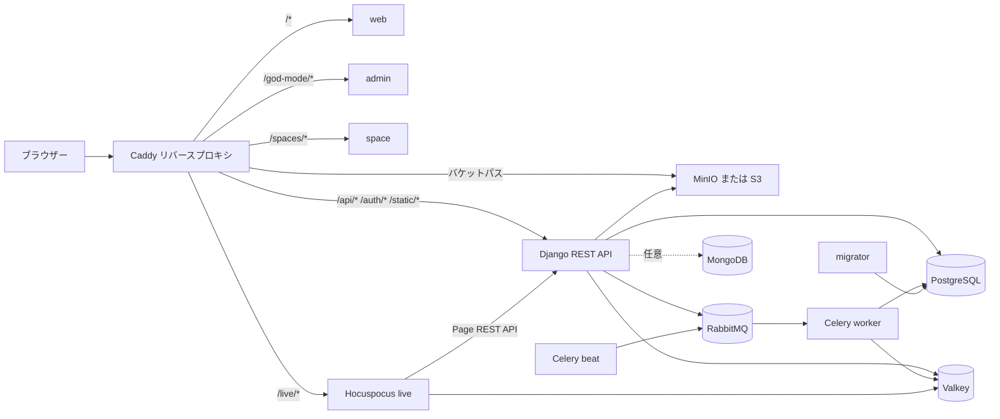
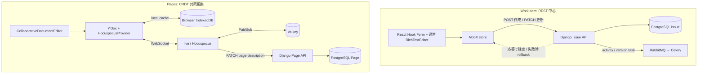
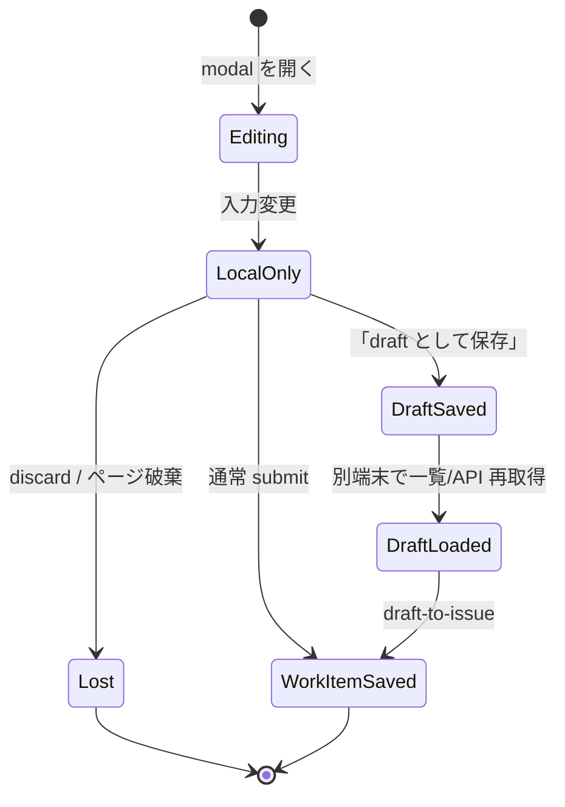

<!-- Generated by GSD docs-update. Verify repository references when implementation changes. -->

# Plane アーキテクチャ概要

この文書は、現在のリポジトリに実装されている Community Edition の主要な実行経路を説明する。特に、通常の Work Item 更新と Pages の共同編集は同じ「リアルタイム編集」ではなく、異なる整合性モデルを持つ点に注意する。

## 全体像

Caddy の Community Edition 設定は `/spaces/*`、`/god-mode/*`、`/live/*`、`/api/*` をそれぞれ `space`、`admin`、`live`、`api` に振り分け、最後に残ったパスを `web` に送る。オブジェクトストレージのバケットパスも MinIO に直接中継する（`apps/proxy/Caddyfile.ce:1-24`）。コンテナ内では web/admin/space/live が 3000、API が 8000 を待ち受け、外部公開は proxy の HTTP/HTTPS ポートに集約される（`docker-compose.yml:99-107`, `docker-compose.yml:154-172`）。

## フロントエンド: React Router + Vite

現在の web、admin、space は Next.js アプリではなく、React Router の framework mode と Vite でビルドされる。各 `package.json` の `dev`/`build` は `react-router dev` と `react-router build` を実行し、Vite 設定は `@react-router/dev/vite` プラグインを読み込む（`apps/web/package.json:7-21`, `apps/admin/package.json:8-18`, `apps/space/package.json:7-17`, `apps/web/vite.config.ts:1-24`）。web と admin はクライアント専用、space は SSR を有効にしている（`apps/web/react-router.config.ts:3-7`, `apps/admin/react-router.config.ts:6-10`, `apps/space/react-router.config.ts:6-10`）。

それでもリポジトリが Next.js に見える理由は、移行後の互換層が残っているためである。

- 画面ファイルに `page.tsx` や `layout.tsx` が多く、旧来のディレクトリ形状を保っている。
- 既存コードの `next/link`、`next/navigation`、`next/script` を一度に書き換えずに済むよう、Vite alias が React Router ベースの shim に向けられている（`apps/web/vite.config.ts:25-32`, `apps/admin/vite.config.ts:29-35`, `apps/space/vite.config.ts:29-34`）。
- `next-themes` はテーマ管理ライブラリとして引き続き使われるが、Next.js ランタイムそのものではない（`apps/web/package.json:53-71`）。
- clean script に `.next` の削除が残る（`apps/web/package.json:12`）。これは互換・移行上の残存物であり、現在の生成物は `build` と `.react-router` である。

したがって、ルーティングやビルドの調査ではファイル名だけで Next.js と判断せず、`react-router.config.ts`、`vite.config.ts`、各アプリの scripts を起点にする。

## モノレポの境界

トップレベルは pnpm workspace と Turborepo で構成される。

- `apps/web`: メインの Plane UI。
- `apps/admin`: `/god-mode` のインスタンス管理 UI。
- `apps/space`: `/spaces` の公開・共有 UI。
- `apps/live`: Hocuspocus ベースの Pages 共同編集サーバー。
- `apps/api`: Django/DRF バックエンド。
- `apps/proxy`: Caddy 設定と proxy イメージ。
- `packages/*`: `@plane/editor`、`@plane/services`、`@plane/shared-state`、`@plane/ui`、`@plane/types`、`@plane/utils` など、アプリ間で共有する TypeScript パッケージ。

pnpm は `apps/*` と `packages/*` を対象にしつつ、Python アプリの `apps/api` とコンテナ専用の `apps/proxy` を明示的に除外する（`pnpm-workspace.yaml:1-5`）。内部パッケージは `workspace:*`、共通の外部依存バージョンは catalog で束ねられる。たとえば web は editor、services、shared-state、types、ui、utils を `workspace:*` で参照する（`apps/web/package.json:32-41`）。

Turborepo はアプリ/パッケージ単位の task 境界を持つ。`build` と型検査は依存パッケージを先に処理し、`dev` は永続 task、remote cache は無効である（`turbo.json:35-43`, `turbo.json:59-70`）。ルートの `pnpm dev`、`pnpm build`、`pnpm check` はそれぞれ Turbo task を全 workspace に配る（`package.json:8-20`）。Python の依存、migration、テストはこの pnpm/Turbo グラフの外側にある。

## リクエストルーティングとサービス

### Caddy から各ランタイムへ

| パス                             | 宛先               | 主用途               |
| -------------------------------- | ------------------ | -------------------- |
| `/*`                             | `web:3000`         | メイン UI            |
| `/god-mode/*`                    | `admin:3000`       | 管理 UI              |
| `/spaces/*`                      | `space:3000`       | Space UI             |
| `/api/*`, `/auth/*`, `/static/*` | `api:8000`         | REST、認証、静的資産 |
| `/live/*`                        | `live:3000`        | WebSocket/Live API   |
| `/<bucket>/*`                    | `plane-minio:9000` | アップロード資産     |

表の経路は `apps/proxy/Caddyfile.ce:6-23` に対応する。Caddy の `reverse_proxy` が WebSocket upgrade も処理するため、Pages の接続はブラウザーから `/live/collaboration` に入り、live コンテナへ到達する。

### Python バックエンド

API は Django 4.2 と Django REST Framework 3.15 を使用し、永続データは PostgreSQL に保存する（`apps/api/requirements/base.txt:4-10`, `apps/api/plane/settings/common.py:143-157`）。本番 entrypoint は migration 完了を待ち、設定・バケット・cache を準備してから Gunicorn/Uvicorn で ASGI アプリを起動する（`apps/api/bin/docker-entrypoint-api.sh:3-38`）。

バックグラウンド処理は Celery worker と Celery beat に分かれ、migrator は独立した一回実行サービスである（`apps/api/bin/docker-entrypoint-worker.sh:4-8`, `apps/api/bin/docker-entrypoint-beat.sh:4-8`, `apps/api/bin/docker-entrypoint-migrator.sh:4-6`）。**Celery の broker は RabbitMQ** であり、Valkey ではない。`AMQP_URL` があればそれを使い、なければ RabbitMQ の接続情報から `CELERY_BROKER_URL` を組み立てる（`apps/api/plane/settings/common.py:258-275`）。

ファイルは S3 互換 API を通じて保存される。self-host の compose は MinIO を提供するが、外部 S3 互換ストレージを使う場合は MinIO サービスを省ける（`deployments/cli/community/docker-compose.yml:19-24`, `deployments/cli/community/docker-compose.yml:204-215`）。MongoDB は必須 DB ではない。URL と DB 名がない場合は機能を無効化し、外部 API/Webhook ログなどは PostgreSQL にフォールバックできる任意構成である（`apps/api/plane/settings/common.py:469-471`, `apps/api/plane/settings/mongo.py:46-68`, `apps/api/plane/bgtasks/logger_task.py:62-99`）。

## Valkey の役割

compose 上のサービス名は歴史的に `plane-redis` だが、実体イメージは `valkey/valkey` である（`docker-compose.yml:123-128`）。コード内の `REDIS_URL`、`redis`、`ioredis` という名前もプロトコル互換性に由来する。Valkey は次の複数用途を共有する。

| 用途                    | 実装                                                                                                                                                                                                                                                   |
| ----------------------- | ------------------------------------------------------------------------------------------------------------------------------------------------------------------------------------------------------------------------------------------------------ |
| Django response cache   | `django_redis.cache.RedisCache` を default cache に設定し、`cache_response` decorator が成功応答を保存する（`apps/api/plane/settings/common.py:180-202`, `apps/api/plane/utils/cache.py:25-47`）。                                                     |
| DRF throttling          | 匿名、認証、API key、メール確認などの throttle 履歴は DRF の cache を使う。既定匿名 rate は 30/minute、メール確認は 3/hour（`apps/api/plane/settings/common.py:79-93`, `apps/api/plane/authentication/rate_limit.py:17-38`）。                         |
| Magic code              | サインイン/サインアップ用 6 桁 code と試行回数を 600 秒保存し、成功時に削除する（`apps/api/plane/authentication/provider/credentials/magic_code.py:54-95`, `apps/api/plane/authentication/provider/credentials/magic_code.py:97-119`）。               |
| メールアドレス変更 code | ユーザー ID と新メールを含む key に code を 600 秒保存し、検証後に削除する（`apps/api/plane/app/views/user/base.py:150-162`, `apps/api/plane/app/views/user/base.py:196-237`）。                                                                       |
| 分散メール lock         | `SET NX EX` で同一 Work Item/受信者/通知集合の重複送信を抑止する（`apps/api/plane/bgtasks/email_notification_task.py:33-43`, `apps/api/plane/bgtasks/email_notification_task.py:152-164`）。                                                           |
| Work Item origin bridge | activity task がリクエスト origin を Work Item ID key に 600 秒保存し、email task が取得して通知リンクの base URL にする（`apps/api/plane/bgtasks/issue_activities_task.py:1502-1532`, `apps/api/plane/bgtasks/email_notification_task.py:161-168`）。 |
| Pages Pub/Sub           | live が `ioredis` client を作り、Hocuspocus Redis extension が document 更新を複数 live instance 間で配信する（`apps/live/src/redis.ts:42-82`, `apps/live/src/extensions/redis.ts:24-50`, `apps/live/src/extensions/redis.ts:122-139`）。              |

この共有は「Valkey が Celery broker」という意味ではない。非同期 task 配送は RabbitMQ、cache/短命 state/lock/Pub/Sub は Valkey、永続的な業務データは PostgreSQL という分担である。

### Valkey に格納される代表的な key と寿命

| 用途                  | key/value の概念形                                                                         | TTL / 削除条件                                                                                                                                                                                                                                                                                                   |
| --------------------- | ------------------------------------------------------------------------------------------ | ---------------------------------------------------------------------------------------------------------------------------------------------------------------------------------------------------------------------------------------------------------------------------------------------------------------- |
| custom response cache | `<request-path>:<user-id>`、または user 非依存なら `<request-path>` → response data/status | decorator 既定 1 時間。Instance、Workspace label など一部 endpoint は 2 時間。HTTP 200 かつ `DEBUG=False` の場合だけ保存する（`apps/api/plane/utils/cache.py:16-47`, `apps/api/plane/license/api/views/instance.py:28-35`, `apps/api/plane/app/views/workspace/label.py:17-29`）。                               |
| Django page cache     | Django middleware が生成する cache key → HttpResponse                                      | Timezone endpoint は custom decorator ではなく `cache_page` で 2 時間保存する（`apps/api/plane/app/views/timezone/base.py:23-29`）。                                                                                                                                                                             |
| API key throttle      | `api_key:<key>` / `service_token:<key>` を基にした request 時刻履歴                        | window 終了まで。通常 API key は既定 60/minute、service token は 300/minute（`apps/api/plane/api/rate_limit.py:12-55`）。                                                                                                                                                                                        |
| magic code            | `magic_<email>` → code、email、試行回数                                                    | 600 秒。または認証成功時に即時削除（`apps/api/plane/authentication/provider/credentials/magic_code.py:54-119`）。                                                                                                                                                                                                |
| email 変更 code       | `magic_email_update_<user-id>_<new-email>` → code                                          | 600 秒。または変更成功時に即時削除（`apps/api/plane/app/views/user/base.py:150-159`, `apps/api/plane/app/views/user/base.py:196-237`）。                                                                                                                                                                         |
| email 送信 lock       | `send_email_notif_<issue-id>_<receiver-id>_<notification-ids>`                             | `SET NX EX 300` で取得する。主要な完了/例外 path は明示削除し、origin 不在で早期 return する path では TTL 失効に任せる（`apps/api/plane/bgtasks/email_notification_task.py:33-43`, `apps/api/plane/bgtasks/email_notification_task.py:152-168`, `apps/api/plane/bgtasks/email_notification_task.py:285-305`）。 |
| origin bridge         | `<issue-id>` → request origin                                                              | 600 秒（`apps/api/plane/bgtasks/issue_activities_task.py:1527-1532`）。                                                                                                                                                                                                                                          |
| live 管理 channel     | `hocuspocus:admin`                                                                         | Pub/Sub のため保持・再生しない。全 live instance への強制切断通知などに使う（`apps/live/src/extensions/redis.ts:24-50`, `apps/live/src/extensions/force-close-handler.ts:157-179`）。                                                                                                                            |

response cache は更新 endpoint の decorator から `DEL` して整合させる。複数 user/key を消す場合は `cache.keys("*...*")` と `delete_many` を使うため、key 数が大きい環境では wildcard 探索コストに注意が必要である（`apps/api/plane/utils/cache.py:54-69`）。email lock は owner token を持たず単純に `DEL` する方式なので、処理が TTL の 300 秒を超えて別 worker が lock を再取得した場合、古い worker が新しい lock を消し得る。これは現在の実装上の制約であり、厳密な lease/owner 検証ではない。

Pages の Pub/Sub message は永続 queue ではなく、その時点で subscribe している live instance に配信される。server-side の system of record は PostgreSQL であり、live server が document を load するときは Django Page API から復元する。再接続時はすでに live server 上に load 済みの document と同期する場合もあり、browser 側には Y.Doc の IndexedDB cache もある。compose は `redisdata` volume を割り当てるが、業務データの正本を Valkey に置く設計ではない（`docker-compose.yml:123-128`, `apps/live/src/extensions/database.ts:26-60`, `packages/editor/src/core/hooks/use-yjs-setup.ts:270-293`）。

## Work Item と Pages は別の書き込み経路

### Work Item の作成・更新

作成/編集 modal は React Hook Form の `useForm<TIssue>` でフォーム state を持つ（`apps/web/core/components/issues/issue-modal/form.tsx:141-155`）。description は共同編集 editor ではなく通常の `RichTextEditor` を `Controller` で包み、HTML をフォーム値に戻す（`apps/web/core/components/issues/issue-modal/components/description-editor.tsx:180-199`）。既存 Work Item の本文編集も `DescriptionInput` から通常の Work Item update を呼ぶ（`apps/web/core/components/issues/issue-detail/main-content.tsx:135-150`）。

詳細画面の description は入力後 1.5 秒の debounce で PATCH され、component unmount 時にも未保存変更があれば保存を試みる。これも WebSocket や browser local storage ではなく通常の REST autosave である（`apps/web/core/components/editor/rich-text/description-input/root.tsx:151-219`, `apps/web/core/components/editor/rich-text/description-input/root.tsx:227-253`）。

通常作成は `POST /api/workspaces/{slug}/projects/{projectId}/issues/` を送り、応答後に MobX map/list に追加する（`apps/web/core/services/issue/issue.service.ts:24-38`, `apps/web/core/store/issue/helpers/base-issues.store.ts:517-542`）。quick add だけは一時 ID の項目を先に追加して、作成応答後に置き換える（`apps/web/core/store/issue/helpers/base-issues.store.ts:643-658`）。

更新は先に MobX store と list を更新し、その後 sparse `PATCH` を送る楽観更新である。成功時はサーバー応答を merge し、失敗時は保存しておいた旧 state に戻す（`apps/web/core/store/issue/helpers/base-issues.store.ts:554-592`）。HTTP client の更新先は `PATCH /api/workspaces/{slug}/projects/{projectId}/issues/{issueId}/` である（`apps/web/core/services/issue/issue.service.ts:226-232`）。

Work Item の内容を受信する WebSocket subscription はない。別端末や別の API client が変更しても、現在の MobX store は自動では更新されず、再取得で収束する。E2E fixture も server-only PATCH がローカル MobX に通知されないことを前提にしている（`apps/web/e2e/fixtures/api.ts:102-124`）。ここでの「subscribe」は通知購読 API を指し、データ同期 WebSocket ではない。

### Pages の共同編集

Pages editor は `CollaborativeDocumentEditorWithRef` を使い、`/live/collaboration` の `ws:`/`wss:` URLを組み立てる（`apps/web/core/components/pages/editor/editor-body.tsx:190-214`, `apps/web/core/components/pages/editor/editor-body.tsx:268-299`）。editor は page ID を document name として `HocuspocusProvider` を生成し、provider の document を Y.Doc session として使う（`packages/editor/src/core/hooks/use-yjs-setup.ts:54-65`, `packages/editor/src/core/hooks/use-yjs-setup.ts:194-196`）。live の collaboration controller が WebSocket を Hocuspocus に渡す（`apps/live/src/controllers/collaboration.controller.ts:14-37`）。

live の Database extension は接続時に Django の Page API から binary description を読み、Yjs state を復元する。保存時には Yjs binary を binary/HTML/JSON に変換し、Page description API に PATCH する（`apps/live/src/extensions/database.ts:26-60`, `apps/live/src/extensions/database.ts:72-92`）。保存は Hocuspocus 側で 10 秒 debounce される（`apps/live/src/hocuspocus.ts:40-51`）。実際の永続化先は `/api/workspaces/{slug}/projects/{projectId}/pages/{pageId}/description/` である（`apps/live/src/services/page/core.service.ts:118-130`, `apps/live/src/services/page/project-page.service.ts:17-30`, `apps/api/plane/app/urls/page.py:56-59`）。

Valkey Pub/Sub は複数 live instance の Hocuspocus document 更新を中継するが、最終的な Page の永続化は Django API と PostgreSQL が担う。したがって Valkey は Pages の system of record ではない。

現在の document service dispatch が受け付ける種別は `project_page` だけである（`apps/live/src/services/page/handler.ts:12-21`）。Work Item description はこの dispatch に入らず、同じ rich-text editor package を使っていても共同編集経路には接続しない。

## Work Item の未保存 state と DraftIssue

modal で未 submit の変更は React Hook Form と React component state に置かれ、`changesMade` は discard/draft 保存用の mirror になる（`apps/web/core/components/issues/issue-modal/form.tsx:141-155`, `apps/web/core/components/issues/issue-modal/base.tsx:60-68`, `apps/web/core/components/issues/issue-modal/base.tsx:367-385`）。localStorage やサーバーへの自動保存ではないため、そのまま破棄、reload、端末切替をすると引き継がれない。

新規 Work Item modal を閉じる際、変更があれば discard 確認を出し、ユーザーが draft 保存を選んだとき初めて `POST /api/workspaces/{slug}/draft-issues/` を呼ぶ。既存 Work Item の更新 modal はこの discard/draft 保存確認を出さずに閉じる（`apps/web/core/components/issues/issue-modal/draft-issue-layout.tsx:59-87`, `apps/web/core/services/issue/workspace_draft.service.ts:18-45`）。保存後は PostgreSQL の `DraftIssue` 行となり、description、日付、assignee、label などを保持する（`apps/api/plane/db/models/draft.py:16-81`）。一覧は作成者で filter され、同じアカウントなら別端末から再取得できる（`apps/api/plane/app/views/workspace/draft.py:100-108`）。draft-to-issue API は正式な Issue を作り、asset を移し、最後に DraftIssue を削除する（`apps/api/plane/app/views/workspace/draft.py:205-225`, `apps/api/plane/app/views/workspace/draft.py:298-309`）。

つまり「未保存のローカル下書き」と「サーバー側 DraftIssue」は別物であり、cross-device になる境界はユーザーが明示的に draft 保存を完了した時点である。

## 同時更新と競合の制約

### 通常の Work Item PATCH

通常の Work Item 更新には汎用的な ETag、`If-Match`、version precondition がない。クライアントは変更 data だけを PATCH し、DRF は `partial=True` で現在行に適用する（`apps/web/core/services/issue/issue.service.ts:226-232`, `apps/api/plane/app/views/issue/base.py:617-672`）。そのため次の挙動になる。

- 同じ field を二者が更新すると、後から DB に保存された値が勝つ（last write wins）。先行更新を検知して拒否する一般機構はない。
- 異なる field を sparse PATCH し、request が順番に処理される通常ケースでは両方が残る。ただし generic row lock/version check がなく、DRF の model update は request が読み込んだ instance を保存するため、完全に並行した request まで非損失を保証するものではない。
- UI が古い値を payload に含めれば、その field は意図せず上書きされ得る。modal の既存 item 更新は dirty field を選別する一方、`description_html` と `type_id` は常に payload に含める（`apps/web/core/components/issues/issue-modal/form.tsx:241-249`, `packages/utils/src/work-item/modal.ts:43-53`）。別端末で更新済みの description/type を古い modal が戻す可能性がある。
- 楽観更新は通信失敗の rollback には効くが、成功応答になった論理的な競合を検出しない。

DraftIssue の PATCH にも ETag/version precondition はなく、同じアカウントが別端末で同一 draft を編集した場合は同じ制約を持つ。未保存の新規 modal は端末ごとに独立しているため、両方を submit すると「競合」ではなく別々の Work Item/DraftIssue が作成される。

description 更新後には `IssueDescriptionVersion` を非同期生成し、同一ユーザーの近接更新は 10 分以内なら最新 version にまとめる（`apps/api/plane/app/views/issue/base.py:673-702`, `apps/api/plane/bgtasks/issue_description_version_task.py:15-66`）。履歴は誤上書き後の参照・回復材料であり、同時更新の予防や compare-and-swap ではない。

### Timeline propagation の限定的な例外

依存関係を含むガント移動には専用の `POST /timeline-propagation/` があり、通常 PATCH とは異なる。request は drag 開始時の `original_start_date`、`original_target_date` と `expected_updated_at` を必須で受け取る（`apps/api/plane/app/serializers/timeline_propagation.py:23-49`）。サーバーは transaction 内で **drag 対象行だけ** を `select_for_update(of=("self",))` で lock してから伝播計算する（`apps/api/plane/app/views/issue/timeline_propagation.py:158-177`）。

ただし現在の `SCHEDULE_CHANGED` 判定は汎用 version 比較ではなく、DB の start/target date が drag 開始時の date range と一致するかに限定される。`expected_updated_at` は request と map には存在するが、propagation ロジックは値の等価比較を行わず、map に値がない場合または date range 不一致を 409 にする（`apps/api/plane/app/services/timeline_propagation/propagation.py:135-156`, `apps/api/plane/app/views/issue/timeline_propagation.py:99-107`）。したがって、日付以外の同時変更を拒否する一般的な楽観 lock ではない。また downstream の全行を個別に row lock する設計でもない。この例外を通常 Work Item PATCH の競合保証へ一般化してはならない。

Pages の本文共同編集はこの last-write-wins REST 経路ではなく Yjs CRDT を使うため、文字列全体の競合モデルは Work Item description と異なる。ただし Page の property REST 更新など、共同編集外の endpoint には別途その endpoint の整合性条件が適用される。

## 開発時と本番時の起動

### ローカル開発

1. ルートと `apps/api` の `.env.example` をもとに必要な環境変数を準備する。
2. `docker compose -f docker-compose-local.yml up` で PostgreSQL、Valkey、RabbitMQ、MinIO、API、Celery worker/beat、migrator を起動する。公開ポートは Valkey 6379、RabbitMQ は compose network 内、MinIO 9000/9090、PostgreSQL 5432、API 8000 である（`docker-compose-local.yml:1-64`, `docker-compose-local.yml:66-142`）。
3. 別 terminal で `pnpm dev` を実行する。Turbo が workspace の dev task を起動し、web は 3000、admin は 3001、space は 3002 を使う（`package.json:8-11`, `apps/web/package.json:8`, `apps/admin/package.json:9`, `apps/space/package.json:8`）。live は `apps/live/.env` の設定で起動し、example の既定は 3100 である（`apps/live/package.json:15-19`, `apps/live/.env.example:1-13`）。

`docker-compose-local.yml` はフロントエンド、live、Caddy を含まない。ローカルでは Vite/React Router dev server と live dev serverを pnpm 側で動かし、API と基盤サービスを compose 側で動かす分割構成である。

### 本番/自己ホスト

ルートの `docker-compose.yml` は web、admin、space、api、worker、beat-worker、migrator、live、PostgreSQL、Valkey、RabbitMQ、MinIO、Caddy proxy を定義する（`docker-compose.yml:1-177`）。ただし現在の root compose の `live` service には runtime `environment`/`env_file` がなく、`apps/live/src/env.ts` が必須とする `API_BASE_URL` と `LIVE_SERVER_SECRET_KEY`、および Redis 接続設定が渡らない。このままの `docker compose up -d --build` では live が環境変数 validation で終了するため、完全な起動手順としては live への環境変数 mapping を追加するか、下記の配布用 compose を使う必要がある（`docker-compose.yml:99-107`, `apps/live/src/env.ts:13-31`）。

release image を使う self-host 用 compose は `deployments/cli/community/docker-compose.yml` にあり、同じ役割を image/replica 単位で定義する。API/worker/beat は RabbitMQ、PostgreSQL、Valkey に依存し、live は API と Valkey を使う（`deployments/cli/community/docker-compose.yml:94-169`）。proxy は web/api/space/admin/live の起動後に HTTP/HTTPS を公開する（`deployments/cli/community/docker-compose.yml:217-243`）。

## 用語集

| 用語              | 意味                                                                                          |
| ----------------- | --------------------------------------------------------------------------------------------- |
| Work Item / Issue | UI では Work Item と呼ぶ主要な業務 item。コード・DB・endpoint には歴史的に `Issue` が残る。   |
| Page              | Yjs/Hocuspocus による共同編集対象の文書。Work Item description とは編集経路が異なる。         |
| DraftIssue        | ユーザーが明示的に保存したサーバー側 Work Item 下書き。未保存フォーム state とは別。          |
| Valkey            | Redis protocol 互換の cache/Pub/Sub/短命 state store。compose の service 名は `plane-redis`。 |
| RabbitMQ          | Celery task の message broker。                                                               |
| Hocuspocus        | Yjs document を WebSocket で同期・永続化する live サーバー framework。                        |
| MobX              | web のクライアント state。Work Item 更新では楽観更新と rollback を担う。                      |
| sparse PATCH      | payload に含めた field だけを部分更新する PATCH。                                             |
| last write wins   | version precondition がない同一 field 更新で、最後に保存された値が残る挙動。                  |
| origin bridge     | HTTP request の origin を Valkey の短命 key で activity task から email task へ渡す仕組み。   |
