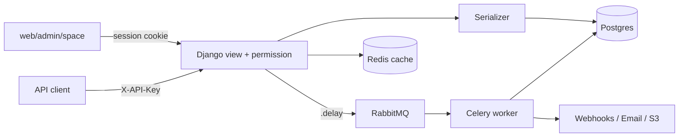

# Plane backend summary

The backend has two services: a Django REST API in `apps/api`, and a Node/TypeScript realtime server in `apps/live`. They share PostgreSQL, Redis and S3-compatible storage.

## 1. Django API (`apps/api/plane`)

**Stack:** Django plus DRF, PostgreSQL, Celery (RabbitMQ broker), Redis (cache and locks), and S3 or MinIO storage. Settings are in `settings/common.py`, with `local`, `production`, `test`, `redis`, `storage` and `openapi` variants.

### URL layout

`plane/urls.py` mounts these routes:

| Prefix           | Module                 | Purpose                                                                                                                |
| ---------------- | ---------------------- | ---------------------------------------------------------------------------------------------------------------------- |
| `api/`           | `plane.app`            | Internal API for the web app (session auth)                                                                            |
| `api/v1/`        | `plane.api`            | Public REST API (API key via `X-API-Key`, rate limited)                                                                |
| `api/public/`    | `plane.space`          | Anonymous or published "Spaces" boards                                                                                 |
| `api/instances/` | `plane.license`        | Instance setup, admin (god-mode) and configuration                                                                     |
| `auth/`          | `plane.authentication` | Sign-in, sign-up, magic link, OAuth (Google, GitHub, GitLab, Gitea), password flows, with separate `spaces/*` variants |
| `api/schema/*`   | drf-spectacular        | OpenAPI, Swagger and Redoc, behind a flag                                                                              |

### Django apps

- `db`: all models, one per file (workspace, project, issue, cycle, module, page, intake, view, state, label, estimate, webhook, asset, notification, api token, session and others).
- `app`, `api`, `space`, `license`: views, serializers and URLs for each surface. Each has its own `BaseViewSet` and `BaseAPIView`. These add timezone handling, a paginator and read-replica routing.
- `authentication`: custom `SessionMiddleware`, provider adapters, and a custom DRF exception handler.
- `bgtasks`: Celery tasks.
- `middleware`: request body size limit, plus request and API-token logging.
- `utils`, `throttles`, `analytics`, `seeds`, `web`.

### Data model

- `BaseModel` inherits `AuditModel`, which combines `TimeAuditModel`, `UserAuditModel` and `SoftDeleteModel` (`db/mixins.py`, `db/models/base.py`).
- Rows carry created and updated timestamps and users, and a `deleted_at` column for soft delete.
- The `soft_delete_related_objects` task cascades soft deletes, and `hard_delete` purges rows older than `HARD_DELETE_AFTER_DAYS`.
- The tenancy hierarchy is Workspace → Project → Issue, Cycle, Module, Page, View and so on. Memberships are `WorkspaceMember` and `ProjectMember`.
- The custom `AUTH_USER_MODEL` is `db.User`, and sessions are stored in the DB (`plane.db.models.session`).

### AuthN and AuthZ

- The web app uses cookie sessions (`session-id`, with a separate `admin-session-id`) and CSRF protection.
- `/api/v1` uses an `APIToken` (`plane_api_*`) with a per-token rate limit and `APIActivityLog` logging.
- Roles are `ADMIN=20`, `MEMBER=15` and `GUEST=5`.
- Permissions are enforced by classes in `app/permissions` and by the `@allow_permission([...], level="PROJECT"|"WORKSPACE")` decorator (`utils/permissions/base.py`). The decorator lets workspace admins who belong to the project through.

### Async and background work

Celery config is in `plane/celery.py`. Beat uses `django_celery_beat`'s `DatabaseScheduler`. Scheduled jobs:

- Email notification batching, every 5 minutes.
- Hard delete of soft-deleted rows, daily.
- Auto-archive and close of old issues, daily.
- Cleanup of exports, orphan file assets, API logs, email logs, page versions, issue description versions and webhook logs.
- Instance telemetry push.

Event-driven tasks cover webhooks (`webhook_task`, with HMAC signing, SSRF protection via `pinned_fetch`, and deactivation emails), issue and page versioning (pages keep at most 20 versions), activity tracking, exports, workspace seeding and notifications.

### Infrastructure and config

- **Database:** `DATABASE_URL` or `POSTGRES_*`. An optional read replica is enabled with `ENABLE_READ_REPLICA`.
- **Cache:** `REDIS_URL` (Valkey), with TLS when the URL is `rediss`.
- **Broker:** `AMQP_URL` or `RABBITMQ_*`.
- **Storage:** `S3Storage` in `settings/storage.py` issues presigned URLs. `USE_MINIO=1` switches to MinIO.
- **Security:** `SECRET_KEY` is checked against known insecure values. CORS is configurable. Webhook allow and deny lists exist (`WEBHOOK_ALLOWED_IPS`, `WEBHOOK_ALLOWED_HOSTS`, `WEBHOOK_DISALLOWED_DOMAINS`).
- **Local dev:** `docker-compose-local.yml` runs `plane-db` (Postgres 15), `plane-redis`, `plane-mq`, `plane-minio`, `api` (port 8000), `worker`, `beat-worker` and `migrator`.

### Typical request flow

A view subclasses `BaseViewSet`, is gated by `@allow_permission`, queries with `workspace__slug` and `project_id` scoping, serializes the result, and queues side effects (activity, webhooks, notifications) to Celery.

## 2. Live server (`apps/live`)

A Node/TypeScript service for collaborative editing of pages and issue descriptions. It uses Hocuspocus (a Yjs CRDT server).

- `src/start.ts` boots `Server` and handles graceful shutdown.
- `src/hocuspocus.ts` holds the websocket config.
- `src/extensions` has the `database`, `redis`, `logger`, `title-sync`, `title-update` and `force-close-handler` extensions.
- `controllers/` holds the HTTP endpoints, and `services/` holds the calls back to the Django API.
- Redis is used for multi-instance sync. Document binaries are persisted through the API into `description_binary` fields.

## 3. Other pieces

- `apps/proxy`: Caddy reverse proxy that routes `/api`, `/auth`, `/live` and `/spaces` to the right service.
- `deployments/`: AIO, CLI, Kubernetes and Swarm deployment configs.
