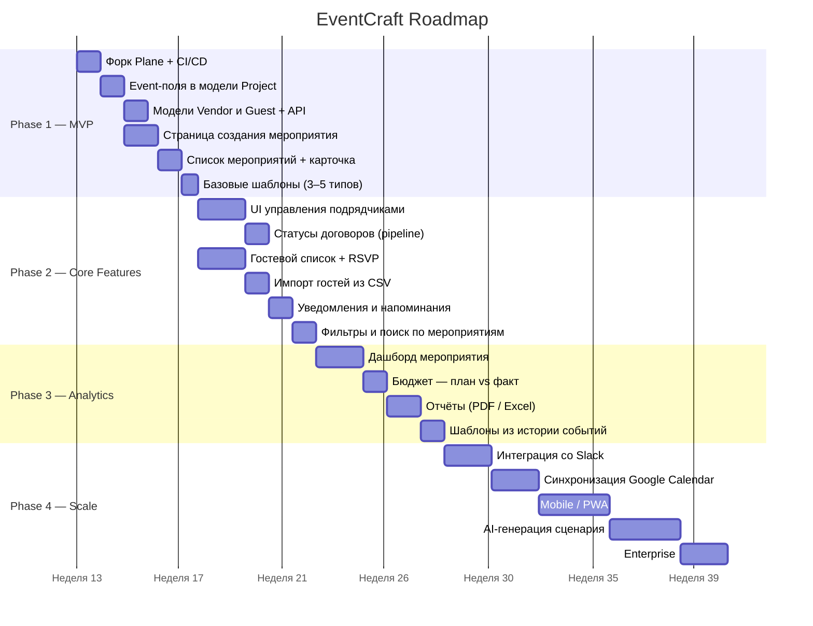

# EventCraft — Gap Analysis & Roadmap

EventCraft — цифровой корпоративный ассистент для планирования мероприятий,
реализуемый на базе Plane (open-source, AGPL-3.0).

---

## Концепция

Plane уже является зрелой платформой управления задачами (46k+ звёзд на GitHub).
EventCraft расширяет её тремя новыми сущностями и переосмысляет существующие
под предметную область ивент-менеджмента.

```
Plane (основа)          EventCraft (надстройка)
──────────────          ───────────────────────
Workspace           →   Workspace (без изменений)
  └── Project       →     └── Event (расширенный Project)
       ├── Issues   →          ├── Tasks (Issues — без изменений)
       ├── Modules  →          ├── Phases (Modules — без изменений)
       ├── Pages    →          ├── Scenario / Runbook (Pages)
       ├── Cycles   →          ├── Preparation Cycles
       ├── Members  →          ├── Team (без изменений)
       │                       ├── Vendors  ← НОВОЕ
       │                       └── Guests   ← НОВОЕ
       └── (нет)               └── event_date, venue, budget ← РАСШИРИТЬ
```

---

## Gap Analysis

### Что в Plane уже есть ✅

| Потребность EventCraft  | Сущность в Plane                | Готовность  |
| ----------------------- | ------------------------------- | ----------- |
| Задачи и чек-листы      | Issue + sub-issues              | ✅ Отлично  |
| Кастомные статусы       | State (настраиваемые)           | ✅ Отлично  |
| Команда и роли          | WorkspaceMember / ProjectMember | ✅ Отлично  |
| Дедлайны задач          | start_date / target_date        | ✅ Есть     |
| Этапы подготовки        | Module (start_date, status)     | ✅ Подходит |
| Календарь               | Calendar view                   | ✅ Есть     |
| Аналитика и дашборды    | Analytics section               | ✅ Есть     |
| Сценарий / документация | Pages (rich text, иерархия)     | ✅ Подходит |
| Уведомления             | Notifications                   | ✅ Есть     |
| Комментарии и вложения  | IssueComment / IssueAttachment  | ✅ Есть     |
| Метки и категории       | Labels                          | ✅ Есть     |
| Приоритеты              | Priority (urgent/high/…)        | ✅ Есть     |

### Чего не хватает ❌

#### 1. Event (само мероприятие)

Сейчас `Project` не содержит event-специфичных полей.
Необходимо добавить в модель `Project`:

| Поле            | Тип           | Описание                              |
| --------------- | ------------- | ------------------------------------- |
| event_date      | DateTimeField | Дата и время проведения               |
| venue           | CharField     | Место проведения                      |
| address         | TextField     | Адрес                                 |
| budget          | DecimalField  | Плановый бюджет                       |
| actual_cost     | DecimalField  | Фактические расходы                   |
| event_type      | CharField     | Тип (конференция, тимбилдинг, и др.)  |
| expected_guests | IntegerField  | Ожидаемое кол-во участников           |
| is_event        | BooleanField  | Флаг: это Event, а не обычный Project |

#### 2. Vendor (подрядчик)

Новая модель. Привязывается к Project (Event).

| Поле            | Тип            | Описание                             |
| --------------- | -------------- | ------------------------------------ |
| name            | CharField      | Название компании / ФИО              |
| category        | CharField      | Категория (кейтеринг, звук, фото, …) |
| contact_name    | CharField      | Контактное лицо                      |
| contact_email   | EmailField     | Email                                |
| contact_phone   | CharField      | Телефон                              |
| contract_status | CharField      | Статус (обсуждение / подписан / …)   |
| amount          | DecimalField   | Сумма договора                       |
| notes           | TextField      | Заметки                              |
| project         | FK → Project   | Привязка к мероприятию               |
| workspace       | FK → Workspace | Привязка к воркспейсу                |

#### 3. Guest / Attendee (участник)

Новая модель. Гостевой список мероприятия.

| Поле        | Тип            | Описание                               |
| ----------- | -------------- | -------------------------------------- |
| full_name   | CharField      | Полное имя                             |
| email       | EmailField     | Email                                  |
| company     | CharField      | Компания                               |
| role        | CharField      | Роль на мероприятии (спикер, гость, …) |
| rsvp_status | CharField      | RSVP (ожидает / подтверждён / отказ)   |
| notes       | TextField      | Заметки                                |
| project     | FK → Project   | Привязка к мероприятию                 |
| workspace   | FK → Workspace | Привязка к воркспейсу                  |

---

## Roadmap



### Phase 1 — MVP (Недели 1–4)

Цель: рабочее демо, которое можно показать.

**Бэкенд (Django):**

- [ ] Добавить event-поля в модель `Project` (event_date, venue, budget, event_type, is_event)
- [ ] Создать модель `Vendor` с миграцией
- [ ] Создать модель `Guest` с миграцией
- [ ] API endpoints: CRUD для Vendor и Guest
- [ ] Фильтрация Projects по `is_event=True`

**Фронтенд (React):**

- [ ] Страница создания мероприятия (форма с event-полями)
- [ ] Список мероприятий (отдельно от обычных Projects)
- [ ] Карточка мероприятия (дата, venue, бюджет, прогресс задач)
- [ ] Адаптировать Tasks/Issues для контекста событий
- [ ] Базовые шаблоны (3–5 типов мероприятий)

**Инфраструктура:**

- [ ] Форк репозитория Plane
- [ ] Настроить CI/CD
- [ ] Docker compose для локального запуска

---

### Phase 2 — Core Features (Недели 5–8)

**Vendor Management:**

- [ ] Страница подрядчиков мероприятия
- [ ] Статусы договоров (pipeline: обсуждение → подписан → выполнен)
- [ ] Привязка задач к подрядчику
- [ ] Бюджет по подрядчикам

**Guest Management:**

- [ ] Гостевой список с RSVP
- [ ] Импорт гостей из CSV
- [ ] Email-приглашения (через существующий email-сервис Plane)

**Уведомления и дедлайны:**

- [ ] Напоминания о дедлайнах задач
- [ ] Уведомления об изменении статуса подрядчика
- [ ] Digest за неделю до мероприятия

---

### Phase 3 — Analytics & Reports (Недели 9–12)

- [ ] Дашборд мероприятия (прогресс задач, бюджет, RSVP)
- [ ] Сравнение: плановый бюджет vs фактические расходы
- [ ] Отчёт по мероприятию (PDF/Excel)
- [ ] Шаблоны на основе прошлых мероприятий
- [ ] Тепловая карта загрузки команды

---

### Phase 4 — Scale (Недели 13–18)

- [ ] Интеграция со Slack (уведомления в каналы)
- [ ] Синхронизация с Google Calendar / Outlook
- [ ] Мобильная версия (PWA или React Native)
- [ ] AI-генерация сценария мероприятия
- [ ] Enterprise: SSO, аудит действий, SLA

---

## Технический стек

| Слой     | Технология                       |
| -------- | -------------------------------- |
| Frontend | React 18 + React Router 7 + MobX |
| Backend  | Django 4.2 + DRF + PostgreSQL    |
| Realtime | Node.js + Hocus Pocus + Yjs      |
| Infra    | Docker + Celery + Redis          |
| Deploy   | Docker Compose / Kubernetes      |

Стек унаследован от Plane и не меняется — снижает порог входа для команды.

---

## Команда и роли

| Роль              | Зона ответственности             |
| ----------------- | -------------------------------- |
| 2× Frontend       | React-компоненты, страницы, UI   |
| 1× Backend        | Django-модели, DRF API, миграции |
| 1× Fullstack / PM | Интеграция, координация, деплой  |
| 1× Designer       | Figma, design system, UX         |

---

## Источники и ссылки

- [Plane GitHub](https://github.com/makeplane/plane)
- [Plane CONTRIBUTING.md](../CONTRIBUTING.md)
- [Django модели Plane](../apps/api/plane/db/models/)
- [Фронтенд приложения](../apps/web/)
