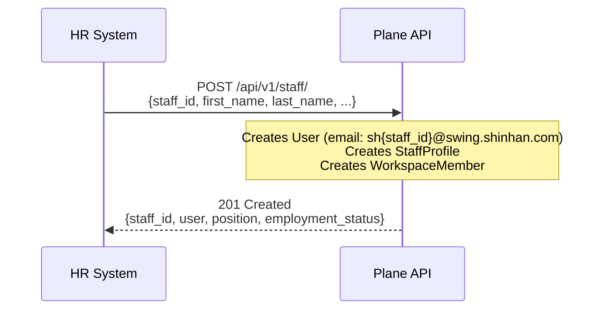
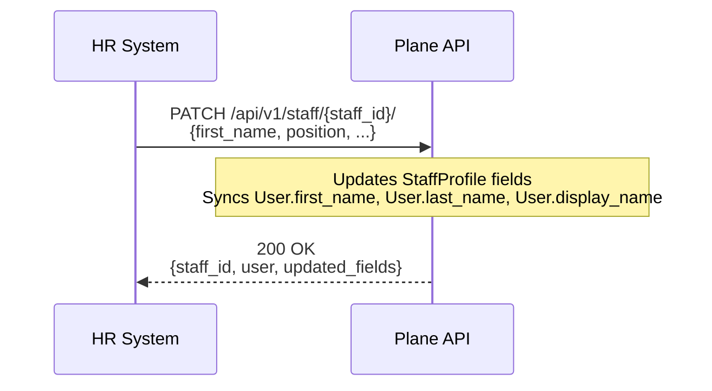
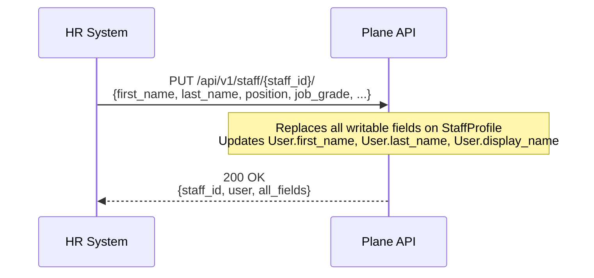
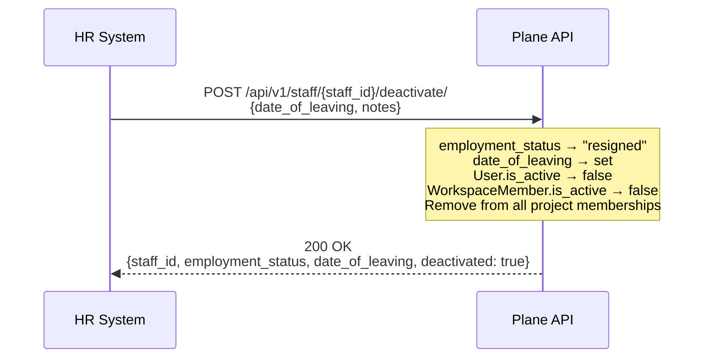
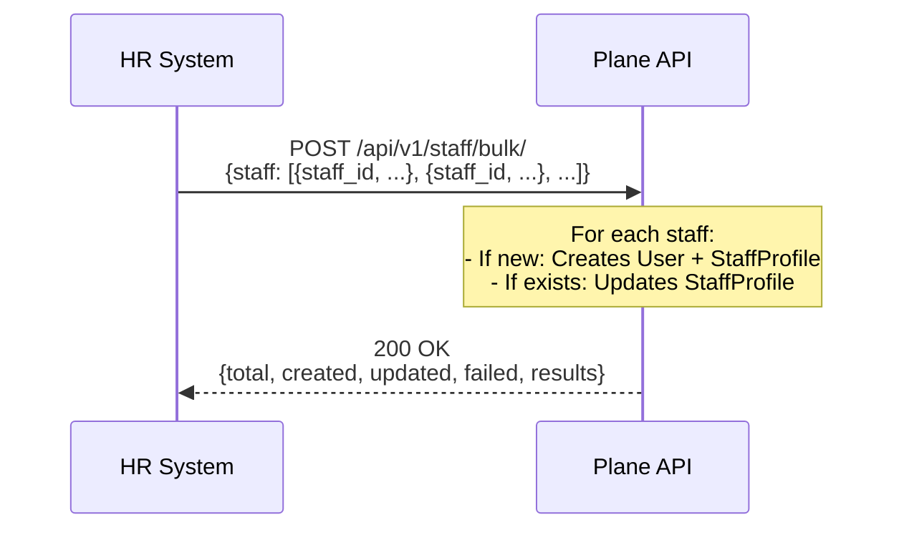

# HR System Integration Specification

> **Version:** 1.5 | **Updated:** 2026-05-06
> **Audience:** HR System Developers, DevOps, and Backend Engineers
> **Status:** Ready — Staff + User Sync Only

---

## 1. Overview

This document specifies the integration between the **HR System (Root)** and **Plane (Target)**. The HR system is the master data source for staff profiles. Whenever a change occurs in the HR system (new hire, name change, or resignation), it must synchronize the data to Plane via REST APIs.

**Important:** The HR system does NOT have information about workspaces or departments. All operations are scoped by `staff_id` only. The workspace is determined by the API credentials (API key) used to call the endpoint.

**Scope:**

- Staff profile upsert (create/update by staff_id)
- User fields synced from staff (first_name, last_name, display_name)
- Staff deactivation (resignation)

---

## 2. Authentication

The HR system must authenticate with Plane using an **API Key**.

- **Header Name:** `X-Api-Key`
- **Base URL:** `https://plane.example.com/api/v1/staff`
- **Scope:** Workspace Admin or Instance Admin
- **Workspace Resolution:** The API key determines which workspace the operation targets. HR system does not pass workspace in requests.

**Example:**

```bash
curl -X POST "https://plane.example.com/api/v1/staff/sync/" \
  -H "X-Api-Key: your-api-key" \
  -H "Content-Type: application/json" \
  -d '{"staff_id": "10000001", "first_name": "John", "last_name": "Doe"}'
```

---

## 3. Entity Mapping

| HR Entity    | Plane Entity            | Source of Truth Key   |
| :----------- | :---------------------- | :-------------------- |
| **Employee** | `StaffProfile` + `User` | `staff_id` (8 digits) |

### 3.1 Email Convention

Plane auto-generates user emails: `sh{staff_id}@swing.shinhan.com`
Example: `staff_id=10000001` → `sh10000001@swing.shinhan.com`

### 3.2 Staff ID Convention

- Must be exactly **8 digits**
- Example: `10000001`, `00012345`
- Used as unique identifier across all sync operations

---

## 4. StaffProfile Fields

| Field                   | Type        | Required | Description                                                             |
| :---------------------- | :---------- | :------- | :---------------------------------------------------------------------- |
| `staff_id`              | String(8)   | **Yes**  | Unique identifier from HR. Exactly 8 digits.                            |
| `first_name`            | String(150) | **Yes**  | First name.                                                             |
| `last_name`             | String(150) | **Yes**  | Last name.                                                              |
| `position`              | String(255) | No       | Job title (e.g., "Senior Developer").                                   |
| `job_grade`             | String(50)  | No       | Level/Grade (e.g., "L4", "M1").                                         |
| `phone`                 | String(20)  | No       | Contact number.                                                         |
| `date_of_joining`       | Date        | No       | Format: `YYYY-MM-DD`.                                                   |
| `date_of_leaving`       | Date        | No       | Format: `YYYY-MM-DD`. Set by deactivation.                              |
| `employment_status`     | Enum        | No       | `active` (default), `probation`, `suspended`, `transferred`, `resigned` |
| `is_department_manager` | Boolean     | No       | If `true`, sets department manager flag.                                |
| `notes`                 | Text        | No       | Internal notes.                                                         |

**Notes:**

- `workspace` and `department` are **not accepted** from HR system. They are managed internally by Plane.
- `user` is auto-created/linked based on email derived from `staff_id`.

---

## 5. API Reference: Staff Management

### HTTP Method Semantics

| Method  | Purpose        | Behavior                                                                     |
| :------ | :------------- | :--------------------------------------------------------------------------- |
| `POST`  | Create         | Creates new staff. Returns `201` if staff_id doesn't exist, `409` if exists. |
| `PUT`   | Full update    | Replaces all writable fields. Returns `200` if staff exists, `404` if not.   |
| `PATCH` | Partial update | Updates only provided fields. Returns `200` if staff exists, `404` if not.   |
| `GET`   | Read           | Retrieves staff record(s). Returns `200`.                                    |

---

### 5.1 Create Staff — `POST /api/v1/staff/`

Create a new staff profile. Fails if `staff_id` already exists.

- **Method:** `POST`
- **URL:** `/api/v1/staff/`
- **Auth:** `x-api-key`

**Request Body:**

| Field                   | Type        | Required | Description                                                 |
| :---------------------- | :---------- | :------- | :---------------------------------------------------------- |
| `staff_id`              | String(8)   | **Yes**  | Unique identifier from HR. Exactly 8 digits.                |
| `first_name`            | String(150) | **Yes**  | First name.                                                 |
| `last_name`             | String(150) | **Yes**  | Last name.                                                  |
| `position`              | String(255) | No       | Job title (e.g., "Senior Developer").                       |
| `job_grade`             | String(50)  | No       | Level/Grade (e.g., "L4", "M1").                             |
| `phone`                 | String(20)  | No       | Contact number.                                             |
| `date_of_joining`       | Date        | No       | Format: `YYYY-MM-DD`.                                       |
| `employment_status`     | Enum        | No       | `active` (default), `probation`, `suspended`, `transferred` |
| `is_department_manager` | Boolean     | No       | If `true`, sets `is_department_manager=true`.               |
| `notes`                 | Text        | No       | Internal notes.                                             |

**Success Response (201 Created):**

```json
{
  "id": "uuid-of-staff-profile",
  "staff_id": "10000001",
  "user": {
    "id": "uuid-of-user",
    "email": "sh10000001@swing.shinhan.com",
    "display_name": "John Doe"
  },
  "position": "Senior Developer",
  "job_grade": "L4",
  "employment_status": "active",
  "is_department_manager": false
}
```

| Code  | Meaning                                                            |
| :---- | :----------------------------------------------------------------- |
| `201` | Created — new staff profile + user                                 |
| `400` | Bad Request — invalid `staff_id` format or missing required fields |
| `401` | Unauthorized — invalid API key                                     |
| `409` | Conflict — `staff_id` already exists                               |

---

### 5.2 Update Staff (Full) — `PUT /api/v1/staff/{staff_id}/`

Replace all writable fields of an existing staff profile.

- **Method:** `PUT`
- **URL:** `/api/v1/staff/{staff_id}/`
- **Auth:** `x-api-key`

**Request Body:**

| Field                   | Type        | Required | Description                                       |
| :---------------------- | :---------- | :------- | :------------------------------------------------ |
| `first_name`            | String(150) | **Yes**  | First name.                                       |
| `last_name`             | String(150) | **Yes**  | Last name.                                        |
| `position`              | String(255) | No       | Job title.                                        |
| `job_grade`             | String(50)  | No       | Level/Grade.                                      |
| `phone`                 | String(20)  | No       | Contact number.                                   |
| `date_of_joining`       | Date        | No       | Format: `YYYY-MM-DD`.                             |
| `employment_status`     | Enum        | No       | `active`, `probation`, `suspended`, `transferred` |
| `is_department_manager` | Boolean     | No       | If `true`, sets `is_department_manager=true`.     |
| `notes`                 | Text        | No       | Internal notes.                                   |

**Success Response (200 OK):**

```json
{
  "id": "uuid-of-staff-profile",
  "staff_id": "10000001",
  "user": {
    "id": "uuid-of-user",
    "email": "sh10000001@swing.shinhan.com",
    "display_name": "John Doe"
  },
  "position": "Senior Developer",
  "job_grade": "L5",
  "employment_status": "active",
  "is_department_manager": true
}
```

| Code  | Meaning                          |
| :---- | :------------------------------- |
| `200` | OK — staff updated               |
| `400` | Bad Request — invalid data       |
| `401` | Unauthorized — invalid API key   |
| `404` | Not Found — `staff_id` not found |

---

### 5.3 Update Staff (Partial) — `PATCH /api/v1/staff/{staff_id}/`

Update only the provided fields of an existing staff profile. Allows updating single field.

- **Method:** `PATCH`
- **URL:** `/api/v1/staff/{staff_id}/`
- **Auth:** `x-api-key`

**Request Body (any subset):**

```json
{
  "first_name": "Jonathan"
}
```

Or multiple fields:

```json
{
  "position": "Lead Developer",
  "job_grade": "L5"
}
```

**Success Response (200 OK):**

```json
{
  "id": "uuid-of-staff-profile",
  "staff_id": "10000001",
  "user": {
    "id": "uuid-of-user",
    "email": "sh10000001@swing.shinhan.com",
    "display_name": "Jonathan Doe"
  },
  "position": "Lead Developer",
  "job_grade": "L5",
  "employment_status": "active",
  "is_department_manager": false
}
```

| Code  | Meaning                          |
| :---- | :------------------------------- |
| `200` | OK — staff updated               |
| `400` | Bad Request — invalid data       |
| `401` | Unauthorized — invalid API key   |
| `404` | Not Found — `staff_id` not found |

---

### 5.4 Deactivate Staff — `POST /api/v1/staff/{staff_id}/deactivate/`

When an employee leaves, revoke access. Uses `staff_id` as identifier.

- **Method:** `POST`
- **URL:** `/api/v1/staff/{staff_id}/deactivate/`
- **Auth:** `x-api-key`

**Request Body (optional):**

| Field             | Type | Required | Description                              |
| :---------------- | :--- | :------- | :--------------------------------------- |
| `date_of_leaving` | Date | No       | Format: `YYYY-MM-DD`. Defaults to today. |
| `notes`           | Text | No       | Reason for deactivation.                 |

**Expected Behavior:**

1. `employment_status` → `resigned`
2. `date_of_leaving` → set to provided date or today
3. `User.is_active` → `false`
4. `WorkspaceMember.is_active` → `false`
5. User removed from all project memberships within the workspace

**Success Response (200 OK):**

```json
{
  "staff_id": "10000001",
  "employment_status": "resigned",
  "date_of_leaving": "2026-05-06",
  "deactivated": true
}
```

| Code  | Meaning                              |
| :---- | :----------------------------------- |
| `200` | OK — deactivated successfully        |
| `400` | Bad Request — staff already resigned |
| `401` | Unauthorized — invalid API key       |
| `404` | Not Found — `staff_id` not found     |

---

### 5.5 Get Staff by Staff ID — `GET /api/v1/staff/{staff_id}/`

Retrieve a single staff profile by `staff_id`.

- **Method:** `GET`
- **URL:** `/api/v1/staff/{staff_id}/`
- **Auth:** `x-api-key`

**Success Response (200 OK):**

```json
{
  "id": "uuid-of-staff-profile",
  "staff_id": "10000001",
  "user": {
    "id": "uuid-of-user",
    "email": "sh10000001@swing.shinhan.com",
    "first_name": "John",
    "last_name": "Doe"
  },
  "position": "Senior Developer",
  "job_grade": "L4",
  "employment_status": "active",
  "is_department_manager": false
}
```

| Code  | Meaning                          |
| :---- | :------------------------------- |
| `200` | OK                               |
| `401` | Unauthorized — invalid API key   |
| `404` | Not Found — `staff_id` not found |

---

### 5.6 Get All Staff (List) — `GET /api/v1/staff/`

Retrieve all staff profiles with pagination and filtering.

- **Method:** `GET`
- **URL:** `/api/v1/staff/`
- **Auth:** `x-api-key`

**Query Parameters:**

| Parameter    | Type    | Default | Description                                                             |
| :----------- | :------ | :------ | :---------------------------------------------------------------------- |
| `page`       | Integer | `1`     | Page number.                                                            |
| `page_size`  | Integer | `50`    | Items per page (max 100).                                               |
| `status`     | Enum    | —       | Filter by `active`, `probation`, `suspended`, `transferred`, `resigned` |
| `is_manager` | Boolean | —       | Filter by department manager flag.                                      |
| `search`     | String  | —       | Search by name (`first_name`, `last_name`) or `staff_id`.               |

**Example:** `GET /api/v1/staff/?page=1&page_size=20&status=active`

**Success Response (200 OK):**

```json
{
  "count": 150,
  "next": "/api/v1/staff/?page=2&page_size=20",
  "previous": null,
  "results": [
    {
      "id": "uuid-of-staff-profile",
      "staff_id": "10000001",
      "user": {
        "id": "uuid-of-user",
        "email": "sh10000001@swing.shinhan.com",
        "display_name": "John Doe"
      },
      "position": "Senior Developer",
      "job_grade": "L4",
      "employment_status": "active",
      "is_department_manager": false
    }
  ]
}
```

---

### 5.7 Get Staff by IDs (Batch) — `GET /api/v1/staff/batch/?ids=`

Retrieve multiple staff profiles by their `staff_id` values.

- **Method:** `GET`
- **URL:** `/api/v1/staff/batch/?ids=10000001,10000002,10000003`
- **Auth:** `x-api-key`

**Query Parameters:**

| Parameter | Type   | Required | Description                                  |
| :-------- | :----- | :------- | :------------------------------------------- |
| `ids`     | String | **Yes**  | Comma-separated list of staff_ids (max 100). |

**Success Response (200 OK):**

```json
{
  "count": 3,
  "results": [
    {
      "id": "uuid-of-staff-profile",
      "staff_id": "10000001",
      "user": {
        "id": "uuid-of-user",
        "email": "sh10000001@swing.shinhan.com",
        "display_name": "John Doe"
      },
      "position": "Senior Developer",
      "employment_status": "active"
    },
    {
      "id": "uuid-of-staff-profile",
      "staff_id": "10000002",
      "user": {
        "id": "uuid-of-user",
        "email": "sh10000002@swing.shinhan.com",
        "display_name": "Jane Smith"
      },
      "position": "Manager",
      "employment_status": "active"
    },
    {
      "staff_id": "10000003",
      "error": "STAFF_NOT_FOUND"
    }
  ]
}
```

---

### 5.8 Bulk Create/Update Staff — `POST /api/v1/staff/bulk/`

Sync multiple staff in one request. Creates new or updates existing based on `staff_id`.

- **Method:** `POST`
- **URL:** `/api/v1/staff/bulk/`
- **Auth:** `x-api-key`

**Request Body:**

```json
{
  "staff": [
    {
      "staff_id": "10000001",
      "first_name": "John",
      "last_name": "Doe",
      "position": "Developer",
      "employment_status": "active"
    },
    {
      "staff_id": "10000002",
      "first_name": "Jane",
      "last_name": "Smith",
      "position": "Manager",
      "is_department_manager": true
    }
  ]
}
```

**Response:**

```json
{
  "total": 2,
  "created": 1,
  "updated": 1,
  "failed": 0,
  "results": [
    { "staff_id": "10000001", "status": "created" },
    { "staff_id": "10000002", "status": "updated" }
  ]
}
```

---

## 6. Expected Integration Workflows

### 6.1 New Hire Flow



### 6.2 Profile Update Flow



### 6.3 Full Profile Replace Flow



### 6.4 Resignation Flow



### 6.5 Initial Data Load (Bulk)



---

## 7. Data Validation Rules

| Rule              | Constraint                                                       |
| :---------------- | :--------------------------------------------------------------- |
| `staff_id`        | Exactly 8 digits, padded with zeros if needed (e.g., `00012345`) |
| `date_of_joining` | ISO-8601 format (`YYYY-MM-DD`), cannot be future                 |
| `date_of_leaving` | ISO-8601 format, cannot be before `date_of_joining`              |

---

## 8. Error Response Format

All errors return JSON:

```json
{
  "error": {
    "code": "STAFF_NOT_FOUND",
    "message": "Staff with ID '10000001' not found",
    "details": {
      "field": "staff_id",
      "value": "10000001"
    }
  }
}
```

### Error Codes

| HTTP  | Code                     | Description                                                |
| :---- | :----------------------- | :--------------------------------------------------------- |
| `400` | `INVALID_STAFF_ID`       | Staff ID not 8 digits                                      |
| `400` | `STAFF_ALREADY_RESIGNED` | Cannot update resigned staff                               |
| `401` | `UNAUTHORIZED`           | Invalid API key or API key not associated with a workspace |
| `404` | `STAFF_NOT_FOUND`        | Staff ID not found                                         |
| `409` | `STAFF_ID_MISMATCH`      | Staff ID exists with different user                        |
| `429` | `RATE_LIMITED`           | Too many requests (100/min)                                |
| `500` | `INTERNAL_ERROR`         | Server error                                               |

---

## 9. Rate Limiting

- **Limit:** 100 requests per minute per API key
- **Headers returned:**
  - `X-RateLimit-Limit: 100`
  - `X-RateLimit-Remaining: 95`
  - `X-RateLimit-Reset: 1714982400`

**Retry Strategy:** Use exponential backoff (1s, 2s, 4s, 8s) on `429` responses.

---

## 10. Security Requirements

1. **HTTPS Only** — All calls must use TLS 1.2+
2. **API Key Storage** — Store securely, rotate regularly
3. **Audit Trail** — All sync operations logged with actor = "HR System Integration"
4. **Idempotency** — Sync endpoints are idempotent; safe to retry

---

## 11. Implementation Checklist

- [ ] `POST /staff/` — Create new staff (201 if new, 409 if exists)
- [ ] `PUT /staff/{staff_id}/` — Full update (replaces all fields)
- [ ] `PATCH /staff/{staff_id}/` — Partial update (single or few fields)
- [ ] `GET /staff/{staff_id}/` — Get single staff by ID
- [ ] `GET /staff/` — List all with pagination (`page`, `page_size`) and filters (`status`, `is_manager`, `search`)
- [ ] `GET /staff/batch/?ids=` — Batch get by comma-separated staff_ids
- [ ] `POST /staff/bulk/` — Bulk create/update
- [ ] `POST /staff/{staff_id}/deactivate/` — Deactivate staff
- [ ] Sync `User.first_name`, `User.last_name`, `User.display_name` on create/update
- [ ] Audit logging with "HR System Integration" actor
- [ ] Rate limiting (100 req/min)

---

## 12. Related Documentation

### External API v1 (where to build — `plane/api/`)

- New staff views: `apps/api/plane/api/views/staff.py` (create new)
- New staff serializers: `apps/api/plane/api/serializers/staff.py` (create new)
- URL routing: `apps/api/plane/api/urls/staff.py`

### Internal API (reference only — `plane/app/`)

- Staff Model: `apps/api/plane/db/models/staff.py`
- Staff Views: `apps/api/plane/app/views/workspace/staff.py`
- Staff Serializers: `apps/api/plane/app/serializers/staff.py`
- User Model: `apps/api/plane/db/models/user.py`
- WorkspaceMember Model: `apps/api/plane/db/models/workspace.py`

### Auth

- API Token Model: `apps/api/plane/db/models/api.py`
- API Auth Middleware: `apps/api/plane/api/middleware/api_authentication.py`

### Key Implementation Notes

- **Email is immutable** after creation: derived as `sh{staff_id}@swing.shinhan.com`
- **User update sync**: on existing staff, sync `User.first_name`, `User.last_name`, `User.display_name` alongside `StaffProfile`
- **Workspace from API key**: The workspace is determined by the API key credentials, not from the request URL
- **No department data from HR**: Department assignment is managed internally by Plane. HR system only provides staff identity and profile data.
- **No workspace data from HR**: Workspace is determined by API key. HR system only provides staff identity and profile data.
