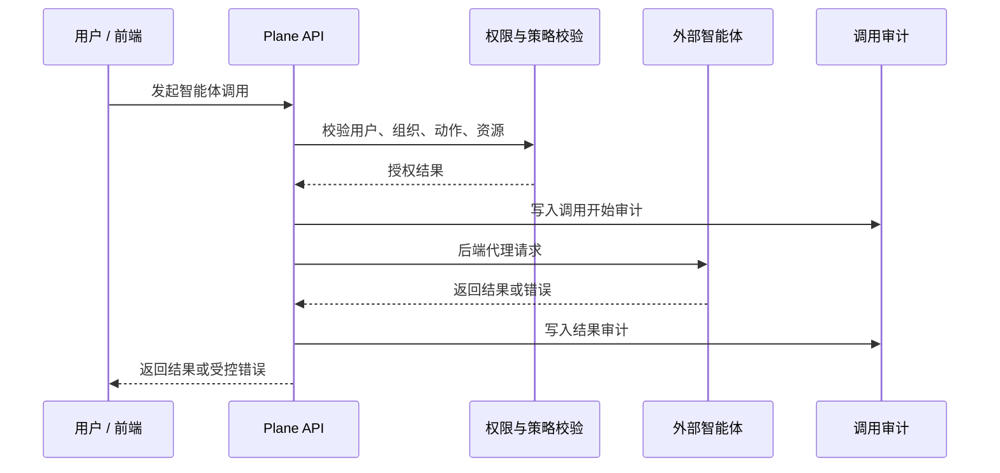
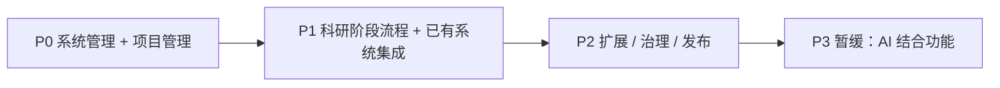
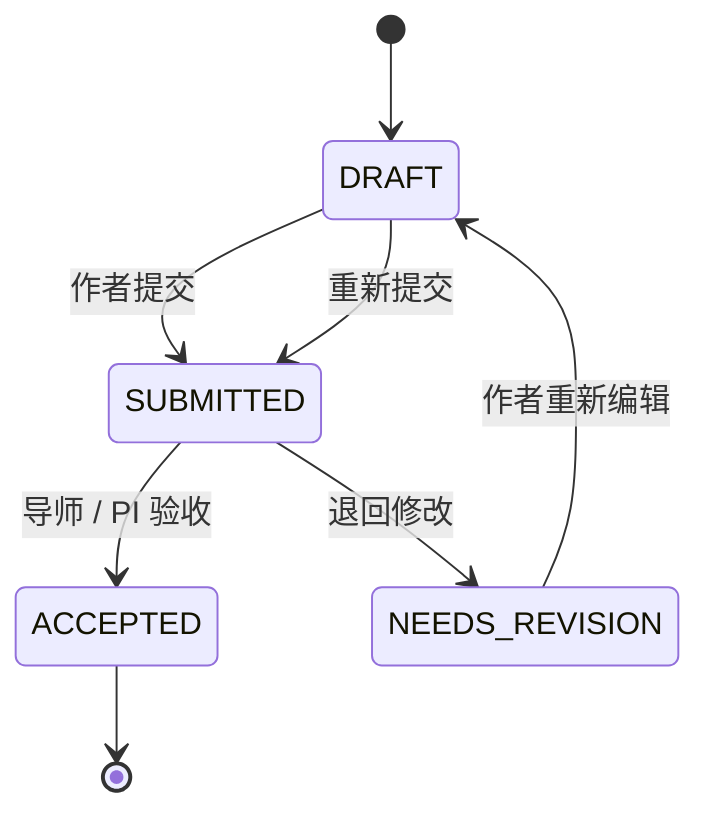
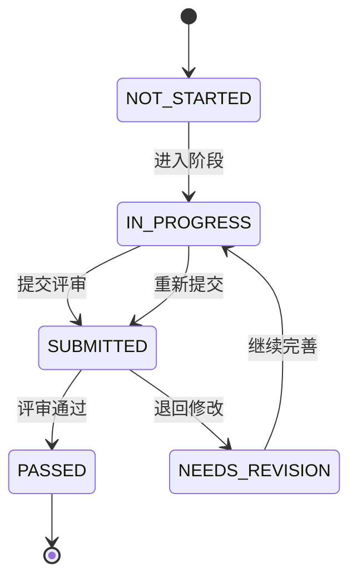
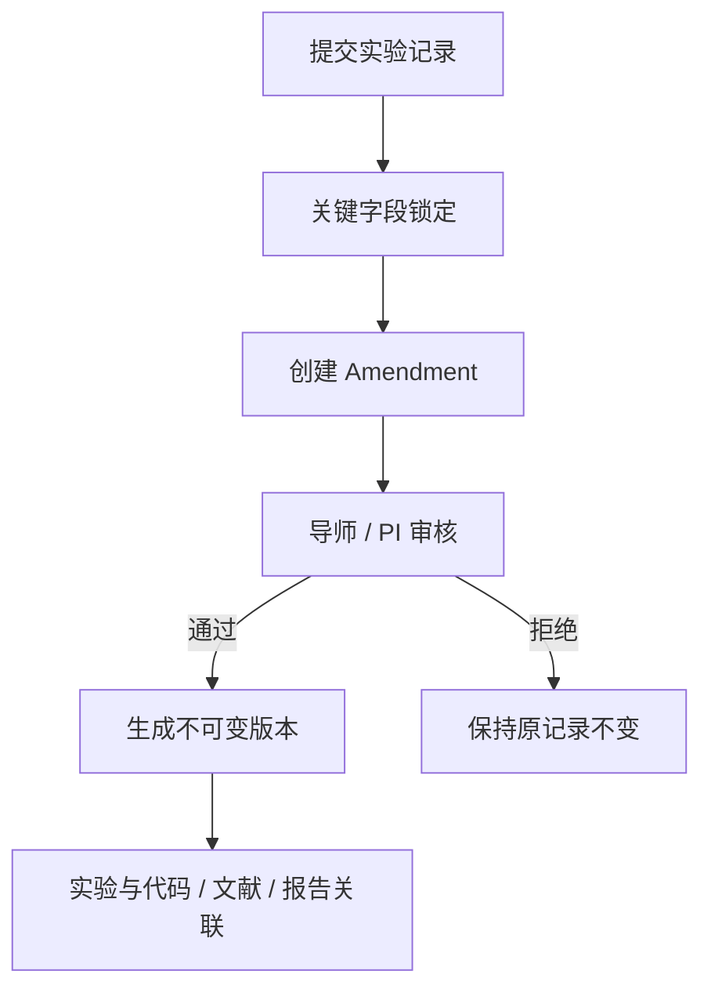

# Plane 科研管理二次开发 PRD 与分期实施路线图

| 项目     | 内容                                                                                                           |
| -------- | -------------------------------------------------------------------------------------------------------------- |
| 文档状态 | Draft / 待评审                                                                                                 |
| 文档版本 | v0.2                                                                                                           |
| 日期     | 2026-09-15                                                                                                     |
| 定位调整 | 由“科研功能全量规划”调整为“系统管理与项目管理优先，AI 结合功能暂缓”                                            |
| 生态边界 | 已有系统（RAGPortal / Poly_Agent / SpecLabOS / SmartAccess / Spec_Agent / AI4MS）只做集成，不重复开发，见 §1.4 |
| 适用范围 | Plane 科研管理增强模块                                                                                         |
| 变更范围 | 本文档只定义产品需求、分期计划、兼容基线与验收标准，不直接修改业务代码、数据库或配置                           |
| 命名原则 | 课题组负责人统一使用 **课题组主 PI**，禁止硬编码任何具体人名或固定昵称                                         |

## 1. 背景与目标

Plane 已具备较完整的项目协作通用能力，包括 Workspace、Project、Work Item / Issue、Cycle、Module、Page、View、附件、通知、集成与权限体系。科研管理场景可以在此基础上扩展，而不是另建一套平行系统。

### 1.1 现状判断

当前可复用的基础能力包括：

- **Project**：可作为“每个科研责任人一个科研 Project”的载体。
- **Page**：具备富文本编辑、版本、公开 / 私有访问、附件与协作编辑基础。
- **FileAsset / S3**：已有文件上传、存储、恢复与下载链路。
- **Workspace / Project 成员角色**：已有 Admin / Member / Guest 权限体系。
- **GitHub OAuth 与集成基础**：可扩展为科研代码仓库登记和溯源能力。
- **测试与部署体系**：已有前端检查命令和后端 Docker pytest 体系。

当前缺口包括：

- 没有 Workspace 级科研组织树、课题组主 PI、直接导师关系。
- Page 只有 Public / Private，无法满足按组织架构分级授权。
- 没有周报 / 月报业务模型、周期规则和提交状态机。
- 没有预开题、开题、中期、结题的科研阶段治理流程。
- 没有文献调研、AI 评分、多人评审和思维链沉淀模型。
- 没有实验记录、字段修改审核和不可篡改版本留痕。
- 没有外部智能体统一授权、代理调用与审计体系。
- 没有课题组主 PI 记忆共享范围控制。
- 现有文件默认大小限制较低，需要为科研 PDF、代码快照等场景提供独立限制。

补充现状基线：

- 实验记录当前为**半自动**登记（部分人工填写、部分由脚本或工具辅助产出），尚无统一的逐条登记模型、字段修改审核与版本留痕。
- 科研知识目前散落在个人 Page、本地文件与外部工具中，尚未与 Plane 全局搜索打通。

### 1.2 产品目标

在 AI4MS 生态中，Plane 承担“科研及办公管理”层，定位是**做系统管理与项目管理，并向已有专业系统集成**，不重复建设已有模块。

交付顺序（先做系统管理与项目管理，AI 结合功能暂缓）：

1. **先做——系统管理**：组织架构、角色权限、账号与 SSO 身份映射、平台配置、审计基础。
2. **先做——项目管理**：每人一个科研 Project、任务与课题管理、周报 / 月报、办公审批（任务审批、采购审批）。
3. **再做——科研阶段流程**：预开题 → 开题 → 中期 → 结题（毕业）与多人评审，本阶段不含 AI。
4. **再做——与已有系统集成**：知识库、湿实验、高分子研发、谱学分析、统一门户。
5. **暂缓——与 AI 结合的功能**：AI 创新性评分、AI 辅助研究计划、论文写作辅助、人机回环、智能体调用、记忆共享。
6. **全程**：保证 Plane 原有通用功能不回归。

### 1.3 非目标

- 不在 Plane 内自建完整 Git 托管平台，只做外部仓库登记、链接、快照与关联。
- 不在 Plane 内训练或托管大模型，AI 能力通过外部智能体 API 接入。
- 不重复开发知识库（文档上传、RAG 问答、向量索引、图谱）；已由 RAGPortal / WeKnora 提供。
- 不重复开发高分子研发能力（计算、DoE、算法包、垂类预测）；已由 Poly_Agent 提供。
- 不重复开发湿实验管理（实验执行、数据入库）；已由 SpecLabOS 提供。
- 不重复开发设备管理（仪器接入、工作流编排、设备监控）；已由 SpecLabOS / SmartAccess 提供。
- 不重复开发谱学分析（GPC / NMR / IR / Raman / LCMS 解析）；已由 Spec_Agent 提供。
- 不在 Plane 内保存实验原始数据与设备数据资产，只保存科研管理口径的条目引用与审核留痕。
- 与 AI 结合的功能本阶段暂缓，只保留接口边界与权限设计，不进入近期交付阶段。
- 第一期 PDF 仅支持上传、存储、预览、下载和授权访问，不承诺 PDF 全文结构化解析。
- AI 结果仅辅助决策，不自动替代课题组主 PI、直接导师或评审人的判断。
- 第一期不做学校组织架构自动同步，组织树在 Plane 内维护。
- 本阶段仅交付 PRD 与实施路线图，不修改业务代码、数据库和配置。

### 1.4 生态边界：已有系统与本模块分工

AI4MS 组织下已有多个专业系统。凡已有模块，Plane 一律通过集成对接，不重复开发。边界以仓库 `docs/ai4ms-plane-integration.png` 与 `docs/ai4ms-plane-enhanced-integration.png` 为准。

| 能力域                           | 归属系统（已有）                            | Plane 的定位                                      | 是否重复开发 |
| -------------------------------- | ------------------------------------------- | ------------------------------------------------- | ------------ |
| 知识库、文档上传、RAG 问答       | RAGPortal（+ WeKnora）                      | 只做引用、权限映射与入口跳转，不自建索引与门户    | 否           |
| 高分子研发、计算、DoE、算法包    | Poly_Agent                                  | 只做科研 Project 与任务关联，不自建算法与计算     | 否           |
| 湿实验管理、实验数据入库         | SpecLabOS（SmartDataHub / MinIO / MongoDB） | 只做科研条目引用与审核留痕，不存原始数据          | 否           |
| 设备管理、仪器接入与执行         | SpecLabOS + SmartAccess                     | 不做，仅引用执行记录与数据资产                    | 否           |
| 谱学分析                         | Spec_Agent                                  | 只做分析结果与报告的引用关联                      | 否           |
| 统一门户与身份                   | AI4MS 门户                                  | 对接 SSO / OIDC，做身份映射与账号关联             | 否           |
| 组织架构、角色与权限             | Plane（本项目）                             | 自建科研组织树与科研 ACL                          | 是           |
| 科研 Project 与任务管理          | Plane（本项目）                             | 自建，复用 Plane Project / Issue / Cycle / Module | 是           |
| 周报 / 月报                      | Plane（本项目）                             | 自建，复用 Plane Page 与附件能力                  | 是           |
| 科研阶段治理（预开题 → 结题）    | Plane（本项目）                             | 自建，Plane 侧为权威状态源                        | 是           |
| 办公审批（任务审批、采购审批等） | Plane（本项目）                             | 自建，复用 Plane Issue 与审批流                   | 是           |
| 代码仓库登记与研发链溯源         | Plane（本项目）                             | 自建，只登记外部仓库与快照                        | 是           |
| 与 AI 结合的能力                 | Poly_Agent / Spec_Agent / 外部智能体        | 本阶段暂缓，仅保留授权边界设计                    | 否           |

边界判定规则：

- 同一能力只允许有一个权威系统，避免双写与口径冲突。
- 已有系统为权威源时，Plane 只保存外部对象标识（ID / URL）与权限映射，不复制正文与原始文件。
- 需要跨系统联合展示时，由 Plane 聚合引用并统一做权限过滤，不落库副本。
- 新需求的归属若落在已有系统，转由对应系统承接，Plane 只做入口与关联。

---

## 2. 总体原则

### 2.1 产品原则

1. Plane 原有通用功能是基线能力，不允许回归。
2. 科研模块采用增量扩展，不替换原有 Project、Issue、Page、Cycle、Module 等通用模型。
3. 科研 Project 继续复用 Plane Project，不新建平行项目系统。
4. 周报 / 月报正文复用 Plane Page 与编辑器能力。
5. 附件复用现有 FileAsset / S3 体系，新增科研附件类型与独立大小限制。
6. 科研权限作为额外 ACL 层叠加，不改变原有 Workspace / Project 权限语义。
7. 新功能通过 Feature Flag 控制，可分阶段启用和回滚。
8. 课题组层级、智能体授权、记忆共享均按角色和授权关系配置，不绑定具体个人姓名。

### 2.2 技术原则

1. 现有 API 路径、请求体、响应体保持向下兼容。
2. 不删除、不重命名现有字段。
3. 数据库迁移必须可回滚或有明确前向兼容策略。
4. 科研模块新增接口统一放在 `/research/` 命名空间下。
5. 原有功能测试作为每次发布的必跑回归集。
6. 前端只新增“科研”入口，不移动、不删除原有导航入口。
7. 科研 ACL 不影响普通 Page、Issue、附件、搜索和通知的既有行为。

### 2.3 架构原则

```text
Plane Web / 前端
  -> Plane Django API
      -> PostgreSQL
      -> S3 / FileAsset
      -> External Agent API
```

- 科研业务模型在 Plane 后端内新增。
- 科研界面在 Plane Web 内新增。
- 后端统一计算权限，前端只做展示优化，不作为权限来源。
- 外部智能体密钥只保存在后端环境变量或安全配置中。
- 所有智能体请求必须经过 Plane 后端代理，前端不能直接访问智能体服务。
- 审计记录不可删除，不可覆盖。

---

## 3. 术语与角色

### 3.1 核心术语

| 术语         | 定义                                                                   |
| ------------ | ---------------------------------------------------------------------- |
| 课题组       | 一个科研组织节点，可对应实验室、研究组、方向组或课题组                 |
| 课题组主 PI  | 课题组的负责人，拥有本组科研管理、审批、共享和智能体授权权限           |
| 直接导师     | 学生的直接指导老师，可以是一名或多名                                   |
| 科研责任人   | 学生、博士后、研究员或其他拥有个人科研 Project 的成员                  |
| 智能体       | 外部 AI 服务或智能体实例，通过 Plane 后端受控接入                      |
| 记忆共享     | 课题组主 PI 或智能体授权人主动选择部分智能体记忆共享给指定范围         |
| 思维链       | 科研认知与决策轨迹的沉淀，覆盖文献调研、选题推导、开题、中期等         |
| 研发链条     | 从文献调研、预开题、开题、研究计划、实验、代码、中期到结题的完整溯源链 |
| 知识库打通   | 科研知识与 Plane 现有 Page、全局搜索复用同一索引与权限链路，不另建孤岛 |
| 不可篡改留痕 | 记录创建后不能静默覆盖，修改必须通过显式流程生成新版本并保留审计       |

### 3.2 命名约束

文档、界面、数据模型、API、环境变量和测试用例中不得出现任何具体 PI 姓名或固定昵称。

统一使用：

- `课题组主 PI`
- `Lab PI`
- `Principal Investigator`
- `PI`
- `Agent Owner`
- `Memory Owner`

禁止出现：

- 任何具体人名。
- 任何只适用于单一人员的硬编码名称。
- 以个人姓名命名的权限、接口、模型或配置项。

### 3.3 科研角色

| 角色            | 说明             | 主要能力                                                                               |
| --------------- | ---------------- | -------------------------------------------------------------------------------------- |
| Workspace Admin | 平台管理员       | 管理全局科研配置、组织树、智能体主体、模板                                             |
| Unit Admin      | 组织节点管理员   | 管理组织成员、查看授权范围内汇总数据                                                   |
| 课题组主 PI     | 课题组负责人     | 管理课题组成员、审批报告和实验修改、参与阶段评审、配置本组智能体权限、选择记忆共享范围 |
| 直接导师        | 学生直接指导老师 | 查看学生报告、参与评审、审核实验修改                                                   |
| Reviewer        | 评审人           | 参与预开题、开题、中期、结题评审                                                       |
| Research Owner  | 科研责任人       | 拥有个人科研 Project，提交报告、实验、阶段材料                                         |
| Agent           | 外部智能体       | 通过受控 API 访问授权资源                                                              |
| Guest           | 普通访客         | 默认无科研模块权限                                                                     |

角色规则：

- Workspace Admin 拥有科研配置和审计查看能力，但不能绕过审计静默修改科研事实。
- Unit Admin 的数据范围受组织节点限制。
- 课题组主 PI 是组织角色，不与具体姓名绑定。
- 主 PI 变更时只调整 `OrgUnitMember.org_role`，历史数据与审计记录不变。
- 一个课题组可配置一名或多名主 PI。
- 一个学生可配置一名或多名直接导师。
- Guest 默认无科研模块权限。

---

## 4. 组织架构与权限模型

### 4.1 组织架构模型

新增 Workspace 级组织树：

- `OrgUnit`
  - `name`
  - `parent`
  - `path`
  - `depth`
  - `unit_type`: `ROOT / INSTITUTE / LAB / GROUP / TEAM`
- `OrgUnitMember`
  - `org_unit`
  - `user`
  - `org_role`: `OWNER / PI / ADVISOR / REVIEWER / UNIT_ADMIN`
  - `is_primary`
  - `effective_from`
  - `effective_to`

规则：

- 每个 Workspace 至少一个 Root Org Unit。
- 一个用户可属于多个组织节点。
- 一个课题组可以配置一名或多名主 PI。
- 一个学生可以配置一名或多名直接导师。
- 课题组主 PI 是组织角色，不与具体姓名绑定。
- 主 PI 变更时只变更 `OrgUnitMember.org_role`，历史数据和审计记录保持不变。
- 组织节点软删除，历史报告和审计保留。
- 组织树仅影响科研对象权限，不改变普通 Project 成员权限。
- `path + depth` 用于优化祖先 / 后代查询。
- 组织树不允许出现循环父节点。

### 4.2 报告访问级别

| 级别             | 可见范围                                 |
| ---------------- | ---------------------------------------- |
| `PRIVATE`        | 作者本人                                 |
| `DIRECT_ADVISOR` | 作者 + 直接导师                          |
| `UNIT`           | 作者 + 所在组织节点成员                  |
| `ANCESTRY`       | 作者 + 当前节点 + 上级节点主 PI / 管理员 |
| `WORKSPACE`      | Workspace 全员                           |
| `CUSTOM`         | 在默认策略边界内额外授权                 |

规则：

- Workspace Admin 可按组织节点和报告类型配置默认访问策略。
- 作者只能收窄默认权限，不能扩大。
- `CUSTOM` 不能超出默认策略边界。
- 报告正文和附件使用同一 ACL。
- 报告访问策略变更必须写入审计日志。
- 普通 Page API 不得绕过报告 ACL 暴露周报 / 月报。
- 非科研 Page 继续沿用现有 Public / Private 行为。

### 4.3 科研 ACL 原则

- ACL 只作用于带科研元数据的对象，例如报告、实验记录、文献、知识条目。
- 普通项目、普通 Issue、普通 Page、普通附件继续走原有权限链路。
- 后端是唯一权限判断来源。
- 前端隐藏入口只是体验优化，不能替代权限校验。
- 搜索、详情、列表、下载、导出、智能体上下文都必须经过同一 ACL。
- 对无权访问的资源返回 403 或过滤结果，不返回部分敏感字段。
- 签名 URL 必须有时效，且下载入口必须再次校验对象 ACL。

### 4.4 智能体权限模型

新增模型：

- `AgentPrincipal`
- `AgentPolicy`
- `AgentCallLog`

规则：

- 默认拒绝所有智能体访问。
- 智能体按组织架构、用户、动作、资源类型授权。
- 课题组主 PI 可在授权范围内配置本组智能体策略。
- Workspace Admin 管理全局智能体主体和跨组策略。
- 智能体名称、展示名、负责人、API 地址和授权范围均为配置项。
- 智能体密钥只保存在后端。
- 前端只能通过 Plane API 代理调用智能体。
- 每次调用必须写审计日志。
- 授权可按用户、课题组、动作、资源类型撤销。
- 用户可调用某个智能体动作，不等于该智能体可以读取该用户所有资源。
- 智能体调用失败、超时或重试不得影响 Plane 原有功能。

智能体调用链：



---

## 5. 需求优先级

优先级口径：

- **P0**：先做。系统管理与项目管理闭环，且**不含任何与 AI 结合的功能**。
- **P1**：再做。科研阶段流程与已有系统集成。
- **P2**：后做。扩展能力、治理与发布收尾。
- **P3（暂缓）**：与 AI 结合的功能，等 P0–P2 稳定后再启动。

**不做**：知识库、高分子研发、湿实验管理、设备管理、谱学分析。以上均已由 SynlysAI 组织内其他系统提供，Plane 只做集成对接，见 §1.4。

## 5.1 P0：系统管理 + 项目管理

目标：先把“人和组织管起来、项目和周报跑起来”，全程不引入 AI 结合功能。

| 模块         | P0 范围                                                         |
| ------------ | --------------------------------------------------------------- |
| 组织架构     | 组织树、成员归属、课题组主 PI、直接导师                         |
| 账号与身份   | AI4MS SSO / OIDC 登录、身份映射、首次登录自动建号               |
| 权限基础     | 科研 ACL 服务、报告按组织架构分级、附件同权                     |
| 平台配置     | 科研 Feature Flag、文件限制独立配置、模板基础                   |
| 审计基础     | 审计事件写入与不可删除约束                                      |
| 个人 Project | 每个科研责任人一个进行中的科研 Project                          |
| 周报 / 月报  | 创建、编辑、提交、退回、重新提交                                |
| 文件能力     | 图片上传、PDF 上传、Markdown 导入                               |
| 办公审批     | 任务审批、采购审批等（复用 Issue 与审批流）                     |
| 科研 UI      | 科研导航、报告列表、组织设置                                    |
| 通用兼容     | 原 Workspace / Project / Issue / Page / Cycle / Module 回归通过 |

P0 首批（优先完成）：系统管理基础（组织架构、角色权限、账号与 SSO）→ 项目管理（每人一个科研 Project）→ 周报 / 月报（含图片、PDF 上传，Markdown `.md` 解析导入，按组织架构的报告访问分级）。

P0 的开发级细化（需求编号、数据模型、接口契约、10 个开发阶段、验收清单）见 [research-p0-development-prd.md](./research-p0-development-prd.md)。

P0 不包含：

- 科研阶段评审（预开题 / 开题 / 中期 / 结题）。
- AI 创新性评分。
- AI 辅助研究计划。
- 智能体调用与调用审计落地。
- 记忆共享。
- 论文写作辅助。
- 与外部系统的实质集成（知识库、湿实验、高分子研发、谱学分析）。

## 5.2 P1：科研阶段流程与已有系统集成

目标：建立标准科研流程，并把已有专业系统接进来，仍不含 AI 结合功能。

| 模块           | P1 范围                                                     |
| -------------- | ----------------------------------------------------------- |
| 科研阶段       | 预开题 → 开题 → 中期 → 结题（阶段状态机与 gate）            |
| 预开题         | 文献登记、数量门槛、提交与评审                              |
| 开题           | 材料清单、实验参与要求、代码仓库登记、人工修改留痕          |
| 中期           | 材料清单、进展汇总、评审                                    |
| 结题           | 材料汇总、论文与成果登记                                    |
| 多人评审       | 直接导师必评、主 PI 或授权评审人参与                        |
| 实验条目       | 科研管理口径的实验条目、字段锁定、修改审核与版本留痕        |
| 代码管理       | 外部 Git 仓库登记、commit / branch / 快照关联               |
| 知识库对接     | 引用 RAGPortal / WeKnora 条目，做权限映射，不自建索引与门户 |
| 设备与实验对接 | 引用 SpecLabOS 运行记录与数据资产，不存原始数据             |
| 研发平台对接   | 引用 Poly_Agent 项目与任务、Spec_Agent 分析结果             |
| 通用兼容       | 普通 Page、附件、搜索、通知、项目管理继续可用               |

## 5.3 P2：扩展、治理与发布

目标：补齐高阶汇总与治理能力，完成发布收尾。

| 模块     | P2 范围                                               |
| -------- | ----------------------------------------------------- |
| 高级看板 | 课题组进度、风险、报告提交率、阶段阻塞                |
| 办公扩展 | 更多审批类型与流程配置                                |
| 移动端   | 响应式手机网页（复用 Next.js 技术栈与组件体系）       |
| 治理     | 权限渗透测试、大数据量优化、审计导出                  |
| 发布     | 回归、加固、i18n 补齐、使用文档与管理员文档、数据迁移 |

## 5.4 P3（暂缓）：与 AI 结合的功能

启动前置条件：P0–P2 稳定，且外部智能体接口边界与 AI 治理策略确认。本阶段只保留设计，不进入近期排期。

| 模块            | P3 范围                              |
| --------------- | ------------------------------------ |
| AI 创新性评分   | 预开题评分、迭代历史与趋势           |
| AI 辅助研究计划 | AI 会话、人工采纳 / 拒绝、diff 留痕  |
| 论文写作辅助    | 大纲、结果整理、引用建议、一致性检查 |
| 人机回环        | 嵌入式 AI 辅助面板与决策留痕         |
| 智能体调用      | 后端代理、按组织架构授权、调用审计   |
| 记忆共享        | 课题组主 PI 记忆共享、授权与撤销     |

优先级依赖：



---

## 6. 功能需求

## 6.1 个人科研 Project

新增 `ResearchProjectProfile`：

| 字段              | 说明                                        |
| ----------------- | ------------------------------------------- |
| `project`         | OneToOne 关联 Plane Project                 |
| `owner`           | 科研责任人                                  |
| `research_type`   | `PHD / MASTER / POSTDOC / RESEARCH_PROJECT` |
| `current_stage`   | 当前阶段                                    |
| `started_at`      | 开始时间                                    |
| `expected_end_at` | 预计结束时间                                |
| `completed_at`    | 实际结束时间                                |
| `is_active`       | 是否进行中                                  |

规则：

- 每个科研责任人默认只能有一个进行中的个人科研 Project。
- Workspace Admin 可配置是否允许多项目。
- 科研 Project 继承 Plane Project 的通用能力。
- 科研责任人在项目中为 Admin。
- 直接导师在项目中为 Admin。
- 评审人在项目中为 Member。
- 科研 Project 需有标识，可与普通 Project 区分和筛选。
- Project 归档不代表科研流程结题，结题必须通过阶段 gate。
- 创建、归档、恢复和结题均写入审计。

## 6.2 周报 / 月报

### 6.2.1 数据模型

新增 `PeriodicReport`：

| 字段           | 说明                                            |
| -------------- | ----------------------------------------------- |
| `report_type`  | `WEEKLY / MONTHLY`                              |
| `owner`        | 报告作者                                        |
| `project`      | 作者个人科研 Project                            |
| `page`         | OneToOne 关联 Plane Page，复用富文本编辑与版本  |
| `period_start` | 周期开始日期                                    |
| `period_end`   | 周期结束日期                                    |
| `timezone`     | 默认继承 Workspace timezone                     |
| `status`       | `DRAFT / SUBMITTED / NEEDS_REVISION / ACCEPTED` |
| `visibility`   | 报告访问级别                                    |
| `submitted_at` | 提交时间                                        |
| `accepted_at`  | 验收时间                                        |
| `created_by`   | 创建人                                          |
| `updated_by`   | 更新人                                          |

周期规则：

- 周报按 ISO week 计算。
- 月报按自然月计算。
- 每人每周期每类型默认只允许一份正式报告。
- 允许补交历史周期报告，但必须标记补交状态。
- 报告周期计算必须使用明确 timezone。

### 6.2.2 状态机



规则：

- 草稿可重复编辑。
- 提交后正文和关键字段只读。
- 导师、课题组主 PI 或有权限管理者可退回。
- 退回必须填写原因。
- 退回后作者可重新编辑并再次提交。
- 每次提交、退回、验收均写入审计。
- 历史版本不可覆盖。

### 6.2.3 文件能力

支持：

- 图片上传并插入正文。
- PDF 上传为报告附件。
- Markdown `.md` 文件导入为正文。
- 通过模板创建周报 / 月报。

| 文件类型   | P0 默认限制         |
| ---------- | ------------------- |
| 图片       | 20MB                |
| PDF        | 100MB               |
| Markdown   | 5MB                 |
| 代码快照包 | P1 引入，默认 500MB |

规则：

- 图片复用 Page editor asset 能力。
- PDF 作为科研报告附件类型挂载。
- Markdown 导入基于现有 `tiptap-markdown` 能力转换为 Plane Page 内容。
- Markdown 中的远程图片链接保留原链接。
- 本地图片可通过批量上传后插入。
- 上传必须校验 MIME、扩展名、文件大小和签名 URL。
- 附件下载必须经过报告 ACL。
- 科研附件限制独立配置，不改变 Plane 原有默认文件限制。

### 6.2.4 汇总视图

提供按组织架构汇总的报告看板：

- 按周期筛选。
- 按组织节点筛选。
- 按人员筛选。
- 查看未提交、已提交、需修改、已验收数量。
- 课题组主 PI 只能看到权限范围内数据。
- Workspace Admin 可查看全量数据。
- 汇总统计与明细访问使用同一 ACL。

## 6.3 知识沉淀与共享（对接 RAGPortal，不重复建设）

### 6.3.1 定位与边界

知识库能力已由 **RAGPortal**（底层 WeKnora）提供，Plane 不重复实现文档上传门户、向量索引、RAG 问答与图谱增强。

Plane 侧职责：

- 在周报 / 月报、阶段材料、实验条目中引用知识条目。
- 维护科研对象与知识条目的关联关系与权限映射。
- 提供从 Plane 到 RAGPortal 的入口跳转与统一检索入口。

Plane 侧不做（归属 RAGPortal / WeKnora）：

- 文档上传门户。
- 向量化、索引构建与 RAG 问答。
- 知识图谱增强。
- 原始文档存储副本。

### 6.3.2 集成方式

- 通过 RAGPortal API 获取知识库列表与条目元数据。
- 复用 AI4MS HMAC Token 认证体系（共享 `AUTH_SECRET`）。
- Plane 只保存外部知识条目 ID、标题、摘要与来源链接，不保存正文副本。
- RAGPortal 不可用时做降级展示（仅保留链接），不影响报告与项目主流程。
- 接口凭证只保存在后端环境变量或密钥管理系统，前端不出现。

### 6.3.3 权限映射

- 知识条目在 Plane 内的可见性由源对象 ACL 决定。
- 无权访问的源对象，其知识条目不出现在 Plane 的检索与引用结果中。
- 引用关系只能收窄可见性，不能放大。
- 跨系统检索统一经过 Plane 后端鉴权，前端不作为权限来源。

### 6.3.4 思维链与研发链

每个科研 Project 自动生成两条并列的沉淀链，并汇入同一条时间线：

- **思维链**：认知与决策轨迹，覆盖文献调研、选题与 gap 推导、预开题、开题、研究计划、中期结论、结题论证。
- **研发链**：产出与数据轨迹，覆盖实验数据、代码版本、结果指标、论文材料。

时间线：

```text
文献调研
  -> 预开题
  -> 开题
  -> 研究计划
  -> 实验记录
  -> 代码管理
  -> 中期
  -> 结题 / 论文
```

时间线聚合：

- 阶段状态。
- 评审结论。
- 周报 / 月报。
- 实验记录。
- 代码提交 / 快照。
- 论文版本。

规则：

- 两条链都只是“引用聚合视图”，不复制源系统的正文与原始文件。
- 实验数据与设备数据以 SpecLabOS 为权威源。
- 文献与知识以 RAGPortal / WeKnora 为权威源。
- 思维链与研发链均按源对象 ACL 过滤，不产生越权可见性。
- 思维链条目只引用源对象，不复制正文。
- 两条链均可按阶段、时间、组织节点筛选。

### 6.3.5 模板系统

新增 `ResearchTemplate`。

内置模板：

1. 周报模板。
2. 月报模板。
3. 文献调研模板。
4. 预开题报告模板。
5. 开题报告模板。
6. 研究计划模板。
7. 实验记录模板。
8. 中期检查模板。
9. 结题报告模板。
10. 论文写作模板。

规则：

- Workspace Admin 可维护全局模板。
- Unit Admin 可维护本组织节点模板。
- 课题组主 PI 可在授权范围内维护课题组模板。
- 用户创建对象时可选择模板。
- 模板支持变量：`{{user}}`、`{{period}}`、`{{project}}`、`{{stage}}`、`{{advisor}}`、`{{org_unit}}`。
- 模板实例化时必须解析变量，不能把未解析变量写入正式内容。

## 6.4 科研阶段流程

固定阶段：

```text
PRE_OPENING  预开题
OPENING      开题
MIDTERM      中期
FINAL        结题 / 毕业
```

新增 `ResearchStageInstance`：

| 字段           | 说明                                                              |
| -------------- | ----------------------------------------------------------------- |
| `project`      | 所属科研 Project                                                  |
| `stage`        | 阶段类型                                                          |
| `status`       | `NOT_STARTED / IN_PROGRESS / SUBMITTED / NEEDS_REVISION / PASSED` |
| `entered_at`   | 进入阶段时间                                                      |
| `submitted_at` | 提交评审时间                                                      |
| `passed_at`    | 通过时间                                                          |
| `gate_result`  | 通过 / 退回 / 未通过                                              |
| `sort_order`   | 固定顺序                                                          |

状态机：



规则：

- 阶段只能按顺序推进，不能跳过。
- 已通过阶段不可删除。
- 退回必须填写原因。
- 每次状态变化写入 `StageTransition`。
- `StageTransition` 不可删除、不可覆盖。
- 科研阶段状态机不影响普通 Issue 状态流。

## 6.5 预开题

### 6.5.1 环节定位

预开题用于明确“做什么”。

允许输入：

- 文献条目。
- 文献 PDF 附件。
- 文献笔记。
- 选题描述。
- 与文献对比形成的 research gap。

禁止输入：

- 实验结果。
- 未发表数据。
- 中期或结题材料。

### 6.5.2 文献调研

新增 `LiteratureEntry`：

| 字段              | 说明                                         |
| ----------------- | -------------------------------------------- |
| `project`         | 所属 Project                                 |
| `title`           | 文献标题                                     |
| `authors`         | 作者                                         |
| `year`            | 年份                                         |
| `venue`           | 期刊 / 会议                                  |
| `doi`             | DOI                                          |
| `url`             | 链接                                         |
| `pdf_asset`       | PDF 附件                                     |
| `summary`         | 用户摘要                                     |
| `method_tags`     | 方法标签                                     |
| `system_tags`     | 体系标签                                     |
| `gap_notes`       | Gap 笔记                                     |
| `relevance_score` | 相关性评分                                   |
| `status`          | `COLLECTED / SCREENED / INCLUDED / EXCLUDED` |

规则：

- 文献数量必须受限。
- Workspace Admin 可配置上限。
- 默认上限 100 篇。
- 预开题提交时至少 20 篇文献处于 `INCLUDED` 状态。
- 每篇纳入文献必须有摘要和 gap 笔记。
- 文献访问权限跟随科研 Project 与阶段材料 ACL。

### 6.5.3 AI 创新性评分（P3 暂缓，本阶段不做）

以下模型与规则仅在 P3 启动后实施。P1 只做文献登记、数量门槛、提交与多人评审，不做任何 AI 评分。

新增 `AIAssessment`：

| 字段                   | 说明                         |
| ---------------------- | ---------------------------- |
| `project`              | 所属 Project                 |
| `stage`                | 阶段                         |
| `round`                | 第几轮评分                   |
| `input_hash`           | 输入内容 hash                |
| `context_resource_ids` | 参与评分的资源               |
| `novelty_score`        | 创新性评分                   |
| `feasibility_score`    | 可行性评分                   |
| `risk_score`           | 风险评分                     |
| `gap_analysis`         | 文献 gap 分析                |
| `rationale`            | AI 解释                      |
| `citations`            | 引用的文献条目               |
| `agent_version`        | 智能体版本                   |
| `status`               | `PENDING / SUCCESS / FAILED` |
| `created_by`           | 发起人                       |

规则：

- 每次评分生成新记录，不能覆盖旧评分。
- 页面展示评分历史和趋势。
- AI 评分只作为辅助，不自动决定 gate 是否通过。
- 预开题评分只能引用文献条目作为上下文。
- 评分失败可重试，失败记录保留。
- 评分结果必须给出引用来源。
- AI 不能输出无来源结论。

### 6.5.4 多人评审

新增 `StageReview`：

| 字段             | 说明                                          |
| ---------------- | --------------------------------------------- |
| `stage_instance` | 阶段实例                                      |
| `reviewer`       | 评审人                                        |
| `reviewer_role`  | `DIRECT_ADVISOR / PI / REVIEWER / UNIT_ADMIN` |
| `recommendation` | `PASS / REJECT / REVISE`                      |
| `score`          | 可选评分                                      |
| `comment`        | 评审意见                                      |
| `submitted_at`   | 提交时间                                      |

默认通过规则：

- 直接导师必须提交评审。
- 课题组主 PI 或其授权评审人必须参与。
- 至少 3 名评审人提交有效评审。
- 多数通过且直接导师未拒绝。
- Workspace Admin 可调整评审人数和规则。
- 评审提交后不可静默修改；如允许修改，必须保留版本和原因。

## 6.6 开题与研究计划

开题用于明确“怎么做”。

必须包含：

1. 研究问题。
2. 文献综述结论。
3. 研究假设。
4. 技术路线。
5. 实验设计。
6. 数据与评价指标。
7. 时间计划。
8. 风险与备选方案。
9. 代码管理方案。
10. 实验记录方案。

环节定位规则：

- 开题用于明确“怎么做”，须有实验参与。
- 开题材料必须体现实验设计、实验记录入口，并至少关联一条实验记录（可为 `PLANNED`）。
- 仅有文献调研不足以通过开题评审。

AI 辅助规则（P3 暂缓，本阶段不做）：

本阶段只落地材料清单校验、实验参与要求与人工修改留痕；以下 AI 规则在 P3 启动后实施。

- 用户可请求 AI 生成初版研究计划。
- 用户修改研究计划时，必须通过 AI 辅助编辑会话完成。
- 每次计划版本记录：
  - AI 建议内容。
  - 用户采纳 / 拒绝 / 修改结果。
  - AI 会话 ID。
  - 变更 diff。
- 直接绕过 AI 的手工修改默认拒绝。
- Workspace Admin 可紧急代改，但必须填写原因并进入审计。
- AI 输出不能直接写回正式文档，必须经人工确认。

## 6.7 实验记录（科研管理口径，数据对接 SpecLabOS）

现状基线：实验记录当前为半自动登记（部分人工填写、部分由脚本或工具辅助产出），无统一登记模型与修改留痕。

边界（避免重复开发）：

- **湿实验执行、设备管理、工作流编排、原始数据与数据资产由 SpecLabOS（SmartDataHub / MinIO / MongoDB）与 SmartAccess 负责**，Plane 不重复建设。
- Plane 只保存**科研管理口径**的实验条目：责任人、所属科研 Project 与阶段、实验目标与分子体系、审核与版本留痕。
- 原始数据、输出文件与设备执行记录以引用方式关联（`asset_id` / `file_id` / run ID），Plane 不落库副本。
- 实验记录有两种来源：**手动记录**（人工填写，对应研究报告部分的记录）与**自动实验记录**（设备端仪器日志经 SpecLabOS 透视图回传的用户日志）。
- SpecLabOS 不可用时，手动记录入口仍可用，自动记录暂停并标记待补，不影响项目主流程。
- 本节目标是把半自动流程升级为逐条登记、修改审核、版本留痕的受控流程。

新增 `ExperimentRecord`：

| 字段                 | 说明                                                            |
| -------------------- | --------------------------------------------------------------- |
| `project`            | 所属 Project                                                    |
| `sequence_no`        | 项目内序号                                                      |
| `title`              | 实验标题                                                        |
| `objective`          | 实验目标                                                        |
| `hypothesis`         | 实验假设                                                        |
| `molecular_system`   | 分子体系                                                        |
| `smiles`             | 可选 SMILES                                                     |
| `system_composition` | 组成 / 浓度 / 相态                                              |
| `method`             | 实验 / 计算方法                                                 |
| `parameters`         | 参数 JSON                                                       |
| `environment`        | 温度、压力、仪器、软件版本等                                    |
| `input_assets`       | 输入数据附件                                                    |
| `output_assets`      | 输出数据附件                                                    |
| `result`             | 实验结果                                                        |
| `metrics`            | 指标                                                            |
| `conclusion`         | 结论                                                            |
| `failure_reason`     | 失败原因                                                        |
| `status`             | `PLANNED / RUNNING / COMPLETED / FAILED / CANCELLED / ARCHIVED` |
| `started_at`         | 开始时间                                                        |
| `completed_at`       | 完成时间                                                        |
| `code_repository`    | 关联代码仓库                                                    |
| `code_commit`        | 关联代码 commit                                                 |
| `literature_refs`    | 关联文献                                                        |

规则：

- 所有实验必须逐条登记。
- 失败实验也必须保留记录。
- `PLANNED` 状态可由创建人编辑。
- 实验开始后关键字段进入锁定状态。
- 提交后的实验不可直接修改。
- 修改已提交实验必须创建 `ExperimentAmendment`。
- 修改请求必须包含原值、新值、原因和证明材料。
- 直接导师、课题组主 PI 或授权管理者审核。
- 审核通过后生成完整 `ExperimentRecordVersion` 快照。
- 实验版本不可删除、不可覆盖。
- 管理员不能静默篡改实验事实，只能审批修改或紧急 override 并留痕。



## 6.8 代码管理

新增 `ProjectCodeRepository`：

| 字段                 | 说明                                          |
| -------------------- | --------------------------------------------- |
| `project`            | 所属 Project                                  |
| `provider`           | `GITHUB / GITLAB / GITEA / LOCAL_GIT / OTHER` |
| `repository_url`     | 仓库地址                                      |
| `default_branch`     | 默认分支                                      |
| `visibility`         | `PUBLIC / INTERNAL / PRIVATE`                 |
| `last_synced_commit` | 最近同步 commit                               |
| `status`             | `ACTIVE / ARCHIVED / SYNC_FAILED`             |
| `snapshot_asset`     | 代码快照附件                                  |

能力：

- 登记外部 Git 仓库。
- 关联 commit、branch、tag。
- 上传代码快照包。
- 将代码版本关联到实验记录。
- 在阶段评审中展示代码活动摘要。
- 不在 Plane 内实现完整 Git 托管。

## 6.9 中期检查

必须提交：

1. 阶段目标完成度。
2. 已完成实验清单。
3. 失败实验与原因。
4. 数据结果摘要。
5. 代码进展。
6. 论文进展。
7. 风险与调整计划。

规则：

- 至少存在一条已完成实验记录。
- 未完成实验必须解释状态。
- 直接导师必须评审。
- 课题组主 PI 或授权评审人必须参与。
- AI 可辅助生成进展总结，但必须引用源记录。
- 中期通过后进入结题准备。

## 6.10 结题 / 毕业

必须提交：

1. 结题报告。
2. 论文或成果文件。
3. 全流程研发链条。
4. 实验记录总表。
5. 代码仓库与快照。
6. 数据与附件清单。
7. 导师评审意见。

AI 辅助能力（P3 暂缓，本阶段不做）：

本阶段只做结题材料汇总清单与人工登记；以下 AI 能力在 P3 启动后实施。

- 生成论文大纲。
- 根据实验记录整理结果段落。
- 根据文献条目补充引用建议。
- 检查论文与实验记录、研究计划的一致性。
- 生成结题材料缺失清单。

规则：

- AI 生成内容必须标记来源。
- 论文正式版本由人工确认。
- 结题通过后 Project 进入 completed 状态。
- 后续仍可按知识权限只读访问沉淀内容。

## 6.11 课题组主 PI 记忆共享（P3 暂缓，本阶段不做）

新增 `MemoryShareGrant`：

| 字段             | 说明                            |
| ---------------- | ------------------------------- |
| `agent`          | 外部智能体                      |
| `memory_owner`   | 记忆所有者或授权配置人          |
| `org_unit`       | 被共享课题组，可选              |
| `audience_users` | 被共享用户，可选                |
| `memory_scope`   | 主 PI 主动选择共享的记忆范围    |
| `actions`        | `READ / SEARCH / USE_IN_REVIEW` |
| `valid_from`     | 生效时间                        |
| `valid_until`    | 失效时间                        |
| `status`         | `ACTIVE / REVOKED / EXPIRED`    |
| `granted_by`     | 授权人                          |
| `revoked_by`     | 撤销人                          |

规则：

- 共享范围完全由课题组主 PI 或记忆所有者选择。
- Plane 不批量导入智能体私有记忆。
- 第一期只保存显式共享的标题、摘要、标签和外部记忆 ID。
- 授权撤销或到期后立即失效。
- 所有记忆读取必须进入 `AgentCallLog`。
- 被共享用户不能再次转授权。
- 授权人和共享范围均使用通用角色与关系，不硬编码姓名。
- 主 PI 变更后，新主 PI 可按权限重新管理共享策略，但不自动获得私有记忆内容。

## 6.12 Human-in-the-loop（P3 暂缓，本阶段不做）

新增嵌入式 AI 辅助面板：

- 用户选择上下文：
  - 文献。
  - 研究计划。
  - 实验记录。
  - 周报。
  - 代码版本。
- AI 返回建议、评分或 diff。
- 用户必须显式选择：
  - 采纳。
  - 部分采纳。
  - 拒绝。
- 每次决策写入 `AIInteractionDecision`。
- AI 输出不能直接写回正式文档。
- 必须经过用户确认后才生成新版本。
- 所有 AI 交互记录保留来源资源和智能体版本。

## 6.13 办公审批（任务审批、采购审批）

对应集成图中“办公模块：任务审批，采购审批等”，复用 Plane 现有 Issue 与协作能力，不新建审批引擎。

支持：

- 任务审批：任务派发、确认、验收、关闭。
- 采购审批：申请、复核、批准、归档。
- 其他办公审批类型由 Workspace Admin 按组织需要扩展。

规则：

- 审批对象复用 Plane Issue 与状态流，不新建平行工单系统。
- 审批链路按组织架构配置，支持多级审批与并发审批。
- 每一级审批记录审批人、时间、意见与结果，不可静默修改。
- 审批结果可关联科研对象（科研 Project、阶段材料、实验条目）。
- 审批通知复用 Plane 现有通知体系。
- 审批流程配置属于系统管理能力。

## 6.14 账号与身份（对接 AI4MS SSO）

来源：集成图定义的登录链路——用户登录 AI4MS → AI4MS Identity / SSO → OAuth2 / OIDC → 查找用户 → 已存在直接登录 / 不存在建立映射。

规则：

- 接入 AI4MS Identity 提供的 OAuth2 / OIDC，不在 Plane 内自建独立账号体系。
- 身份映射优先级：`sub` > `email` > `employee_id`。
- 命中已有用户直接建立会话；未命中按策略建立映射或自动创建账号。
- 首次登录自动创建账号时默认无任何科研角色，需由管理员或主 PI 分配。
- 关闭 SSO 时需有本地回退登录方式，避免整体不可用。
- 账号停用后审计记录与历史数据保留，不物理删除。
- 身份映射关系变更写入审计日志。
- 同一套身份映射同时服务于算力系统的认证对齐。

---

## 7. 分阶段实施计划

规划原则：

- **先系统管理与项目管理，后科研流程，最后集成**；与 AI 结合的功能整体暂缓。
- 每个阶段必须同时满足“科研功能验收”和“原有通用功能不回归”才可退出。
- 每个阶段可独立发布并回滚，由 Feature Flag 控制。

## Phase 0：需求冻结、生态边界与技术设计

目标：把范围、边界和技术方案一次性定清楚。

产出：

- PRD 定稿与优先级冻结（P0 / P1 / P2 / P3）。
- 生态边界确认：哪些能力对接已有系统、哪些由 Plane 自建（见 §1.4）。
- 不重复开发清单确认：知识库、高分子研发、湿实验管理、设备管理、谱学分析。
- 通用功能兼容基线与回归范围。
- 数据库设计评审与迁移方案。
- API 契约草案（含请求 / 响应 / 错误码 / 分页 / 幂等）。
- 权限矩阵（组织架构 × 角色 × 对象）。
- AI4MS SSO / OIDC 身份映射方案（`sub` / `email` / `employee_id`）。
- Feature Flag 设计与文件存储限制确认。
- 与 RAGPortal / SpecLabOS / Poly_Agent / Spec_Agent 的接口边界确认。
- 课题组主 PI 与记忆所有者的通用化命名确认。

退出标准：

- P0 / P1 / P2 / P3 范围确认。
- 无重复开发模块。
- 原有通用功能回归范围确认。
- 组织架构和报告权限规则确认。
- 身份映射与 SSO 方案确认。
- Markdown 导入方案确认。
- 文档和设计中无任何硬编码具体人名。
- 明确现有 API 不做破坏性变更。

## Phase 1：系统管理基础，P0

目标：先把“人、组织、权限、账号”管起来，这是后续一切功能的前置。

开发内容：

- 1.1 组织架构：`OrgUnit`、`OrgUnitMember`、组织树管理 UI、课题组主 PI 与直接导师关系。
- 1.2 账号与身份：AI4MS SSO / OIDC 接入、身份映射、首次登录建立账号、本地回退登录。
- 1.3 权限：报告访问级别模型、后端统一科研 ACL 服务、按组织架构的分级授权。
- 1.4 平台配置：科研 Feature Flag、科研附件独立大小限制、基础模板管理。
- 1.5 审计基础：审计事件模型、不可删除约束、审计查看入口。

退出标准：

- 可创建多级组织节点，且不允许出现循环父节点。
- 可配置课题组主 PI 与直接导师，主 PI 可转移且历史数据不丢失。
- 可用 AI4MS 账号登录 Plane，用户按 `sub` / `email` / `employee_id` 正确映射。
- 报告 ACL 覆盖作者、导师、课题组、上级组织、Workspace Admin。
- 无权限用户访问报告和附件返回 403。
- 关闭科研 Feature Flag 后，原有 Plane 功能完全可用。
- 开启科研 Feature Flag 后，普通 Workspace / Project 权限行为不变。

## Phase 2：项目管理核心，P0

目标：每人一个科研 Project，把科研项目纳入 Plane 统一管理。

开发内容：

- 2.1 `ResearchProjectProfile` 模型。
- 2.2 自动创建个人科研 Project。
- 2.3 科研 Project 标识、筛选与区分（与普通 Project 并存）。
- 2.4 项目成员与角色映射：责任人 Admin、直接导师 Admin、评审人 Member。
- 2.5 科研导航与科研项目总览页。
- 2.6 项目状态：进行中 / 归档 / 结题，归档不等于结题。

退出标准：

- 每个科研责任人默认只有一个进行中的个人科研 Project。
- 科研 Project 可被识别和筛选，不与普通 Project 混淆。
- 创建科研 Project 后，普通 Project 列表、设置与成员管理不受影响。
- 项目创建、归档、恢复均写入审计。

## Phase 3：周报 / 月报闭环，P0（首批优先）

目标：跑通“创建 → 提交 → 退回 → 重新提交 → 验收”的完整闭环。

开发内容：

- 3.1 `PeriodicReport` 模型与周期规则（ISO week / 自然月 / timezone）。
- 3.2 报告与 Plane Page 关联，复用富文本编辑与版本能力。
- 3.3 状态机：`DRAFT / SUBMITTED / NEEDS_REVISION / ACCEPTED`。
- 3.4 图片上传、PDF 附件、Markdown `.md` 导入。
- 3.5 报告列表与按组织架构的汇总视图（周期 / 组织节点 / 人员 / 状态）。
- 3.6 报告与附件统一 ACL。
- 3.7 提交、退回、验收通知。

退出标准：

- 每人每周期每类型只有一份正式报告。
- 图片、PDF 可上传并受报告 ACL 保护。
- `.md` 可导入为富文本正文。
- 报告提交后只读，退回后可修改并保留历史。
- 课题组主 PI 只能看到权限范围内数据。
- 无报告权限用户无法通过普通 Page API 读取报告内容。
- 普通 Project、Issue、Page 创建和访问不受影响。

## Phase 4：办公审批，P0

目标：把任务审批、采购审批纳入同一套体系，复用 Issue 而不新建工单系统。

开发内容：

- 4.1 审批类型与流程配置（按组织架构）。
- 4.2 任务审批：派发、确认、验收、关闭。
- 4.3 采购审批：申请、复核、批准、归档。
- 4.4 多级审批与并发审批。
- 4.5 审批记录、通知与审计。

退出标准：

- 可按组织架构配置审批链路。
- 每级审批留痕，不可静默修改。
- 审批通知正常送达，且不影响原有 Issue 通知。

## Phase 5：科研阶段流程，P1（不含 AI）

目标：建立预开题 → 开题 → 中期 → 结题的受控流程与多人评审，全程不引入 AI。

开发内容：

- 5.1 `ResearchStageInstance`、阶段状态机、`StageTransition`。
- 5.2 `StageReview` 多人评审（直接导师必评、主 PI 或授权评审人参与）。
- 5.3 预开题：`LiteratureEntry` 文献登记、数量门槛、提交与评审（不做 AI 评分）。
- 5.4 开题：材料清单、实验参与要求、`ProjectCodeRepository` 代码仓库登记、人工修改留痕。
- 5.5 中期：材料清单、进展汇总、评审。
- 5.6 结题：材料汇总清单、论文与成果登记。
- 5.7 阶段材料与附件 ACL。

退出标准：

- 阶段只能按顺序推进，不可跳过、不可静默重置。
- 开题须有实验参与，仅文献不足以通过。
- 已通过阶段不可删除，评审记录不可静默修改。
- 普通 Issue 状态流、Cycle、Module 不受科研阶段状态机影响。

## Phase 6：与已有系统集成，P1

目标：把 AI4MS 生态里已有的系统接进来，全程不重复开发。

开发内容：

- 6.1 知识库对接：引用 RAGPortal / WeKnora 条目，权限映射与入口跳转（不自建索引与门户）。
- 6.2 湿实验对接：引用 SpecLabOS 运行记录与数据资产（`asset_id` / `file_id`）。
- 6.3 设备对接：引用 SmartAccess 执行记录与 `run_trace`，不做设备控制。
- 6.4 高分子研发对接：引用 Poly_Agent 项目与任务，不自建算法与计算。
- 6.5 谱学分析对接：引用 Spec_Agent 分析结果与报告。
- 6.6 统一门户：AI4MS 入口与 SSO 联动。
- 6.7 移动端响应式适配。

退出标准：

- 各集成只保存引用，不复制正文与原始文件。
- 外部系统不可用时 Plane 主流程不受影响，可降级。
- 跨系统检索按源对象 ACL 过滤，无越权可见。
- 不存在与已有系统重复建设的模块。

## Phase 7：治理、加固与发布，P0 起持续

开发内容：

- 科研功能全链路测试。
- 原有通用功能回归测试。
- 权限渗透测试。
- 大数据量性能测试。
- 审计日志检查与导出。
- i18n 补齐。
- 使用文档和管理员文档。
- 数据迁移回填。
- 发布前检查。

退出标准：

- 后端 Docker 测试通过。
- `pnpm check` 通过。
- `pnpm build` 通过。
- 科研 P0 / P1 验收场景全部通过。
- 原有通用功能基线全部通过。
- 无附件越权下载。
- 无审计记录缺失。
- 无任何具体 PI 姓名硬编码。
- 关闭科研 Feature Flag 后系统可回退到原有 Plane 使用方式。

## Phase 8（暂缓）：AI 结合能力，P3

启动前置条件：Phase 1–6 稳定；外部智能体接口边界与 AI 治理策略确认；数据合规与隐私方案确认。

暂缓内容：

- AI 创新性评分与迭代历史。
- AI 辅助研究计划与人机回环。
- 论文写作辅助与结题自动汇总。
- 智能体调用、按组织架构授权与调用审计。
- 课题组主 PI 记忆共享。

说明：

- 智能体**权限模型与边界设计**在 Phase 1 已定义，本阶段只做落地实现。
- 前置条件未确认前，不进入排期。

阶段总览：

| 阶段    | 优先级     | 核心交付                                 | 关键前置       |
| ------- | ---------- | ---------------------------------------- | -------------- |
| Phase 0 | P0         | 需求、生态边界与技术设计冻结             | 业务确认       |
| Phase 1 | P0         | 系统管理：组织、账号与 SSO、权限、审计   | Phase 0        |
| Phase 2 | P0         | 项目管理：个人科研 Project               | Phase 1        |
| Phase 3 | P0         | 周报 / 月报闭环与附件、Markdown          | Phase 1 / 2    |
| Phase 4 | P0         | 办公审批：任务审批、采购审批             | Phase 1        |
| Phase 5 | P1         | 科研阶段流程与多人评审（不含 AI）        | Phase 2 / 3    |
| Phase 6 | P1         | 与已有系统集成（知识库 / 湿实验 / 研发） | Phase 3 / 5    |
| Phase 7 | P0 起持续  | 回归、安全、性能、发布                   | 每阶段均需执行 |
| Phase 8 | P3（暂缓） | AI 结合能力                              | Phase 1–6 稳定 |

---

## 8. 原有通用功能基线

以下 Plane 能力列为不可回归范围。

## 8.1 Workspace 与成员

- Workspace 创建、设置、成员邀请。
- Admin / Member / Guest 角色。
- 成员激活、停用、移除。
- Workspace 偏好设置。

## 8.2 Project 管理

- 项目创建、编辑、归档、删除。
- 项目成员管理。
- 项目负责人、默认状态、时区配置。
- Cycle、Module、View、Page、Intake 功能开关。
- 项目设置页和项目权限。

## 8.3 Work Item / Issue

- 创建、编辑、分配、评论。
- 状态、优先级、标签、负责人。
- 父子 Issue、关联 Issue。
- 附件、订阅、通知。
- 列表、看板、日历视图。
- 全局搜索和项目内搜索。

## 8.4 Cycle 与 Module

- Cycle 创建、编辑、周期管理。
- Cycle 内 Issue 管理。
- Module 创建、编辑、Issue 关联。
- 活跃 Cycle 展示。

## 8.5 Page 与协作

- Page 创建、编辑、收藏。
- Public / Private 访问。
- 页面版本、归档、锁定。
- 富文本编辑、图片上传、协作编辑。
- 普通 Page 不受科研报告 ACL 误伤。

## 8.6 View 与筛选

- 个人 View、项目 View。
- 筛选、排序、展示属性。
- 保存视图和默认视图。

## 8.7 附件与文件

- Issue 附件。
- Page 图片。
- 用户头像、Workspace Logo、项目封面。
- 文件上传、恢复、下载。
- 原有默认文件限制不因科研附件规则改变。

## 8.8 通知、集成与部署

- Issue 活动记录。
- 评论、提及、订阅通知。
- GitHub 集成、Webhook、API Token。
- Docker 部署和升级流程兼容。
- 现有测试命令仍可执行：

```bash
pnpm check
pnpm build
docker compose -f docker-compose-test.yml up --build --abort-on-container-exit --exit-code-from api-tests
```

---

## 9. 通用功能兼容测试矩阵

## 9.1 Workspace / Project

- 创建 Workspace。
- 邀请成员并设置 Admin / Member / Guest。
- 创建普通 Project。
- 编辑 Project 设置。
- 添加 / 移除项目成员。
- 开关 Cycle、Module、Page、Intake。
- 归档和恢复 Project。
- 创建科研 Project 后，普通 Project 列表和设置不受影响。

## 9.2 Work Item / Issue

- 创建、编辑、删除 Issue。
- 更新状态、优先级、标签、负责人。
- 父子 Issue 和关联 Issue。
- 评论、提及、订阅。
- 附件上传下载。
- 列表、看板、日历视图。
- 全局搜索和项目搜索。
- 科研 ACL 开启后，普通 Issue 权限不变。

## 9.3 Page

- 创建普通 Page。
- Public / Private 切换。
- 收藏、锁定、归档。
- 图片上传。
- 版本查看与恢复。
- 创建周报 / 月报后，普通 Page 列表、搜索、版本不异常。
- 无报告权限用户不能通过普通 Page API 读取报告内容。

## 9.4 Cycle / Module / View

- 创建和编辑 Cycle。
- Cycle 添加 Issue。
- 创建和编辑 Module。
- Module 关联 Issue。
- 创建个人 View 和项目 View。
- 保存筛选、排序、展示属性。
- 科研阶段上线后，Cycle / Module / View 行为不变。

## 9.5 附件

- Issue 附件上传下载。
- Page 图片上传。
- 用户头像、Workspace Logo、项目封面。
- 科研 PDF、图片、Markdown、代码快照独立限制生效。
- 原有默认文件限制对原有场景不变。
- 无权限用户不能下载科研附件。

## 9.6 通知与集成

- Issue 活动记录。
- 评论和提及通知。
- 订阅通知。
- 项目加入通知。
- 报告退回、阶段评审、实验审核产生科研通知。
- GitHub 集成可用。
- Webhook 可用。
- API Token 权限不变。
- 新增科研接口不破坏现有接口契约。

---

## 10. 数据与接口预规划

## 10.1 新增模型组

按交付阶段分组。P3（暂缓）模型只做设计，不进入近期迁移。

P0：

1. 组织架构
   - `OrgUnit`
   - `OrgUnitMember`
2. 身份映射
   - `ExternalIdentityMapping`
3. 报告
   - `PeriodicReport`
   - `ReportAccessGrant`
   - `ReportVisibilityPolicy`
4. 科研 Project
   - `ResearchProjectProfile`
5. 办公审批
   - `ApprovalFlow`
   - `ApprovalStep`
6. 模板
   - `ResearchTemplate`
7. 审计
   - `ResearchAuditEvent`

P1：

8. 科研流程
   - `ResearchStageInstance`
   - `StageTransition`
   - `StageReview`
9. 文献
   - `LiteratureEntry`
10. 实验（科研管理口径）
    - `ExperimentRecord`
    - `ExperimentRecordVersion`
    - `ExperimentAmendment`
11. 代码
    - `ProjectCodeRepository`
    - `CodeRepositorySnapshot`
12. 外部引用（不落库副本）
    - `ExternalKnowledgeRef`：RAGPortal / WeKnora 知识条目引用
    - `ExternalAssetRef`：SpecLabOS 数据资产引用（`asset_id` / `file_id`）
    - `ExternalRunRef`：SpecLabOS / SmartAccess 运行记录引用

P3（暂缓，只做设计）：

13. AI
    - `AIAssessment`
    - `AIInteractionDecision`
14. 智能体与记忆
    - `AgentPrincipal`
    - `AgentPolicy`
    - `AgentCallLog`
    - `MemoryShareGrant`

## 10.2 API 命名空间

统一新增前缀：

```text
/api/workspaces/{workspaceSlug}/research/
```

核心接口：

```text
# 组织架构
GET/POST     /org-units/
PATCH/DELETE /org-units/{id}/
GET/POST     /org-units/{id}/members/

# 报告
GET/POST     /reports/
GET/PATCH    /reports/{id}/
POST         /reports/{id}/submit/
POST         /reports/{id}/return/
POST         /reports/{id}/accept/
POST         /reports/{id}/access/
GET/POST     /reports/{id}/attachments/

# 科研 Project
GET/POST     /projects/
GET/PATCH    /projects/{projectId}/
GET          /projects/{projectId}/timeline/

# 阶段
GET          /projects/{projectId}/stages/
POST         /projects/{projectId}/stages/{stage}/submit/
POST         /projects/{projectId}/stages/{stage}/return/
POST         /projects/{projectId}/stages/{stage}/pass/
GET/POST     /stage-reviews/

# 文献
GET/POST     /projects/{projectId}/literature/
PATCH/DELETE /literature/{id}/
POST         /literature/{id}/pdf/

# AI
POST         /projects/{projectId}/ai/novelty-assessment/
POST         /projects/{projectId}/ai/plan-assist/
POST         /projects/{projectId}/ai/progress-summary/
POST         /projects/{projectId}/ai/thesis-assist/
GET          /ai-assessments/{id}/

# 实验
GET/POST     /projects/{projectId}/experiments/
GET/PATCH    /experiments/{id}/
POST         /experiments/{id}/amendments/
POST         /amendments/{id}/approve/
POST         /amendments/{id}/reject/
GET          /experiments/{id}/versions/

# 代码
GET/POST     /projects/{projectId}/code-repositories/
PATCH/DELETE /code-repositories/{id}/
POST         /code-repositories/{id}/snapshots/

# 知识
GET          /knowledge/
GET          /knowledge/{id}/
POST         /knowledge/search/

# 智能体
GET/POST     /agents/
PATCH        /agents/{id}/
GET/POST     /agents/{id}/policies/
POST         /agents/{id}/calls/
GET          /agents/{id}/call-logs/

# 记忆共享
GET/POST     /memory-share-grants/
POST         /memory-share-grants/{id}/revoke/
```

兼容性要求：

- 以上接口全部为新增接口。
- 不复写、不删除现有 Plane API。
- 新增响应字段必须可选。
- 对现有 Project / Page / FileAsset serializer 只做向后兼容扩展。
- API 命名不得包含具体人名。

## 10.3 前端路由预规划

新增一级导航：`科研`。

```text
/{workspaceSlug}/research
  /reports            周报 / 月报
  /projects           科研项目总览
  /approvals          办公审批（任务 / 采购）
  /knowledge          知识沉淀（跳转 RAGPortal，不自建门户）
  /settings/org       组织架构
  /settings/templates 模板管理
  /settings/sso       账号与身份映射
  /settings/agents    智能体权限（P3 暂缓）
```

项目详情内新增：

```text
/{workspaceSlug}/projects/{projectId}/research
  /timeline           全流程时间线
  /literature         文献调研
  /stages             阶段材料与评审
  /experiments        实验记录
  /code               代码管理
  /thesis             论文与结题
```

交互要求：

- 报告列表支持周期、状态、组织节点、人员筛选。
- 阶段页展示当前阶段、阻塞项、评审状态。
- 实验记录修改时展示原值 / 新值 diff。
- 外部系统入口标注归属系统（如“由 SpecLabOS 管理”），避免用户误以为可在 Plane 编辑。
- AI 面板与 AI 评分历史在 P3 启动后再加入；在此之前不出现相关入口。
- 所有越权操作由后端拒绝，前端同时隐藏不可用入口。
- 中文优先，保留 i18n key。
- 只新增科研入口，不移动、不删除原有导航入口。

## 10.4 环境变量预规划

```env
RESEARCH_MODULE_ENABLED=false
RESEARCH_IMAGE_MAX_MB=20
RESEARCH_PDF_MAX_MB=100
RESEARCH_MARKDOWN_MAX_MB=5
RESEARCH_CODE_SNAPSHOT_MAX_MB=500
RESEARCH_AGENT_BASE_URL=
RESEARCH_AGENT_TOKEN=
RESEARCH_AGENT_TIMEOUT_SECONDS=
```

要求：

- `RESEARCH_AGENT_TOKEN` 只能保存在后端环境变量或密钥管理系统。
- 前端构建产物和浏览器运行时不得出现智能体密钥。
- Feature Flag 默认关闭，按 Workspace 分阶段开启。

---

## 11. 测试与验收要求

## 11.1 后端测试（P0 / P1）

- 组织树增删改和循环依赖拒绝。
- 课题组主 PI 配置和转移。
- 多导师关系。
- SSO / OIDC 身份映射（`sub` / `email` / `employee_id`）与未命中处理。
- 报告 ACL 权限矩阵。
- 附件越权下载拒绝。
- 报告周期唯一性。
- Markdown 导入。
- 办公审批链路与逐级留痕。
- 阶段不可跳过。
- 开题实验参与门槛生效。
- 实验修改必须审核。
- 实验版本不可篡改。
- 外部系统引用不落库副本，外部系统不可用时主流程可降级。
- 普通 Page / Issue / 附件权限不回归。

### 11.1.1 后端测试（P3 暂缓，随 AI 功能实施）

- AI 评分不可覆盖。
- 智能体默认拒绝。
- 智能体调用审计必写。
- 记忆共享撤销后立即失效。

## 11.2 前端测试（P0 / P1）

- 科研导航。
- 组织架构设置。
- 课题组主 PI 配置。
- 报告创建、编辑、提交、退回。
- 图片、PDF、Markdown 上传导入。
- 办公审批发起与审批。
- 阶段时间线。
- 文献列表。
- 实验记录修改 diff。
- 无权限入口隐藏。
- 原有 Workspace / Project / Issue / Page / Cycle / Module 页面可用。

### 11.2.1 前端测试（P3 暂缓，随 AI 功能实施）

- AI 评分历史。
- AI 建议采纳 / 拒绝。
- 记忆共享授权与撤销。

## 11.3 安全测试

- 报告、附件、实验、文献、知识搜索统一走后端 ACL。
- 签名 URL 有时效。
- 审计日志不可删除。
- 管理员不能静默篡改已锁定实验事实。
- SSO 身份映射不可越权提升角色。
- 外部系统引用不暴露无权对象。
- 代码和界面无具体 PI 姓名硬编码。
- （P3）智能体密钥不出现在前端。
- （P3）智能体默认拒绝。
- （P3）记忆共享不可被下游用户转授权。

## 11.4 核心验收场景

### 11.4.1 P0 / P1 验收场景

1. 科研责任人创建本周周报，上传图片和 PDF，导入 Markdown，提交后直接导师可读。
2. 无关课题组成员无法读取该周报或下载附件。
3. 用 AI4MS 账号登录 Plane，用户身份按 `sub` / `email` / `employee_id` 正确映射。
4. 科研责任人维护文献清单，直接导师和评审人完成预开题评审（不含 AI 评分）。
5. 预开题通过后进入开题，责任人提交材料并关联代码仓库与实验记录；仅文献不足以通过开题。
6. 科研责任人登记代码仓库和实验记录，实验提交后申请修改字段，导师审批后生成历史版本。
7. 中期评审汇总实验、代码、报告和论文进展，汇总为引用聚合，不复制源数据。
8. 结题阶段生成完整研发链条和论文材料清单。
9. 知识条目从 RAGPortal 引用展示，无权用户看不到对应条目。
10. 实验数据通过 SpecLabOS 资产引用在 Plane 内可见，Plane 不保存原始文件副本。
11. 任务审批与采购审批走通，每一级留痕。
12. Workspace Admin 能按组织架构查看报告提交情况，但不能绕过审计修改实验事实。
13. 关闭科研 Feature Flag 后，普通 Workspace / Project / Issue / Page / Cycle / Module 功能仍完全可用。
14. 开启科研 Feature Flag 后，普通 Project、普通 Page、普通附件和普通搜索行为不变。

### 11.4.2 P3 验收场景（暂缓）

15. 科研责任人发起预开题 AI 评分，评分历史不可覆盖。
16. 开题阶段 AI 生成研究计划，责任人修改并记录 AI 交互。
17. 课题组主 PI 选择部分记忆共享给指定课题组，到期或撤销后立即不可用。
18. 未授权智能体访问报告时返回拒绝，并记录调用日志。

---

## 12. 风险与处理策略

| 风险                          | 影响                         | 处理策略                                                  |
| ----------------------------- | ---------------------------- | --------------------------------------------------------- |
| 科研 ACL 误伤普通 Page / 附件 | 原有功能不可用               | ACL 只作用于带科研元数据的对象，普通对象走原逻辑          |
| 复用 Project 导致项目混淆     | 用户分不清科研项目与普通项目 | 增加 Research Project 标识和筛选，不改变原 Project 能力   |
| 新导航影响现有信息架构        | 体验回归                     | 只新增“科研”入口，不移动、不删除原入口                    |
| 数据库迁移影响升级            | 部署失败                     | 迁移分阶段、可回滚、先加字段后切逻辑                      |
| 缺少 Feature Flag             | 问题难以回滚                 | P0 引入科研模块开关                                       |
| 文件限制改动影响旧功能        | 原有上传异常                 | 科研附件独立限制，原默认限制不变                          |
| 与已有系统重复建设            | 维护成本翻倍、口径冲突       | 按 §1.4 生态边界表判定归属，同一能力只保留一个权威系统    |
| 跨系统引用导致数据不一致      | 展示与实际不符               | 只保存引用标识，不做双写；以源系统为权威源                |
| 外部系统不可用拖垮 Plane      | 主流程不可用                 | 集成做降级处理，外部不可用时主流程仍可用                  |
| （P3）智能体调用拖慢主流程    | 性能下降                     | 异步或代理超时，不阻塞原有功能                            |
| （P3）记忆共享范围过宽        | 隐私风险                     | 默认拒绝，主 PI 逐项选择，可撤销、可到期、可审计          |
| 阶段门槛过严导致流程卡死      | 用户绕过系统                 | 门槛数值可配置，并提供合理例外流程                        |
| 只测新功能导致通用能力回归    | 上线风险高                   | 每阶段必跑通用功能回归矩阵                                |
| PI 姓名或权限硬编码           | 无法维护、更换负责人困难     | 全部使用 `OrgUnitMember.org_role = PI` 和可配置智能体主体 |
| 原有 API 兼容性破坏           | 客户端集成失败               | API 契约测试和 OpenAPI diff 检查                          |
| 实验字段过度定制              | 开发膨胀                     | 第一版固化核心字段，参数使用 JSON 扩展                    |
| 代码管理范围失控              | 变成自建 Git 平台            | 只登记外部仓库和快照，不做 Git 托管                       |

---

## 13. 版本与发布策略

- 本文档变更不修改软件版本号。
- 版本号基线以仓库当前实际版本为准（注意：文档下方原有的 `1.4.3` / `1.5.0` 建议值已过期，见 §16 附录 B 待确认事项 1）。
- Phase 1–4（系统管理与项目管理）为向下兼容新功能，按次版本号递增。
- Phase 5–6（科研流程与集成）为向下兼容新功能，按次版本号递增。
- Phase 7（治理与发布收尾）按补丁号递增。
- Phase 8（AI 结合能力）单独评估，若引入新的权限与数据模型，按次版本号递增。
- 若出现数据库破坏性迁移、API 不兼容或现有功能语义变更，则升级主版本。
- 每次发布前同步检查：
  - 根 `package.json`。
  - 相关 package 版本。
  - API 文档。
  - 界面显示版本。
  - Git tag。
- 发布前必须同时通过：
  - 科研功能测试。
  - 原有通用功能回归测试。
  - 权限安全测试。
  - 构建和类型检查。

---

## 14. 默认决策

1. 本文档是科研管理二次开发的单一产品与实施依据。
2. 优先级分为 P0 / P1 / P2 / P3（暂缓）。
3. 开发分为 Phase 0 到 Phase 8。
4. P0 必须同时交付系统管理与项目管理闭环，以及通用功能回归方案。
5. 原有通用功能作为不可回归基线。
6. 科研功能通过 Feature Flag 控制，可关闭。
7. 科研 ACL 不改变普通 Workspace / Project / Page 权限。
8. 普通 Page 继续使用现有 Public / Private 行为。
9. 科研附件使用独立大小限制，不改变原有默认限制。
10. 课题组负责人统一命名为 **课题组主 PI**，不使用或硬编码任何具体人名。
11. 课题组主 PI 是组织角色，可配置、可转移、可审计。
12. 记忆共享称为 **课题组主 PI 记忆共享**，共享范围由主 PI 或记忆所有者选择。
13. 智能体名称、展示名、负责人和授权范围均为配置项。
14. 智能体默认拒绝，所有调用经后端代理并审计。
15. 实验记录审核与不可篡改留痕放 P1。
16. 每阶段验收必须包含科研场景和原有通用功能回归场景。
17. 本阶段只新增本文档，不修改业务代码、数据库和配置。
18. 交付顺序为：系统管理 → 项目管理 → 科研阶段流程 → 已有系统集成 → AI 结合功能。
19. 知识库、高分子研发、湿实验管理、设备管理、谱学分析均已由 AI4MS 组织内其他系统提供，Plane 不重复开发，只做集成对接。
20. 与 AI 结合的功能整体暂缓到 P3，前置条件未确认前不进入排期；智能体权限模型仍在 P0 设计。
21. 实验数据与设备数据的权威源是 SpecLabOS，Plane 只保存科研管理口径的条目与引用。
22. 集成对接只保存引用标识与权限映射，不复制源系统的正文与原始文件。
23. 账号体系统一接入 AI4MS SSO / OIDC，不在 Plane 内自建独立账号体系。

---

## 15. 附录 A：功能目标对照表

用于确认业务方功能清单与本文档的对应关系，并标注本轮调整项。

| 需求要点                             | 文档落点            | 优先级               | 状态                                                       |
| ------------------------------------ | ------------------- | -------------------- | ---------------------------------------------------------- |
| 周报 / 月报功能                      | §6.2                | P0                   | 一致                                                       |
| 图片 / PDF 上传                      | §6.2.3              | P0                   | 一致                                                       |
| Markdown 解析                        | §6.2.3              | P0                   | 一致，文档表述为“导入为正文”                               |
| 报告访问权限按组织架构分级           | §4.2、§4.3、§6.2.4  | P0                   | 一致                                                       |
| 智能体调用权限按组织架构配置         | §4.4、§5.4、Phase 8 | P3（暂缓）           | **本轮调整**：权限模型仍在 P0 设计，落地实现随 AI 功能暂缓 |
| 知识沉淀与共享                       | §6.3                | P1（集成）           | **本轮调整**：改为对接 RAGPortal，不重复开发知识库         |
| 沉淀研发链条（实验数据）             | §6.3.4、§6.7        | P1                   | 一致，数据权威源改为 SpecLabOS                             |
| 沉淀思维链（文献调研、开题中期等）   | §6.3.4              | P1                   | **本轮补齐**：原文只在缺口清单出现，无对应模型与章节       |
| 知识库打通（避免孤岛）               | §6.3.2、§6.3.3      | P1                   | **本轮补齐**并改为集成方式，不自建索引                     |
| 每人一个科研 Project                 | §6.1                | P0                   | 一致                                                       |
| 标准流程 预开题 → 开题 → 中期 → 结题 | §6.4                | P1                   | 一致（不含 AI）                                            |
| 预开题 AI 介入、迭代评分             | §6.5.3              | P3（暂缓）           | **本轮调整**：按“AI 先不做”移出近期排期                    |
| 预开题多人评审（含直接导师）         | §6.5.4              | P1                   | 一致                                                       |
| 预开题仅文献、对比选题与文献 gap     | §6.5.1、§6.5.2      | P1                   | 一致                                                       |
| 开题通过后研究计划、人工修改留痕     | §6.6                | P1（留痕）/ P3（AI） | **本轮拆分**：留痕 P1，AI 辅助 P3 暂缓                     |
| 开题须有实验参与                     | §6.6                | P1                   | **本轮补齐**：原文仅要求“实验设计”字段                     |
| 代码管理，上传 GitHub 类代码系统     | §6.8                | P1                   | 一致（支持 `GITHUB / GITLAB / GITEA / LOCAL_GIT`）         |
| 实验记录逐条登记、可溯源             | §6.7                | P1                   | 一致，改为科研管理口径 + 引用 SpecLabOS 数据               |
| 实验记录当前为半自动                 | §1.1、§6.7          | P1                   | **本轮补齐**：原文未记录现状基线                           |
| 实验字段修改需审核并留痕             | §6.7                | P1                   | 一致                                                       |
| 所有实验均需记录（含失败实验）       | §6.7                | P1                   | 一致                                                       |
| 人机回环 human-in-the-loop           | §6.12               | P3（暂缓）           | **本轮调整**：随 AI 功能暂缓                               |
| 中期 Review                          | §6.9                | P1                   | 一致                                                       |
| 结题：论文写作覆盖整套流程           | §6.10               | P1（材料）/ P3（AI） | **本轮拆分**：材料登记 P1，AI 写作 P3 暂缓                 |
| 办公审批（任务审批、采购审批）       | §6.13               | P0                   | **本轮新增**：来自集成图“办公模块”                         |
| AI4MS SSO / 身份映射                 | §6.14               | P0                   | **本轮新增**：来自集成图的登录链路                         |
| 不重复开发已有模块                   | §1.4                | P0（约束）           | **本轮新增**：生态边界表与判定规则                         |

## 16. 附录 B：待确认事项

以下条目本轮未处理，需业务方确认后再动。

1. 版本号基线：文档仍写 P0 由 `1.4.3` 升至 `1.5.0`，与仓库当前 `2.0.0` 不一致，且无 git tag。
2. 标题层级：§5、§6、§8、§9、§10、§11 下的三级小节使用 `##`，与一级章节平级，大纲错乱。
3. 重复内容：主 PI 规则、默认拒绝、Feature Flag 等在多处重复，需合并并改为章节引用。
4. 智能体网关：文档规划的 `RESEARCH_AGENT_*` 与仓库现有私有 OpenAI 兼容网关的关系未定义。
5. 文件限制落点：图片 20MB / PDF 100MB 未说明在 Django、反向代理、S3 各层如何实现。
6. 数据模型约束：多张新增表缺少 workspace 归属、唯一键、索引与防环约束。
7. 接口契约：§10.2 仅有路径清单，缺请求 / 响应示例、错误码、分页与幂等约定。
8. 非功能指标：缺性能、审计保留期、数据导出与删除策略。
9. 办公审批清单：§6.13 的审批类型来自集成图“任务审批，采购审批等”，具体清单需业务确认。
10. 集成接口：RAGPortal / SpecLabOS / Poly_Agent / Spec_Agent 的实际接口契约需各系统提供。
11. 身份映射策略：SSO 未命中用户时“建立映射”还是“自动创建账号”，需业务确认。
12. 已解决：“知识库打通（避免……）”的表述歧义已按“知识库由 RAGPortal 提供、Plane 只做集成”澄清，见 §6.3。
