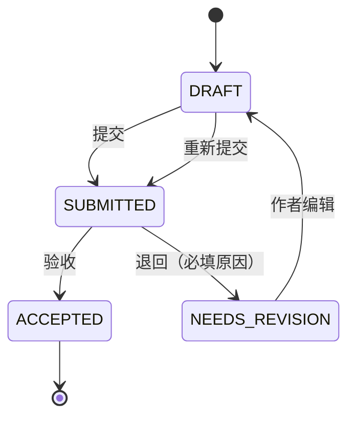

# PiLab 科研管理 P0 开发 PRD（分阶段开发执行版）

| 项目     | 内容                                                                                              |
| -------- | ------------------------------------------------------------------------------------------------- |
| 文档名称 | PiLab 科研管理 P0 开发 PRD                                                              |
| 文档版本 | v1.1（实现完成回写，见 §16）                                                                      |
| 文档状态 | 已评审 / 实现完成（十个阶段全部交付并验收）                                                       |
| 日期     | 2026-09-15                                                                                        |
| 上游依据 | [`docs/research-management-prd-roadmap.md`](./research-management-prd-roadmap.md) §5.1（P0 范围） |
| 代码基线 | `develop` 分支，工作区版本 `2.0.1`，`plane.db` 迁移编号至 `0122`                                  |
| 交付状态 | 已交付 `v2.1.0`；验收见 [research-p0-acceptance-report.md](./research-p0-acceptance-report.md)    |
| 文档定位 | 把路线图中的 P0 范围拆解为可排期、可开发、可验收的开发规格                                        |
| 变更范围 | 本轮仅新增本文档，不修改业务代码、数据库结构与部署配置                                            |
| 术语约束 | 课题组负责人统一写作 **课题组主 PI**，禁止硬编码任何具体人名                                      |

## 0. 文档定位与阅读方式

本仓库已有两份文档，职责不同，不要混用：

| 文档                                                                         | 回答的问题                                | 覆盖范围   |
| ---------------------------------------------------------------------------- | ----------------------------------------- | ---------- |
| [`research-management-prd-roadmap.md`](./research-management-prd-roadmap.md) | 做什么、什么优先级、生态边界在哪          | P0–P3 全景 |
| 本文档                                                                       | P0 怎么做、分几步、每步交付什么、如何验收 | 仅 P0      |

阅读建议：

- 产品与业务方：§1、§3、§7、§13。
- 后端开发：§2、§4、§5、§7。
- 前端开发：§2、§5、§6、§7。
- 测试与质量：§3、§7、§9、§13。
- 部署与运维：§2、§10、§14。

约束优先级：P0 范围内若本文档与路线图冲突，以本文档为准，并回溯修订路线图。本文档未决事项集中登记在 §12，未被决策覆盖前不进入开发排期。

## 1. 项目概述

### 1.1 项目定位

PiLab 是 AI4MS 统一研发门户下的**科研及办公管理模块**，基于上游 Plane 二次开发。P0 是该项目的第一批可交付版本，定位是"把人和组织管起来、把项目和周报跑起来"，**全程不引入任何与 AI 结合的功能**。

P0 完成后，平台应当能独立支撑一个课题组或实验室的日常科研管理：组织关系清晰、登录身份统一、科研项目一人一项、周报月报可提交可退回、报告与附件按组织架构分级可见、办公审批有据可查、原有 Plane 通用能力不受影响。

### 1.2 P0 目标与成功判据

| 编号 | 目标             | 成功判据（可验证）                                                            |
| ---- | ---------------- | ----------------------------------------------------------------------------- |
| G1   | 人和组织可管     | 可维护多级组织树，可配置课题组主 PI 与直接导师，主 PI 变更不影响历史数据      |
| G2   | 账号身份统一     | 可用 AI4MS 账号登录，身份按 `sub` / `email` / `employee_id` 正确映射或建号    |
| G3   | 权限可分级       | 报告与附件按组织架构分级可见，越权访问后端返回 403，普通 Page 行为不变        |
| G4   | 科研项目一人一项 | 每个科研责任人默认一个进行中的科研 Project，可与普通 Project 区分和筛选       |
| G5   | 周报月报闭环     | 创建 → 提交 → 退回 → 重新提交 → 验收全链路可跑通，历史版本不可覆盖            |
| G6   | 文件能力可用     | 图片上传插入正文、PDF 作为附件、`.md` 导入为正文，均受报告 ACL 保护           |
| G7   | 办公审批可追溯   | 任务审批与采购审批复用 Issue 与审批流，每级审批留痕且不可静默修改             |
| G8   | 通用功能不回归   | 关闭科研开关时原 Workspace / Project / Issue / Page / Cycle / Module 完全可用 |

### 1.3 P0 范围

| 模块         | P0 范围                                                         |
| ------------ | --------------------------------------------------------------- |
| 组织架构     | 组织树、成员归属、课题组主 PI、直接导师                         |
| 账号与身份   | AI4MS SSO / OIDC 登录、身份映射、首次登录自动建号               |
| 权限基础     | 科研 ACL 服务、报告按组织架构分级、附件同权                     |
| 平台配置     | 科研 Feature Flag、文件限制独立配置、模板基础                   |
| 审计基础     | 审计事件写入与不可删除约束                                      |
| 个人 Project | 每个科研责任人一个进行中的科研 Project                          |
| 周报 / 月报  | 创建、编辑、提交、退回、重新提交                                |
| 文件能力     | 图片上传、PDF 上传、Markdown 导入                               |
| 办公审批     | 任务审批、采购审批等（复用 Issue 与审批流）                     |
| 科研 UI      | 科研导航、报告列表、组织设置                                    |
| 通用兼容     | 原 Workspace / Project / Issue / Page / Cycle / Module 回归通过 |

P0 首批（优先完成）顺序：

```text
系统管理基础（组织架构、角色权限、账号与 SSO）
  → 项目管理（每人一个科研 Project）
    → 周报 / 月报（含图片、PDF 上传，Markdown .md 解析导入，按组织架构的报告访问分级）
```

### 1.4 P0 不包含

以下内容明确不在 P0 交付范围内，不得以"顺手实现"为由进入 P0 排期：

- 科研阶段评审：预开题 / 开题 / 中期 / 结题。
- AI 创新性评分。
- AI 辅助研究计划。
- 智能体调用与调用审计落地。
- 记忆共享。
- 论文写作辅助。
- 与外部系统的实质集成（知识库、湿实验、高分子研发、谱学分析）。

同时沿用的既有非目标（详见路线图 §1.3、§1.4）：

- 不在 Plane 内自建独立账号体系，统一接入 AI4MS SSO / OIDC。
- 不在 Plane 内自建知识库、湿实验管理、设备管理、谱学分析能力。
- P0 文件能力仅承诺上传、存储、预览、下载与授权访问，不承诺 PDF 全文结构化解析。
- P0 不做学校组织架构自动同步，组织树在 Plane 内维护。
- P0 不引入移动端原生 App，仅保证现有响应式布局在新页面可用。

### 1.5 P0 角色

| 角色            | 说明             | P0 能力                                                         |
| --------------- | ---------------- | --------------------------------------------------------------- |
| Workspace Admin | 平台管理员       | 配置科研开关、组织树、报告默认可见级别、审批流、查看全量汇总    |
| Unit Admin      | 组织节点管理员   | 管理本节点成员，查看授权范围内报告汇总                          |
| 课题组主 PI     | 课题组负责人     | 管理本组成员与导师关系、验收 / 退回报告、参与审批、查看本组汇总 |
| 直接导师        | 学生直接指导老师 | 查看被指导学生报告、验收 / 退回、参与审批                       |
| Research Owner  | 科研责任人       | 拥有个人科研 Project，撰写提交周报月报、上传附件                |
| Reviewer        | 评审人           | P0 仅保留角色位与成员映射，不启用阶段评审动作（P1 启用）        |
| Guest           | 普通访客         | 默认无科研模块任何权限                                          |

角色规则：

- 课题组主 PI 是**组织角色**，不绑定具体姓名；主 PI 变更只调整 `OrgUnitMember.org_role`。
- 一名用户可属于多个组织节点；一个课题组可配置一名或多名主 PI。
- 一个科研责任人可配置一名或多名直接导师。
- 首次通过 SSO 自动建号的用户默认**无任何科研角色**，需由管理员或主 PI 分配。

### 1.6 P0 术语

| 术语         | 定义                                                              |
| ------------ | ----------------------------------------------------------------- |
| 组织节点     | Workspace 组织树上的一个节点，可为学院、实验室、课题组或小组      |
| 课题组主 PI  | 组织节点负责人，`OrgUnitMember.org_role = PI`                     |
| 直接导师     | 学生的直接指导老师，`OrgUnitMember.org_role = ADVISOR`            |
| 科研责任人   | 拥有个人科研 Project 的成员，覆盖学生、博士后、研究员等           |
| 科研 Project | 复用 Plane Project 载体，通过 `ResearchProjectProfile` 标识为科研 |
| 周期报告     | 周报 / 月报的统一业务对象 `PeriodicReport`                        |
| 报告访问级别 | `PRIVATE / DIRECT_ADVISOR / UNIT / ANCESTRY / WORKSPACE / CUSTOM` |
| 科研 ACL     | 叠加在原有权限之上的科研对象访问控制层，后端为唯一判定方          |
| 审计事件     | 只追加、不可修改、不可删除的科研操作留痕记录 `ResearchAuditEvent` |

## 2. 交付基线与技术约束

### 2.1 代码基线（写作时核对）

| 项           | 现状                                                                                       |
| ------------ | ------------------------------------------------------------------------------------------ |
| 工作区版本   | `2.0.1`（根 `package.json`、`apps/web`、`apps/api`、`packages/ui` 一致）                   |
| 数据库迁移   | `apps/api/plane/db/migrations` 最新为 `0122_...`，新迁移从 `0123` 起                       |
| 科研模块代码 | 仓库内暂不存在任何 research 相关模型、接口或页面                                           |
| 后端框架     | Django + DRF，应用注册见 `apps/api/plane/settings/common.py`                               |
| 后端路由     | `apps/api/plane/urls.py`：`/api/`、`/api/v1/`、`/api/public/`、`/auth/`、`/api/instances/` |
| 前端框架     | React Router v7 + Vite，路由配置在 `apps/web/app/routes/{core,extended}.ts`                |
| 后台任务     | Celery（`apps/api/plane/celery.py`、`plane.bgtasks`）                                      |
| 测试入口     | `apps/api/tests`，Docker 栈 `docker-compose-test.yml`                                      |

### 2.2 复用能力与落点

P0 的全部功能都必须建立在既有能力之上，新增代码只做"叠加"，不做"替换"。

| 能力           | 既有实现                                          | 关键文件                                              | P0 用法                                        |
| -------------- | ------------------------------------------------- | ----------------------------------------------------- | ---------------------------------------------- |
| 项目载体       | `Project`                                         | `apps/api/plane/db/models/project.py`                 | 科研 Project 仍用该模型，新增一对一副本表      |
| 项目成员与角色 | `ProjectMember` / `ROLE_CHOICES`                  | 同上                                                  | 责任人 Admin、直接导师 Admin、评审人 Member    |
| 富文本正文     | `Page`（`access` 为 0/1）                         | `apps/api/plane/db/models/page.py`                    | 报告正文复用 Page，不新增编辑器                |
| 附件存储       | `FileAsset` + S3                                  | `apps/api/plane/db/models/asset.py`                   | 报告附件、正文图片复用同一存储链路             |
| 文件大小限制   | `FILE_SIZE_LIMIT`（默认 5MB）                     | `apps/api/plane/settings/common.py`                   | 科研附件使用独立配置，不改默认值               |
| 权限判定       | `apps/api/plane/app/permissions/*`                | `base.py` / `project.py` / `page.py` / `workspace.py` | 新增科研 ACL 服务，叠加而非改写既有权限        |
| 登录体系       | OAuth2 provider：google / github / gitlab / gitea | `apps/api/plane/authentication/provider/oauth/`       | 新增 OIDC provider，结构对齐既有实现           |
| 社交账号关联   | `SocialLoginConnection`                           | `apps/api/plane/db/models/social_connection.py`       | 身份映射参考该模型的设计，必要时新增独立映射表 |
| 审计字段       | `AuditModel`（`created_by` / `updated_by`）       | `apps/api/plane/db/mixins.py`、`db/models/base.py`    | 业务模型沿用；科研审计事件另建只追加表         |
| 通知           | 现有 notification 模型与前端通知中心              | `apps/api/plane/db/models/notification.py`            | 提交 / 退回 / 验收通知复用既有链路             |
| 工作项         | `Issue` + `State` + `Project`                     | `apps/api/plane/db/models/issue.py`、`state.py`       | 办公审批复用 Issue 与状态流，不新建工单系统    |
| 国际化         | i18n 文案包                                       | `packages/i18n/src/locales/*`                         | 新增科研文案 key，中文优先                     |
| 前端共享状态   | MobX store（`packages/shared-state`）             | `apps/web/core/store/*`                               | 科研 store 沿用同一模式                        |

### 2.3 技术约束

1. 增量扩展：不修改原有模型字段语义，不删除、不重命名既有字段与接口。
2. 科研接口统一挂 `/api/research/` 命名空间；既有 `/api/`、`/api/v1/` 路径保持不动。
3. 数据库迁移必须可回滚或有明确前向兼容策略；先加字段、后切逻辑，不做破坏性列变更。
4. 权限以后端计算为唯一来源，前端隐藏入口只是体验优化。
5. 科研 ACL 只作用于带科研元数据的对象；普通 Project、Issue、Page、附件继续走原权限链路。
6. 科研附件限制独立配置，不改变 `FILE_SIZE_LIMIT` 对原有功能的默认行为。
7. 新功能一律由科研开关控制，可分 Workspace 灰度启用与关闭。
8. 审计事件只追加：不允许更新与删除，且不随业务对象级联删除。
9. 所有界面文案、数据模型、接口、配置项不得出现任何具体 PI 姓名或固定昵称。
10. 保留上游 AGPL-3.0 版权与来源声明，新增文件沿用现有版权头格式。

### 2.4 代码落点规划

新增代码建议落点（供评审确认，最终以实施 PR 为准）：

```text
后端
  apps/api/plane/db/models/research/org.py         组织架构模型
  apps/api/plane/db/models/research/identity.py    SSO 身份映射
  apps/api/plane/db/models/research/report.py      报告与报告附件
  apps/api/plane/db/models/research/project.py     科研 Project 副本
  apps/api/plane/db/models/research/config.py      科研平台配置与模板
  apps/api/plane/db/models/research/audit.py       科研审计事件
  apps/api/plane/db/models/research/approval.py    审批流定义与动作
  apps/api/plane/db/migrations/0123_*.py           起，按阶段逐个新增
  apps/api/plane/research/
    urls.py  views/  serializers/  permissions/  utils/acl.py
  apps/api/plane/authentication/provider/oauth/oidc.py
  apps/api/plane/urls.py                           增加 /api/research/ 路由

前端
  apps/web/app/routes/(all)/[workspaceSlug]/(projects)/research/...
  apps/web/core/components/research/...
  apps/web/core/services/research/...
  apps/web/core/store/research/...
  packages/constants/src/research.ts
  packages/i18n/src/locales/*                       科研文案 key
```

命名约定：模型统一 `BaseModel` 派生，接口统一 `Research*` 前缀序列化器，前端接口封装统一放 `core/services/research/`。

## 3. P0 功能需求规格

需求编号规则：`P0-<模块>-<序号>`，用于和开发阶段（§7）及验收清单（§13）互相对应。每条需求都必须可被测试用例覆盖。

### 3.1 组织架构

| 编号      | 需求        | 规则                                                                            |
| --------- | ----------- | ------------------------------------------------------------------------------- |
| P0-ORG-01 | 维护组织树  | 每个 Workspace 至少一个根节点；节点类型 `ROOT / INSTITUTE / LAB / GROUP / TEAM` |
| P0-ORG-02 | 组织树防环  | 父节点不得为自身或后代节点，写入时校验并拒绝，返回 400                          |
| P0-ORG-03 | 成员归属    | 用户可归属多个节点，可设置主属节点（`is_primary`）                              |
| P0-ORG-04 | 组织角色    | 节点内角色 `OWNER / PI / ADVISOR / REVIEWER / UNIT_ADMIN`，可多人同角色         |
| P0-ORG-05 | 课题组主 PI | 一个节点可配置一名或多名主 PI，主 PI 是组织角色，不与姓名绑定                   |
| P0-ORG-06 | 直接导师    | 一个科研责任人可绑定一名或多名直接导师                                          |
| P0-ORG-07 | 关系有效期  | 成员关系支持 `effective_from / effective_to`，过期关系不再参与权限计算          |
| P0-ORG-08 | 软删除      | 组织节点软删除，历史报告与审计记录保留                                          |
| P0-ORG-09 | 审计        | 节点增删改、成员变更、主 PI 转移均写入科研审计事件                              |

验收要点：

- 连续创建"学院 → 实验室 → 课题组 → 小组"四级节点成功，尝试把上级节点挪到自己的子节点下被拒绝。
- 主 PI 从 A 调整为 B 后，A 立即失去该组管理权限，B 立即获得，且历史报告作者与审批记录不变。
- 组织关系变更不影响该用户在其他 Workspace 与普通 Project 中的既有权限。

### 3.2 账号与身份

| 编号     | 需求           | 规则                                                                         |
| -------- | -------------- | ---------------------------------------------------------------------------- |
| P0-ID-01 | OIDC 登录      | 接入 AI4MS Identity 的 OIDC，授权码模式 + PKCE，校验 `state` 与 `nonce`      |
| P0-ID-02 | 身份映射优先级 | `sub` > `email` > `employee_id`，命中即建立会话                              |
| P0-ID-03 | 首次登录建号   | 未命中且策略允许时自动建号，默认无科研角色，仅进 Workspace 默认权限          |
| P0-ID-04 | 身份冲突处理   | `email` 命中多个候选或 `sub` 与 `email` 指向不同用户时拒绝自动合并且记录事件 |
| P0-ID-05 | 映射可审计     | 绑定、解绑、自动建号、邮箱变更均写入科研审计事件                             |
| P0-ID-06 | 本地回退登录   | 关闭或不可用 SSO 时保留本地管理员登录入口，保证平台可进入                    |
| P0-ID-07 | 账号停用       | 用户停用后不物理删除，历史报告与审计保留                                     |
| P0-ID-08 | 门户跳转       | 支持从 AI4MS 门户带目标地址跳入，登录后回到原目标路径，非法地址回落到首页    |

验收要点：

- 首次登录自动建号后，该用户看不到任何未授权科研数据，需要管理员分配组织关系后才出现科研入口数据。
- 伪造或过期的 `id_token`、缺失 `nonce` 的请求一律拒绝登录。
- 关闭 OIDC 配置后，本地登录仍可用，平台不整体不可用。

### 3.3 权限基础（科研 ACL）

| 编号      | 需求             | 规则                                                                                    |
| --------- | ---------------- | --------------------------------------------------------------------------------------- |
| P0-ACL-01 | ACL 服务         | 提供统一判定入口，输入 `actor + action + resource`，输出允许 / 拒绝                     |
| P0-ACL-02 | 访问级别         | `PRIVATE / DIRECT_ADVISOR / UNIT / ANCESTRY / WORKSPACE / CUSTOM` 六级                  |
| P0-ACL-03 | 默认策略         | Workspace Admin 可按报告类型配置默认访问级别                                            |
| P0-ACL-04 | 只可收窄         | 作者可在默认级别基础上收窄可见范围，不可扩大                                            |
| P0-ACL-05 | 自定义授权       | `CUSTOM` 仅在默认边界内额外授权，不得越界                                               |
| P0-ACL-06 | 附件同权         | 报告附件、正文图片与报告正文使用同一 ACL，下载入口再次校验                              |
| P0-ACL-07 | 统一过滤         | 列表、详情、搜索、导出、下载走同一判定，无权限时返回 403 或从结果中剔除，不返回部分字段 |
| P0-ACL-08 | 越权不可绕行     | 普通 Page 接口不得成为读取科研报告的旁路                                                |
| P0-ACL-09 | 策略变更审计     | 默认策略与单份报告的可见性变更写入审计事件                                              |
| P0-ACL-10 | 普通对象不受影响 | 非科研 Page、普通 Issue、普通附件继续使用原有 Public / Private 语义                     |

验收要点：

- 权限矩阵用例覆盖六种访问级别 × 六类主体（本人、直接导师、同节点成员、上级节点主 PI、Workspace Admin、无关成员）。
- 附件直链、签名 URL、搜索接口三条路径均无法绕过 ACL。
- 关闭科研开关后，普通 Page 的 Public / Private 行为与变更前一致。

### 3.4 平台配置

| 编号      | 需求             | 规则                                                                    |
| --------- | ---------------- | ----------------------------------------------------------------------- |
| P0-CFG-01 | 全局开关         | 提供科研模块总开关，默认关闭，可整体回滚                                |
| P0-CFG-02 | Workspace 开关   | 每个 Workspace 独立启用科研模块，支持分 Workspace 灰度                  |
| P0-CFG-03 | 分模块开关       | 组织架构、报告、审批可分别开关，未启用时对应入口与接口不可用            |
| P0-CFG-04 | 文件限制独立配置 | 图片、PDF、Markdown 限制独立可配，默认不改变原有 `FILE_SIZE_LIMIT` 行为 |
| P0-CFG-05 | 模板基础         | 支持按报告类型维护模板，可设默认模板，模板正文复用 Page 富文本结构      |
| P0-CFG-06 | 时区配置         | 报告周期计算使用明确时区，默认继承 Workspace 时区                       |
| P0-CFG-07 | 多项目策略       | 可配置是否允许一个科研责任人存在多个进行中的科研 Project                |
| P0-CFG-08 | 配置审计         | 开关、限制、模板的变更写入审计事件                                      |

验收要点：

- 关闭总开关后，科研接口返回明确的不可用错误，前端隐藏科研入口，普通功能不受影响。
- 把 PDF 限制调整为 200MB 后，科研 PDF 上传生效，普通 Issue 附件限制仍是原值。

### 3.5 审计基础

| 编号      | 需求         | 规则                                                                                                       |
| --------- | ------------ | ---------------------------------------------------------------------------------------------------------- |
| P0-AUD-01 | 审计模型     | 记录 `actor / action / resource_type / resource_id / workspace / org_unit / 时间 / 来源 IP / 元数据`       |
| P0-AUD-02 | 只追加       | 不提供更新与删除接口；模型层禁止 `save` 覆盖与 `delete`                                                    |
| P0-AUD-03 | 不可级联删除 | 业务对象删除时审计事件保留，不使用级联删除外键                                                             |
| P0-AUD-04 | 必写事件     | 登录与身份映射、组织变更、报告提交 / 退回 / 验收、可见性变更、配置与模板变更、审批动作、附件下载失败均记录 |
| P0-AUD-05 | 查询入口     | 提供按时间、操作人、资源、组织节点筛选的审计查询，仅管理员可见                                             |
| P0-AUD-06 | 保留策略     | 审计记录保留期可配置，默认不自动清理                                                                       |

验收要点：

- 通过接口与管理后台均无法修改或删除已写入的审计事件。
- 删除一篇科研报告后，其提交与退回审计记录仍可查询。

### 3.6 个人科研 Project

| 编号      | 需求           | 规则                                                                                  |
| --------- | -------------- | ------------------------------------------------------------------------------------- |
| P0-PRJ-01 | 科研项目副本   | 通过 `ResearchProjectProfile` 与 Plane Project 一对一关联，不新建平行项目系统         |
| P0-PRJ-02 | 一人一项目     | 每个科研责任人默认只有一个进行中的科研 Project，创建前校验                            |
| P0-PRJ-03 | 项目类型       | `PHD / MASTER / POSTDOC / RESEARCH_PROJECT`                                           |
| P0-PRJ-04 | 自动创建       | 分配科研责任人角色后可按策略自动创建个人科研 Project                                  |
| P0-PRJ-05 | 成员角色映射   | 责任人 Admin、直接导师 Admin、评审人 Member、课题组主 PI 按组织角色获得管理权         |
| P0-PRJ-06 | 可识别可筛选   | 科研项目在项目列表中可标识、可筛选，不与普通项目混淆                                  |
| P0-PRJ-07 | 归档不等于结题 | 项目归档仅影响普通项目语义，科研流程状态单独维护（P0 仅区分进行中 / 已归档 / 已结题） |
| P0-PRJ-08 | 审计           | 创建、归档、恢复、负责人变更写入审计                                                  |

验收要点：

- 同一责任人重复创建第二个进行中科研 Project 时被拒绝或按配置放行，行为与配置一致。
- 科研 Project 创建后，普通 Project 列表、设置与成员管理行为无变化。

### 3.7 周报 / 月报

| 编号      | 需求         | 规则                                                                        |
| --------- | ------------ | --------------------------------------------------------------------------- |
| P0-RPT-01 | 报告类型     | 支持 `WEEKLY` 与 `MONTHLY`                                                  |
| P0-RPT-02 | 周期规则     | 周报按 ISO week，月报按自然月，计算基于明确时区                             |
| P0-RPT-03 | 唯一性       | 每人每周期每类型只允许一份正式报告                                          |
| P0-RPT-04 | 补交         | 允许补交历史周期报告，须标记为补交并记录原周期                              |
| P0-RPT-05 | 创建与编辑   | 正文复用 Plane Page，支持模板创建、草稿反复编辑                             |
| P0-RPT-06 | 状态机       | `DRAFT → SUBMITTED → ACCEPTED`，`SUBMITTED → NEEDS_REVISION → DRAFT` 可循环 |
| P0-RPT-07 | 提交只读     | 提交后正文与关键字段只读，再次编辑须先退回                                  |
| P0-RPT-08 | 退回必填原因 | 退回必须填写原因，退回后作者可编辑并重新提交                                |
| P0-RPT-09 | 验收         | 直接导师、课题组主 PI 或有权限管理者可验收，验收后报告终态                  |
| P0-RPT-10 | 可见性       | 创建时按 Workspace 默认策略初始化可见级别，作者可收窄                       |
| P0-RPT-11 | 历史不可覆盖 | 每次提交、退回、验收留痕，历史正文版本可追溯，不可静默覆盖                  |
| P0-RPT-12 | 通知         | 提交通知导师 / 主 PI，退回与验收通知作者                                    |

状态机：



验收要点：

- 重复提交已提交状态的报告返回 409，不产生第二条提交记录。
- 退回后重新提交，历史提交与退回原因在报告中均可查。
- 报告提交后，作者通过普通 Page 接口修改正文被拒绝。

### 3.8 文件能力

| 编号       | 需求          | 规则                                                                |
| ---------- | ------------- | ------------------------------------------------------------------- |
| P0-FILE-01 | 图片上传      | 图片上传后插入正文，复用编辑器 asset 能力                           |
| P0-FILE-02 | PDF 附件      | PDF 作为报告附件挂载，支持预览与下载                                |
| P0-FILE-03 | Markdown 导入 | `.md` 导入为报告正文，支持把文件内容写入 Page 富文本                |
| P0-FILE-04 | 校验          | 校验 MIME、扩展名、文件大小与文件头签名，不匹配则拒绝               |
| P0-FILE-05 | 大小限制      | 图片 / PDF / Markdown 分别使用科研独立限制，默认 20MB / 100MB / 5MB |
| P0-FILE-06 | 同权保护      | 附件与正文使用同一 ACL，下载前二次校验                              |
| P0-FILE-07 | 外链处理      | Markdown 中远程图片保留原链接，本地图片走上传后插入                 |
| P0-FILE-08 | 原有行为不变  | 科研限制不影响普通 Issue 附件、头像、封面的既有上传行为             |

验收要点：

- 上传伪装成 PDF 的可执行文件被拒绝，并写入审计事件。
- 无报告权限的用户通过附件直链下载返回 403。
- 导入含标题、列表、代码块、表格的 `.md` 后正文结构完整可再编辑。

### 3.9 办公审批

| 编号      | 需求       | 规则                                                   |
| --------- | ---------- | ------------------------------------------------------ |
| P0-APR-01 | 复用 Issue | 审批对象复用 Plane Issue 与状态流，不新建平行工单系统  |
| P0-APR-02 | 审批类型   | P0 提供任务审批与采购审批，其他类型可由管理员扩展      |
| P0-APR-03 | 流程配置   | 审批链路按组织架构配置，支持多级与并行（或签 / 会签）  |
| P0-APR-04 | 逐级留痕   | 每级记录审批人、时间、意见与结果，不可静默修改         |
| P0-APR-05 | 结果关联   | 审批结果可关联科研 Project 与报告                      |
| P0-APR-06 | 通知       | 审批通知复用既有通知体系，不新增通知通道               |
| P0-APR-07 | 回退与作废 | 支持撤回未完成的申请，已完成审批不可删除只可作废并留痕 |

验收要点：

- 两级审批中第一级驳回后，申请回到发起人，流程不继续推进。
- 审批历史中每条动作都有审批人与时间，且无法通过接口篡改。

### 3.10 科研 UI

| 编号     | 需求       | 规则                                                      |
| -------- | ---------- | --------------------------------------------------------- |
| P0-UI-01 | 科研导航   | 新增一级入口「科研」，包含报告、项目、审批、设置          |
| P0-UI-02 | 报告列表   | 支持按周期、状态、组织节点、人员筛选                      |
| P0-UI-03 | 报告详情   | 展示正文、附件、状态、可见级别、审批历史与操作按钮        |
| P0-UI-04 | 组织设置   | 组织树维护、成员与角色配置、主 PI 与导师关系配置          |
| P0-UI-05 | 汇总视图   | 按组织节点与周期展示未提交 / 已提交 / 需修改 / 已验收数量 |
| P0-UI-06 | 权限隐藏   | 无权限入口隐藏，越权操作由后端拒绝并给出明确提示          |
| P0-UI-07 | 开关降级   | 科研开关关闭时入口不出现，直接访问路由回落到工作区首页    |
| P0-UI-08 | 原导航不动 | 只新增科研入口，不移动、不删除原有导航与页面              |

### 3.11 通用兼容

| 编号         | 需求         | 规则                                                                |
| ------------ | ------------ | ------------------------------------------------------------------- |
| P0-COMPAT-01 | 原功能回归   | Workspace / Project / Issue / Page / Cycle / Module / View 全部可用 |
| P0-COMPAT-02 | 接口兼容     | 既有接口路径、请求体、响应体保持向下兼容，只允许新增可选字段        |
| P0-COMPAT-03 | 权限不串扰   | 科研 ACL 不影响普通对象的权限判定与搜索结果                         |
| P0-COMPAT-04 | 文件限制隔离 | 科研文件限制不改变原有默认限制                                      |
| P0-COMPAT-05 | 开关可回滚   | 关闭科研开关后系统回到接入前行为                                    |

## 4. 数据模型设计

### 4.1 新增模型总览

全部新增模型均带 `workspace` 归属、`created_at / updated_at`、`created_by / updated_by`，并遵循软删除原则；审计表除外（只追加，无更新语义）。

| 模型                       | 用途                   | 引入阶段 | 迁移 |
| -------------------------- | ---------------------- | -------- | ---- |
| `OrgUnit`                  | 组织树节点             | P0-A1    | 0123 |
| `OrgUnitMember`            | 组织成员与组织角色     | P0-A1    | 0123 |
| `IdentityMapping`          | SSO 身份映射           | P0-A2    | 0124 |
| `WorkspaceResearchSetting` | 科研平台配置           | P0-A3/A4 | 0125 |
| `ReportAccessGrant`        | 自定义报告授权         | P0-A3    | 0125 |
| `ResearchAuditEvent`       | 科研审计事件（只追加） | P0-A4    | 0126 |
| `ReportTemplate`           | 报告模板               | P0-A4    | 0126 |
| `ResearchProjectProfile`   | 科研 Project 副本      | P0-B1    | 0127 |
| `PeriodicReport`           | 周报 / 月报            | P0-C1    | 0128 |
| `ReportReviewLog`          | 提交 / 退回 / 验收留痕 | P0-C1    | 0128 |
| `ReportAttachment`         | 报告附件关联           | P0-C2    | 0129 |
| `ApprovalFlow`             | 审批流定义             | P0-D1    | 0130 |
| `ApprovalFlowStep`         | 审批步骤               | P0-D1    | 0130 |
| `ApprovalAction`           | 审批动作留痕           | P0-D1    | 0130 |

迁移编号为规划值，实际以合入时的最新编号顺延；同一阶段内的多个模型可合并到同一迁移文件。

### 4.2 组织架构

`OrgUnit`

| 字段         | 类型                        | 约束                                    | 说明                    |
| ------------ | --------------------------- | --------------------------------------- | ----------------------- |
| `workspace`  | FK → `Workspace`            | 必填，`on_delete=PROTECT`               | 组织树按 Workspace 隔离 |
| `name`       | `CharField(255)`            | 必填                                    | 节点名称                |
| `parent`     | FK → 自身                   | 可空，`on_delete=PROTECT`               | 根节点为空              |
| `path`       | `CharField`                 | 必填，索引                              | 物化路径，便于后代查询  |
| `depth`      | `PositiveSmallIntegerField` | 默认 0                                  | 层级深度                |
| `unit_type`  | `CharField`                 | `ROOT / INSTITUTE / LAB / GROUP / TEAM` | 节点类型                |
| `sort_order` | `FloatField`                | 默认 65535                              | 展示排序                |
| `is_active`  | `BooleanField`              | 默认 True                               | 软删除标记              |

约束与索引：

- 唯一约束：`(workspace, parent, name)`（同级不重名），`(workspace)` 下仅允许一个 `unit_type=ROOT` 且 `parent IS NULL` 的根节点（部分唯一索引）。
- 索引：`(workspace, path)`、`(workspace, parent, sort_order)`。
- 防环：写入时校验 `parent.path` 不是 `self.path` 的前缀，校验失败返回 400。

`OrgUnitMember`

| 字段             | 类型           | 约束                                           | 说明                         |
| ---------------- | -------------- | ---------------------------------------------- | ---------------------------- |
| `org_unit`       | FK → `OrgUnit` | 必填                                           | 所属节点                     |
| `user`           | FK → `User`    | 必填                                           | 成员                         |
| `org_role`       | `CharField`    | `OWNER / PI / ADVISOR / REVIEWER / UNIT_ADMIN` | 组织角色                     |
| `is_primary`     | `BooleanField` | 默认 False                                     | 主归属节点                   |
| `effective_from` | `DateField`    | 默认当天                                       | 关系生效时间                 |
| `effective_to`   | `DateField`    | 可空                                           | 关系失效时间，空表示长期有效 |

约束与索引：

- 唯一约束：`(org_unit, user, org_role)`，避免重复角色造成权限膨胀。
- 索引：`(user, org_role)`、`(org_unit, org_role)`，支撑 ACL 反查。
- 部分唯一索引：同一用户在同一 Workspace 只允许一个 `is_primary=True` 的成员关系。
- 有效期外的关系不参与权限计算，但历史记录保留。

### 4.3 身份映射

`IdentityMapping`

| 字段             | 类型                    | 约束                           | 说明                     |
| ---------------- | ----------------------- | ------------------------------ | ------------------------ |
| `user`           | FK → `User`             | 必填                           | 本地账号                 |
| `provider`       | `CharField`             | 默认 `ai4ms-oidc`              | 身份提供方标识           |
| `subject`        | `CharField(255)`        | 必填                           | OIDC `sub`，长期稳定主键 |
| `email_snapshot` | `CharField(255)`        | 可空                           | 最近一次登录携带的邮箱   |
| `employee_id`    | `CharField(255)`        | 可空，索引                     | 工号 / 学工号            |
| `status`         | `CharField`             | `ACTIVE / SUSPENDED / REVOKED` | 映射状态                 |
| `last_login_at`  | `DateTimeField`         | 可空                           | 最近登录时间             |
| `last_login_ip`  | `GenericIPAddressField` | 可空                           | 最近登录来源             |

约束与索引：

- 唯一约束：`(provider, subject)`；`(provider, user)`。
- `employee_id` 非唯一但建索引，冲突时按 P0-ID-04 处理，不自动合并。
- 该表不参与科研 ACL 计算，仅负责身份解析；科研权限仍由组织关系决定。

### 4.4 科研 Project

`ResearchProjectProfile`

| 字段              | 类型                 | 约束                                        | 说明                         |
| ----------------- | -------------------- | ------------------------------------------- | ---------------------------- |
| `project`         | OneToOne → `Project` | 必填，`on_delete=CASCADE`                   | 复用 Plane Project           |
| `workspace`       | FK → `Workspace`     | 必填                                        | 冗余便于过滤                 |
| `owner`           | FK → `User`          | 必填                                        | 科研责任人                   |
| `org_unit`        | FK → `OrgUnit`       | 可空                                        | 归属课题组，影响可见范围     |
| `research_type`   | `CharField`          | `PHD / MASTER / POSTDOC / RESEARCH_PROJECT` | 科研类型                     |
| `workflow_status` | `CharField`          | `ACTIVE / ARCHIVED / COMPLETED`             | 科研流程状态，独立于项目归档 |
| `started_at`      | `DateField`          | 可空                                        | 开始时间                     |
| `expected_end_at` | `DateField`          | 可空                                        | 预计结束                     |
| `completed_at`    | `DateField`          | 可空                                        | 实际结束                     |
| `is_active`       | `BooleanField`       | 默认 True                                   | 是否进行中                   |

约束与索引：

- 部分唯一索引：`(workspace, owner)` 上 `is_active=True AND workflow_status='ACTIVE'`，实现"一人一个进行中项目"；允许配置放宽时以应用层校验替代。
- 索引：`(workspace, workflow_status)`、`(org_unit)`。
- `Project` 侧不新增必填字段；如需在项目列表标识科研项目，只新增可选 `is_research_project` 字段（默认 `false`），保证既有客户端兼容。

### 4.5 周报 / 月报

`PeriodicReport`

| 字段           | 类型              | 约束                                            | 说明                    |
| -------------- | ----------------- | ----------------------------------------------- | ----------------------- |
| `workspace`    | FK → `Workspace`  | 必填                                            | 隔离维度                |
| `project`      | FK → `Project`    | 必填                                            | 作者个人科研 Project    |
| `owner`        | FK → `User`       | 必填                                            | 报告作者                |
| `org_unit`     | FK → `OrgUnit`    | 可空                                            | 提交时刻的组织快照      |
| `page`         | OneToOne → `Page` | 必填，`on_delete=PROTECT`                       | 正文载体                |
| `report_type`  | `CharField`       | `WEEKLY / MONTHLY`                              | 报告类型                |
| `period_key`   | `CharField(16)`   | 必填，索引                                      | `2026-W38` 或 `2026-09` |
| `period_start` | `DateField`       | 必填                                            | 周期开始                |
| `period_end`   | `DateField`       | 必填                                            | 周期结束                |
| `timezone`     | `CharField`       | 默认继承 Workspace                              | 周期计算时区            |
| `status`       | `CharField`       | `DRAFT / SUBMITTED / NEEDS_REVISION / ACCEPTED` | 状态                    |
| `visibility`   | `CharField`       | 六级访问级别，默认取 Workspace 策略             | 可见范围                |
| `is_backfill`  | `BooleanField`    | 默认 False                                      | 是否为补交              |
| `submitted_at` | `DateTimeField`   | 可空                                            | 最近提交时间            |
| `accepted_at`  | `DateTimeField`   | 可空                                            | 验收时间                |
| `reviewer`     | FK → `User`       | 可空                                            | 最近验收 / 退回人       |

约束与索引：

- 唯一约束：`(workspace, owner, report_type, period_key)`，保证每人每周期每类型一份正式报告。
- 索引：`(workspace, status, period_key)`、`(org_unit, period_key)`、`(owner, report_type, period_start)`。
- 状态流转只允许状态机中定义的边，非法流转返回 409。
- `page.owned_by` 与 `owner` 必须一致；Page 创建后由报告模块接管其可见性。

`ReportReviewLog`（只追加）

| 字段                        | 类型                  | 约束                                | 说明               |
| --------------------------- | --------------------- | ----------------------------------- | ------------------ |
| `report`                    | FK → `PeriodicReport` | 必填，`on_delete=PROTECT`           | 所属报告           |
| `actor`                     | FK → `User`           | 必填                                | 操作人             |
| `action`                    | `CharField`           | `SUBMIT / RETURN / ACCEPT / REOPEN` | 动作               |
| `from_status` / `to_status` | `CharField`           | 必填                                | 状态迁移           |
| `comment`                   | `TextField`           | 退回必填                            | 意见与原因         |
| `snapshot_version`          | `CharField`           | 可空                                | 对应 Page 版本标识 |
| `created_at`                | `DateTimeField`       | 自动                                | 动作时间           |

规则：不提供更新与删除接口；退回原因不可被后续修改覆盖。

`ReportAccessGrant`

| 字段               | 类型                  | 约束         | 说明         |
| ------------------ | --------------------- | ------------ | ------------ |
| `report`           | FK → `PeriodicReport` | 必填         | 目标报告     |
| `grantee_user`     | FK → `User`           | 与节点二选一 | 指定用户授权 |
| `grantee_org_unit` | FK → `OrgUnit`        | 与用户二选一 | 指定节点授权 |
| `granted_by`       | FK → `User`           | 必填         | 授权人       |
| `expires_at`       | `DateTimeField`       | 可空         | 到期自动失效 |
| `is_revoked`       | `BooleanField`        | 默认 False   | 撤销标记     |

规则：仅在默认可见级别边界内生效，越界的授权在写入时被拒绝。

### 4.6 审计事件

`ResearchAuditEvent`（只追加，无 `updated_by`）

| 字段            | 类型                    | 约束                       | 说明                                  |
| --------------- | ----------------------- | -------------------------- | ------------------------------------- |
| `workspace`     | FK → `Workspace`        | 必填，`on_delete=PROTECT`  | 不随 Workspace 删除而消失             |
| `actor`         | FK → `User`             | 可空，`on_delete=SET_NULL` | 系统动作时为空                        |
| `action`        | `CharField(64)`         | 必填，索引                 | 如 `report.submit`、`org.pi.transfer` |
| `resource_type` | `CharField(64)`         | 必填                       | 对象类型                              |
| `resource_id`   | `UUIDField`             | 可空                       | 对象标识，不做外键                    |
| `org_unit`      | FK → `OrgUnit`          | 可空，`on_delete=SET_NULL` | 组织维度                              |
| `metadata`      | `JSONField`             | 默认 dict                  | 变更前后摘要、原因等                  |
| `ip_address`    | `GenericIPAddressField` | 可空                       | 来源地址                              |
| `user_agent`    | `CharField(255)`        | 可空                       | 客户端标识                            |
| `created_at`    | `DateTimeField`         | 自动，索引                 | 事件时间                              |

规则与实现要求：

- 模型层重写 `save()`：仅允许新增，禁止更新；重写 `delete()` 直接抛错。
- 数据库层对应用账号回收该表的 `UPDATE` / `DELETE` 权限（部署脚本或迁移中说明），形成"业务不可删"的双重保障。
- 不对业务对象建立级联删除外键，避免删除对象时带走审计。
- 索引：`(workspace, created_at)`、`(resource_type, resource_id)`、`(actor, created_at)`。

### 4.7 平台配置与模板

`WorkspaceResearchSetting`（每个 Workspace 一行）

| 字段                        | 类型                   | 默认                      | 说明                   |
| --------------------------- | ---------------------- | ------------------------- | ---------------------- |
| `workspace`                 | OneToOne → `Workspace` | 必填                      | 配置归属               |
| `module_enabled`            | `BooleanField`         | False                     | 科研模块总开关         |
| `org_enabled`               | `BooleanField`         | True                      | 组织架构子开关         |
| `report_enabled`            | `BooleanField`         | True                      | 报告子开关             |
| `approval_enabled`          | `BooleanField`         | True                      | 审批子开关             |
| `allow_multiple_projects`   | `BooleanField`         | False                     | 是否允许多个进行中项目 |
| `default_report_visibility` | `CharField`            | `DIRECT_ADVISOR`          | 报告默认可见级别       |
| `image_max_mb`              | `PositiveIntegerField` | 20                        | 图片限制               |
| `pdf_max_mb`                | `PositiveIntegerField` | 100                       | PDF 限制               |
| `markdown_max_mb`           | `PositiveIntegerField` | 5                         | Markdown 限制          |
| `timezone`                  | `CharField`            | 继承 `Workspace.timezone` | 报告周期时区           |
| `audit_retention_days`      | `PositiveIntegerField` | 0（不清理）               | 审计保留天数           |

`ReportTemplate`

| 字段           | 类型             | 约束               | 说明                           |
| -------------- | ---------------- | ------------------ | ------------------------------ |
| `workspace`    | FK → `Workspace` | 必填               | 模板归属                       |
| `report_type`  | `CharField`      | `WEEKLY / MONTHLY` | 适用报告类型                   |
| `name`         | `CharField(255)` | 必填               | 模板名称                       |
| `content_json` | `JSONField`      | 默认 dict          | 与 Page 正文结构一致的模板内容 |
| `is_default`   | `BooleanField`   | 默认 False         | 每种类型至多一个默认模板       |
| `is_active`    | `BooleanField`   | 默认 True          | 停用后不影响历史报告           |

### 4.8 办公审批

| 模型               | 关键字段                                                                                               | 说明                       |
| ------------------ | ------------------------------------------------------------------------------------------------------ | -------------------------- |
| `ApprovalFlow`     | `workspace`、`org_unit`、`approval_type`（`TASK / PURCHASE / CUSTOM`）、`name`、`is_active`、`version` | 审批流定义，按组织节点绑定 |
| `ApprovalFlowStep` | `flow`、`order`、`approver_mode`（`ANY / ALL`）、`approver_org_role`、`approver_user`、`is_required`   | 审批步骤，按顺序推进       |
| `ApprovalAction`   | `issue`、`step`、`actor`、`action`（`APPROVE / REJECT / WITHDRAW / CANCEL`）、`comment`、`created_at`  | 审批动作留痕，只追加       |

规则：

- 审批对象是 Plane `Issue`，审批流信息以科研扩展表挂在 Issue 上，不修改 Issue 既有字段语义。
- `ApprovalFlow` 变更采用版本号方式，历史在途申请沿用创建时的流程版本，避免中途换流程导致状态错乱。
- `ApprovalAction` 只追加，不可更新与删除；作废通过新增 `CANCEL` 动作表达。

### 4.9 迁移策略

1. 每个阶段单独提交迁移，迁移只做新增表、新增可空字段、新增索引，不做破坏性列变更。
2. 每个迁移都必须能 `migrate` 回滚到上一版本；无法无损回滚的字段改造必须拆成"加字段 → 回填 → 切逻辑 → 清理"多步。
3. 现有表不因科研功能新增必填字段；如需在 `Project` 上标识科研项目，只新增默认值为 `false` 的可选字段。
4. 迁移执行顺序：先建表与索引 → 再部署后端 → 再部署前端 → 最后按 Workspace 打开开关。
5. 生产环境迁移前需在测试栈（`docker-compose-test.yml`）验证一次完整升级路径与回滚路径。

## 5. 接口设计

### 5.1 通用约定

- 基础路径：`/api/research/`，全部为新增接口；既有 `/api/`、`/api/v1/`、`/auth/` 路径不改动。
- 鉴权：沿用现有会话与 CSRF 机制，不新增鉴权体系。
- 分页与过滤：沿用 `apps/api/plane/app` 现有列表接口的分页与查询参数风格，保持前端 SDK 一致。
- 错误码：`400` 参数或规则校验失败、`401` 未登录、`403` 无权限、`404` 不存在或不可见、`409` 状态冲突（如重复提交）、`413` 文件超限、`422` 业务规则不满足。
- 错误体统一包含 `error_code` 与 `message`，例如 `{"error_code": "report_already_submitted", "message": "报告已提交"}`。
- 幂等：状态类接口（提交 / 退回 / 验收）以当前状态判定，重复调用返回 `409` 而不产生重复记录。
- 不存在与无权访问统一返回 `404` 或 `403`，且不返回对象的部分敏感字段。

### 5.2 组织架构接口

```text
GET         /api/research/org-units/                    组织树（按权限过滤）
POST        /api/research/org-units/                     创建节点
GET/PATCH   /api/research/org-units/{id}/                节点详情与更新
DELETE      /api/research/org-units/{id}/                软删除节点
GET/POST    /api/research/org-units/{id}/members/        成员列表与添加
PATCH       /api/research/org-units/{id}/members/{mid}/  调整角色 / 有效期 / 主归属
DELETE      /api/research/org-units/{id}/members/{mid}/  移除成员
POST        /api/research/org-units/{id}/pi/             设置或转移课题组主 PI
GET/POST    /api/research/mentors/                       直接导师关系查询与配置
```

创建节点请求示例：

```json
{
  "name": "先进材料课题组",
  "parent": "8f1b0f0e-2b31-4a5c-9f27-3a1f6c9d2b77",
  "unit_type": "GROUP"
}
```

失败示例（防环校验）：

```json
{ "error_code": "org_unit_cycle_detected", "message": "父节点不能是当前节点的后代" }
```

### 5.3 身份接口

```text
GET         /auth/oidc/                                  发起 OIDC 授权（新增 provider）
GET         /auth/oidc/callback/                         回调并建立会话
GET         /api/research/identity/mappings/             身份映射列表（管理员）
POST        /api/research/identity/mappings/             手工建立映射
DELETE      /api/research/identity/mappings/{id}/        解绑映射
GET         /api/research/identity/me/                   当前用户身份与组织关系
```

规则：

- `GET /api/research/identity/me/` 返回当前用户的组织节点、组织角色与科研开关状态，供前端决定是否展示科研入口。
- 回调失败时返回可读错误页，不泄露 `id_token` 或 provider 原始报文。

### 5.4 科研 Project 接口

```text
GET         /api/research/projects/                       科研项目列表（可筛选、可区分普通项目）
POST        /api/research/projects/                       创建科研项目（含个人项目自动创建策略）
GET/PATCH   /api/research/projects/{projectId}/           科研项目详情与更新
POST        /api/research/projects/{projectId}/archive/   归档科研项目
POST        /api/research/projects/{projectId}/restore/   恢复科研项目
```

返回体在原有 Project 字段之外，新增可选字段：

```json
{
  "id": "…",
  "name": "…",
  "is_research_project": true,
  "research": {
    "research_type": "PHD",
    "workflow_status": "ACTIVE",
    "org_unit": "…",
    "started_at": "2026-09-01"
  }
}
```

兼容要求：`is_research_project` 对普通项目返回 `false`，字段缺失时前端按普通项目处理。

### 5.5 报告接口

```text
GET         /api/research/reports/                        报告列表（周期 / 状态 / 组织节点 / 人员筛选）
POST        /api/research/reports/                        创建报告（可指定模板与可见级别）
GET/PATCH   /api/research/reports/{id}/                   报告详情与编辑（仅草稿 / 待修改可编辑）
POST        /api/research/reports/{id}/submit/            提交
POST        /api/research/reports/{id}/return/            退回（必填原因）
POST        /api/research/reports/{id}/accept/            验收
GET         /api/research/reports/{id}/history/           状态与意见历史
GET/PATCH   /api/research/reports/{id}/access/            可见级别与自定义授权
GET/POST    /api/research/reports/{id}/attachments/       附件列表与上传
POST        /api/research/reports/{id}/import-markdown/   Markdown 导入正文
GET         /api/research/reports/summary/                按组织节点与周期的汇总统计
GET         /api/research/report-templates/               模板列表（含管理员维护接口）
```

创建报告请求示例：

```json
{
  "report_type": "WEEKLY",
  "period_key": "2026-W38",
  "template": "5c0e…",
  "visibility": "DIRECT_ADVISOR"
}
```

汇总返回示例：

```json
{
  "period_key": "2026-W38",
  "org_unit": "先进材料课题组",
  "counts": { "not_submitted": 3, "submitted": 5, "needs_revision": 1, "accepted": 8 }
}
```

约束：

- `POST /reports/` 幂等键为 `(owner, report_type, period_key)`，重复创建返回 `409` 与既有报告标识。
- `POST /reports/{id}/access/` 只允许在默认策略边界内收窄或授权，越界返回 `422`。
- 汇总接口与列表接口共用同一 ACL，不出现"能看统计不能看明细"的口径差异。

### 5.6 审批接口

```text
GET/POST    /api/research/approval-flows/                  审批流列表与创建
PATCH       /api/research/approval-flows/{id}/             更新（生成新版本）
GET/POST    /api/research/approval-requests/               审批申请列表与发起（关联 Issue）
POST        /api/research/approval-requests/{id}/approve/  审批通过
POST        /api/research/approval-requests/{id}/reject/   驳回
POST        /api/research/approval-requests/{id}/withdraw/ 撤回
GET         /api/research/approval-requests/{id}/history/  审批历史
```

约束：审批动作写 `ApprovalAction` 与科研审计事件；审批结果不修改 Issue 的历史状态记录，只推进状态。

### 5.7 配置与审计接口

```text
GET/PATCH   /api/research/settings/                        科研配置读写（管理员）
GET         /api/research/audit-events/                    审计查询（管理员，只读）
GET         /api/research/health/                          科研模块可用性探测（供前端降级判断）
```

兼容性要求：

- 上述接口全部为新增接口，不覆写、不删除任何现有接口。
- 现有 Project / Page / FileAsset 序列化器只允许新增可选字段，不改变既有字段名称、类型与默认语义。
- 新增字段一律可选，保证旧客户端不因字段变化报错。

## 6. 前端设计

### 6.1 路由规划

科研路由挂在既有 Workspace 作用域下，新增路由目录 `(all)/[workspaceSlug]/(projects)/research/`：

```text
/{workspaceSlug}/research                    科研总览（重定向到报告列表）
/{workspaceSlug}/research/reports            报告列表
/{workspaceSlug}/research/reports/{reportId} 报告详情与编辑
/{workspaceSlug}/research/projects           科研项目总览
/{workspaceSlug}/research/approvals          办公审批（任务 / 采购）
/{workspaceSlug}/research/settings/org       组织架构与成员
/{workspaceSlug}/research/settings/templates 报告模板
/{workspaceSlug}/research/settings/identity  身份映射（管理员）
/{workspaceSlug}/research/settings/platform  科研平台配置（开关、文件限制、默认可见级别）
/{workspaceSlug}/research/audit              审计查询（管理员，只读）
```

规则：

- 只新增入口，不移动、不删除既有路由；科研路由与原有 `projects/`、`pages/`、`cycles/` 路由并行存在。
- 科研开关关闭或用户无权限时，直接访问科研路由回落到工作区首页，不出现空白页。
- 路由与组件命名不得包含任何具体人名。

### 6.2 组件与目录规划

```text
apps/web/core/components/research/
  navigation/          科研侧边导航与入口
  reports/             ReportList / ReportDetail / ReportEditor / ReportStatusBadge / ReportReviewPanel
  reports/summary/     ReportSummaryBoard（按组织节点与周期汇总）
  projects/            ResearchProjectList / ResearchProjectCard
  approvals/           ApprovalList / ApprovalDetail / ApprovalFlowEditor
  settings/org/        OrgTreeEditor / OrgMemberTable / MentorBindings / PiTransferDialog
  settings/templates/  TemplateList / TemplateEditor
  settings/identity/   IdentityMappingTable
  settings/platform/   ResearchPlatformSettingsForm
  audit/               AuditEventTable
  file/                MarkdownImportDialog / PdfAttachmentList
```

前端实现要求：

- 报告正文直接复用既有 Page 编辑器组件，不另起一套富文本实现。
- 附件上传复用既有上传组件与 S3 签名流程，仅替换为科研限制与科研权限校验。
- 状态徽标、可见级别、审批状态使用统一枚举常量，来源 `packages/constants/src/research.ts`。
- 所有列表页具备加载中、空态、错误态与无权限态四种状态。
- 与后端错误码映射为可读提示，`403` 提示无权限、`409` 提示状态冲突（如"报告已提交"）。

### 6.3 状态管理与数据获取

- 沿用 `apps/web/core/services/` 的接口封装模式，新增 `research/` 子目录，按模块拆分 service。
- 列表与详情采用既有请求缓存与失效策略，报告提交 / 退回 / 验收后必须刷新列表、详情与汇总三个视图。
- 科研开关与当前用户科研身份在 Workspace 维度加载一次并缓存，避免每个页面重复请求。
- 组织树采用扁平数据 + 前端组装树结构，切换节点不整页刷新。

### 6.4 国际化

- 中文优先，新增文案通过 i18n key 管理，不硬编码中文字符串。
- key 命名规则：`research.<模块>.<语义>`，例如 `research.reports.status_needs_revision`。
- 首批必须覆盖：导航、报告状态、可见级别、组织角色、审批动作、错误提示、空态文案。

### 6.5 权限与降级

| 场景           | 前端行为                                   | 后端行为                    |
| -------------- | ------------------------------------------ | --------------------------- |
| 科研总开关关闭 | 不渲染科研入口与路由                       | 科研接口返回不可用错误      |
| 子模块关闭     | 隐藏对应菜单项（如审批关闭则隐藏「审批」） | 对应接口返回不可用错误      |
| 无报告权限     | 列表不展示该报告，详情页返回无权限态       | 返回 403 / 404 并从列表过滤 |
| 无非管理员权限 | 隐藏设置与审计入口                         | 返回 403                    |
| 组织关系变化   | 下次加载身份信息后即时生效                 | 每次请求重新计算 ACL        |

原则：前端隐藏只是体验优化，任何越权动作都必须由后端拒绝，前端不得作为唯一防线。

## 7. 分阶段开发计划

### 7.0 阶段划分总览

P0 拆成 10 个可独立验收的阶段，A 阶段对应"系统管理基础"，B/C 对应"项目管理与周报月报"，D/E 对应"办公审批、UI 整合与发布"。

| 阶段  | 名称                     | 覆盖需求                         | 前置依赖          | 参考工作量 | 退出标志                            |
| ----- | ------------------------ | -------------------------------- | ----------------- | ---------- | ----------------------------------- |
| P0-A1 | 组织架构与成员归属       | P0-ORG-01 ~ 09                   | —                 | 11 人日    | 组织树、主 PI、导师关系可用且有审计 |
| P0-A2 | 账号与身份（SSO/OIDC）   | P0-ID-01 ~ 08                    | P0-A1（成员匹配） | 10 人日    | AI4MS 账号可登录并正确映射或建号    |
| P0-A3 | 科研 ACL 与访问级别      | P0-ACL-01 ~ 10                   | P0-A1             | 9 人日     | 权限矩阵用例全部通过                |
| P0-A4 | 平台配置与审计基础       | P0-CFG-01 ~ 08、P0-AUD-01 ~ 06   | P0-A3             | 9 人日     | 开关可控、审计不可删                |
| P0-B1 | 个人科研 Project         | P0-PRJ-01 ~ 08                   | P0-A1、P0-A4      | 10 人日    | 一人一项目可创建、可识别、可筛选    |
| P0-C1 | 周报 / 月报闭环          | P0-RPT-01 ~ 12（除附件）         | P0-B1、P0-A3      | 16 人日    | 创建到验收全链路跑通                |
| P0-C2 | 文件能力                 | P0-FILE-01 ~ 08                  | P0-C1（报告载体） | 10 人日    | 图片、PDF、Markdown 均受 ACL 保护   |
| P0-C3 | 汇总视图与通知           | P0-RPT-11、P0-UI-05，通知部分    | P0-C1             | 10 人日    | 按组织架构汇总与通知可用            |
| P0-D1 | 办公审批                 | P0-APR-01 ~ 07                   | P0-A4             | 13 人日    | 两类审批跑通且逐级留痕              |
| P0-E1 | 科研 UI 整合、回归与发布 | P0-UI-01 ~ 08、P0-COMPAT-01 ~ 05 | 全部              | 10 人日    | 科研验收 + 通用回归双通过           |

合计参考工作量约 108 人日（含测试），按 2 名后端 + 2 名前端 + 1 名测试并行，考虑阶段之间的强依赖，参考工期约 9–10 周，逐周排期见 §8。工作量与工期为估算值，需团队复核后确认。

C1 与 C2 可部分并行：C2 的图片与 PDF 能力需在 C1 报告详情可用后立即开展，Markdown 导入可与 C1 收尾并行。

### 7.1 P0-A1 组织架构与成员归属

目标：把科研组织树、成员归属、课题组主 PI 与直接导师关系建起来，为后续权限与汇总提供骨架。

前置依赖：无（P0 起点）。需要业务方先确认组织节点类型层级与初始组织数据来源。

开发内容：

- 后端
  - 新增 `OrgUnit`、`OrgUnitMember` 模型与迁移（§4.2）。
  - 组织树读写接口、防环校验、物化路径维护（§5.2）。
  - 主 PI 设置与转移接口，转移只需调整组织角色，不迁移历史数据。
  - 直接导师关系配置接口。
  - 组织相关审计事件接入（依赖 P0-A4 的审计模型，本阶段可先落日志占位，A4 完成后补齐）。
- 前端
  - 组织树编辑器（新增 / 重命名 / 移动 / 软删除）。
  - 成员表与角色编辑、主归属设置。
  - 主 PI 转移弹窗与直接导师绑定面板。
- 数据与配置
  - 初始组织数据导入脚本或管理端录入路径（不引入外部同步）。

交付物：模型与迁移 0123、组织接口集合、组织设置页面、组织模块单元测试与权限用例。

验收标准：

- 四级组织树可创建，防环用例通过（P0-ORG-02）。
- 主 PI 转移后权限即时变化且历史数据不变（P0-ORG-05）。
- 一名学生可绑定两名直接导师并分别生效（P0-ORG-06）。
- 组织关系变更写入审计（P0-ORG-09）。

退出标准：组织模块在未开启科研总开关的环境下不产生任何副作用；开启后组织页面可用。

风险与缓解：组织层级定义反复导致返工 → 本阶段开始前冻结节点类型与层级上限，变更走新阶段。

### 7.2 P0-A2 账号与身份（SSO / OIDC）

目标：接入 AI4MS 统一身份，完成身份映射与首次登录建号，同时保留本地回退入口。

前置依赖：AI4MS Identity 提供可用的 OIDC 发现文档、客户端凭据与回调地址白名单（见 §12 待确认）。

开发内容：

- 后端
  - 新增 OIDC provider，结构对齐既有 `provider/oauth/*` 实现：授权码 + PKCE、`state` / `nonce` 校验、JWKS 验签、时钟偏移容错。
  - 新增 `IdentityMapping` 模型与迁移 0124。
  - 身份解析链：`sub` > `email` > `employee_id`，未命中按策略自动建号（生成唯一 `username`，默认无科研角色）。
  - 冲突处理：多候选命中或标识冲突时拒绝自动合并且记录审计事件。
  - 本地回退登录保持不变，SSO 关闭时不影响管理员进入。
- 前端
  - 登录页新增 "使用 AI4MS 账号登录" 入口，保留本地登录入口。
  - 支持门户带目标地址跳入并回跳，非法地址回落首页。
  - 管理员身份映射查看与手工绑定、解绑界面。
- 配置
  - 新增 OIDC 相关环境变量（§14），密钥仅存在于后端。

交付物：OIDC provider、身份映射模型与迁移、身份管理页面、SSO 登录与冲突处理测试。

验收标准：

- OIDC 登录成功并按优先级命中用户（P0-ID-01、P0-ID-02）。
- 首次登录自动建号后无科研角色，需分配组织关系后可见科研数据（P0-ID-03）。
- 伪造 `id_token`、过期令牌、缺失 `nonce` 均被拒绝（P0-ID-01）。
- 关闭 OIDC 配置后本地登录仍可用（P0-ID-06）。

退出标准：SSO 与本地登录双通道均验证通过，身份映射变更全部有审计记录。

风险与缓解：AI4MS 侧字段口径不一致导致映射失败 → 联调前用测试租户固定 `sub` / `email` / `employee_id` 样例数据，先跑通映射矩阵再上线。

### 7.3 P0-A3 科研 ACL 与访问级别

目标：建立统一科研权限判定服务与六级访问级别模型，为报告、附件、汇总提供一致权限口径。

前置依赖：P0-A1（组织关系数据）、Workspace 默认策略的初始取值需业务确认。

开发内容：

- 后端
  - 新增 `WorkspaceResearchSetting` 与 `ReportAccessGrant` 模型及迁移 0125。
  - 实现 `apps/api/plane/research/utils/acl.py`：统一 `check_access(actor, action, resource)` 判定入口。
  - 实现六级可见范围解析：本人、直接导师、节点成员、上级节点主 PI、Workspace 全员、自定义授权。
  - 收窄与边界校验：作者只能收窄，`CUSTOM` 不得越界（P0-ACL-04、05）。
  - 列表与详情统一使用 ACL 过滤，附件下载走二次校验（P0-ACL-06、07）。
- 前端
  - 可见级别选择器与授权管理面板。
  - 无权限态页面与提示文案。
- 测试
  - 权限矩阵用例：六级 × 六类主体，覆盖正向与反向。

交付物：ACL 服务、配置与授权模型、权限矩阵测试集、可见级别 UI。

验收标准：

- 权限矩阵用例全部通过（P0-ACL-02）。
- 附件直链、签名 URL、搜索三条路径均无法越权（P0-ACL-06、07）。
- 普通 Page 的 Public / Private 行为不变（P0-ACL-10）。

退出标准：ACL 作为后续所有科研对象的唯一权限入口，禁止在视图层自行拼装权限判断。

风险与缓解：ACL 误伤普通对象 → 判定入口强制校验对象是否带科研元数据，非科研对象直接短路放行到原权限链路。

### 7.4 P0-A4 平台配置与审计基础

目标：让科研模块可控可回滚，并建立只追加的审计底座。

前置依赖：P0-A3（配置模型已引入）。

开发内容：

- 后端
  - 完善 `WorkspaceResearchSetting` 字段与读写接口（总开关、子开关、文件限制、默认可见级别、时区、多项目策略、审计保留期）。
  - 新增 `ResearchAuditEvent` 与 `ReportTemplate` 模型及迁移 0126。
  - 审计模型层禁止更新与删除，数据库层回收 `UPDATE` / `DELETE` 权限。
  - 审计写入统一工具函数与必写事件清单（P0-AUD-04）。
  - 配置与模板变更写入审计。
- 前端
  - 科研平台配置页（开关、限制、默认级别、时区）。
  - 模板列表与模板编辑（可设默认模板）。
  - 审计查询页（管理员，只读，多维度筛选）。
- 运维
  - 环境变量与 Workspace 开关的优先级说明（§14）。

交付物：配置接口与页面、审计模型与查询页、模板基础能力、配置变更测试。

验收标准：

- 关闭总开关后科研接口不可用且普通功能正常（P0-CFG-01）。
- 调整科研 PDF 限制不影响普通附件限制（P0-CFG-04、P0-FILE-05 前置）。
- 已写入审计事件无法通过接口或后台修改删除（P0-AUD-02）。

退出标准：任意阶段出现问题时，可通过关闭开关把影响范围收敛到科研模块内。

风险与缓解：审计写入影响主流程性能 → 审计写入与业务写入同事务但保持轻量，禁止在审计中存储整篇正文。

### 7.5 P0-B1 个人科研 Project

目标：让每个科研责任人拥有一个可识别的进行中科研 Project。

前置依赖：P0-A1（组织归属）、P0-A4（配置与审计）。

开发内容：

- 后端
  - 新增 `ResearchProjectProfile` 模型与迁移 0127。
  - 个人科研 Project 创建逻辑：复用 Plane Project 创建流程，附加科研副本与成员角色映射。
  - 唯一性校验与配置放宽分支（P0-PRJ-02）。
  - 项目标识输出：科研项目在列表与详情返回可选标识字段（P0-PRJ-06）。
  - 归档 / 恢复 / 负责人变更写入审计（P0-PRJ-08）。
- 前端
  - 科研项目总览页、科研项目卡片、筛选器。
  - 项目中展示科研属性（类型、组织、起止时间、流程状态）。
  - 在既有项目设置中适度展示科研属性，但不改变原有设置项行为。

交付物：科研项目模型与迁移、创建与归档接口、科研项目总览页、唯一性测试。

验收标准：

- 同一责任人在默认配置下无法创建第二个进行中项目（P0-PRJ-02）。
- 科研项目可在列表中被筛选识别，普通项目不受影响（P0-PRJ-06、P0-COMPAT-02）。
- 成员角色映射符合"责任人 Admin、导师 Admin、评审人 Member"（P0-PRJ-05）。

退出标准：科研项目与普通项目在同一列表中并存且互不干扰。

风险与缓解：混淆科研项目与普通项目 → 卡片与详情页显著标识科研属性，并在筛选器提供"仅科研项目"开关。

### 7.6 P0-C1 周报 / 月报闭环

目标：跑通"创建 → 编辑 → 提交 → 退回 → 重新提交 → 验收"完整闭环，这是 P0 的核心业务价值。

前置依赖：P0-B1（个人科研 Project）、P0-A3（ACL 与可见级别）。

开发内容：

- 后端
  - 新增 `PeriodicReport` 与 `ReportReviewLog` 模型及迁移 0128。
  - 周期计算：ISO week 与自然月，按 Workspace 时区；支持补交标记。
  - 唯一性约束与冲突返回（P0-RPT-03）。
  - 状态机实现与状态流转校验，非法流转返回 409（P0-RPT-06、07）。
  - 报告与 Page 的绑定与只读控制：提交后正文与关键字段只读，Page 接口同步受限（P0-RPT-07、P0-ACL-08）。
  - 退回必填原因与历史留痕（P0-RPT-08、11）。
  - 模板应用：按模板初始化正文结构（P0-CFG-05 对接）。
  - 提交 / 退回 / 验收写入审计（P0-AUD-04）。
- 前端
  - 报告列表（周期、状态、组织节点、人员筛选）。
  - 报告详情与编辑器（草稿态可编辑，非草稿态只读）。
  - 提交确认、退回弹窗（必填原因）、验收操作。
  - 状态徽标与历史时间线。

交付物：报告模型与迁移、状态机接口、报告列表与详情页、状态机与唯一性测试。

验收标准：

- 全链路可跑通，且重复提交返回 409（P0-RPT-06）。
- 每人每周期每类型只有一份正式报告（P0-RPT-03）。
- 退回原因必填且不可被覆盖，历史可查（P0-RPT-08、11）。
- 报告作者通过普通 Page 接口修改已提交报告被拒绝（P0-ACL-08）。

退出标准：报告闭环在测试环境用真实组织数据演练一次，覆盖"提交—退回—重新提交—验收"完整路径。

风险与缓解：状态机边界遗漏导致卡单 → 在开发前把状态迁移表固化为测试用例，所有非法迁移必须有对应用例。

### 7.7 P0-C2 文件能力

目标：让报告可上传图片与 PDF，并可导入 Markdown，全程受报告 ACL 保护。

前置依赖：P0-C1（报告载体）、P0-A4（文件限制配置）。

开发内容：

- 后端
  - 新增 `ReportAttachment` 模型与迁移 0129，关联既有 `FileAsset`。
  - 上传校验：MIME、扩展名、文件大小、文件头签名（P0-FILE-04）。
  - 科研独立大小限制读取自 `WorkspaceResearchSetting`（P0-FILE-05）。
  - 附件下载二次 ACL 校验与时效签名 URL（P0-FILE-06）。
  - Markdown 导入接口：解析 `.md` 结构并写入 Page 正文（P0-FILE-03）。
- 前端
  - 编辑器图片上传插入。
  - PDF 附件区（上传、预览、下载、删除）。
  - Markdown 导入弹窗与导入结果预览。
- 兼容
  - 确认普通 Issue 附件、头像、封面的上传行为与限制不变（P0-FILE-08）。

交付物：附件模型与迁移、上传与下载接口、Markdown 导入接口、前端文件交互组件、文件安全测试。

验收标准：

- 伪造成 PDF 的文件被拒绝并写审计（P0-FILE-04）。
- 无权限用户下载附件返回 403（P0-FILE-06）。
- 含标题、列表、表格、代码块的 `.md` 导入后结构完整可编辑（P0-FILE-03）。
- 科研限制调整后普通附件限制不变（P0-FILE-08）。

退出标准：文档中声明的三类文件能力在报告场景全部可用且通过安全测试。

风险与缓解：大 PDF 上传影响服务稳定性 → 使用既有 S3 签名直传链路，服务端只做校验与登记，并设置超时与并发上限。

### 7.8 P0-C3 汇总视图与通知

目标：让课题组主 PI 与管理员按组织架构查看报告提交情况，并让提交 / 退回 / 验收有通知。

前置依赖：P0-C1（报告数据）、P0-A3（ACL 过滤）。

开发内容：

- 后端
  - 汇总统计接口：按组织节点与周期统计未提交 / 已提交 / 需修改 / 已验收（P0-UI-05）。
  - 未提交名单计算：按组织成员与周期生成应提交、未提交清单。
  - 统计与明细共用 ACL，禁止越权聚合（P0-ACL-07）。
  - 通知接入：提交通知直接导师与主 PI，退回与验收通知作者（P0-RPT-12）。
- 前端
  - 汇总看板：组织节点树 + 周期切换 + 状态计数 + 下钻到明细列表。
  - 通知中心展示科研通知并支持跳转到报告详情。

交付物：汇总接口与看板、未提交清单、通知接入、聚合权限测试。

验收标准：

- 课题组主 PI 仅能看到权限范围内数据，Workspace Admin 可看全量（P0-UI-05）。
- 汇总数字与明细列表口径一致，可相互校验。
- 提交 / 退回 / 验收三种通知均能送达并可跳转（P0-RPT-12）。

退出标准：汇总看板可支撑一次真实的周报检查场景。

风险与缓解：组织节点多导致统计慢 → 统计接口按周期与节点建复合索引，必要时引入缓存，缓存 key 纳入权限维度。

### 7.9 P0-D1 办公审批

目标：把任务审批与采购审批纳入统一体系，复用 Issue 与审批流，做到逐级留痕。

前置依赖：P0-A4（审计与配置）。

开发内容：

- 后端
  - 新增 `ApprovalFlow`、`ApprovalFlowStep`、`ApprovalAction` 模型与迁移 0130。
  - 审批流按组织节点绑定，支持多级与或签 / 会签（P0-APR-03）。
  - 审批申请与 Issue 关联，审批动作推进 Issue 状态（P0-APR-01）。
  - 撤回与作废语义，已完成审批不可删除（P0-APR-07）。
  - 审批动作写入 `ApprovalAction` 与科研审计事件（P0-APR-04）。
- 前端
  - 审批流配置页（管理员）。
  - 审批列表（待我审批 / 我发起的 / 已完成）。
  - 审批详情与动作面板，展示历史意见。

交付物：审批模型与迁移、审批接口、审批配置与办理页面、多级审批测试。

验收标准：

- 可配置两级审批链路并跑通（P0-APR-03）。
- 第一级驳回后流程不继续推进（P0-APR-04）。
- 每条审批动作含审批人、时间、意见且不可篡改（P0-APR-04）。
- 审批通知复用既有通知体系且不影响原 Issue 通知（P0-APR-06）。

退出标准：任务审批与采购审批各跑通一个真实样例。

风险与缓解：审批类型与层级需求不确定 → P0 只固化两类审批与"按组织节点绑定 + 多级"能力，其余类型通过配置扩展。

### 7.10 P0-E1 科研 UI 整合、通用回归与发布

目标：把科研入口整合进现有信息架构，完成通用功能回归，并按开关灰度发布 P0。

前置依赖：P0-A1 ~ P0-D1 全部完成。

开发内容：

- 前端整合
  - 工作区侧边栏新增「科研」一级入口与子导航（报告、项目、审批、设置），不移动原有入口。
  - 科研总览页与统一空态、加载态、错误态。
  - 开关关闭与无权限时的路由回落与提示。
- 回归与加固
  - 执行 §9 的通用功能回归矩阵。
  - 执行权限与安全测试清单（越权、签名 URL、审计不可删）。
  - 补充缺失的 i18n 文案与错误提示映射。
- 发布准备
  - 版本号从 `2.0.1` 升至 `2.1.0`，同步根 `package.json`、`apps/web`、`apps/api`、`packages/ui` 与界面显示版本。
  - 编写部署与回滚说明（§10）。

交付物：科研导航整合、回归报告、安全测试报告、P0 发布说明与版本号同步提交。

验收标准：

- P0 全部需求编号（P0-ORG / ID / ACL / CFG / AUD / PRJ / RPT / FILE / APR / UI / COMPAT）均有对应测试记录。
- 通用回归矩阵全绿（P0-COMPAT-01）。
- 关闭科研开关后系统行为与接入前一致（P0-COMPAT-05）。
- 版本号在各处一致，且无硬编码人名残留。

退出标准：P0 评审通过，可在试点 Workspace 打开开关并交付业务方验收。

风险与缓解：回归不充分导致通用功能受损 → 回归矩阵作为发布门禁，未全绿不发版；发布采用"先关开关上线、再按 Workspace 灰度打开"两步走。

## 8. 里程碑与排期建议

假设投入 2 名后端、2 名前端、1 名测试，按 5 个工作日 / 周并行排期，参考节奏如下（阶段间存在并行，实际排期以团队确认的工作量为准）：

| 周次 | 后端重点                     | 前端重点                   | 里程碑                      |
| ---- | ---------------------------- | -------------------------- | --------------------------- |
| W1   | P0-A1 组织模型与接口         | P0-A1 组织设置页           | M1 组织架构可用             |
| W2   | P0-A2 OIDC 与身份映射        | P0-A2 登录与身份页         | M2 SSO 登录打通             |
| W3   | P0-A3 ACL 服务               | P0-A3 可见级别 UI          | M3 权限矩阵通过             |
| W4   | P0-A4 配置与审计             | P0-A4 配置 / 模板 / 审计页 | M4 开关与审计底座可用       |
| W5   | P0-B1 科研 Project           | P0-B1 项目总览页           | M5 一人一项目               |
| W6   | P0-C1 报告模型与状态机       | P0-C1 报告列表与编辑器     | M6 报告闭环跑通             |
| W7   | P0-C2 文件与 Markdown 导入   | P0-C2 文件交互             | M7 文件能力可用             |
| W8   | P0-C3 汇总与通知、P0-D1 审批 | P0-C3 看板、P0-D1 审批页   | M8 汇总与审批可用           |
| W9   | P0-E1 回归与修缺陷           | P0-E1 UI 整合与降级        | M9 P0 发布候选              |
| W10  | P0-E1 发布与灰度             | P0-E1 回归复核             | M10 试点 Workspace 灰度开启 |

里程碑验收要求：每个里程碑都必须同时通过"科研阶段验收"与"通用功能回归"两部分，不允许只验证新功能。

## 9. 测试策略与回归矩阵

### 9.1 分层测试

| 层级     | 范围                                                   | 执行方式                             |
| -------- | ------------------------------------------------------ | ------------------------------------ |
| 单元测试 | 组织树防环、周期计算、状态机、ACL 判定、文件校验       | `pytest -m unit`（Docker 测试栈）    |
| 集成测试 | 接口权限、跨模块联动、通知、审计写入、Markdown 导入    | `pytest` 全量 + 测试栈               |
| 前端测试 | 科研导航、报告编辑与状态流转、文件交互、权限隐藏、降级 | 前端测试框架 + 手工验收              |
| 安全测试 | 越权访问、旁路读取、签名 URL、审计不可删、伪文件上传   | 专项用例 + 手工渗透检查              |
| 回归测试 | 通用功能矩阵（§9.3）                                   | 发布门禁，每阶段出口与发布前各跑一次 |

### 9.2 各阶段必测项

| 阶段  | 必测项                                                                           |
| ----- | -------------------------------------------------------------------------------- |
| P0-A1 | 组织树增删改、防环、主 PI 转移、多导师、软删除后历史保留                         |
| P0-A2 | OIDC 登录成功 / 失败、映射优先级、自动建号、冲突拒绝、SSO 关闭回退、门户回跳     |
| P0-A3 | 六级可见范围 × 六类主体权限矩阵、附件同权、普通 Page 不受影响                    |
| P0-A4 | 总开关与子开关生效、文件限制独立、模板默认值、审计只追加、配置变更审计           |
| P0-B1 | 一人一项目校验、配置放宽、成员角色映射、科研项目筛选、归档不结题                 |
| P0-C1 | 周期计算（ISO week / 自然月 / 时区）、唯一性、状态机全路径、提交后只读、退回原因 |
| P0-C2 | 图片 / PDF / Markdown 三类能力、伪文件拒绝、越权下载拒绝、普通附件限制不变       |
| P0-C3 | 汇总口径与明细一致、越权聚合拒绝、三类通知送达                                   |
| P0-D1 | 多级审批、或签 / 会签、驳回回到发起人、撤回、审批留痕不可改                      |
| P0-E1 | 全需求编号覆盖、通用回归矩阵、开关回滚、版本号一致                               |

### 9.3 通用功能回归矩阵

| 模块              | 回归项                                            | 验证方式                     |
| ----------------- | ------------------------------------------------- | ---------------------------- |
| Workspace         | 创建、设置、成员邀请与角色、删除后行为            | 后端接口 + 前端手工          |
| Project           | 创建、编辑、归档、恢复、成员管理、设置项          | 后端接口 + 前端手工          |
| Work Item / Issue | 创建、编辑、状态流转、指派、评论、附件            | 后端接口 + 前端手工          |
| Page              | 创建、编辑、Public / Private 切换、版本、公开分享 | 后端接口 + 前端手工          |
| Cycle             | 创建、周期进度、归档                              | 后端接口 + 前端手工          |
| Module            | 创建、关联、归档                                  | 后端接口 + 前端手工          |
| View / 筛选       | 视图创建、筛选、保存与共享                        | 前端手工（视图依赖前端表现） |
| 附件与文件        | 普通 Issue 附件、头像、封面、默认大小限制行为     | 后端接口 + 上传实测          |
| 通知              | 既有通知触发与展示                                | 后端接口 + 前端手工          |
| 搜索              | 全局搜索不返回无权限科研对象，也不遗漏原有对象    | 后端接口 + 前端手工          |

回归执行规则：

1. 每个阶段出口必须执行一次矩阵中与改动相关的行。
2. 每个发布候选必须执行完整矩阵。
3. 任何一行失败都视为发布阻断项，修复前不得进入下一阶段发布。

## 10. 发布、开关与回滚

### 10.1 开关层级

| 层级           | 位置                                                  | 作用                  |
| -------------- | ----------------------------------------------------- | --------------------- |
| 全局总开关     | 后端环境变量 `RESEARCH_MODULE_ENABLED`                | 部署级熔断，默认关闭  |
| Workspace 开关 | `WorkspaceResearchSetting.module_enabled`             | 按 Workspace 灰度启用 |
| 子模块开关     | `org_enabled` / `report_enabled` / `approval_enabled` | 精确控制功能域        |

优先级：全局开关关闭时，任何 Workspace 开关均不生效，科研接口统一返回不可用。

### 10.2 发布流程

```text
备份数据库
  → 执行新增迁移（可回滚）
  → 部署后端（开关关闭状态）
  → 部署前端（入口隐藏状态）
  → 冒烟验证：通用功能回归 + 科研接口不可用性
  → 打开发试点 Workspace 开关
  → 业务方验收
  → 全量或按批次扩大开关范围
```

### 10.3 回滚策略

| 问题类型         | 回滚动作                                      |
| ---------------- | --------------------------------------------- |
| 科研功能异常     | 关闭对应 Workspace 或子模块开关，无需回滚代码 |
| 影响通用功能     | 关闭全局开关，必要时回滚后端镜像              |
| 迁移导致升级失败 | 回滚迁移至上一版本，恢复数据库备份            |
| 身份登录异常     | 启用本地回退登录入口，同时关闭科研入口        |

要求：回滚动作必须在发布前演练一次，并记录在发布说明中。

## 11. 风险登记册

| 风险                         | 影响             | 概率 | 缓解措施                                               |
| ---------------------------- | ---------------- | ---- | ------------------------------------------------------ |
| 组织层级口径反复             | 返工、进度延后   | 中   | P0-A1 前冻结节点类型与层级，变更走新阶段               |
| AI4MS OIDC 接口契约未定型    | SSO 无法按期联调 | 中   | 先用测试租户跑通映射矩阵，契约稳定后再上线             |
| 科研 ACL 误伤普通对象        | 通用功能不可用   | 中   | 非科研对象在 ACL 入口短路放行，回归矩阵强制覆盖        |
| 报告状态机边界遗漏           | 卡单、状态错乱   | 中   | 状态迁移表固化为测试用例，非法迁移必须有对应用例       |
| 文件限制改动影响原上传       | 上传异常         | 低   | 科研限制独立配置，原 `FILE_SIZE_LIMIT` 保持不变        |
| 一人一项目约束与真实场景冲突 | 用户无法建项目   | 中   | 提供 `allow_multiple_projects` 配置开关                |
| 审计写入带来性能与存储压力   | 接口变慢、库膨胀 | 中   | 审计只存摘要不存正文，按周期与资源建索引，保留期可配置 |
| 审批流需求持续扩展           | 范围失控         | 中   | P0 仅固化两类审批与基础流程能力，其余走配置扩展        |
| 并发阶段导致接口口径不一致   | 前后端联调反复   | 中   | 接口契约以本文档 §5 为准，变更须同步修订文档           |
| 组织节点多导致汇总变慢       | 看板体验差       | 低   | 复合索引 + 按周期缓存，缓存 key 纳入权限维度           |
| 版本号口径不一致             | 发布记录混乱     | 低   | §15 版本同步清单 + 发布检查项                          |

## 12. 待确认事项

以下事项需业务方或对接方确认，未确认前不进入开发排期：

1. AI4MS OIDC 的发现地址、客户端凭据、回调地址白名单与测试租户。
2. 首次登录未命中用户时的默认策略：自动建号、拒绝登录还是先建待审批账号。
3. `employee_id` 的权威来源与更新机制（是否随组织架构变化更新）。
4. 组织节点类型与层级上限，以及初始组织数据由谁维护、如何导入。
5. 报告默认可见级别的初始取值（默认建议 `DIRECT_ADVISOR`）。
6. 周报 / 月报是否为强制提交，是否存在免交名单与补交时限。
7. 办公审批在 P0 的具体审批类型清单与各级审批人规则。
8. 图片 / PDF / Markdown 限制的最终取值（默认建议 20MB / 100MB / 5MB）。
9. 审计保留期与是否需要导出能力（默认不自动清理、P0 不提供导出）。
10. Markdown 导入的图片处理策略：仅保留外链，或同时支持本地图片批量上传后插入。
11. 科研模块的独立开关是否需要暴露给 Workspace Admin 自助配置，还是仅由实例管理员控制。
12. 版本号发布策略确认：P0 作为向下兼容新功能按次版本号发布（`2.0.1 → 2.1.0`），阶段内合并到 `develop` 不单独改版本号。

## 13. 附录 A：P0 验收清单

组织架构：

- [ ] P0-ORG-01 组织树可维护，节点类型符合定义
- [ ] P0-ORG-02 防环校验生效，非法父节点返回 400
- [ ] P0-ORG-03 成员可归属多节点并设置主属节点
- [ ] P0-ORG-04 组织角色可配置，支持多人同角色
- [ ] P0-ORG-05 主 PI 可配置与转移，历史数据不受影响
- [ ] P0-ORG-06 直接导师可配置多名
- [ ] P0-ORG-07 成员关系有效期生效
- [ ] P0-ORG-08 组织节点软删除，历史保留
- [ ] P0-ORG-09 组织变更写入审计

账号与身份：

- [ ] P0-ID-01 OIDC 登录可用，`state` / `nonce` / 验签校验齐全
- [ ] P0-ID-02 身份映射按 `sub` > `email` > `employee_id`
- [ ] P0-ID-03 首次登录自动建号且默认无科研角色
- [ ] P0-ID-04 身份冲突拒绝自动合并并记录事件
- [ ] P0-ID-05 映射变更可审计
- [ ] P0-ID-06 本地回退登录可用
- [ ] P0-ID-07 账号停用后历史数据保留
- [ ] P0-ID-08 门户跳转可回跳，非法地址回落首页

权限与配置：

- [ ] P0-ACL-01 ~ 10 权限矩阵与旁路防护全部通过
- [ ] P0-CFG-01 ~ 08 开关、限制、模板、时区、多项目策略、配置审计全部可用
- [ ] P0-AUD-01 ~ 06 审计写入、只追加、不可级联删除、查询入口、保留策略全部可用

项目与报告：

- [ ] P0-PRJ-01 ~ 08 科研项目创建、唯一性、成员映射、标识筛选、归档留痕全部可用
- [ ] P0-RPT-01 ~ 12 周期、唯一性、补交、状态机、只读、退回、验收、可见性、历史、通知全部可用
- [ ] P0-FILE-01 ~ 08 图片、PDF、Markdown、校验、限制、同权、外链、原行为不变全部可用

审批与界面：

- [ ] P0-APR-01 ~ 07 审批流配置、两类审批、多级、留痕、关联、通知、撤回作废全部可用
- [ ] P0-UI-01 ~ 08 导航、列表、详情、组织设置、汇总、权限隐藏、开关降级、原导航不动全部可用

通用兼容：

- [ ] P0-COMPAT-01 通用功能回归矩阵全绿
- [ ] P0-COMPAT-02 接口保持向下兼容
- [ ] P0-COMPAT-03 科研 ACL 不影响普通对象
- [ ] P0-COMPAT-04 文件限制隔离
- [ ] P0-COMPAT-05 关闭开关可回到接入前行为

## 14. 附录 B：环境变量与配置项

```env
# 科研模块全局开关（部署级，默认关闭）
RESEARCH_MODULE_ENABLED=0

# SSO / OIDC
OIDC_ISSUER_URL=
OIDC_CLIENT_ID=
OIDC_CLIENT_SECRET=
OIDC_REDIRECT_URI=
OIDC_SCOPES=openid profile email
OIDC_ENABLE_PKCE=1
OIDC_AUTO_PROVISION_USERS=0

# 科研附件限制默认值（可被 Workspace 配置覆盖）
RESEARCH_IMAGE_MAX_MB=20
RESEARCH_PDF_MAX_MB=100
RESEARCH_MARKDOWN_MAX_MB=5
```

要求：

- `OIDC_CLIENT_SECRET` 只保存在后端环境变量或密钥管理系统中，前端构建产物与浏览器运行时不得出现。
- P0 不引入任何智能体密钥或外部服务令牌（`RESEARCH_AGENT_*` 属于 P1/P3，不在 P0 落地）。
- 环境变量默认值必须保证"未配置即可安全运行"：开关关闭、SSO 未配置时使用本地登录。

## 15. 附录 C：文档维护与版本管理

### 15.1 本文档维护规则

- 本文档只覆盖 P0；P1 及以后内容仍以路线图文档为准。
- 需求编号一旦分配不得复用；需求下线时保留编号并标注"已取消"。
- 接口契约（§5）变更必须同步更新对应调试与测试用例。
- 阶段划分（§7）调整必须同步更新 §8 排期与 §13 验收清单。

### 15.2 版本号管理（遵循仓库 `AGENTS.md`）

- P0 整体为向下兼容的新功能，发布时按次版本号递增：`2.0.1 → 2.1.0`。
- 阶段内合并到 `develop` 不单独调整版本号；发布候选时才统一升版。
- 若 P0 期间出现破坏性变更（如既有 API 不兼容或数据库破坏性迁移），则升主版本号。
- 发布前必须同步检查并保持一致：
  - 根 `package.json`。
  - `apps/web/package.json`、`apps/api/package.json`、`packages/ui/package.json`。
  - 界面显示的版本号。
  - 部署配置与 Git tag。

### 15.3 变更记录

| 版本 | 日期       | 变更内容                                                                           | 作者  |
| ---- | ---------- | ---------------------------------------------------------------------------------- | ----- |
| v1.0 | 2026-09-15 | 首版：基于路线图 P0 范围拆解为 10 个开发阶段                                       | —     |
| v1.1 | 2026-09-15 | P0 全部 10 个阶段实现完成，按 §16 回写实现口径、新增接口与迁移编号，并补记评审结论 | Codex |

## 16. 实现回写记录（v1.1）

本节记录实现过程中与 v1.0 规划的差异，逐条对应评审报告
[`research-p0-development-prd-review.md`](./research-p0-development-prd-review.md) §9 的回写清单。

### 16.1 数据模型调整

| 项           | v1.0 规划                                      | 实际实现                                                                    | 原因                                        |
| ------------ | ---------------------------------------------- | --------------------------------------------------------------------------- | ------------------------------------------- |
| 直接导师关系 | 仅 `OrgUnitMember.org_role=ADVISOR`            | 新增 `MentorBinding`（`0123`），与节点级 ADVISOR 角色并存                   | P0-ORG-06 要求 per-student 绑定             |
| 组织成员表   | `OrgUnitMember` 无 workspace 字段              | 冗余 `workspace` 字段 + 条件唯一约束                                        | 支撑"同一用户仅一个主属节点"的库级约束      |
| 审计事件     | P0-A4 引入（`0126`）                           | P0-A1 引入（`0123`），`workspace` 可空                                      | P0-ORG-09 属 A1 需求，登录事件可无工作区    |
| 自主可见级别 | 单值 `default_report_visibility`               | 增加 `weekly_default_visibility` / `monthly_default_visibility`（可空覆盖） | 满足 P0-ACL-03"按报告类型配置默认级别"      |
| 报告正文外键 | `Page` `on_delete=PROTECT`                     | `on_delete=CASCADE` + 应用层正文保护                                        | PROTECT 会阻断既有 Page 删除路径            |
| 科研项目标识 | 建议在 `Project` 增加 `is_research_project` 列 | 改为注解输出（`Exists` 子查询），不新增物理列                               | 零改动既有表，兼容性更好                    |
| 自定义授权   | `ReportAccessGrant` 于 P0-A3（`0125`）         | 随报告模型在 P0-C1 交付（`0128`）                                           | 该表依赖 `PeriodicReport`，无模型时无法建立 |
| 审批申请载体 | §4.8 描述"以科研扩展表挂在 Issue 上"           | 新增 `ApprovalRequest` 扩展表（`0130`）                                     | 审批状态、当前步骤、关联对象需要落库        |
| 附件登记     | §4.1 规划 `ReportAttachment`（`0129`）         | 同编号交付，复用 `FileAsset` + S3                                           | 与规划一致                                  |

### 16.2 迁移编号（实际交付）

| 编号   | 内容                                                                       | 阶段  |
| ------ | -------------------------------------------------------------------------- | ----- |
| `0123` | `OrgUnit` / `OrgUnitMember` / `MentorBinding` / `ResearchAuditEvent`       | P0-A1 |
| `0124` | `IdentityMapping`                                                          | P0-A2 |
| `0125` | `WorkspaceResearchSetting`                                                 | P0-A3 |
| `0126` | `ReportTemplate`                                                           | P0-A4 |
| `0127` | `ResearchProjectProfile`                                                   | P0-B1 |
| `0128` | `PeriodicReport` / `ReportReviewLog` / `ReportAccessGrant`                 | P0-C1 |
| `0129` | `ReportAttachment`                                                         | P0-C2 |
| `0130` | `ApprovalFlow` / `ApprovalFlowStep` / `ApprovalRequest` / `ApprovalAction` | P0-D1 |

### 16.3 接口调整

| 项             | v1.0 规划                                           | 实际实现                                                              |
| -------------- | --------------------------------------------------- | --------------------------------------------------------------------- |
| 路径前缀       | `/api/research/org-units/...`                       | `/api/research/workspaces/<slug>/...`（与既有 API 风格一致）          |
| 报告可见性接口 | `GET/PATCH /reports/{id}/access/`（与约束段不一致） | 统一为 `GET` / `PATCH`                                                |
| 模板维护       | 仅 `GET /report-templates/`                         | 补 `POST` 与 `GET/PATCH/DELETE /report-templates/{id}/`               |
| 导师关系       | `GET/POST /mentors/`                                | 补 `DELETE /mentors/{id}/`（写 `effective_to`，不物理删除）           |
| 审批申请       | 缺详情与筛选口径                                    | 补 `GET /approval-requests/{id}/` 与 `scope=to_me\|mine\|completed`   |
| 附件上传       | 未定义上传链路                                      | 补 `POST /attachments/presign/`（S3 直传）+ `POST /attachments/` 登记 |
| 健康探测       | `GET /api/research/health/`                         | 同规划，额外返回 `oidc_configured` 与文件限制                         |
| 组织树根节点   | 未定义创建时机                                      | 列表首次访问或开启模块时懒创建，唯一且不可删除                        |

### 16.4 术语与文案

- 报告场景的审核留痕统一称"审核历史"（`ReportReviewLog`），办公审批场景称"审批历史"（`ApprovalAction`）。
- 科研文案通过 i18n key 管理（`research.<模块>.<语义>`），实现落在 `common` 命名空间；英文与简体中文完整，其余语言回落英文。
- 全仓未出现任何具体 PI 姓名或固定昵称。

### 16.5 验证与回归结论

| 项             | 结果                                                       |
| -------------- | ---------------------------------------------------------- |
| 科研自动化测试 | 233 条（单元 + 契约）全部通过                              |
| 后端全量测试   | 798 通过 / 15 失败，失败项与 P0 改动前基线完全一致（见下） |
| 前端类型检查   | `pnpm --filter=web check:types` 通过                       |
| 前端生产构建   | `pnpm --filter=web build` 通过                             |
| 版本号         | 全仓 `package.json` 统一为 `2.1.0`                         |

全量测试中的 15 项失败均为既有环境/顺序问题，与 P0 无关：

- `contract/app/test_authentication.py`（14 项）：魔法链接用例依赖 `EMAIL_HOST`，本地开发容器未配置（`docker-compose-test.yml` 中显式注入占位值）。
- `contract/api/test_projects_lite.py`（3 项）：单独执行时全部通过，属既有用例间顺序耦合。

### 16.6 待确认事项落地方式

§12 的 12 项待确认事项按评审报告 §7 的实施默认值落地：全部通过环境变量或 Workspace 配置表达，
业务方确认后调整配置即可，无需改动数据模型主干。
