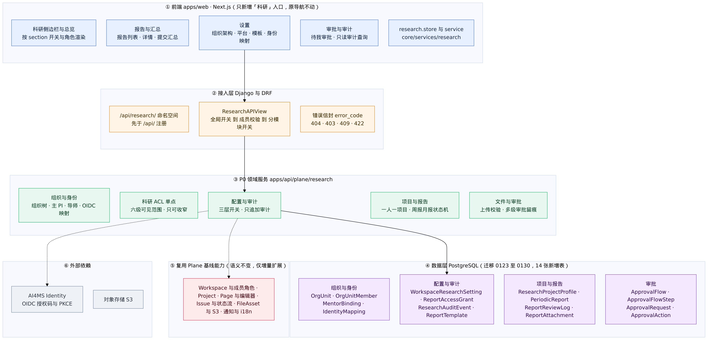
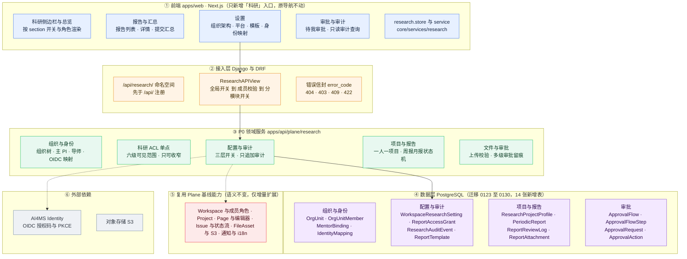
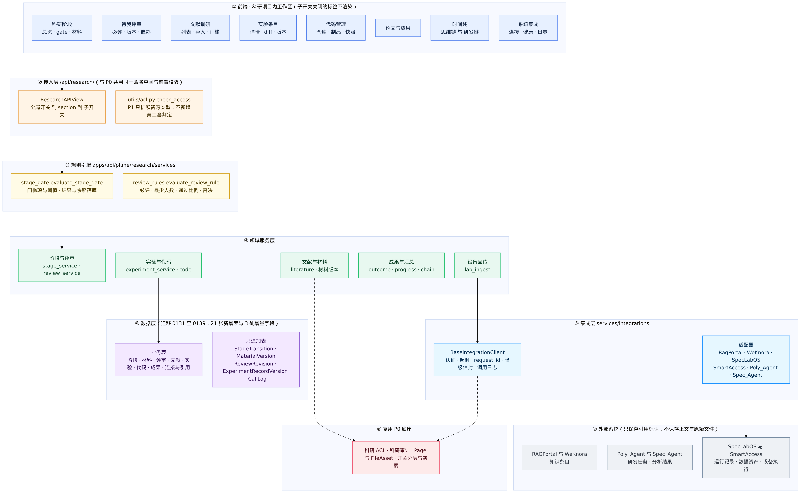
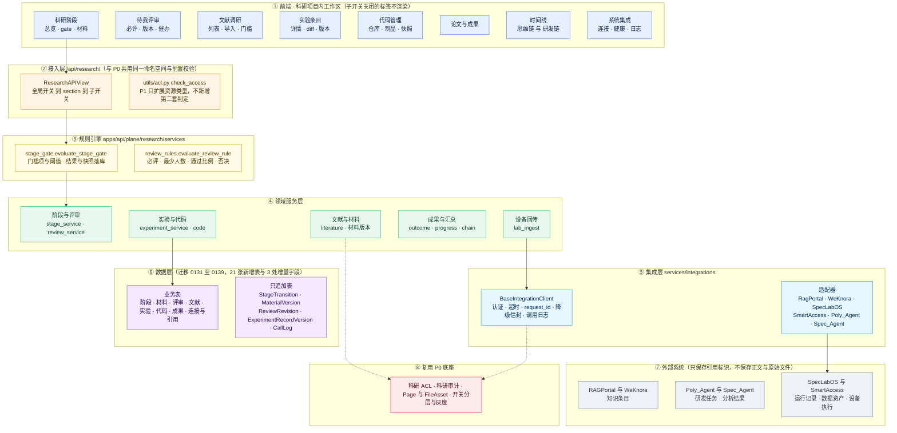
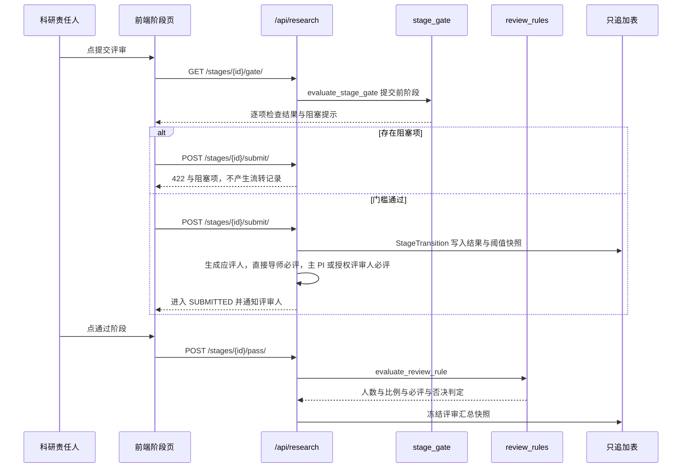
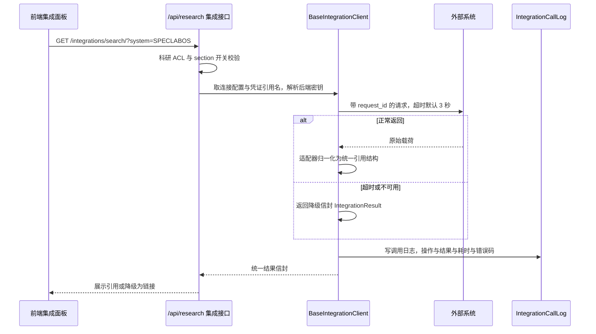
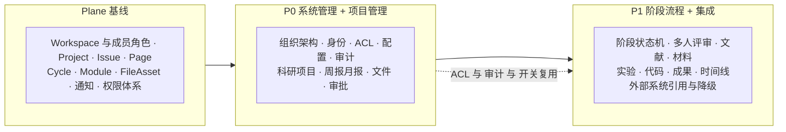

# Plane for AI4MS 科研管理 P0 / P1 功能整理与技术架构图

| 项目     | 内容                                                                                                  |
| -------- | ----------------------------------------------------------------------------------------------------- |
| 文档状态 | 已评审 / 随实现同步维护                                                                               |
| 文档版本 | v1.0                                                                                                  |
| 日期     | 2026-09-16                                                                                            |
| 覆盖范围 | P0（`2.0.1 → 2.1.0`）与 P1（`2.1.0 → 2.2.1`）已交付实现                                               |
| 事实来源 | 代码优先；本文与开发 PRD 冲突时以代码为准，并回写对应 PRD                                             |
| 上游依据 | [`research-management-prd-roadmap.md`](./research-management-prd-roadmap.md)、各期开发 PRD 与发布说明 |

本文做两件事：

1. 把 P0 / P1 已交付的能力按模块整理成一张可对照的清单（需求编号 → 能力 → 数据模型 → 接口 → 开关）。
2. 为 P0、P1 各画一张技术架构图（Mermaid 源码 + 渲染图），说明分层职责与关键调用链。

需求编号口径：`P0-<模块>-<序号>` 与 `P1-<模块>-<序号>`，与开发 PRD §3 和验收报告一一对应。
P0 覆盖 89 条需求编号，P1 覆盖 145 条需求编号，合计 234 条。

## 1. 功能整理

### 1.1 P0 功能清单（系统管理 + 项目管理，89 条）

| 模块        | 编号（条数）      | 交付能力                                                                                                             | 关键数据模型                                                            | 主要接口 / 页面                                                                 | 开关                |
| ----------- | ----------------- | -------------------------------------------------------------------------------------------------------------------- | ----------------------------------------------------------------------- | ------------------------------------------------------------------------------- | ------------------- |
| 组织架构    | ORG-01~09（9）    | Workspace 级组织树、成员归属、组织角色、课题组主 PI、直接导师、关系有效期、软删除、审计                              | `OrgUnit`、`OrgUnitMember`、`MentorBinding`                             | `/org-units/`、`/org-units/{id}/members/`、`/org-units/{id}/pi/`、`/mentors/`   | `org_enabled`       |
| 账号与身份  | ID-01~08（8）     | AI4MS OIDC 登录（授权码 + PKCE）、映射优先级 `sub` > `email` > `employee_id`、自动建号、冲突拒绝、本地回退、门户回跳 | `IdentityMapping`                                                       | `/identity/me/`、`/identity/mappings/`、`authentication/provider/oauth/oidc.py` | `OIDC_*` 环境变量   |
| 权限基础    | ACL-01~10（10）   | 统一 ACL 入口、六级可见范围、只可收窄、自定义授权边界、附件同权、列表与详情与下载统一过滤、普通对象不受影响          | `ReportAccessGrant`                                                     | `utils/acl.py::check_access()`、`/reports/{id}/access/`                         | 跟随模块开关        |
| 平台配置    | CFG-01~08（8）    | 全局 / Workspace / 分模块三层开关、科研独立文件限制、报告模板、时区、多进行中项目策略、配置审计                      | `WorkspaceResearchSetting`、`ReportTemplate`                            | `/settings/`、`/report-templates/`                                              | `module_enabled` 等 |
| 审计基础    | AUD-01~06（6）    | 只追加审计事件、模型层禁止改删、必写事件清单、管理员查询、保留期可配                                                 | `ResearchAuditEvent`                                                    | `/audit-events/`、`utils/audit.py::record_audit_event()`                        | 跟随模块开关        |
| 科研项目    | PRJ-01~08（8）    | 一人一科研 Project（与 Plane Project 一对一）、项目类型、成员角色映射、可标识可筛选、归档与恢复                      | `ResearchProjectProfile`                                                | `/projects/`、`/projects/{id}/archive/`、`/projects/{id}/restore/`              | 跟随模块开关        |
| 周报 / 月报 | RPT-01~12（12）   | ISO 周 / 自然月周期、唯一性、补交标记、状态机、提交只读、退回必填原因、验收终态、历史不可覆盖、通知                  | `PeriodicReport`、`ReportReviewLog`                                     | `/reports/`、`/reports/{id}/{submit,return,accept,history,access}/`             | `report_enabled`    |
| 文件能力    | FILE-01~08（8）   | 正文图片、PDF 附件、Markdown 导入为正文、MIME 与扩展名与大小与文件头校验、同权保护、原上传行为不变                   | `ReportAttachment`                                                      | `/reports/{id}/attachments/`、`/attachments/presign/`、`/import-markdown/`      | 科研独立限制        |
| 办公审批    | APR-01~07（7）    | 复用 Issue 作为审批对象、任务与采购审批类型、多级与或签与会签、逐级留痕、撤回与作废                                  | `ApprovalFlow`、`ApprovalFlowStep`、`ApprovalRequest`、`ApprovalAction` | `/approval-flows/`、`/approval-requests/`、`/approval-requests/{id}/{action}/`  | `approval_enabled`  |
| 科研 UI     | UI-01~08（8）     | 新增「科研」一级入口、报告列表筛选、报告详情、组织设置、提交汇总看板、权限隐藏、开关降级、原导航不动                 | —                                                                       | `/research/**` 页面、`research-sidebar-items.tsx`                               | 跟随 section 开关   |
| 通用兼容    | COMPAT-01~05（5） | 原功能回归、接口向下兼容、权限不串扰、文件限制隔离、开关可回滚                                                       | —                                                                       | 既有 Workspace / Project / Issue / Page / Cycle / Module 契约测试               | 全局开关可回滚      |

### 1.2 P1 功能清单（阶段流程 + 已有系统集成，145 条）

| 模块              | 编号（条数）      | 交付能力                                                                                                                              | 关键数据模型                                                                                                    | 主要接口 / 页面                                                                                        | 开关                  |
| ----------------- | ----------------- | ------------------------------------------------------------------------------------------------------------------------------------- | --------------------------------------------------------------------------------------------------------------- | ------------------------------------------------------------------------------------------------------ | --------------------- |
| 阶段状态机与 gate | STG-01~13（13）   | 固定四阶段、禁止跳阶、单活跃阶段、提交前预检、门槛可配置、门槛快照、管理员 reopen、流转只追加、项目状态联动                           | `ResearchStageInstance`、`StageTransition`、`ResearchStageRequirement`、`StageMaterial`、`StageMaterialVersion` | `/projects/{id}/stages/`、`/stages/{id}/{enter,submit,return,pass,reopen,gate,transitions}/`           | `stage_enabled`       |
| 多人评审          | REV-01~12（12）   | 直接导师必评、主 PI 或授权评审人、最少 3 人、通过比例、直接导师否决即不通过、评审不可静默修改、重提后失效、催办                       | `StageReviewerAssignment`、`StageReview`、`StageReviewRevision`                                                 | `/stages/{id}/reviewers/`、`/stages/{id}/reviews/`、`/reviews/`、`/reviews/{id}/revise/`               | `stage_enabled`       |
| 预开题与文献      | LIT-01~12（12）   | 文献登记全字段、四态流转、纳入数量不少于 20、总数不超过 100、纳入必须有摘要与 gap 笔记、DOI 去重、批量导入                            | `LiteratureEntry`                                                                                               | `/projects/{id}/literature/`、`/literature/import/`、`/literature/{id}/status/`、`/threshold/`         | `stage_enabled`       |
| 开题与研究计划    | OPN-01~10（10）   | 10 项材料清单、至少 1 条实验记录、至少 1 个代码仓库、正文复用 Page、版本留痕、防静默覆盖、管理员代改、模板变量                        | `StageMaterial`、`StageMaterialVersion`                                                                         | `/stages/{id}/materials/`、`/materials/{id}/submit/`、`/materials/{id}/override/`                      | `stage_enabled`       |
| 中期检查          | MID-01~08（8）    | 7 项材料清单、至少 1 条已完成实验、未完成实验必须有状态说明、进展汇总只读引用、汇总不放大可见范围                                     | 复用实验 / 代码 / 报告 / 文献                                                                                   | `/projects/{id}/progress/`                                                                             | `stage_enabled`       |
| 结题与成果        | FIN-01~08（8）    | 7 项结题材料、成果登记六类型、成果门槛、成果关联双向可查、研发链引用清单导出、项目收口只读沉淀                                        | `ResearchOutcome`、`ResearchOutcomeLink`                                                                        | `/projects/{id}/outcomes/`、`/outcomes/{id}/links/`                                                    | `stage_enabled`       |
| 实验条目          | EXP-01~14（14）   | 逐条登记且序号唯一、来源区分人工与自动、运行后关键字段锁定、修改必须走修订审批、版本不可变、失败实验只归档                            | `ExperimentRecord`、`ExperimentRecordVersion`、`ExperimentAmendment`、`ExperimentAssetLink`                     | `/projects/{id}/experiments/`、`/experiments/{id}/{status,submit,archive,versions,assets,amendments}/` | `experiment_enabled`  |
| 代码管理          | CODE-01~10（10）  | 外部仓库登记、五类提供方、commit 与 branch 与 tag 关联、快照上传（默认 500MB）、制品关联实验、同步失败降级、凭证只存引用名            | `ProjectCodeRepository`、`CodeArtifact`                                                                         | `/projects/{id}/code-repositories/`、`/code-repositories/{id}/{sync,snapshots,artifacts}/`             | `code_enabled`        |
| 集成基础层        | INT-01~12（12）   | 连接配置、HMAC 与 Bearer 与 OIDC 认证、只存引用、统一外部引用模型、权限取交集、超时降级、缓存带权限维度、调用留痕、后端代理           | `ExternalSystemConnection`、`ResearchExternalReference`、`ExternalReferenceLink`、`IntegrationCallLog`          | `/integrations/`、`/integrations/{health,search,call-logs}/`、`/external-references/`                  | `integration_enabled` |
| 知识库对接        | KB-01~08（8）     | 引用 RAGPortal 与 WeKnora 条目、统一检索入口、权限只可收窄、不建索引与问答、可挂到报告与材料、标注归属系统、不可用时降级为链接        | 复用外部引用模型                                                                                                | `/knowledge/entries/`、`/integrations/search/`                                                         | `integration_enabled` |
| 湿实验与设备对接  | LAB-01~08（8）    | 引用 SpecLabOS 运行记录与数据资产、引用 SmartAccess 设备执行与 `run_trace`、自动记录标记 `AUTOMATED` 与待补、源不可用时手动登记仍可用 | `ExperimentAssetLink`                                                                                           | `/lab/runs/`、`/lab/assets/`、`/lab/device-executions/`、`/experiments/ingest/`                        | `integration_enabled` |
| 研发平台对接      | RD-01~07（7）     | 引用 Poly_Agent 项目与任务、引用 Spec_Agent 分析结果、多版本保留、只读引用不重算                                                      | 复用外部引用模型                                                                                                | `/rd/projects/`、`/rd/analyses/`                                                                       | `integration_enabled` |
| 思维链 / 研发链   | CHAIN-01~07（7）  | 双链聚合视图、时间线顺序、来源覆盖阶段与评审与报告与实验与代码与成果、只引用不复制、按源 ACL 过滤、清单导出                           | 只读聚合                                                                                                        | `/projects/{id}/timeline/`、`/projects/{id}/chain/`、`/chain/export/`                                  | 跟随子开关            |
| 科研 UI           | UI-01~09（9）     | 项目内导航（阶段与文献与实验与代码与时间线与成果）、阶段页、评审页、实验 diff、代码页、集成标注、权限与降级、i18n                     | —                                                                                                               | `research-project-nav.tsx`、`/research/projects/{id}/**`                                               | 跟随子开关            |
| 通用兼容          | COMPAT-01~07（7） | Page 与附件与搜索与通知与项目管理不回归、接口向下兼容、开关可回滚                                                                     | —                                                                                                               | 回归矩阵与契约测试                                                                                     | 子开关可回滚          |

### 1.3 两期边界与关键差异

| 维度         | P0                                   | P1                                                      |
| ------------ | ------------------------------------ | ------------------------------------------------------- |
| 主题         | 把人和组织管起来，把项目和周报跑起来 | 把科研流程管起来，并把已有系统接进来                    |
| 是否含 AI    | 不含（智能体权限模型仅设计，不落地） | 不含（AI 能力整体留在 P3）                              |
| 新增数据表   | 14 张（迁移 `0123` ~ `0130`）        | 21 张 + 3 处既有表增量字段（迁移 `0131` ~ `0139`）      |
| 外部依赖     | AI4MS Identity（OIDC）、S3           | 追加 6 个业务系统，全部经后端代理并支持降级             |
| 状态权威源   | Plane（报告、审批）                  | 阶段与实验与代码在 Plane；实验原始数据以 SpecLabOS 为准 |
| 覆盖需求编号 | 89 条                                | 145 条                                                  |

## 2. P0 技术架构图

### 2.1 架构图





### 2.2 分层说明

| 层           | 职责                                                                                               | 不做什么                                       |
| ------------ | -------------------------------------------------------------------------------------------------- | ---------------------------------------------- |
| ① 前端       | 只新增科研入口与页面；按 section 开关与角色渲染菜单；越权只做隐藏                                  | 不移动、不删除原有导航；不把权限结论缓存在前端 |
| ② 接入层     | 全局开关前置拦截；Workspace 解析与非 Guest 成员校验；统一 error_code 信封；`/api/research/` 先注册 | 不把业务规则写在视图里                         |
| ③ 领域服务层 | 组织与身份、科研 ACL、配置与审计、项目与报告、文件与审批五个功能域；ACL 与审计是全局单点           | 不新建平行项目、富文本、工单系统               |
| ④ 数据层     | 14 张新增表，均带 workspace 归属与软删除语义；审计表只追加                                         | 不修改既有表语义，破坏性迁移一律禁止           |
| ⑤ 复用基线   | Project、Page、Issue、FileAsset、通知与权限体系继续承担通用能力                                    | 科研 ACL 不作用于此层对象                      |
| ⑥ 外部依赖   | 仅身份（OIDC）与对象存储两类                                                                       | 不引入 AI 或业务系统依赖                       |

### 2.3 关键调用链

1. **报告提交链**：前端报告详情 → `POST /reports/{id}/submit/` → 全局开关 → Workspace 成员校验 → `acl.check_access` → 状态机校验（仅 `DRAFT` 与 `NEEDS_REVISION` 可提交）→ 写 `ReportReviewLog` 与科研审计 → 通知导师与主 PI。
2. **附件下载链**：`GET /reports/{id}/attachments/presign/` → 同一 ACL 判定 → 生成有时效的签名 URL → 下载入口再次校验对象 ACL（P0-ACL-06）。
3. **身份登录链**：前端 OIDC 跳转 → AI4MS Identity → 回调 `authentication/provider/oauth/oidc.py` → `utils/identity.py` 按 `sub` 与 `email` 与 `employee_id` 的优先级命中 `IdentityMapping` → 建立会话或按策略自动建号 → 写 `identity.login` 审计。
4. **越权旁路防护链**：普通 Page 接口读取报告正文 → `utils/page_guard.py` 判定为科研报告并拒绝，不落回通用 Public 与 Private 语义（P0-ACL-08）。

## 3. P1 技术架构图

### 3.1 架构图





### 3.2 分层说明

| 层         | 职责                                                                                 | 约束                                                        |
| ---------- | ------------------------------------------------------------------------------------ | ----------------------------------------------------------- |
| ① 前端     | 项目内六个标签页、评审箱、集成配置；展示 gate 阻塞项、修订 diff、降级提示            | 外部入口必须标注归属系统，不能让用户误以为可在 Plane 内编辑 |
| ② 接入层   | 复用 P0 的命名空间、开关前置与错误信封，追加 section 与 P1 子开关                    | 不新增第二套 ACL 判定                                       |
| ③ 规则引擎 | stage_gate 判门槛、review_rules 判评审；门槛项与阈值来自配置，结果与阈值快照一起落库 | 规则不内联在视图层；历史流转保留旧阈值快照                  |
| ④ 领域服务 | 阶段、评审、文献、实验、代码、成果、进展汇总、时间线、设备回传                       | 修改已提交事实必须走修订或代改流程并留痕                    |
| ⑤ 集成层   | 六个外部系统适配器；统一认证、超时、缓存、降级信封与调用日志                         | 只保存外部 ID 与标题与摘要与链接；前端不直连外部系统        |
| ⑥ 数据层   | 21 张新增表与 3 处既有表增量字段；五类只追加表                                       | 回滚场景下只追加表一律不删除                                |
| ⑦ 外部系统 | 知识库、湿实验与设备、研发平台                                                       | Plane 不做算法、计算、谱学解析与设备控制                    |
| ⑧ P0 底座  | ACL、审计、Page 与 FileAsset、开关分层                                               | P1 不重写这些能力                                           |

### 3.3 关键调用链：阶段提交与通过



### 3.4 关键调用链：外部引用读取与降级



## 4. 两期关系



P1 不新起一套底座：ACL、审计、开关、Page 与 FileAsset 全部沿用 P0，新增的是规则引擎、领域服务与集成适配器。

## 5. 开关与降级速查

| 层级         | 位置                                                                               | 关闭后的行为                                          |
| ------------ | ---------------------------------------------------------------------------------- | ----------------------------------------------------- |
| 全局总开关   | `RESEARCH_MODULE_ENABLED`（仅 `1` 视为开启）                                       | 科研接口返回 404 `research_module_disabled`，入口隐藏 |
| Workspace    | `WorkspaceResearchSetting.module_enabled`（未建行时跟随全局总开关，默认渲染）      | 该工作区回到接入前行为                                |
| P0 子开关    | `org_enabled` 与 `report_enabled` 与 `approval_enabled`                            | 对应功能域入口与接口不可用                            |
| P1 子开关    | `stage_enabled` 与 `experiment_enabled` 与 `code_enabled` 与 `integration_enabled` | 对应标签页不渲染，数据保留                            |
| 集成连接开关 | `ExternalSystemConnection.is_enabled`（按系统）                                    | 引用降级为链接，阶段与实验主流程继续可用              |

降级口径：外部系统超时默认 3 秒，缓存默认 300 秒且 key 含权限维度，降级模式默认 `link_only`（仅保留链接展示）。

## 6. 图的生成方式

两张 PNG 由本文档 §2.1 与 §3.1 的 Mermaid 源码渲染。架构调整后请重新生成，避免图文不一致：

`mmdc.json`（中文字体与布局参数）：

```json
{
  "theme": "base",
  "themeVariables": { "fontFamily": "Droid Sans Fallback, DejaVu Sans, sans-serif", "fontSize": "15px" },
  "flowchart": { "nodeSpacing": 30, "rankSpacing": 75, "useMaxWidth": false }
}
```

```bash
# 把 §2.1 / §3.1 的 mermaid 代码块分别存为 research-p0-architecture.mmd 与 research-p1-architecture.mmd
npx -y @mermaid-js/mermaid-cli -i research-p0-architecture.mmd -o docs/research-p0-architecture.png -b white -s 2 -c mmdc.json
npx -y @mermaid-js/mermaid-cli -i research-p1-architecture.mmd -o docs/research-p1-architecture.png -b white -s 2 -c mmdc.json
```

字体说明：导出 PNG 时必须显式指定含中文字形的字体（如 `Droid Sans Fallback`），否则中文会渲染为乱码。

## 7. 变更记录

| 版本 | 日期       | 变更内容                                                              | 作者 |
| ---- | ---------- | --------------------------------------------------------------------- | ---- |
| v1.0 | 2026-09-16 | 首版：P0 与 P1 功能清单整理，两期技术架构图、关键调用链、开关降级速查 | —    |
