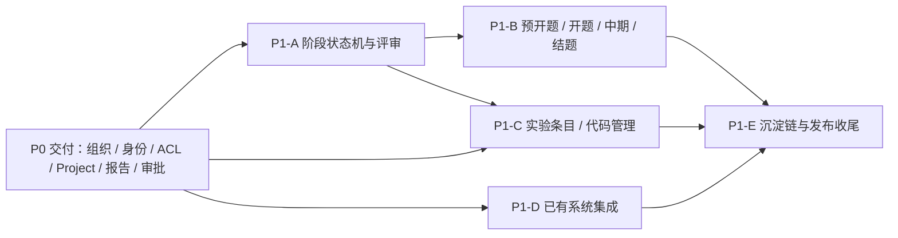

# Plane for AI4MS 科研管理 P1 开发 PRD（分阶段开发执行版）

| 项目     | 内容                                                                                                                   |
| -------- | ---------------------------------------------------------------------------------------------------------------------- |
| 文档名称 | Plane for AI4MS 科研管理 P1 开发 PRD                                                                                   |
| 文档版本 | v1.0                                                                                                                   |
| 文档状态 | Draft / 待评审                                                                                                         |
| 日期     | 2026-09-15                                                                                                             |
| 上游依据 | [`research-management-prd-roadmap.md`](./research-management-prd-roadmap.md) §5.2（P1 范围）、§6.4–§6.10、§7 Phase 5–6 |
| 前置文档 | [`research-p0-development-prd.md`](./research-p0-development-prd.md) v1.1（P0 已实现）                                 |
| 代码基线 | `develop` 分支，工作区版本 `2.1.0`，`plane.db` 迁移编号至 `0130`                                                       |
| 文档定位 | 把路线图 P1 范围拆解为可排期、可开发、可验收的开发规格                                                                 |
| 变更范围 | 本轮仅新增本文档，不修改业务代码、数据库结构与部署配置                                                                 |
| 术语约束 | 课题组负责人统一写作 **课题组主 PI**，禁止硬编码任何具体人名                                                           |

## 0. 文档定位与阅读方式

本仓库现有三份文档，职责不同，不要混用：

| 文档                                                                         | 回答的问题                                | 覆盖范围              |
| ---------------------------------------------------------------------------- | ----------------------------------------- | --------------------- |
| [`research-management-prd-roadmap.md`](./research-management-prd-roadmap.md) | 做什么、什么优先级、生态边界在哪          | P0–P3 全景            |
| [`research-p0-development-prd.md`](./research-p0-development-prd.md)         | P0 怎么做、分几步、每步交付什么           | 仅 P0（已实现，v1.1） |
| 本文档                                                                       | P1 怎么做、分几步、每步交付什么、如何验收 | 仅 P1                 |

阅读建议：

- 产品与业务方：§1、§3、§7、§13。
- 后端开发：§2、§4、§5、§7。
- 前端开发：§2、§5.1、§6、§7。
- 集成与联调：§2.3、§3.9–§3.12、§4.7、§5.7、§12。
- 测试与质量：§3、§7、§9、§13。
- 部署与运维：§2、§10、§14。

约束优先级：P1 范围内若本文档与路线图冲突，以本文档为准，并回溯修订路线图；若本文档与 P0 开发 PRD 的既有实现描述冲突，以 P0 文档 §16（实现回写记录）与工作区实测为准。本文档未决事项集中登记在 §12，未被决策覆盖前不进入开发排期。

## 1. 项目概述

### 1.1 P1 定位

P0 已交付"系统管理 + 项目管理"闭环：组织架构、AI4MS SSO / OIDC、科研 ACL、个人科研 Project、周报 / 月报、办公审批，以及科研开关与审计底座。P1 在此之上补齐两件事：

1. **科研主线**：把预开题 → 开题 → 中期 → 结题变成受控的阶段流程，每个阶段有材料清单、门槛（gate）、多人评审与不可篡改的留痕。
2. **专业系统集成**：把 AI4MS 生态中已有的知识库、湿实验、设备、高分子研发、谱学分析系统以"外部引用"方式接入，Plane 只做聚合、权限映射与入口跳转，不重复建设。

P1 完成后，一名科研责任人从进组到毕业的全过程应可在 Plane 内被追溯：文献如何调研、开题如何论证、实验如何执行、代码如何迭代、中期如何检查、结题提交了哪些材料，以及各环节引用了哪些外部系统的权威数据。**P1 仍不包含任何与 AI 结合的功能**，AI 评分、AI 辅助写作、智能体调用与记忆共享统一推迟到 P3。

### 1.2 P1 目标与成功判据

| 编号 | 目标           | 成功判据（可验证）                                                                   |
| ---- | -------------- | ------------------------------------------------------------------------------------ |
| G1   | 阶段流程受控   | 预开题 → 开题 → 中期 → 结题只能顺序推进，跳过、倒序与静默重置均被拒绝                |
| G2   | 门槛可解释     | 每次提交返回结构化 gate 检查结果，未通过项逐条给出原因与修复指引，门槛数值由配置决定 |
| G3   | 多人评审闭环   | 直接导师必评、主 PI 或授权评审人参与、按规则判定通过；评审提交后不可静默修改         |
| G4   | 阶段材料留痕   | 阶段材料与研究计划支持版本留痕，人工修改生成新版本而非覆盖旧版本                     |
| G5   | 实验条目受控   | 实验逐条登记，关键字段提交后锁定，修改必须走审批并生成不可变版本                     |
| G6   | 代码可溯源     | 可登记外部 Git 仓库并关联 commit / branch / tag / 快照，Plane 不承担 Git 托管        |
| G7   | 已有系统可集成 | 知识库、湿实验、设备、研发平台、谱学分析以引用方式可见，Plane 不落库正文与原始文件   |
| G8   | 集成可降级     | 外部系统不可用时 Plane 主流程仍可用，界面明示归属系统与降级状态                      |
| G9   | 沉淀链可追溯   | 每个科研 Project 生成思维链与研发链两条聚合视图，可见性按源对象 ACL 过滤             |
| G10  | 通用功能不回归 | 普通 Page、附件、搜索、通知、Project 管理与 P0 行为一致，接口向下兼容                |

### 1.3 P1 范围

| 模块           | P1 范围                                                     |
| -------------- | ----------------------------------------------------------- |
| 科研阶段       | 预开题 → 开题 → 中期 → 结题（阶段状态机与 gate）            |
| 预开题         | 文献登记、数量门槛、提交与评审                              |
| 开题           | 材料清单、实验参与要求、代码仓库登记、人工修改留痕          |
| 中期           | 材料清单、进展汇总、评审                                    |
| 结题           | 材料汇总、论文与成果登记                                    |
| 多人评审       | 直接导师必评、主 PI 或授权评审人参与                        |
| 实验条目       | 科研管理口径的实验条目、字段锁定、修改审核与版本留痕        |
| 代码管理       | 外部 Git 仓库登记、commit / branch / 快照关联               |
| 知识库对接     | 引用 RAGPortal / WeKnora 条目，做权限映射，不自建索引与门户 |
| 设备与实验对接 | 引用 SpecLabOS 运行记录与数据资产，不存原始数据             |
| 研发平台对接   | 引用 Poly_Agent 项目与任务、Spec_Agent 分析结果             |
| 通用兼容       | 普通 Page、附件、搜索、通知、项目管理继续可用               |

P1 首批（优先完成）顺序：

```text
科研阶段状态机与 gate
  → 多人评审
    → 预开题（文献数量门槛）
      → 开题（材料清单 + 实验参与 + 代码登记）
        → 中期（进展汇总 + 评审）
          → 结题（材料汇总 + 成果登记）
            ↘ 实验条目与代码管理（与阶段流程并行推进）
              ↘ 已有系统集成（引用模型 + 权限映射 + 降级）
```

依赖关系：



### 1.4 P1 不包含

以下内容明确不在 P1 交付范围内，不得以"顺手实现"为由进入 P1 排期：

- AI 创新性评分与迭代评分历史（P3）。
- AI 辅助研究计划、AI 论文写作辅助、人机回环决策留痕（P3）。
- 智能体统一授权、后端代理调用与 `AgentCallLog`（P3；P1 的外部系统连接是确定性 API 集成，不是智能体调用）。
- 课题组主 PI 记忆共享（P3）。
- 自建知识库、文档上传门户、向量索引、RAG 问答、知识图谱增强（归 RAGPortal / WeKnora）。
- 自建 Git 托管、代码仓库镜像与完整历史克隆（P1 只登记引用与快照）。
- 湿实验执行、设备控制、工作流编排与原始数据入库（归 SpecLabOS / SmartAccess）。
- 高分子计算、DoE、算法包与垂类预测（归 Poly_Agent）。
- 谱学数据解析（GPC / NMR / IR / Raman / LCMS，归 Spec_Agent）。
- 在 Plane 内保存实验原始数据、设备数据资产与外部系统正文副本。
- 高阶看板（课题组进度、风险、提交率）与移动端响应式交付（P2）。
- 学校组织架构自动同步与阶段材料 PDF 归档导出（P2，除 §3.13 声明的引用清单导出外）。

### 1.5 P1 角色

P1 不新增组织角色，只启用 P0 已保留的角色位并补充阶段场景职责：

| 角色            | 说明             | P1 能力                                                            |
| --------------- | ---------------- | ------------------------------------------------------------------ |
| Workspace Admin | 平台管理员       | 配置阶段门槛与评审规则、集成连接；执行例外流程；查看全量汇总与审计 |
| Unit Admin      | 组织节点管理员   | 管理本节点成员；参与授权范围内阶段评审；查看授权范围内阶段汇总     |
| 课题组主 PI     | 课题组负责人     | 必评角色之一；审核实验修改；参与阶段通过判定；授权评审人           |
| 直接导师        | 学生直接指导老师 | 必评角色；审核实验修改；查看被指导学生全流程材料                   |
| Reviewer        | 评审人           | P1 启用：参与预开题 / 开题 / 中期 / 结题评审（含主 PI 授权评审人） |
| Research Owner  | 科研责任人       | 提交阶段材料与实验、登记代码仓库、发起修改申请、登记论文与成果     |
| Guest           | 普通访客         | 默认无科研模块任何权限，阶段与材料不可见                           |

角色规则：

- 课题组主 PI 与直接导师是**组织关系**角色，不绑定姓名；阶段评审规则按角色计算，不按人计算。
- 主 PI 可授权本组其他成员作为授权评审人参与阶段评审，授权范围与有效期可配置、可撤销。
- 一名用户同时具备多个角色时按最高权限计算，但不得评审自己提交的阶段。

### 1.6 P1 术语

| 术语       | 定义                                                                    |
| ---------- | ----------------------------------------------------------------------- |
| 阶段实例   | 一个科研 Project 上一个具体阶段的运行实例（`ResearchStageInstance`）    |
| 门槛 gate  | 阶段提交前必须满足的可配置条件集合，检查结果可复现、可解释              |
| 阶段材料   | 阶段要求提交的材料条目，正文复用 Page，附件复用 FileAsset               |
| 评审规则   | 判定阶段是否通过的一组条件：必评角色、最少人数、通过比例、否决规则      |
| 授权评审人 | 由主 PI 或管理员指定、在有效期内代替主 PI 参与评审的成员                |
| 实验条目   | 科研管理口径的实验记录，只保存管理字段与外部数据引用，不保存原始数据    |
| 实验修订   | 对已提交实验的字段修改申请（`ExperimentAmendment`），审批后生成新版本   |
| 外部引用   | 指向其他系统对象的只读引用（id + 元数据 + 链接），不复制正文与原始文件  |
| 降级       | 外部系统不可用或超时时，Plane 返回只读链接与明示状态，不阻塞主流程      |
| 思维链     | 认知与决策轨迹的聚合视图：文献 → 预开题 → 开题 → 研究计划 → 中期 → 结题 |
| 研发链     | 产出与数据轨迹的聚合视图：实验 → 代码 → 结果指标 → 论文 / 成果          |
| 快照       | 代码仓库在某时间点的归档包（zip / tar），仅作留痕，不用于日常开发回滚   |

## 2. 交付基线与技术约束

### 2.1 代码基线（写作时核对）

| 项           | 现状                                                                                                              |
| ------------ | ----------------------------------------------------------------------------------------------------------------- |
| 工作区版本   | `2.1.0`（根 `package.json`、`apps/web`、`apps/api`、`packages/ui` 一致）                                          |
| 数据库迁移   | `apps/api/plane/db/migrations` 最新为 `0130_research_approvals.py`，P1 新迁移从 `0131` 起                         |
| 后端科研模块 | `apps/api/plane/research/`（views / serializers / permissions / utils）、`apps/api/plane/db/models/research/`     |
| 后端路由     | `apps/api/plane/research/urls.py`，前缀 `/api/research/workspaces/<slug>/`，另有 `/api/research/health/`          |
| 前端科研模块 | `apps/web/core/components/research/`、`core/services/research/`、`core/store/research/`                           |
| 前端路由     | `apps/web/app/(all)/[workspaceSlug]/(projects)/research/...`（reports / projects / approvals / settings / audit） |
| 共享常量     | `packages/constants/src/research.ts`（导航项、端点、枚举顺序）                                                    |
| 共享类型     | `packages/types/src/research.ts`                                                                                  |
| 文案         | `packages/i18n/src/locales/*/common.json` 的 `research.*` 命名空间                                                |
| 测试入口     | `apps/api/plane/tests/{unit,contract}/`（含 `tests/unit/research/`、`tests/contract/app/test_research_*.py`）     |

P0 已交付且 P1 必须复用、不得重写的部分：

| 能力         | P0 交付物                                                                          |
| ------------ | ---------------------------------------------------------------------------------- |
| 组织与角色   | `OrgUnit` / `OrgUnitMember` / `MentorBinding`，`OrgUnitMember.org_role`            |
| 科研 ACL     | `apps/api/plane/research/utils/acl.py`：`check_access` 统一判定入口                |
| 审计         | `ResearchAuditEvent`（只追加），`utils/audit.py` 写入工具                          |
| 平台配置     | `WorkspaceResearchSetting` + `utils/settings.py`（含 `sections` 计算）             |
| 科研 Project | `ResearchProjectProfile`                                                           |
| 报告         | `PeriodicReport` / `ReportReviewLog` / `ReportAccessGrant`（可复用的版本留痕范式） |
| 附件         | `ReportAttachment` + S3 预签名直传链路                                             |
| 办公审批     | `ApprovalFlow` / `ApprovalFlowStep` / `ApprovalRequest` / `ApprovalAction`         |
| 模板         | `ReportTemplate`（P1 需扩展为阶段材料与实验模板）                                  |
| 前端外壳     | 科研侧边导航、`ResearchGuard`、错误文案映射、科研 store 与 service 分层            |

### 2.2 复用能力与落点

P1 全部功能建立在既有能力之上，新增代码只做"叠加"，不做"替换"。

| 能力       | 既有实现                                   | P1 用法                                                     |
| ---------- | ------------------------------------------ | ----------------------------------------------------------- |
| 材料正文   | `Page` + 编辑器                            | 阶段材料正文复用 Page，不新增编辑器                         |
| 附件与存储 | `FileAsset` + S3 预签名直传                | 文献 PDF、证明附件、代码快照复用同一链路与科研限制          |
| 权限判定   | `research/utils/acl.py`                    | 阶段、文献、实验、引用统一走 `check_access`，不新增判定分支 |
| 审计       | `ResearchAuditEvent` + `utils/audit.py`    | 阶段流转、评审、实验修订、集成调用与降级全部写审计          |
| 通知       | 现有 notification 模型与通知中心           | 阶段提交 / 退回 / 通过、评审指派、实验修订结果复用既有链路  |
| 模板       | `ReportTemplate`                           | 扩展 `scope` / `material_type` 后可覆盖阶段材料与实验模板   |
| 科研开关   | `RESEARCH_MODULE_ENABLED` + Workspace 开关 | 新增子开关（阶段 / 实验 / 代码 / 集成）叠加在既有层级上     |
| 项目与成员 | `Project` / `ProjectMember`                | 阶段流程作用于科研 Project，不改动项目成员权限语义          |
| 工作项     | `Issue` / `State`                          | 实验与阶段的待办可派生 Issue，但阶段状态独立于 Issue 状态流 |

### 2.3 技术约束

1. 增量扩展：不修改原有模型字段语义，不删除、不重命名既有字段与接口。
2. 科研接口统一挂 `/api/research/workspaces/<slug>/` 命名空间；P0 已有路径保持不变。
3. 迁移只做新增表、新增可空字段与新增索引，不做破坏性列变更；每个迁移可回滚。
4. 权限以后端计算为唯一来源，前端隐藏入口与外部系统入口都只是体验优化。
5. 科研 ACL 只作用于带科研元数据的对象；普通 Project、Issue、Page、附件继续走原权限链路。
6. 外部系统集成一律经 Plane 后端代理，前端不得直连外部系统，外部凭证不得进入前端产物。
7. 外部引用只保存标识与元数据，不保存正文与原始文件；跨系统展示按源对象 ACL 过滤。
8. 外部系统不可用时必须降级，超时上限默认 3 秒，任何集成故障不得阻塞阶段提交与实验登记。
9. 阶段状态机与 Issue 状态流完全独立；阶段推进不得修改项目内既有 Issue 状态。
10. 已提交的阶段材料、评审、实验版本与审计事件不可静默修改，只能通过显式流程生成新版本。
11. 所有界面文案、数据模型、接口、配置项不得出现任何具体 PI 姓名或固定昵称。
12. 保留上游 AGPL-3.0 版权与来源声明，新增文件沿用现有版权头格式。

### 2.4 代码落点规划

新增代码建议落点（供评审确认，最终以实施 PR 为准）：

```text
后端
  apps/api/plane/db/models/research/stage.py        阶段实例、流转、材料、门槛、评审
  apps/api/plane/db/models/research/literature.py   文献条目
  apps/api/plane/db/models/research/experiment.py   实验条目、版本、修订、数据引用
  apps/api/plane/db/models/research/code.py         代码仓库与代码制品
  apps/api/plane/db/models/research/integration.py  外部连接、外部引用、调用日志
  apps/api/plane/db/models/research/outcome.py      论文与成果登记
  apps/api/plane/db/migrations/0131_*.py            起，按阶段逐个新增
  apps/api/plane/research/views/{stages,reviews,literature,experiments,code,integrations,outcomes,chain}.py
  apps/api/plane/research/serializers/{stage,literature,experiment,code,integration,outcome}.py
  apps/api/plane/research/services/                 规则引擎与集成客户端
    stage_gate.py       门槛检查
    review_rules.py     评审规则判定
    integrations/       ragportal.py / speclabos.py / smartaccess.py / poly_agent.py / spec_agent.py
  apps/api/plane/research/utils/acl.py              扩展研究资源类型，不新增第二套判定

前端
  apps/web/app/(all)/[workspaceSlug]/(projects)/research/projects/[projectId]/{stages,literature,experiments,code,timeline,outcomes}/page.tsx
  apps/web/app/(all)/[workspaceSlug]/(projects)/research/{reviews,integrations}/page.tsx
  apps/web/core/components/research/{stages,literature,experiments,code,timeline,integrations,outcomes}/...
  apps/web/core/services/research/{stage,literature,experiment,code,integration,outcome}.service.ts
  packages/constants/src/research.ts                 新增导航项与端点
  packages/types/src/research.ts                     新增类型
  packages/i18n/src/locales/*/common.json            research.* 文案 key
```

命名约定：模型统一 `BaseModel` 派生（只追加表除外），序列化器统一 `Research*` 前缀，前端接口封装统一放 `core/services/research/`，规则引擎统一放 `research/services/`，不在视图层内联业务规则。

## 3. P1 功能需求规格

需求编号规则：`P1-<模块>-<序号>`，用于和开发阶段（§7）及验收清单（§13）互相对应。每条需求都必须可被测试用例覆盖；编号一旦分配不得复用，需求取消时保留编号并标注"已取消"。

### 3.1 科研阶段状态机与 gate

| 编号      | 需求          | 规则                                                                                            |
| --------- | ------------- | ----------------------------------------------------------------------------------------------- |
| P1-STG-01 | 固定阶段序列  | 阶段固定为 `PRE_OPENING / OPENING / MIDTERM / FINAL`，顺序不可配置、不可跳过                    |
| P1-STG-02 | 阶段实例      | 每个科研 Project 对应四个阶段实例，首次进入时创建并激活，重复创建返回 409                       |
| P1-STG-03 | 状态机        | `NOT_STARTED → IN_PROGRESS → SUBMITTED → PASSED`，`SUBMITTED → NEEDS_REVISION → IN_PROGRESS`    |
| P1-STG-04 | 禁止跳阶      | 前一阶段未 `PASSED` 时，进入后一阶段返回 409，并提示当前阻塞阶段                                |
| P1-STG-05 | 单活跃阶段    | 同一项目同一时刻最多一个阶段处于 `IN_PROGRESS / SUBMITTED / NEEDS_REVISION`                     |
| P1-STG-06 | 提交前预检    | `GET /stages/{id}/gate/` 返回逐项检查结果；带阻塞项提交返回 422 且不产生流转记录                |
| P1-STG-07 | 门槛可配置    | 门槛项与阈值来自 `ResearchStageRequirement` 与 Workspace 配置，数值可调整、可按节点覆盖         |
| P1-STG-08 | 门槛快照      | 每次 gate 检查把规则版本、阈值与结果写入 `StageTransition.metadata`，事后可复现                 |
| P1-STG-09 | 例外流程      | Workspace Admin 可 `reopen` 已通过阶段回到 `NEEDS_REVISION`，必填原因并审计；`FINAL` 需二次确认 |
| P1-STG-10 | 留痕不可改    | `StageTransition` 只追加，不提供更新与删除接口，模型层禁止覆盖与删除                            |
| P1-STG-11 | 项目状态联动  | `FINAL` 通过后 `ResearchProjectProfile.workflow_status` 置 `COMPLETED` 并写入 `completed_at`    |
| P1-STG-12 | 与 Issue 解耦 | 阶段流转不修改任何 Issue 状态；Issue 状态流变更不影响阶段状态                                   |
| P1-STG-13 | 通知          | 进入阶段、提交、退回、通过分别通知责任人、必评角色与项目关注者                                  |

各阶段 gate 默认项（全部可配置）：

| 阶段          | 默认阻塞项                                                                                    |
| ------------- | --------------------------------------------------------------------------------------------- |
| `PRE_OPENING` | `INCLUDED` 文献 ≥ 20 篇；每篇纳入文献有摘要与 gap 笔记；总数 ≤ 100；评审规则满足              |
| `OPENING`     | 10 项材料清单齐备；至少 1 条实验记录（`PLANNED` 及以上）；至少 1 个代码仓库登记；评审规则满足 |
| `MIDTERM`     | 7 项材料清单齐备；至少 1 条 `COMPLETED` 实验；未完成实验均有状态说明；评审规则满足            |
| `FINAL`       | 7 项材料清单齐备；至少 1 条成果登记；实验总表与代码快照齐备；导师评审意见已提交；评审规则满足 |

验收要点：

- 未通过预开题时直接提交开题返回 409，并返回阻塞阶段标识。
- gate 检查结果可复现：修改门槛阈值后，新提交使用新阈值，历史流转仍显示旧阈值快照。
- 通过 `reopen` 重置阶段后，原评审记录标记为失效但历史仍可查。

### 3.2 多人评审

| 编号      | 需求           | 规则                                                                                  |
| --------- | -------------- | ------------------------------------------------------------------------------------- |
| P1-REV-01 | 评审人指派     | 阶段提交时按规则生成应评人：直接导师必评、主 PI 或其授权评审人必评、可追加 `REVIEWER` |
| P1-REV-02 | 直接导师必评   | 存在有效 `MentorBinding` 的直接导师必须提交有效评审，否则为阻塞项                     |
| P1-REV-03 | 主 PI 或授权人 | 主 PI 未参与时，其有效期内授权评审人的评审视为满足该条件                              |
| P1-REV-04 | 最少评审人数   | 默认至少 3 名评审人提交有效评审，人数不足时 gate 不通过                               |
| P1-REV-05 | 通过判定       | 多数 `PASS` 且无直接导师 `REJECT` 且必评角色齐全，方可通过                            |
| P1-REV-06 | 评审建议       | 建议取值 `PASS / REJECT / REVISE`；`REVISE` 不计入通过，但意见必须保留                |
| P1-REV-07 | 不可静默修改   | 评审提交后不可覆盖；修改须通过 `revise` 生成新版本并填写原因                          |
| P1-REV-08 | 重提后评审失效 | 阶段材料重新提交时，既有评审标记 `superseded`，需重新收集评审                         |
| P1-REV-09 | 待我评审       | 提供 `scope=to_me` 列表，区分"必评"与"可选"，并支持催办                               |
| P1-REV-10 | 通过快照       | 阶段通过时冻结评审汇总（人数、建议分布、规则版本）到 `StageTransition.metadata`       |
| P1-REV-11 | 回避自己       | 提交人不得评审自己提交的阶段，返回 403                                                |
| P1-REV-12 | 评审通知       | 指派、催办、评审完成复用既有通知体系，不新增通知通道                                  |

验收要点：

- 3 人评审中直接导师未提交时，阶段不能通过并提示"直接导师评审缺失"。
- 直接导师提交 `REJECT` 时，即使其余评审人均 `PASS`，阶段仍不通过。
- 评审提交后修改意见，历史版本保留原意见与修改原因。

### 3.3 预开题与文献

| 编号      | 需求         | 规则                                                                                               |
| --------- | ------------ | -------------------------------------------------------------------------------------------------- |
| P1-LIT-01 | 文献登记字段 | 标题、作者、年份、期刊 / 会议、DOI、链接、PDF 附件、摘要、方法标签、体系标签、gap 笔记、相关性评分 |
| P1-LIT-02 | 文献状态     | `COLLECTED / SCREENED / INCLUDED / EXCLUDED`，仅 `INCLUDED` 计入数量门槛                           |
| P1-LIT-03 | 数量门槛     | 预开题提交时 `INCLUDED` 文献默认 ≥ 20 篇，阈值可配置                                               |
| P1-LIT-04 | 数量上限     | 单项目文献总数默认 ≤ 100 条，超限新增返回 422，上限可配置                                          |
| P1-LIT-05 | 纳入质量要求 | 标记为 `INCLUDED` 必须已有摘要与 gap 笔记，否则返回 422                                            |
| P1-LIT-06 | PDF 附件     | 复用 `FileAsset` 与科研 PDF 限制，附件与文献条目同权                                               |
| P1-LIT-07 | DOI 去重     | 同一项目内相同 DOI 仅允许一条，重复返回 409                                                        |
| P1-LIT-08 | 预开题材料   | 提交需含选题描述与 gap 分析材料；引用来源不得包含实验记录或未发表数据                              |
| P1-LIT-09 | 预开题评审   | 走 §3.2 评审规则，评审结论写入 `StageTransition`                                                   |
| P1-LIT-10 | 文献复用     | 预开题通过后文献条目保留，可被开题、中期、结题与实验条目引用                                       |
| P1-LIT-11 | 权限         | 文献条目跟随科研 Project 与阶段材料 ACL，无权用户不出现在列表、详情与检索结果                      |
| P1-LIT-12 | 审计         | 新增、修改、删除、状态变更与门槛检查写入科研审计事件                                               |

验收要点：

- 仅有 19 篇 `INCLUDED` 文献时提交预开题失败并返回差值与修复指引。
- 把 `SCREENED` 文献直接改为 `INCLUDED` 且未填 gap 笔记时被拒绝。
- 无权限用户通过文献详情与 PDF 直链均无法访问。

### 3.4 开题与研究计划

| 编号      | 需求         | 规则                                                                                                                               |
| --------- | ------------ | ---------------------------------------------------------------------------------------------------------------------------------- |
| P1-OPN-01 | 材料清单     | 研究问题、文献综述结论、研究假设、技术路线、实验设计、数据与评价指标、时间计划、风险与备选方案、代码管理方案、实验记录方案共 10 项 |
| P1-OPN-02 | 实验参与     | 至少关联 1 条实验记录（`PLANNED` 及以上），仅文献调研不足以提交开题                                                                |
| P1-OPN-03 | 代码登记     | 至少关联 1 个已登记的 `ProjectCodeRepository`                                                                                      |
| P1-OPN-04 | 正文复用     | 阶段材料正文复用 Page 与既有编辑器，不新增富文本实现                                                                               |
| P1-OPN-05 | 人工修改留痕 | 每次保存生成 `StageMaterialVersion`，记录修改人、时间、原因与差异摘要                                                              |
| P1-OPN-06 | 防静默覆盖   | 已提交材料在退回前只读；绕过科研接口直接修改关联 Page 被拒绝                                                                       |
| P1-OPN-07 | 例外代改     | Workspace Admin 可紧急代改，必填原因，写入审计与版本记录                                                                           |
| P1-OPN-08 | 模板         | 开题报告与研究计划模板可配置，变量未解析时禁止写入正式内容                                                                         |
| P1-OPN-09 | 开题评审     | 走 §3.2 评审规则；通过后方可进入中期                                                                                               |
| P1-OPN-10 | 审计         | 材料提交、版本生成、代改与代码关联写入科研审计事件                                                                                 |

验收要点：

- 材料齐备但未关联实验记录时提交失败，提示"需要至少一条实验记录"。
- 修改研究计划后版本历史可对比，旧版本不可删除。
- 作者通过普通 Page 接口修改已提交材料被拒绝。

### 3.5 中期检查

| 编号      | 需求       | 规则                                                                                                    |
| --------- | ---------- | ------------------------------------------------------------------------------------------------------- |
| P1-MID-01 | 材料清单   | 阶段目标完成度、已完成实验清单、失败实验与原因、数据结果摘要、代码进展、论文进展、风险与调整计划共 7 项 |
| P1-MID-02 | 实验门槛   | 至少存在 1 条 `COMPLETED` 实验记录                                                                      |
| P1-MID-03 | 未完成说明 | `PLANNED / RUNNING` 实验必须填写状态与阻塞原因，否则 gate 不通过                                        |
| P1-MID-04 | 进展汇总   | 汇总实验、代码、周报月报与文献为引用聚合视图，不复制源数据                                              |
| P1-MID-05 | 汇总只读   | 汇总视图不可直接编辑源对象；编辑须跳转源对象并遵循其权限与状态规则                                      |
| P1-MID-06 | 中期评审   | 走 §3.2 评审规则，评审结论与汇总快照写入 `StageTransition`                                              |
| P1-MID-07 | 顺序约束   | 中期通过后才可进入结题阶段                                                                              |
| P1-MID-08 | 权限       | 中期材料沿用科研 Project 与阶段材料 ACL，汇总视图不放大可见范围                                         |

验收要点：

- 无任何已完成实验时提交中期失败并列出阻塞项。
- 存在未说明状态的实验时 gate 报告逐条列出实验编号与标题。
- 汇总视图条数与明细列表一致，无权限用户看不到对应明细。

### 3.6 结题与成果

| 编号      | 需求     | 规则                                                                                                        |
| --------- | -------- | ----------------------------------------------------------------------------------------------------------- |
| P1-FIN-01 | 材料清单 | 结题报告、论文或成果文件、全流程研发链条、实验记录总表、代码仓库与快照、数据与附件清单、导师评审意见共 7 项 |
| P1-FIN-02 | 成果登记 | 新增成果登记模型，类型 `PAPER / PATENT / SOFTWARE / DATASET / AWARD / OTHER`                                |
| P1-FIN-03 | 成果门槛 | 至少 1 条成果登记（阈值可配置），状态取值 `DRAFT / SUBMITTED / ACCEPTED / PUBLISHED`                        |
| P1-FIN-04 | 成果关联 | 成果可关联实验条目、代码制品与阶段材料，关联关系双向可查                                                    |
| P1-FIN-05 | 链条清单 | 生成研发链条引用清单（Markdown），仅含引用与摘要，不含原始数据                                              |
| P1-FIN-06 | 项目收口 | 结题通过后项目 `workflow_status = COMPLETED`，阶段材料转为只读沉淀                                          |
| P1-FIN-07 | 只读沉淀 | 结题后仍按科研 ACL 支持只读访问，历史评审与版本完整保留                                                     |
| P1-FIN-08 | 审计     | 成果登记、材料汇总、结题通过与项目收口写入科研审计事件                                                      |

验收要点：

- 结题材料齐备后通过评审，项目状态变为已完成且不可再提交阶段材料。
- 结题后原文献、实验、代码与评审记录仍可按权限查看，不可修改。
- 研发链条清单中的每条记录都可回溯到源对象。

### 3.7 实验条目与修改审核

| 编号      | 需求         | 规则                                                                                                 |
| --------- | ------------ | ---------------------------------------------------------------------------------------------------- |
| P1-EXP-01 | 逐条登记     | 实验必须逐条登记，项目内 `sequence_no` 唯一且不可复用                                                |
| P1-EXP-02 | 字段集       | 标题、目标、假设、分子体系、SMILES、组成 / 浓度 / 相态、方法、参数、环境、结果、指标、结论、失败原因 |
| P1-EXP-03 | 来源标记     | 来源分 `MANUAL`（人工填写）与 `AUTOMATED`（设备端日志经 SpecLabOS 回传），界面上明确区分             |
| P1-EXP-04 | 状态与锁定   | `PLANNED` 可自由编辑；进入 `RUNNING` 后关键字段锁定；提交后全字段只读                                |
| P1-EXP-05 | 修改走审批   | 修改已提交实验必须创建 `ExperimentAmendment`，不能直接 PATCH                                         |
| P1-EXP-06 | 修订内容     | 修订必须包含原值、新值、原因与证明材料，缺项返回 422                                                 |
| P1-EXP-07 | 审核人       | 由直接导师、课题组主 PI 或授权管理者审核                                                             |
| P1-EXP-08 | 审批结果     | 通过后生成 `ExperimentRecordVersion` 快照并递增版本号；拒绝则原记录保持不变                          |
| P1-EXP-09 | 版本不可变   | 实验版本不可删除、不可覆盖，历史版本可对比                                                           |
| P1-EXP-10 | 失败实验     | 失败实验必须保留记录（`FAILED`），只允许归档（`ARCHIVED`），不允许删除                               |
| P1-EXP-11 | 外部数据引用 | 输入 / 输出数据以引用关联 SpecLabOS / SmartAccess 资产，Plane 不保存原始文件                         |
| P1-EXP-12 | 关联能力     | 可关联代码仓库与 commit、文献条目、阶段材料与周报月报                                                |
| P1-EXP-13 | 管理员边界   | 管理员不能静默篡改实验事实，只能审批修订或紧急 override 并留痕                                       |
| P1-EXP-14 | 审计         | 登记、提交、锁定、修订、审批与 override 全部写入科研审计事件                                         |

验收要点：

- 直接 PATCH 已提交实验返回 409，并提示必须走修订流程。
- 修订通过后版本号递增，历史版本仍可查看原值与原因。
- 失败实验可归档但不可删除，删除请求返回 409。

### 3.8 代码管理

| 编号       | 需求     | 规则                                                               |
| ---------- | -------- | ------------------------------------------------------------------ |
| P1-CODE-01 | 仓库登记 | 登记外部仓库地址、默认分支、可见性与提供方                         |
| P1-CODE-02 | 提供方   | 支持 `GITHUB / GITLAB / GITEA / LOCAL_GIT / OTHER`                 |
| P1-CODE-03 | 版本关联 | 可关联 commit、branch、tag，记录 SHA、作者、提交时间与说明         |
| P1-CODE-04 | 快照上传 | 支持上传代码快照包，使用独立大小限制（默认 500MB），复用 S3 直传   |
| P1-CODE-05 | 实验关联 | 代码制品可关联实验条目，形成"实验 → 代码版本"追溯链                |
| P1-CODE-06 | 评审摘要 | 阶段评审页展示代码活动摘要：仓库数、最近提交、关联实验数与快照时间 |
| P1-CODE-07 | 不做托管 | 不克隆完整历史、不提供 Git 服务、不做代码审查与合并                |
| P1-CODE-08 | 凭证     | 私有仓库只读凭证仅存后端密钥管理，配置项只保存引用名，前端不可见   |
| P1-CODE-09 | 同步失败 | 同步失败标记 `SYNC_FAILED`，保留最后的成功数据并按降级展示         |
| P1-CODE-10 | 审计     | 仓库登记、凭证变更、快照上传与同步失败写入科研审计事件             |

验收要点：

- 登记仓库后可关联 commit 与快照，并在阶段评审页看到代码活动摘要。
- 同步失败时页面显示降级状态，不阻塞阶段提交。
- 未授权用户无法下载快照附件。

### 3.9 集成基础层

| 编号      | 需求       | 规则                                                                                        |
| --------- | ---------- | ------------------------------------------------------------------------------------------- |
| P1-INT-01 | 连接配置   | 按 Workspace + 系统维护连接（地址、认证方式、超时、开关、展示名），仅管理员可维护           |
| P1-INT-02 | 认证       | 优先复用 AI4MS HMAC Token（共享 `AUTH_SECRET`），支持 bearer / OIDC client 作为备选         |
| P1-INT-03 | 只存引用   | 外部引用只保存外部 ID、标题、摘要、来源链接与权限提示，不保存正文与原始文件                 |
| P1-INT-04 | 统一模型   | 用统一的外部引用模型承载各系统对象，避免为每个系统新建一套关联表                            |
| P1-INT-05 | 权限映射   | 可见性取 Plane 对象 ACL 与源系统 ACL 的交集；源系统无法判定时默认拒绝，不放行               |
| P1-INT-06 | 降级       | 连接超时（默认 3 秒）或不可用时返回降级结果与原因，主流程继续可用                           |
| P1-INT-07 | 缓存       | 外部元数据缓存默认 300 秒，缓存 key 必须包含 workspace、system 与权限维度，避免越权命中缓存 |
| P1-INT-08 | 调用留痕   | 每次外部调用记录 `IntegrationCallLog`（系统、操作、结果、耗时、错误码）并写科研审计事件     |
| P1-INT-09 | 后端代理   | 前端不直连外部系统，所有调用经 Plane 后端并复用科研 ACL                                     |
| P1-INT-10 | 健康检查   | 提供集成健康接口，返回各系统可用状态、最近成功时间与降级原因                                |
| P1-INT-11 | 可关闭     | 集成开关关闭后相关入口隐藏；已有引用以只读链接形式保留，不影响阶段与实验主流程              |
| P1-INT-12 | 不阻塞发布 | 任一外部系统未就绪不得阻塞 P1 其他阶段交付，按系统独立开路                                  |

验收要点：

- 关闭某系统连接后，Plane 页面仍可正常提交阶段与实验，引用区显示降级提示。
- 无源对象权限的用户看不到对应引用条目，即使直接请求引用接口也返回 403 / 404。
- 外部凭证不出现在前端产物、网络响应与日志明文中。

### 3.10 知识库对接（RAGPortal / WeKnora）

| 编号     | 需求     | 规则                                                                     |
| -------- | -------- | ------------------------------------------------------------------------ |
| P1-KB-01 | 条目引用 | 引用 RAGPortal / WeKnora 条目：外部 ID、标题、摘要、知识库归属与来源链接 |
| P1-KB-02 | 统一检索 | 提供经 Plane 鉴权的统一检索入口，再跳转或展示源系统结果                  |
| P1-KB-03 | 权限映射 | 按 P1-INT-05 执行，引用关系只能收窄可见性，不能放大                      |
| P1-KB-04 | 不做的事 | 不做上传门户、不建索引、不做 RAG 问答、不存正文副本                      |
| P1-KB-05 | 引用位置 | 可挂到周报月报、阶段材料、文献条目与实验条目                             |
| P1-KB-06 | 归属标注 | 界面明确标注"由 RAGPortal 管理"，并提供跳转入口                          |
| P1-KB-07 | 降级     | RAGPortal 不可用时降级为链接展示，不影响报告与阶段主流程                 |
| P1-KB-08 | 审计     | 引用新增、移除与降级事件写入科研审计事件                                 |

验收要点：

- 从 Plane 检索知识条目并引用到阶段材料，引用条目在源系统的权限变化后立即反映。
- 无权用户看不到该条引用，也不出现在阶段材料详情与时间线中。

### 3.11 设备与湿实验对接（SpecLabOS / SmartAccess）

| 编号      | 需求         | 规则                                                                      |
| --------- | ------------ | ------------------------------------------------------------------------- |
| P1-LAB-01 | 运行记录引用 | 引用 SpecLabOS 运行记录（run ID），展示运行时间、状态、仪器与操作者       |
| P1-LAB-02 | 数据资产引用 | 引用数据资产（`asset_id` / `file_id`），Plane 不保存原始数据文件          |
| P1-LAB-03 | 设备执行引用 | 引用 SmartAccess 执行记录与 `run_trace`，Plane 不做设备控制与工作流编排   |
| P1-LAB-04 | 自动记录     | 设备端日志经 SpecLabOS 回传的用户日志标记为 `AUTOMATED`，并支持"待补"标记 |
| P1-LAB-05 | 展示字段     | 运行时间、状态、仪器、操作者、数据资产清单、外部链接与最后同步时间        |
| P1-LAB-06 | 手动可用     | SpecLabOS 不可用时，手动实验登记入口完全可用，自动记录暂停并标记待补      |
| P1-LAB-07 | 权限         | 无源对象权限的用户看不到对应运行记录与数据资产引用                        |
| P1-LAB-08 | 审计         | 引用建立、同步失败与降级写入科研审计事件                                  |

验收要点：

- 在实验条目中关联一次 SpecLabOS 运行记录与数据资产，页面可跳转源系统查看详情。
- 断开 SpecLabOS 后新建手动实验正常，自动记录区显示待补提示与最后成功时间。

### 3.12 研发平台对接（Poly_Agent / Spec_Agent）

| 编号     | 需求     | 规则                                                             |
| -------- | -------- | ---------------------------------------------------------------- |
| P1-RD-01 | 研发项目 | 引用 Poly_Agent 项目与任务，展示项目名、任务状态与更新时间和链接 |
| P1-RD-02 | 分析结果 | 引用 Spec_Agent 分析结果与报告，展示分析方法、结果摘要与生成时间 |
| P1-RD-03 | 关联位置 | 可关联实验条目、阶段材料与科研 Project                           |
| P1-RD-04 | 只读引用 | Plane 不自建算法、计算与谱学解析，仅做展示与关联                 |
| P1-RD-05 | 结果版本 | 同一分析结果多次引用保留结果 ID 与生成时间，不覆盖历史引用       |
| P1-RD-06 | 权限降级 | 权限映射与降级规则同 P1-INT-05、P1-INT-06                        |
| P1-RD-07 | 审计     | 引用与降级事件写入科研审计事件                                   |

验收要点：

- 实验条目可关联 Poly_Agent 任务与 Spec_Agent 分析结果，并在研发链中按时间展示。
- 源系统不可用时引用区显示降级状态而非报错中断。

### 3.13 思维链、研发链与全流程时间线

| 编号        | 需求       | 规则                                                                             |
| ----------- | ---------- | -------------------------------------------------------------------------------- |
| P1-CHAIN-01 | 双链视图   | 每个科研 Project 提供思维链与研发链两条聚合视图，并汇入同一条时间线              |
| P1-CHAIN-02 | 时间线顺序 | 文献调研 → 预开题 → 开题 → 研究计划 → 实验记录 → 代码管理 → 中期 → 结题 / 论文   |
| P1-CHAIN-03 | 聚合来源   | 阶段状态、评审结论、周报月报、实验记录、代码制品 / 快照、论文与成果              |
| P1-CHAIN-04 | 只引用     | 聚合视图只引用源对象，不复制正文与原始文件                                       |
| P1-CHAIN-05 | 权限过滤   | 按源对象 ACL 过滤，聚合结果不得出现无权对象；权威源以 SpecLabOS / RAGPortal 为准 |
| P1-CHAIN-06 | 筛选       | 支持按阶段、时间范围、组织节点与来源系统筛选                                     |
| P1-CHAIN-07 | 清单导出   | 支持导出研发链条引用清单（Markdown），仅含引用、摘要与链接                       |

验收要点：

- 时间线完整展示一个项目从文献到结题的关键事件，并可跳到源对象。
- 无权限的评审意见或实验条目不出现在时间线中。
- 导出的清单与页面展示口径一致，不含原始数据内容。

### 3.14 科研 UI

| 编号     | 需求       | 规则                                                             |
| -------- | ---------- | ---------------------------------------------------------------- |
| P1-UI-01 | 项目内导航 | 科研项目内新增工作区导航：阶段、文献、实验、代码、时间线、成果   |
| P1-UI-02 | 阶段页     | 展示当前阶段、gate 检查清单、阻塞项、评审状态与操作按钮          |
| P1-UI-03 | 评审页     | 展示待我评审、必评标识、评审意见、版本历史与通过规则说明         |
| P1-UI-04 | 实验页     | 列表、详情、修改 diff（原值 / 新值）、版本历史与外部资产引用     |
| P1-UI-05 | 代码页     | 仓库列表、制品与快照、关联实验、同步状态                         |
| P1-UI-06 | 集成标注   | 外部入口标注归属系统与降级状态，避免用户误认为可在 Plane 内编辑  |
| P1-UI-07 | 权限与降级 | 无权限入口隐藏，直接访问回落到项目科研首页；开关关闭时入口不出现 |
| P1-UI-08 | 原导航不动 | 只新增科研入口，不移动、不删除原有导航与页面                     |
| P1-UI-09 | 国际化     | key 命名 `research.<模块>.<语义>`，中英文完整，其余语言回落英文  |

### 3.15 通用兼容

| 编号         | 需求           | 规则                                                                        |
| ------------ | -------------- | --------------------------------------------------------------------------- |
| P1-COMPAT-01 | Page 不回归    | 阶段材料复用 Page 不改变普通 Page 的创建、编辑、Public / Private 与版本行为 |
| P1-COMPAT-02 | 附件不回归     | 科研 PDF、证明材料与代码快照的独立限制不影响普通附件、头像与封面            |
| P1-COMPAT-03 | 搜索口径       | 搜索只返回有权访问的科研对象与原有对象，既不越权也不遗漏                    |
| P1-COMPAT-04 | 通知不回归     | 新增科研通知不改变既有通知的触发、展示与已读语义                            |
| P1-COMPAT-05 | 项目管理不回归 | 科研阶段、实验与代码登记不改变普通 Project / Issue / Cycle / Module 行为    |
| P1-COMPAT-06 | 接口兼容       | 既有接口路径、请求体、响应体保持向下兼容，新增字段一律可选                  |
| P1-COMPAT-07 | 开关可回滚     | 关闭科研总开关或子开关后回到接入前行为，不产生残留副作用                    |

## 4. 数据模型设计

### 4.1 新增模型总览

全部新增模型均带 `workspace` 归属、`created_at / updated_at`、`created_by / updated_by`，并遵循软删除原则；只追加表（流转、版本、修订、调用日志）除外，它们没有更新语义且不随业务对象级联删除。

| 模型                        | 用途                         | 引入阶段 | 迁移 |
| --------------------------- | ---------------------------- | -------- | ---- |
| `ResearchStageInstance`     | 阶段实例                     | P1-A1    | 0131 |
| `StageTransition`           | 阶段流转留痕（只追加）       | P1-A1    | 0131 |
| `ResearchStageRequirement`  | 门槛配置项                   | P1-A1    | 0131 |
| `StageMaterial`             | 阶段材料条目                 | P1-A1    | 0132 |
| `StageMaterialVersion`      | 材料版本留痕（只追加）       | P1-A1    | 0132 |
| `StageReviewerAssignment`   | 评审人指派                   | P1-A2    | 0133 |
| `StageReview`               | 阶段评审                     | P1-A2    | 0133 |
| `StageReviewRevision`       | 评审版本留痕（只追加）       | P1-A2    | 0133 |
| `LiteratureEntry`           | 文献条目                     | P1-B1    | 0134 |
| `ExperimentRecord`          | 实验条目                     | P1-C1    | 0135 |
| `ExperimentRecordVersion`   | 实验版本快照（只追加）       | P1-C1    | 0135 |
| `ExperimentAmendment`       | 实验修订申请                 | P1-C1    | 0135 |
| `ExperimentAssetLink`       | 实验数据资产引用             | P1-C1    | 0135 |
| `ProjectCodeRepository`     | 代码仓库登记                 | P1-C2    | 0136 |
| `CodeArtifact`              | commit / branch / tag / 快照 | P1-C2    | 0136 |
| `ExternalSystemConnection`  | 外部系统连接配置             | P1-D1    | 0137 |
| `ResearchExternalReference` | 外部对象引用                 | P1-D1    | 0137 |
| `ExternalReferenceLink`     | 引用与 Plane 对象关联        | P1-D1    | 0137 |
| `IntegrationCallLog`        | 集成调用日志（只追加）       | P1-D1    | 0137 |
| `ResearchOutcome`           | 论文与成果登记               | P1-B4    | 0138 |
| `ResearchOutcomeLink`       | 成果关联关系                 | P1-B4    | 0138 |

迁移编号为规划值，实际以合入时的最新编号顺延；同一阶段内的多个模型可合并到同一迁移文件。P1 合计新增 21 张表与 3 处既有表增量字段（§4.9）。

### 4.2 阶段流程模型

`ResearchStageInstance`

| 字段            | 类型                        | 约束                                                              | 说明                   |
| --------------- | --------------------------- | ----------------------------------------------------------------- | ---------------------- |
| `workspace`     | FK → `Workspace`            | 必填，`on_delete=PROTECT`                                         | 隔离维度               |
| `project`       | FK → `Project`              | 必填，`on_delete=CASCADE`                                         | 所属科研 Project       |
| `stage`         | `CharField(16)`             | `PRE_OPENING / OPENING / MIDTERM / FINAL`                         | 阶段类型               |
| `status`        | `CharField(20)`             | `NOT_STARTED / IN_PROGRESS / SUBMITTED / NEEDS_REVISION / PASSED` | 阶段状态               |
| `sort_order`    | `PositiveSmallIntegerField` | 必填                                                              | 固定顺序 1–4           |
| `entered_at`    | `DateTimeField`             | 可空                                                              | 进入阶段时间           |
| `submitted_at`  | `DateTimeField`             | 可空                                                              | 最近提交时间           |
| `passed_at`     | `DateTimeField`             | 可空                                                              | 通过时间               |
| `gate_result`   | `CharField(16)`             | `PASS / BLOCKED / WAIVED`，可空                                   | 最近一次 gate 结论     |
| `attempt_count` | `PositiveSmallIntegerField` | 默认 0                                                            | 提交轮次，用于重提失效 |
| `org_unit`      | FK → `OrgUnit`              | 可空，`on_delete=SET_NULL`                                        | 阶段归属组织快照       |

约束与索引：

- 唯一约束：`(project, stage)`，保证每个项目每个阶段只有一个实例。
- 索引：`(workspace, stage, status)`、`(project, sort_order)`、`(workspace, status, updated_at)`。
- 状态流转只允许 §3.1 定义的边，非法流转返回 409。
- `workspace` 与 `project.workspace` 必须一致，写入时校验。

`StageTransition`（只追加）

| 字段              | 类型                         | 说明                                                 |
| ----------------- | ---------------------------- | ---------------------------------------------------- |
| `stage_instance`  | FK → `ResearchStageInstance` | 必填，`on_delete=PROTECT`                            |
| `actor`           | FK → `User`                  | 可空（系统触发），`on_delete=SET_NULL`               |
| `action`          | `CharField(32)`              | `ENTER / SUBMIT / RETURN / PASS / REOPEN / OVERRIDE` |
| `from_status`     | `CharField(20)`              | 迁移前状态                                           |
| `to_status`       | `CharField(20)`              | 迁移后状态                                           |
| `reason`          | `TextField`                  | 退回、reopen、override 必填                          |
| `gate_snapshot`   | `JSONField`                  | 规则版本、阈值、逐项结果                             |
| `review_snapshot` | `JSONField`                  | 评审汇总（人数、建议分布、必评角色状态）             |
| `metadata`        | `JSONField`                  | 其他上下文（客户端、来源页）                         |
| `created_at`      | `DateTimeField`              | 自动，索引                                           |

规则：模型层重写 `save()` 仅允许新增、重写 `delete()` 抛错；不提供更新与删除接口；不使用级联删除外键。

`ResearchStageRequirement`

| 字段               | 类型                   | 默认       | 说明                                                                                       |
| ------------------ | ---------------------- | ---------- | ------------------------------------------------------------------------------------------ |
| `workspace`        | FK → `Workspace`       | 必填       | 配置归属                                                                                   |
| `stage`            | `CharField(16)`        | 必填       | 适用阶段                                                                                   |
| `code`             | `CharField(64)`        | 必填       | 门槛项标识，如 `literature_min_included`                                                   |
| `requirement_type` | `CharField(24)`        | 必填       | `MANUAL / LITERATURE_COUNT / EXPERIMENT_LINKED / CODE_REPO / OUTCOME_COUNT / MATERIAL_SET` |
| `threshold`        | `PositiveIntegerField` | 可空       | 数值阈值                                                                                   |
| `is_blocking`      | `BooleanField`         | True       | 是否阻塞提交                                                                               |
| `is_active`        | `BooleanField`         | True       | 停用后不参与 gate 计算                                                                     |
| `org_unit`         | FK → `OrgUnit`         | 可空       | 组织节点级覆盖；为空表示 Workspace 默认                                                    |
| `sort_order`       | `FloatField`           | 默认 65535 | 展示顺序                                                                                   |

约束：唯一约束 `(workspace, stage, code)` 上 `org_unit IS NULL`，以及 `(workspace, stage, code, org_unit)` 上 `org_unit IS NOT NULL`；无 Workspace 级配置时回落环境变量默认值（§14）。

`StageMaterial`

| 字段              | 类型                         | 约束                                      | 说明                |
| ----------------- | ---------------------------- | ----------------------------------------- | ------------------- |
| `stage_instance`  | FK → `ResearchStageInstance` | 必填，`on_delete=CASCADE`                 | 所属阶段            |
| `material_type`   | `CharField(48)`              | 见 §4.2 材料清单枚举                      | 材料类型            |
| `page`            | FK → `Page`                  | 可空，`on_delete=SET_NULL`                | 正文载体，复用 Page |
| `status`          | `CharField(16)`              | `DRAFT / SUBMITTED / ACCEPTED / REJECTED` | 材料状态            |
| `visibility`      | `CharField(16)`              | 六级访问级别，默认继承阶段材料策略        | 可见范围            |
| `is_required`     | `BooleanField`               | 默认按 stage 默认清单                     | 是否属于必填材料    |
| `submitted_at`    | `DateTimeField`              | 可空                                      | 提交时间            |
| `last_version_no` | `PositiveIntegerField`       | 默认 0                                    | 最近版本号          |
| `owner`           | FK → `User`                  | 必填                                      | 材料责任人          |

材料类型枚举（按阶段）：

```text
PRE_OPENING: TOPIC_DESCRIPTION, GAP_ANALYSIS
OPENING:     RESEARCH_QUESTION, LITERATURE_REVIEW, HYPOTHESIS, TECHNICAL_ROUTE,
             EXPERIMENT_DESIGN, DATA_AND_METRICS, TIME_PLAN, RISK_AND_BACKUP,
             CODE_PLAN, EXPERIMENT_RECORD_PLAN
MIDTERM:     GOAL_COMPLETION, COMPLETED_EXPERIMENTS, FAILED_EXPERIMENTS,
             DATA_SUMMARY, CODE_PROGRESS, PAPER_PROGRESS, RISK_ADJUSTMENT
FINAL:       FINAL_REPORT, THESIS_OR_OUTPUT, FULL_RESEARCH_CHAIN,
             EXPERIMENT_SUMMARY, CODE_AND_SNAPSHOT, DATA_AND_ATTACHMENT_LIST,
             ADVISOR_OPINION
```

约束：唯一约束 `(stage_instance, material_type)`；索引 `(stage_instance, status)`、`(owner, status)`。

`StageMaterialVersion`（只追加）

| 字段            | 类型                   | 说明                                     |
| --------------- | ---------------------- | ---------------------------------------- |
| `material`      | FK → `StageMaterial`   | 必填，`on_delete=PROTECT`                |
| `version_no`    | `PositiveIntegerField` | 阶段内递增                               |
| `snapshot`      | `JSONField`            | 正文摘要 / 内容快照 / 附件清单           |
| `change_source` | `CharField(16)`        | `MANUAL / ADMIN_OVERRIDE / STAGE_REOPEN` |
| `reason`        | `TextField`            | `ADMIN_OVERRIDE` 必填                    |
| `diff_summary`  | `JSONField`            | 字段级差异摘要，不存全文 diff            |
| `created_by`    | FK → `User`            | 可空                                     |
| `created_at`    | `DateTimeField`        | 自动                                     |

规则：唯一约束 `(material, version_no)`；不提供更新与删除接口。

### 4.3 评审模型

`StageReviewerAssignment`

| 字段              | 类型                         | 说明                                          |
| ----------------- | ---------------------------- | --------------------------------------------- |
| `stage_instance`  | FK → `ResearchStageInstance` | 必填                                          |
| `reviewer`        | FK → `User`                  | 必填                                          |
| `reviewer_role`   | `CharField(20)`              | `DIRECT_ADVISOR / PI / REVIEWER / UNIT_ADMIN` |
| `is_required`     | `BooleanField`               | 默认 True，直接导师与主 PI 分支为必评         |
| `assignment_kind` | `CharField(16)`              | `AUTO / MANUAL / DELEGATED`                   |
| `assigned_by`     | FK → `User`                  | 可空，手工指派或授权时记录                    |
| `is_active`       | `BooleanField`               | 默认 True                                     |
| `superseded_at`   | `DateTimeField`              | 可空，阶段重提后失效时间                      |

约束：唯一约束 `(stage_instance, reviewer)` 上 `is_active=True`；索引 `(reviewer, is_active)` 支撑"待我评审"。

`StageReview`

| 字段             | 类型                         | 约束                     | 说明                   |
| ---------------- | ---------------------------- | ------------------------ | ---------------------- |
| `stage_instance` | FK → `ResearchStageInstance` | 必填                     | 所属阶段               |
| `reviewer`       | FK → `User`                  | 必填                     | 评审人                 |
| `reviewer_role`  | `CharField(20)`              | 同指派角色               | 角色快照               |
| `recommendation` | `CharField(16)`              | `PASS / REJECT / REVISE` | 评审建议               |
| `score`          | `DecimalField(5,2)`          | 可空，0–100              | 可选评分（非 AI 评分） |
| `comment`        | `TextField`                  | `REJECT` / `REVISE` 必填 | 评审意见               |
| `revision_no`    | `PositiveIntegerField`       | 默认 1                   | 评审版本号             |
| `is_superseded`  | `BooleanField`               | 默认 False               | 阶段重提后失效         |
| `submitted_at`   | `DateTimeField`              | 自动                     | 提交时间               |

约束：唯一约束 `(stage_instance, reviewer)` 上 `is_superseded=False`；索引 `(stage_instance, recommendation)`、`(reviewer, submitted_at)`。

`StageReviewRevision`（只追加）

| 字段             | 类型                   | 说明                      |
| ---------------- | ---------------------- | ------------------------- |
| `review`         | FK → `StageReview`     | 必填，`on_delete=PROTECT` |
| `revision_no`    | `PositiveIntegerField` | 递增                      |
| `recommendation` | `CharField(16)`        | 修改后的建议              |
| `score`          | `DecimalField(5,2)`    | 可空                      |
| `comment`        | `TextField`            | 修改后的意见              |
| `reason`         | `TextField`            | 修改原因，必填            |
| `created_by`     | FK → `User`            | 必填                      |
| `created_at`     | `DateTimeField`        | 自动                      |

评审规则默认值（可被 `ResearchStageRequirement` 与 Workspace 配置覆盖）：

| 规则                 | 默认值 | 说明                           |
| -------------------- | ------ | ------------------------------ |
| `min_reviewers`      | 3      | 有效评审最少人数               |
| `pass_ratio`         | 0.5    | `PASS` 占比需严格大于该值      |
| `advisor_required`   | True   | 直接导师必评                   |
| `pi_branch_required` | True   | 主 PI 或授权评审人至少一人参与 |
| `advisor_veto`       | True   | 直接导师 `REJECT` 一票否决     |
| `author_self_review` | False  | 作者不得评审自己               |

### 4.4 文献模型

`LiteratureEntry`

| 字段              | 类型                         | 约束                                         | 说明             |
| ----------------- | ---------------------------- | -------------------------------------------- | ---------------- |
| `workspace`       | FK → `Workspace`             | 必填                                         | 隔离维度         |
| `project`         | FK → `Project`               | 必填                                         | 所属科研 Project |
| `owner`           | FK → `User`                  | 必填                                         | 登记人           |
| `title`           | `CharField(500)`             | 必填                                         | 文献标题         |
| `authors`         | `TextField`                  | 可空                                         | 作者             |
| `year`            | `PositiveSmallIntegerField`  | 可空                                         | 年份             |
| `venue`           | `CharField(255)`             | 可空                                         | 期刊 / 会议      |
| `doi`             | `CharField(255)`             | 可空，索引                                   | DOI              |
| `url`             | `URLField(500)`              | 可空                                         | 链接             |
| `pdf_asset`       | FK → `FileAsset`             | 可空，`on_delete=SET_NULL`                   | PDF 附件         |
| `summary`         | `TextField`                  | 可空                                         | 摘要             |
| `method_tags`     | `JSONField`                  | 默认 list                                    | 方法标签         |
| `system_tags`     | `JSONField`                  | 默认 list                                    | 体系标签         |
| `gap_notes`       | `TextField`                  | 可空                                         | gap 笔记         |
| `relevance_score` | `DecimalField(5,2)`          | 可空                                         | 相关性评分       |
| `status`          | `CharField(16)`              | `COLLECTED / SCREENED / INCLUDED / EXCLUDED` | 文献状态         |
| `visibility`      | `CharField(16)`              | 默认继承阶段材料策略                         | 可见范围         |
| `stage_instance`  | FK → `ResearchStageInstance` | 可空                                         | 首次纳入阶段     |

约束与索引：

- 部分唯一索引：`(project, doi)` 上 `doi <> '' AND deleted_at IS NULL`，防止同项目重复文献。
- 索引：`(project, status)`、`(workspace, status, updated_at)`、`(project, year)`。
- `status = INCLUDED` 时应用层校验 `summary` 与 `gap_notes` 非空。

### 4.5 实验模型

`ExperimentRecord`

| 字段                 | 类型                         | 约束                                                            | 说明                       |
| -------------------- | ---------------------------- | --------------------------------------------------------------- | -------------------------- |
| `workspace`          | FK → `Workspace`             | 必填                                                            | 隔离维度                   |
| `project`            | FK → `Project`               | 必填                                                            | 所属科研 Project           |
| `sequence_no`        | `PositiveIntegerField`       | 必填                                                            | 项目内序号                 |
| `stage_instance`     | FK → `ResearchStageInstance` | 可空                                                            | 首个关联阶段               |
| `title`              | `CharField(255)`             | 必填                                                            | 实验标题                   |
| `objective`          | `TextField`                  | 可空                                                            | 实验目标                   |
| `hypothesis`         | `TextField`                  | 可空                                                            | 实验假设                   |
| `molecular_system`   | `CharField(255)`             | 可空                                                            | 分子体系                   |
| `smiles`             | `CharField(500)`             | 可空                                                            | 可选 SMILES                |
| `system_composition` | `TextField`                  | 可空                                                            | 组成 / 浓度 / 相态         |
| `method`             | `CharField(255)`             | 可空                                                            | 实验 / 计算方法            |
| `parameters`         | `JSONField`                  | 默认 dict                                                       | 参数                       |
| `environment`        | `JSONField`                  | 默认 dict                                                       | 温度、压力、仪器、软件版本 |
| `result`             | `TextField`                  | 可空                                                            | 实验结果                   |
| `metrics`            | `JSONField`                  | 默认 dict                                                       | 指标                       |
| `conclusion`         | `TextField`                  | 可空                                                            | 结论                       |
| `failure_reason`     | `TextField`                  | `FAILED` 必填                                                   | 失败原因                   |
| `status`             | `CharField(16)`              | `PLANNED / RUNNING / COMPLETED / FAILED / CANCELLED / ARCHIVED` | 状态                       |
| `source`             | `CharField(16)`              | `MANUAL / AUTOMATED`                                            | 登记来源                   |
| `owner`              | FK → `User`                  | 必填                                                            | 实验责任人                 |
| `started_at`         | `DateTimeField`              | 可空                                                            | 开始时间                   |
| `completed_at`       | `DateTimeField`              | 可空                                                            | 完成时间                   |
| `is_locked`          | `BooleanField`               | 默认 False                                                      | 关键字段锁定标记           |
| `submitted_at`       | `DateTimeField`              | 可空                                                            | 提交时间                   |
| `current_version_no` | `PositiveIntegerField`       | 默认 1                                                          | 当前版本号                 |
| `visibility`         | `CharField(16)`              | 默认继承科研材料策略                                            | 可见范围                   |

约束与索引：

- 唯一约束：`(project, sequence_no)`；序号不回收。
- 索引：`(workspace, status)`、`(project, status, completed_at)`、`(project, created_at)`。
- 关键字段集合（进入 `RUNNING` 后锁定）：`molecular_system`、`smiles`、`system_composition`、`method`、`parameters`、`environment`、`started_at`。
- 状态机：`PLANNED → RUNNING → COMPLETED / FAILED / CANCELLED`；`FAILED / COMPLETED / CANCELLED → ARCHIVED`；禁止删除。

`ExperimentRecordVersion`（只追加）

| 字段            | 类型                    | 说明                                  |
| --------------- | ----------------------- | ------------------------------------- |
| `record`        | FK → `ExperimentRecord` | 必填，`on_delete=PROTECT`             |
| `version_no`    | `PositiveIntegerField`  | 递增                                  |
| `snapshot`      | `JSONField`             | 全字段快照                            |
| `change_source` | `CharField(16)`         | `SUBMIT / AMENDMENT / ADMIN_OVERRIDE` |
| `reason`        | `TextField`             | `AMENDMENT` / `ADMIN_OVERRIDE` 必填   |
| `created_by`    | FK → `User`             | 可空                                  |
| `created_at`    | `DateTimeField`         | 自动                                  |

`ExperimentAmendment`

| 字段             | 类型                           | 约束                                        | 说明             |
| ---------------- | ------------------------------ | ------------------------------------------- | ---------------- |
| `record`         | FK → `ExperimentRecord`        | 必填                                        | 目标实验         |
| `requested_by`   | FK → `User`                    | 必填                                        | 申请人           |
| `reason`         | `TextField`                    | 必填                                        | 修改原因         |
| `change_set`     | `JSONField`                    | 必填，`[{field, old, new}]`                 | 字段级变更       |
| `evidence_asset` | FK → `FileAsset`               | 可空                                        | 证明材料         |
| `status`         | `CharField(16)`                | `PENDING / APPROVED / REJECTED / CANCELLED` | 状态             |
| `reviewed_by`    | FK → `User`                    | 可空                                        | 审核人           |
| `reviewed_at`    | `DateTimeField`                | 可空                                        | 审核时间         |
| `review_comment` | `TextField`                    | 拒绝必填                                    | 审核意见         |
| `result_version` | FK → `ExperimentRecordVersion` | 可空                                        | 通过后生成的版本 |

约束：同一实验同一时刻最多一个 `PENDING` 修订（部分唯一索引）；`change_set` 中字段必须在关键字段或允许修改字段白名单内。

`ExperimentAssetLink`

| 字段                | 类型                    | 说明                                                                            |
| ------------------- | ----------------------- | ------------------------------------------------------------------------------- |
| `record`            | FK → `ExperimentRecord` | 必填                                                                            |
| `relation`          | `CharField(16)`         | `INPUT / OUTPUT / REFERENCE`                                                    |
| `source_system`     | `CharField(24)`         | `PLANE / SPECLABOS / SMARTACCESS / RAGPORTAL / POLY_AGENT / SPEC_AGENT / OTHER` |
| `external_asset_id` | `CharField(255)`        | 外部资产标识                                                                    |
| `external_file_id`  | `CharField(255)`        | 可空，外部文件标识                                                              |
| `external_run_id`   | `CharField(255)`        | 可空，外部运行标识                                                              |
| `display_name`      | `CharField(255)`        | 展示名                                                                          |
| `mime_type`         | `CharField(128)`        | 可空                                                                            |
| `size_bytes`        | `BigIntegerField`       | 可空                                                                            |
| `external_url`      | `URLField(500)`         | 可空                                                                            |
| `last_verified_at`  | `DateTimeField`         | 可空                                                                            |
| `status`            | `CharField(16)`         | `ACTIVE / UNAVAILABLE / REVOKED / DEGRADED`                                     |

约束：唯一约束 `(record, source_system, external_asset_id)`；不存文件内容与二进制。

### 4.6 代码模型

`ProjectCodeRepository`

| 字段                 | 类型             | 约束                                          | 说明                         |
| -------------------- | ---------------- | --------------------------------------------- | ---------------------------- |
| `workspace`          | FK → `Workspace` | 必填                                          | 隔离维度                     |
| `project`            | FK → `Project`   | 必填                                          | 所属科研 Project             |
| `provider`           | `CharField(16)`  | `GITHUB / GITLAB / GITEA / LOCAL_GIT / OTHER` | 提供方                       |
| `repository_url`     | `URLField(500)`  | 必填                                          | 仓库地址                     |
| `repository_slug`    | `CharField(255)` | 可空                                          | `owner/name`                 |
| `default_branch`     | `CharField(128)` | 默认 `main`                                   | 默认分支                     |
| `visibility`         | `CharField(16)`  | `PUBLIC / INTERNAL / PRIVATE`                 | 可见性                       |
| `status`             | `CharField(16)`  | `ACTIVE / ARCHIVED / SYNC_FAILED`             | 状态                         |
| `credential_ref`     | `CharField(128)` | 可空                                          | 后端密钥引用名，不存明文     |
| `last_synced_commit` | `CharField(64)`  | 可空                                          | 最近同步 commit              |
| `last_sync_at`       | `DateTimeField`  | 可空                                          | 最近同步时间                 |
| `sync_error`         | `CharField(255)` | 可空                                          | 最近失败原因（不含敏感信息） |

约束：唯一约束 `(project, repository_url)`；索引 `(workspace, status)`、`(project, provider)`。

`CodeArtifact`

| 字段                | 类型                         | 约束                               | 说明                  |
| ------------------- | ---------------------------- | ---------------------------------- | --------------------- |
| `repository`        | FK → `ProjectCodeRepository` | 必填                               | 所属仓库              |
| `ref_type`          | `CharField(16)`              | `COMMIT / BRANCH / TAG / SNAPSHOT` | 制品类型              |
| `ref_value`         | `CharField(255)`             | 必填                               | SHA / 分支名 / tag 名 |
| `commit_message`    | `TextField`                  | 可空                               | 提交说明              |
| `author_name`       | `CharField(255)`             | 可空                               | 提交作者              |
| `committed_at`      | `DateTimeField`              | 可空                               | 提交时间              |
| `snapshot_asset`    | FK → `FileAsset`             | 可空，`on_delete=SET_NULL`         | 快照归档包            |
| `linked_experiment` | FK → `ExperimentRecord`      | 可空                               | 关联实验              |
| `description`       | `TextField`                  | 可空                               | 备注                  |

约束：唯一约束 `(repository, ref_type, ref_value)`；`ref_type=SNAPSHOT` 时 `snapshot_asset` 必填；索引 `(repository, ref_type, committed_at)`。

### 4.7 集成模型

`ExternalSystemConnection`

| 字段                | 类型                        | 约束                                                                      | 说明             |
| ------------------- | --------------------------- | ------------------------------------------------------------------------- | ---------------- |
| `workspace`         | FK → `Workspace`            | 必填                                                                      | 隔离维度         |
| `system`            | `CharField(24)`             | `RAGPORTAL / WEKNORA / SPECLABOS / SMARTACCESS / POLY_AGENT / SPEC_AGENT` | 系统标识         |
| `display_name`      | `CharField(255)`            | 必填                                                                      | 界面展示名       |
| `base_url`          | `URLField(500)`             | 必填                                                                      | 服务地址         |
| `auth_mode`         | `CharField(16)`             | `HMAC / BEARER / OIDC_CLIENT / NONE`                                      | 认证方式         |
| `credential_ref`    | `CharField(128)`            | 可空                                                                      | 后端密钥引用名   |
| `timeout_seconds`   | `PositiveSmallIntegerField` | 默认 3                                                                    | 超时上限         |
| `cache_ttl_seconds` | `PositiveIntegerField`      | 默认 300                                                                  | 元数据缓存时间   |
| `degraded_mode`     | `CharField(16)`             | `LINK_ONLY / HIDDEN`，默认 `LINK_ONLY`                                    | 不可用时行为     |
| `is_enabled`        | `BooleanField`              | 默认 False                                                                | 连接开关         |
| `health_status`     | `CharField(16)`             | `UNKNOWN / OK / DEGRADED / DOWN`                                          | 最近健康状态     |
| `last_health_at`    | `DateTimeField`             | 可空                                                                      | 最近健康检查时间 |

约束：唯一约束 `(workspace, system)`；凭证仅以后端引用名保存，明文只存在于密钥管理系统或环境变量。

`ResearchExternalReference`

| 字段                 | 类型             | 说明                                                                                          |
| -------------------- | ---------------- | --------------------------------------------------------------------------------------------- |
| `workspace`          | FK → `Workspace` | 必填                                                                                          |
| `system`             | `CharField(24)`  | 来源系统                                                                                      |
| `external_type`      | `CharField(32)`  | `KNOWLEDGE_ENTRY / RD_PROJECT / RD_TASK / RUN_RECORD / DATA_ASSET / ANALYSIS_RESULT / REPORT` |
| `external_id`        | `CharField(255)` | 外部对象唯一标识                                                                              |
| `external_parent_id` | `CharField(255)` | 可空，外部层级（如知识库归属）                                                                |
| `title`              | `CharField(500)` | 必填                                                                                          |
| `summary`            | `TextField`      | 可空                                                                                          |
| `source_url`         | `URLField(500)`  | 必填                                                                                          |
| `acl_hint`           | `JSONField`      | 源系统返回的权限提示，仅作过滤输入，不作为唯一判据                                            |
| `metadata`           | `JSONField`      | 展示用元数据（作者、时间、状态、方法等）                                                      |
| `content_hash`       | `CharField(64)`  | 可空                                                                                          |
| `synced_at`          | `DateTimeField`  | 可空                                                                                          |
| `status`             | `CharField(16)`  | `ACTIVE / UNAVAILABLE / REVOKED / DEGRADED`                                                   |

约束：唯一约束 `(workspace, system, external_type, external_id)`；索引 `(workspace, system, status)`、`(external_type, external_id)`。

`ExternalReferenceLink`

| 字段          | 类型                             | 说明                                                                                          |
| ------------- | -------------------------------- | --------------------------------------------------------------------------------------------- |
| `reference`   | FK → `ResearchExternalReference` | 必填                                                                                          |
| `target_type` | `CharField(32)`                  | `PROJECT / STAGE_MATERIAL / LITERATURE_ENTRY / EXPERIMENT_RECORD / PERIODIC_REPORT / OUTCOME` |
| `target_id`   | `UUIDField`                      | 必填，不做外键，避免跨模块级联                                                                |
| `created_by`  | FK → `User`                      | 可空                                                                                          |

约束：唯一约束 `(reference, target_type, target_id)`；索引 `(target_type, target_id)` 支撑反向查询。

`IntegrationCallLog`（只追加）

| 字段          | 类型                            | 说明                                 |
| ------------- | ------------------------------- | ------------------------------------ |
| `workspace`   | FK → `Workspace`                | 必填                                 |
| `connection`  | FK → `ExternalSystemConnection` | 可空，`on_delete=SET_NULL`           |
| `system`      | `CharField(24)`                 | 系统标识快照                         |
| `operation`   | `CharField(64)`                 | 操作名，如 `fetch_knowledge_entries` |
| `request_id`  | `CharField(64)`                 | 关联追踪 ID                          |
| `outcome`     | `CharField(16)`                 | `SUCCESS / DEGRADED / FAILED`        |
| `status_code` | `PositiveSmallIntegerField`     | 可空                                 |
| `latency_ms`  | `PositiveIntegerField`          | 可空                                 |
| `error_code`  | `CharField(64)`                 | 可空                                 |
| `created_at`  | `DateTimeField`                 | 自动                                 |

规则：不记录请求体与响应体正文，避免泄露外部系统数据；不提供更新与删除接口。

### 4.8 成果模型

`ResearchOutcome`

| 字段           | 类型             | 约束                                                  | 说明                   |
| -------------- | ---------------- | ----------------------------------------------------- | ---------------------- |
| `workspace`    | FK → `Workspace` | 必填                                                  | 隔离维度               |
| `project`      | FK → `Project`   | 必填                                                  | 所属科研 Project       |
| `output_type`  | `CharField(16)`  | `PAPER / PATENT / SOFTWARE / DATASET / AWARD / OTHER` | 成果类型               |
| `title`        | `CharField(500)` | 必填                                                  | 成果名称               |
| `authors`      | `JSONField`      | 默认 list                                             | 作者 / 完成人列表      |
| `venue`        | `CharField(255)` | 可空                                                  | 期刊 / 会议 / 授予单位 |
| `doi`          | `CharField(255)` | 可空                                                  | DOI 或专利号           |
| `external_url` | `URLField(500)`  | 可空                                                  | 外部链接               |
| `file_asset`   | FK → `FileAsset` | 可空                                                  | 论文或成果文件         |
| `status`       | `CharField(16)`  | `DRAFT / SUBMITTED / ACCEPTED / PUBLISHED`            | 状态                   |
| `published_at` | `DateField`      | 可空                                                  | 发表 / 授权时间        |
| `visibility`   | `CharField(16)`  | 默认继承科研材料策略                                  | 可见范围               |

约束：索引 `(project, output_type, status)`、`(workspace, status, published_at)`。

`ResearchOutcomeLink`

| 字段          | 类型                   | 说明                                                                   |
| ------------- | ---------------------- | ---------------------------------------------------------------------- |
| `outcome`     | FK → `ResearchOutcome` | 必填                                                                   |
| `target_type` | `CharField(32)`        | `EXPERIMENT_RECORD / CODE_ARTIFACT / STAGE_MATERIAL / PERIODIC_REPORT` |
| `target_id`   | `UUIDField`            | 必填，不做外键                                                         |

约束：唯一约束 `(outcome, target_type, target_id)`。

### 4.9 既有模型增量字段

只新增可空字段或带默认值的字段，保证既有数据与客户端不受影响。

| 模型                       | 新增字段                                                                                                                                                                                                                                                                   | 说明                                         |
| -------------------------- | -------------------------------------------------------------------------------------------------------------------------------------------------------------------------------------------------------------------------------------------------------------------------- | -------------------------------------------- |
| `ResearchProjectProfile`   | `current_stage`（可空）                                                                                                                                                                                                                                                    | 冗余当前阶段，便于列表与汇总筛选             |
| `WorkspaceResearchSetting` | `stage_enabled`、`experiment_enabled`、`code_enabled`、`integration_enabled`（默认 True）；`literature_min_included`（默认 20）、`literature_max_entries`（默认 100）、`stage_min_reviewers`（默认 3）、`stage_pass_ratio`（默认 0.5）、`code_snapshot_max_mb`（默认 500） | P1 子开关与门槛默认值，可由 Workspace 覆盖   |
| `ReportTemplate`           | `scope`（默认 `REPORT`）、`material_type`（可空）、`stage`（可空）、`variables`（默认 list）                                                                                                                                                                               | 扩展为阶段材料与实验模板，不影响既有报告模板 |

`ReportTemplate.scope` 取值：`REPORT / STAGE_MATERIAL / EXPERIMENT`；既有数据默认 `REPORT`，历史报告解析逻辑不变。模板变量集合：`{{user}}`、`{{period}}`、`{{project}}`、`{{stage}}`、`{{advisor}}`、`{{org_unit}}`，实例化时未解析变量必须阻断写入。

### 4.10 迁移策略

1. 每个阶段单独提交迁移，只做新增表、新增可空字段与新增索引，不做破坏性列变更。
2. 每个迁移必须可 `migrate` 回滚；无法无损回滚的改造拆成"加字段 → 回填 → 切逻辑 → 清理"多步。
3. 既有表不新增必填字段；`ReportTemplate` 新字段全部可空或带默认值。
4. 迁移执行顺序：先建表与索引 → 再部署后端（开关关闭）→ 再部署前端（入口隐藏）→ 最后按 Workspace 打开子开关。
5. 生产迁移前在测试栈（`docker-compose-test.yml`）验证一次完整升级路径与回滚路径。

## 5. 接口设计

### 5.1 通用约定

- 基础路径：`/api/research/workspaces/<slug>/...`，与 P0 已实现路径风格一致，全部为新增接口。
- 鉴权：沿用现有会话与 CSRF 机制，不新增鉴权体系。
- 错误码：`400` 参数或规则校验失败、`401` 未登录、`403` 无权限、`404` 不存在或不可见、`409` 状态冲突、`413` 文件超限、`422` 业务规则不满足（含 gate 未通过）、`424` 外部依赖不可用但已降级返回。
- 错误体统一包含 `error_code` 与 `message`，gate 失败额外返回 `blockers`：

```json
{
  "error_code": "stage_gate_blocked",
  "message": "阶段门槛未满足",
  "blockers": [{ "code": "literature_min_included", "required": 20, "actual": 17, "hint": "还需纳入 3 篇文献" }]
}
```

- 幂等：状态类接口（提交 / 退回 / 通过 / reopen）以当前状态判定，重复调用返回 409 且不产生第二条流转记录。
- 外部依赖：涉及外部系统的接口在降级时返回 `200` 但带 `degraded: true`，或返回 `424` 并附可展示的降级提示；两者都必须返回 `source_system` 与 `source_url`。
- 分页与过滤：沿用 `apps/api/plane/app` 现有风格，保持前端 SDK 一致。

### 5.2 阶段接口

```text
GET         /api/research/workspaces/{slug}/projects/{projectId}/stages/          阶段列表与当前阶段
GET         /api/research/workspaces/{slug}/stages/{stageId}/                     阶段详情（含材料与评审摘要）
POST        /api/research/workspaces/{slug}/stages/{stageId}/enter/               进入阶段
POST        /api/research/workspaces/{slug}/stages/{stageId}/submit/              提交评审（先跑 gate）
POST        /api/research/workspaces/{slug}/stages/{stageId}/return/              退回（必填原因）
POST        /api/research/workspaces/{slug}/stages/{stageId}/pass/                通过（校验评审规则）
POST        /api/research/workspaces/{slug}/stages/{stageId}/reopen/              例外重开（管理员，必填原因）
GET         /api/research/workspaces/{slug}/stages/{stageId}/gate/                门槛预检（结构化结果）
GET         /api/research/workspaces/{slug}/stages/{stageId}/transitions/         流转历史（只读）
GET/POST    /api/research/workspaces/{slug}/stages/{stageId}/materials/           材料清单与创建
GET/PATCH   /api/research/workspaces/{slug}/materials/{materialId}/               材料详情与编辑（草稿可改）
POST        /api/research/workspaces/{slug}/materials/{materialId}/submit/        提交材料
GET         /api/research/workspaces/{slug}/materials/{materialId}/versions/      版本历史
GET/PATCH   /api/research/workspaces/{slug}/stage-requirements/                   门槛配置（管理员）
```

门槛预检返回示例：

```json
{
  "stage": "OPENING",
  "result": "BLOCKED",
  "items": [
    { "code": "material_set", "label": "材料清单齐备", "passed": true, "required": 10, "actual": 10 },
    { "code": "experiment_linked", "label": "至少一条实验记录", "passed": false, "required": 1, "actual": 0 },
    { "code": "code_repo", "label": "至少一个代码仓库", "passed": true, "required": 1, "actual": 1 },
    { "code": "review_rule", "label": "评审规则满足", "passed": false, "pending_required_roles": ["DIRECT_ADVISOR"] }
  ]
}
```

约束：`submit`、`pass` 均以同一规则引擎计算，接口返回与 `/gate/` 完全一致，不允许出现"预检通过但提交失败"的口径差异。

### 5.3 评审接口

```text
GET/POST    /api/research/workspaces/{slug}/stages/{stageId}/reviewers/           评审人列表与手工指派
DELETE      /api/research/workspaces/{slug}/reviewers/{assignmentId}/             移除指派（标记失效，不物理删除）
GET/POST    /api/research/workspaces/{slug}/stages/{stageId}/reviews/             评审列表与提交评审
GET         /api/research/workspaces/{slug}/reviews/{reviewId}/                   评审详情
POST        /api/research/workspaces/{slug}/reviews/{reviewId}/revise/            修改评审（生成新版本，必填原因）
GET         /api/research/workspaces/{slug}/reviews/{reviewId}/revisions/         评审版本历史
GET         /api/research/workspaces/{slug}/reviews/                              全局评审列表（scope=to_me|mine|completed）
GET         /api/research/workspaces/{slug}/stages/{stageId}/review-summary/      评审汇总与规则判定
```

`scope=to_me` 返回项需带 `is_required`、`assignment_kind`、`stage`、`project` 与截止时间，供"待我评审"列表直接渲染。

### 5.4 文献接口

```text
GET/POST    /api/research/workspaces/{slug}/projects/{projectId}/literature/      文献列表与登记
GET/PATCH/DELETE /api/research/workspaces/{slug}/literature/{entryId}/            文献详情、编辑与删除（软删除）
POST        /api/research/workspaces/{slug}/literature/{entryId}/pdf/             上传或替换 PDF
POST        /api/research/workspaces/{slug}/literature/{entryId}/status/          状态变更（含纳入校验）
GET         /api/research/workspaces/{slug}/projects/{projectId}/literature/threshold/ 数量门槛与当前计数
POST        /api/research/workspaces/{slug}/projects/{projectId}/literature/import/    批量导入（DOI 列表或 BibTeX）
```

约束：`status` 变更为 `INCLUDED` 时校验摘要与 gap 笔记；`import` 逐条返回成功 / 跳过 / 失败明细，不做全量回滚。

### 5.5 实验接口

```text
GET/POST    /api/research/workspaces/{slug}/projects/{projectId}/experiments/     实验列表与登记
GET/PATCH   /api/research/workspaces/{slug}/experiments/{recordId}/               实验详情与编辑（仅 PLANNED 可全字段编辑）
POST        /api/research/workspaces/{slug}/experiments/{recordId}/submit/        提交实验（锁定并生成版本）
POST        /api/research/workspaces/{slug}/experiments/{recordId}/amendments/    发起修订申请
GET         /api/research/workspaces/{slug}/amendments/{amendmentId}/             修订详情
POST        /api/research/workspaces/{slug}/amendments/{amendmentId}/approve/     审批通过（生成新版本）
POST        /api/research/workspaces/{slug}/amendments/{amendmentId}/reject/      审批拒绝
POST        /api/research/workspaces/{slug}/amendments/{amendmentId}/cancel/      申请人撤回
GET         /api/research/workspaces/{slug}/experiments/{recordId}/versions/      版本历史
GET         /api/research/workspaces/{slug}/experiments/{recordId}/assets/        输入 / 输出数据引用
POST        /api/research/workspaces/{slug}/experiments/{recordId}/assets/        登记外部数据引用
```

约束：`PATCH` 命中锁定字段返回 409 并提示"关键字段已锁定，请发起修订"；`assets` 只接受外部标识与元数据，拒绝文件上传请求（原始数据归属 SpecLabOS）。

### 5.6 代码接口

```text
GET/POST    /api/research/workspaces/{slug}/projects/{projectId}/code-repositories/    仓库列表与登记
GET/PATCH/DELETE /api/research/workspaces/{slug}/code-repositories/{repoId}/           仓库详情、更新与归档
POST        /api/research/workspaces/{slug}/code-repositories/{repoId}/sync/           触发元数据同步
GET/POST    /api/research/workspaces/{slug}/code-repositories/{repoId}/artifacts/      制品列表与关联（commit / branch / tag）
POST        /api/research/workspaces/{slug}/code-repositories/{repoId}/snapshots/      快照登记（含预签名上传）
GET/PATCH/DELETE /api/research/workspaces/{slug}/code-artifacts/{artifactId}/          制品详情、更新关联与解绑
GET         /api/research/workspaces/{slug}/projects/{projectId}/code-summary/         阶段评审用代码活动摘要
```

约束：`snapshots` 使用 `POST /presign/` + 登记两步流程，复用 P0 报告附件链路；`sync` 失败返回 `200` 且 `status=SYNC_FAILED` 与失败原因，不抛 500。

### 5.7 集成接口

```text
GET/PATCH   /api/research/workspaces/{slug}/integrations/                        连接列表与配置（管理员）
GET         /api/research/workspaces/{slug}/integrations/health/                 各系统健康状态与降级原因
GET         /api/research/workspaces/{slug}/integrations/search/                 聚合检索（system + q + 分页）
GET/POST    /api/research/workspaces/{slug}/external-references/                 引用列表与登记
GET/PATCH/DELETE /api/research/workspaces/{slug}/external-references/{refId}/    引用详情、更新与移除
POST        /api/research/workspaces/{slug}/external-references/{refId}/links/   与 Plane 对象建立关联
DELETE      /api/research/workspaces/{slug}/external-references/{refId}/links/{linkId}/ 解除关联
GET         /api/research/workspaces/{slug}/integrations/call-logs/              调用日志（管理员，只读）
```

按系统的语义化入口（内部调用同一引用模型）：

```text
GET         /api/research/workspaces/{slug}/knowledge/entries/                   RAGPortal / WeKnora 条目检索
GET         /api/research/workspaces/{slug}/lab/runs/                            SpecLabOS 运行记录检索
GET         /api/research/workspaces/{slug}/lab/assets/                          SpecLabOS 数据资产检索
GET         /api/research/workspaces/{slug}/lab/device-executions/               SmartAccess 执行记录检索
GET         /api/research/workspaces/{slug}/rd/projects/                         Poly_Agent 项目与任务检索
GET         /api/research/workspaces/{slug}/rd/analyses/                         Spec_Agent 分析结果检索
```

规则：

- 所有检索接口返回统一结构：`items`、`degraded`、`source_system`、`synced_at`；无权对象直接不出现在 `items` 中，不返回"存在但无权"的提示。
- 连接配置写入与凭证变更必须写审计，响应体中不得回显凭证内容，只返回引用名与是否已配置。

### 5.8 成果与时间线接口

```text
GET/POST    /api/research/workspaces/{slug}/projects/{projectId}/outcomes/        成果列表与登记
GET/PATCH/DELETE /api/research/workspaces/{slug}/outcomes/{outcomeId}/            成果详情、编辑与删除
POST        /api/research/workspaces/{slug}/outcomes/{outcomeId}/links/           关联实验 / 代码 / 材料
GET         /api/research/workspaces/{slug}/projects/{projectId}/timeline/        全流程时间线
GET         /api/research/workspaces/{slug}/projects/{projectId}/chain/           思维链 / 研发链（chain=thinking|development）
GET         /api/research/workspaces/{slug}/projects/{projectId}/chain/export/    引用清单导出（Markdown）
GET         /api/research/workspaces/{slug}/projects/{projectId}/progress/        进展汇总（供中期材料引用）
```

时间线返回示例：

```json
{
  "project": "…",
  "items": [
    {
      "kind": "stage_transition",
      "stage": "PRE_OPENING",
      "action": "PASS",
      "at": "2026-10-08T09:12:00+08:00",
      "actor": "…",
      "chains": ["thinking"]
    },
    {
      "kind": "external_reference",
      "source_system": "SPECLABOS",
      "external_type": "RUN_RECORD",
      "title": "样品 A 的 GPC 运行",
      "source_url": "…",
      "chains": ["development"],
      "degraded": false
    }
  ],
  "degraded_sources": []
}
```

### 5.9 兼容性要求

- 上述接口全部为新增接口，不覆写、不删除 P0 与上游 Plane 的任何接口。
- 既有 `PeriodicReport`、`OrgUnit`、`ApprovalRequest` 等序列化器只允许新增可选字段。
- `ReportTemplate` 新增字段均为可选，旧客户端按 `scope=REPORT` 解析，行为不变。
- 阶段材料关联 `Page` 时，不改动 `Page` 既有字段与 `access` 语义；科研可见性由科研 ACL 叠加计算。
- 新增字段一律可选，保证旧客户端不因字段变化报错。

## 6. 前端设计

### 6.1 路由规划

P1 在既有科研命名空间内扩展，不新增一级导航：

```text
/{workspaceSlug}/research/reviews                          待我评审（全局）
/{workspaceSlug}/research/integrations                     集成配置与健康状态（管理员）
/{workspaceSlug}/research/projects/{projectId}/stages       阶段总览与 gate 检查
/{workspaceSlug}/research/projects/{projectId}/stages/{stage}/materials/{materialId}  材料编辑
/{workspaceSlug}/research/projects/{projectId}/literature   文献调研
/{workspaceSlug}/research/projects/{projectId}/experiments  实验条目
/{workspaceSlug}/research/projects/{projectId}/code         代码管理
/{workspaceSlug}/research/projects/{projectId}/outcomes     论文与成果
/{workspaceSlug}/research/projects/{projectId}/timeline     思维链 / 研发链与全流程时间线
```

规则：

- 只新增路由，不移动、不删除 P0 已有科研路由与原有 `projects/`、`pages/` 路由。
- 子开关关闭或用户无权限时，直接访问对应路由回落到 `/{workspaceSlug}/research`，不出现空白页。
- 既有前端路由实现在 `apps/web/app/(all)/[workspaceSlug]/(projects)/research/` 下按同样目录风格扩展。
- 路由与组件命名不得包含任何具体人名。

### 6.2 组件与目录规划

```text
apps/web/core/components/research/
  stages/          StageTimeline / StageGateChecklist / StageMaterialList / StageSubmitDialog /
                   StageTransitionHistory / StageReopenDialog
  reviews/         ReviewBoard / ReviewForm / ReviewSummaryCard / ReviewRevisionHistory /
                   RequiredReviewerBadge
  literature/      LiteratureList / LiteratureForm / LiteratureThresholdPanel /
                   LiteratureStatusBoard / LiteratureImportDialog
  experiments/     ExperimentList / ExperimentDetail / ExperimentAmendmentDialog /
                   ExperimentDiffView / ExperimentVersionHistory / ExperimentAssetLinks
  code/            CodeRepositoryList / CodeArtifactTable / CodeSnapshotUpload /
                   CodeSyncStatusBadge / CodeSummaryCard
  outcomes/        OutcomeList / OutcomeForm / OutcomeLinkPanel
  timeline/        ResearchTimeline / ThinkingChainView / DevelopmentChainView / ChainFilters
  integrations/    IntegrationConnectionForm / IntegrationHealthBoard /
                   ExternalReferencePicker / ExternalReferenceCard / ExternalCallLogTable
```

前端实现要求：

- 阶段材料正文直接复用既有 Page 编辑器组件，不另起一套富文本实现。
- 文献 PDF、证明附件与代码快照复用既有上传组件与 S3 签名流程，仅替换为科研限制与科研权限校验。
- 阶段状态、材料类型、评审建议、实验状态、成果类型、外部系统标识使用统一枚举常量，来源 `packages/constants/src/research.ts`。
- 所有外部引用卡片必须展示来源系统标签（如"由 SpecLabOS 管理"）与降级状态，禁止提供 Plane 内编辑入口。
- 所有列表页具备加载中、空态、错误态、无权限态与降级态五种状态。
- 与后端错误码映射为可读提示：`403` 无权限、`409` 状态冲突、`422` 携带 `blockers` 逐条展示 gate 未通过原因。

### 6.3 状态管理与数据获取

- 沿用 `apps/web/core/services/research/` 与 `core/store/research/` 分层，按模块新增 `stage`、`literature`、`experiment`、`code`、`integration`、`outcome` service。
- 阶段提交 / 退回 / 通过 / reopen 后必须刷新阶段列表、阶段详情、时间线与项目科研概览四处视图。
- 评审提交后刷新评审汇总、阶段详情与"待我评审"列表。
- 实验提交 / 修订审批后刷新实验详情、版本历史、时间线与阶段 gate 检查结果。
- 集成元数据按"按需加载 + 短时缓存"策略获取，缓存失效时间与后端 `cache_ttl_seconds` 对齐；降级结果不做长时间缓存，避免恢复后仍展示过期状态。
- 科研身份与 `sections` 在 Workspace 维度加载一次并缓存，P1 新增 `stages`、`experiments`、`code`、`integrations` 子开关到 `sections`，前端据此决定入口可见性。

### 6.4 交互要求

| 场景       | 交互要求                                                                      |
| ---------- | ----------------------------------------------------------------------------- |
| 阶段提交   | 提交前先调用 gate 预检，未通过时逐条展示阻塞项与修复入口，不弹通用错误提示    |
| 阶段退回   | 必填原因，原因在阶段详情与时间线中可见，不可编辑                              |
| 评审提交   | `REJECT` / `REVISE` 必须填写意见；提交后按钮变为"修改评审（留痕）"            |
| 材料编辑   | 展示当前版本号与最近一次修改信息；提交后编辑器转为只读                        |
| 实验修改   | 以 diff 形式展示原值 / 新值，未在修订范围内的字段不可修改                     |
| 外部引用   | 卡片展示来源系统、同步时间与降级状态；不可用时按钮变为"打开源系统"            |
| 集成配置   | 凭证只允许填写或更新，不允许回显；健康状态区分"正常 / 降级 / 不可用 / 未配置" |
| 时间线     | 支持按阶段、时间范围、链类型与来源系统筛选；点击条目跳转源对象                |
| 越权与降级 | 前端隐藏只是体验优化，任何越权动作由后端拒绝，前端展示后端返回的错误码        |

### 6.5 国际化

- 中文优先，新增文案通过 i18n key 管理，不硬编码中文字符串。
- key 命名规则沿用 `research.<模块>.<语义>`，例如 `research.stages.status_needs_revision`、`research.literature.threshold_hint`、`research.integrations.degraded_hint`。
- P1 必须补齐的命名空间：`stages`、`materials`、`reviews`、`literature`、`experiments`、`code`、`outcomes`、`timeline`、`integrations`、`external`。
- 英文与简体中文完整，其余语言回落英文；不允许出现未翻译的 key 直接渲染。

### 6.6 权限与降级

| 场景                  | 前端行为                                     | 后端行为                                    |
| --------------------- | -------------------------------------------- | ------------------------------------------- |
| 科研总开关关闭        | 不渲染科研入口与路由                         | 科研接口返回不可用错误                      |
| 阶段 / 实验子开关关闭 | 隐藏对应菜单与项目内导航项                   | 对应接口返回不可用错误                      |
| 无阶段材料权限        | 列表不展示该材料，详情页返回无权限态         | 返回 403 / 404 并从列表过滤                 |
| 非管理员访问集成配置  | 隐藏集成设置入口                             | 返回 403                                    |
| 外部系统不可用        | 展示降级卡片与源系统链接，主流程按钮保持可用 | 返回 `degraded=true` 或 `424`，并写调用日志 |
| 组织关系变化          | 下次加载身份信息后即时生效                   | 每次请求重新计算 ACL                        |

原则：前端隐藏只是体验优化，任何越权动作必须由后端拒绝，前端不得作为唯一防线。

## 7. 分阶段开发计划

### 7.0 阶段划分总览

P1 拆成 14 个可独立验收的阶段，分属 5 组：A 阶段治理、B 阶段材料、C 科研资产、D 生态集成、E 沉淀与收尾。

| 阶段  | 名称                   | 覆盖需求编号                              | 前置依赖            | 参考工作量 | 退出标志                                   |
| ----- | ---------------------- | ----------------------------------------- | ------------------- | ---------- | ------------------------------------------ |
| P1-A1 | 阶段状态机与 gate      | P1-STG-01 ~ 13                            | P0 全部交付         | 13 人日    | 四阶段顺序推进，gate 逐项可解释            |
| P1-A2 | 多人评审与评审规则     | P1-REV-01 ~ 12                            | P1-A1               | 11 人日    | 直接导师必评、主 PI 分支齐全、评审留痕可查 |
| P1-B1 | 预开题与文献登记       | P1-LIT-01 ~ 12                            | P1-A2               | 12 人日    | 文献数量门槛生效，预开题可提交可评审       |
| P1-B2 | 开题与研究计划         | P1-OPN-01 ~ 10                            | P1-B1               | 12 人日    | 材料清单 + 实验参与 + 代码登记三项门槛生效 |
| P1-B3 | 中期检查               | P1-MID-01 ~ 08                            | P1-B2               | 9 人日     | 进展汇总与中期评审跑通                     |
| P1-B4 | 结题与成果登记         | P1-FIN-01 ~ 08、P1-CHAIN-07               | P1-B3               | 10 人日    | 结题材料齐备，项目进入已完成态             |
| P1-C1 | 实验条目与修订留痕     | P1-EXP-01 ~ 14                            | P1-A1               | 17 人日    | 字段锁定 + 修订审批 + 版本不可变           |
| P1-C2 | 代码仓库登记与快照     | P1-CODE-01 ~ 10                           | P1-A1               | 12 人日    | 仓库 / commit / 快照可关联实验             |
| P1-D1 | 集成基础层             | P1-INT-01 ~ 12                            | P1-A1               | 13 人日    | 引用模型、权限映射、降级与调用日志可用     |
| P1-D2 | 知识库对接             | P1-KB-01 ~ 08                             | P1-D1               | 10 人日    | 知识条目可按权限引用与跳转                 |
| P1-D3 | 湿实验与设备对接       | P1-LAB-01 ~ 08                            | P1-D1、P1-C1        | 12 人日    | 运行记录与数据资产以引用方式可见           |
| P1-D4 | 研发平台对接           | P1-RD-01 ~ 07                             | P1-D1、P1-C1        | 10 人日    | Poly_Agent 任务与 Spec_Agent 结果可关联    |
| P1-E1 | 思维链、研发链与时间线 | P1-CHAIN-01 ~ 06、P1-UI-01 ~ 06、P1-UI-09 | P1-B4、P1-C2、P1-D2 | 11 人日    | 双链与时间线按 ACL 聚合展示                |
| P1-E2 | 整合、通用回归与发布   | P1-UI-07 ~ 08、P1-COMPAT-01 ~ 07          | 全部                | 12 人日    | P1 验收 + 通用回归双通过，版本号同步       |

合计参考工作量约 164 人日（含测试）。按 2 名后端 + 2 名前端 + 1 名测试并行，考虑阶段强依赖与外部系统联调不确定度，参考工期约 12–14 周，逐周排期见 §8。工作量与工期为估算值，需团队复核后确认。

并行说明：

- `P1-C1`、`P1-C2` 与 `P1-B1`–`P1-B4` 分属两条轨道，可在 A 组完成后并行推进；B2 开始前 C2 需至少先行具备仓库登记能力，B3 开始前 C1 需具备实验登记与状态机能力。
- `P1-D1` 是集成前置，必须先行；`P1-D2`–`P1-D4` 按外部系统就绪度独立开路，互不阻塞。
- `P1-E1` 依赖 B/C/D 三组的数据，建议在 B4 完成后启动；`P1-E2` 为发布门禁阶段。

### 7.1 P1-A1 阶段状态机与 gate

目标：建立科研阶段主流程与可解释的门槛检查，使"能不能进入下一阶段"由系统判定而不是人工口头确认。

前置依赖：P0 全部交付（组织、ACL、审计、科研 Project、平台配置）。

开发内容：

- 后端
  - 新增 `ResearchStageInstance`、`StageTransition`、`ResearchStageRequirement` 模型与迁移（§4.2）。
  - 实现状态机与服务层 `stage_service.py`：进入、提交、退回、通过、reopen，全部校验合法迁移边。
  - 实现门槛规则引擎 `research/services/stage_gate.py`：按阶段聚合门槛项，返回结构化结果与阻塞原因。
  - 阶段材料模型 `StageMaterial` 与版本表 `StageMaterialVersion`，正文关联 `Page`。
  - 门槛检查结果与评审快照写入 `StageTransition.metadata`，形成可复现记录。
  - 阶段与项目状态联动：`FINAL` 通过后项目置 `COMPLETED`。
  - 阶段流转、材料提交与例外 reopen 写入科研审计事件。
- 前端
  - 项目内科研导航新增"阶段"入口，阶段时间线展示四个阶段与当前状态。
  - 阶段详情页：gate 检查清单、阻塞项与修复入口、材料清单、流转历史。
  - 提交 / 退回 / reopen 弹窗，退回与 reopen 必填原因。
- 配置
  - 门槛默认值接入 `WorkspaceResearchSetting` 与 `ResearchStageRequirement`（§4.9、§14）。

交付物：阶段模型与迁移 0131–0132、状态机与门槛规则引擎、阶段接口集合、阶段与材料页面、状态机与门槛单元测试。

验收标准：

- 阶段只能顺序推进，跳阶与倒序返回 409（P1-STG-03、P1-STG-04）。
- gate 预检结果与提交结果口径完全一致，阻塞项逐条可读（P1-STG-06、P1-STG-07）。
- 门槛阈值调整后历史流转仍展示旧阈值快照（P1-STG-08）。
- 管理员 reopen 必填原因，原评审失效但历史保留（P1-STG-09、P1-STG-10）。
- 阶段流转不改变任何 Issue 状态（P1-STG-12）。

退出标准：四阶段状态机在测试环境用一个真实科研 Project 走通"进入 → 提交 → 退回 → 重提 → 通过 → 进入下一阶段"。

风险与缓解：门槛过严导致流程卡死 → 阈值全部可配置，并提供管理员例外流程（reopen / override）且强制留痕。

### 7.2 P1-A2 多人评审与评审规则

目标：把"直接导师必评 + 主 PI 或授权评审人参与"变成系统可判定规则，评审意见不可静默修改。

前置依赖：P1-A1（阶段提交动作与流转留痕）。

开发内容：

- 后端
  - 新增 `StageReviewerAssignment`、`StageReview`、`StageReviewRevision` 模型与迁移 0133（§4.3）。
  - 评审人自动指派：按 `MentorBinding`、`OrgUnitMember.org_role=PI` 与授权评审人生成必评列表。
  - 评审规则引擎 `research/services/review_rules.py`：最少人数、通过比例、直接导师否决、主 PI 分支必评、回避自己。
  - 评审提交、修改（生成版本）、失效（阶段重提）、汇总接口。
  - 评审结论写入 `StageTransition.review_snapshot`，作为阶段通过的判定依据。
  - 评审指派、提交、修改与失效写入科研审计事件与通知。
- 前端
  - 全局"待我评审"页：按必评 / 可选分组，支持进入阶段详情评审。
  - 阶段详情内的评审区：评审人名单、必评标识、建议分布与规则说明。
  - 评审表单与修改留痕视图。
- 数据与配置
  - 评审规则默认值落到 `WorkspaceResearchSetting` 与门槛配置项（§14）。

交付物：评审模型与迁移、评审规则引擎、评审接口、待我评审页与评审区组件、规则矩阵测试。

验收标准：

- 直接导师未提交时阶段不能通过，提示缺失角色（P1-REV-02）。
- 直接导师 `REJECT` 时其余评审全 `PASS` 也不能通过（P1-REV-05）。
- 评审人数不足 3 人时为阻塞项（P1-REV-04）。
- 作者不能评审自己的阶段（P1-REV-11）。
- 评审修改生成新版本并保留原因（P1-REV-07）。

退出标准：规则矩阵用例（角色 × 建议 × 人数）全部通过，且阶段通过快照可复现判定过程。

风险与缓解：评审规则反复调整 → 规则以配置驱动并固化为测试用例，改动只需改配置与用例，不改判定主干。

### 7.3 P1-B1 预开题与文献登记

目标：让预开题真正回答"做什么"，用文献数量与质量门槛约束选题论证。

前置依赖：P1-A2（预开题需要评审）、P0 附件能力。

开发内容：

- 后端
  - 新增 `LiteratureEntry` 模型与迁移 0134（§4.4）。
  - 文献登记、编辑、软删除、状态流转与 PDF 附件上传（复用 FileAsset 与科研 PDF 限制）。
  - 数量门槛服务：`INCLUDED` 计数、上限校验、纳入质量校验（摘要 + gap 笔记）。
  - DOI 去重与批量导入（DOI 列表 / BibTeX）。
  - 预开题材料（选题描述、gap 分析）与阶段材料打通，提交时校验引用来源不含实验记录。
  - 文献 ACL 接入 `check_access`，文献增删改与门槛检查写入审计。
- 前端
  - 项目内"文献"页：列表、筛选（状态 / 年份 / 标签）、状态看板、门槛计数面板。
  - 文献表单、PDF 上传与预览、批量导入弹窗。
  - 预开题材料页与文献引用选择器。

交付物：文献模型与迁移、文献接口集合、门槛计数接口、文献页面与导入组件、门槛与权限测试。

验收标准：

- `INCLUDED` 文献不足阈值时预开题提交失败并返回差值（P1-LIT-03）。
- 超过登记上限的新增请求返回 422（P1-LIT-04）。
- 未填摘要或 gap 笔记不能标记为 `INCLUDED`（P1-LIT-05）。
- 同项目重复 DOI 返回 409（P1-LIT-07）。
- 无权用户无法访问文献详情与 PDF（P1-LIT-11）。

退出标准：用真实课题组数据登记一批文献，走通"登记 → 筛选 → 纳入到阈值 → 提交预开题 → 评审通过"。

风险与缓解：批量导入质量参差 → 导入结果逐条返回成功 / 跳过 / 失败，不整批回滚，并保留导入日志。

### 7.4 P1-B2 开题与研究计划

目标：让开题回答"怎么做"，强制材料清单、实验参与与代码管理方案，并留下人工修改轨迹。

前置依赖：P1-B1（预开题通过）、P1-C2（代码仓库登记能力至少可用）。

开发内容：

- 后端
  - 开题阶段 10 项材料清单落到 `StageMaterial` 与门槛配置。
  - 实验参与门槛：校验项目内至少一条 `PLANNED` 及以上实验，并在提交时快照关联实验清单。
  - 代码管理方案门槛：至少关联一个 `ProjectCodeRepository`。
  - 材料版本留痕：每次保存生成 `StageMaterialVersion`，记录修改人、时间、原因与差异摘要。
  - 已提交材料只读控制，并阻断绕过科研接口直接修改关联 Page 的路径（复用 P0 `page_guard` 思路）。
  - 管理员紧急代改接口，必填原因并写入审计与版本。
  - 模板扩展：开题报告与研究计划模板（`ReportTemplate.scope=STAGE_MATERIAL`）。
- 前端
  - 开题材料清单页：逐项状态、必填标识、阻塞项联动。
  - 研究计划编辑器（复用 Page 编辑器）与版本历史对比。
  - 实验与代码关联选择器。

交付物：开题材料与门槛实现、材料版本留痕、代改通道、开题页面与模板、门槛与只读测试。

验收标准：

- 材料齐备但无实验记录时提交失败（P1-OPN-02）。
- 无代码仓库登记时提交失败（P1-OPN-03）。
- 已提交材料的 Page 直改被拒绝（P1-OPN-06）。
- 研究计划每次修改均可回溯版本与原因（P1-OPN-05）。
- 管理员代改必须填写原因并出现在审计与版本历史中（P1-OPN-07）。

退出标准：开题阶段在真实项目上走通"材料填写 → 关联实验与代码 → 提交 → 评审通过"。

风险与缓解：材料清单项与实际科研习惯不符 → 清单项与必填性通过 `ResearchStageRequirement` 配置，允许团队按学科调整。

### 7.5 P1-B3 中期检查

目标：让中期检查基于真实数据给出进展判断，而不是重新写一份自由文本。

前置依赖：P1-B2（开题通过）、P1-C1（实验条目与状态）。

开发内容：

- 后端
  - 中期 7 项材料清单与门槛配置。
  - 进展汇总服务：聚合实验、代码、周报月报、文献为引用聚合，输出结构化汇总。
  - 未完成实验状态说明校验：`PLANNED / RUNNING` 必须填写阻塞原因。
  - 中期评审与通过判定，汇总快照写入 `StageTransition.metadata`。
  - 汇总与明细共用 ACL，禁止越权聚合。
- 前端
  - 中期材料页与进展汇总看板（按实验 / 代码 / 报告 / 文献分区）。
  - 汇总项下钻到源对象；无权限项直接不展示。
  - 未完成实验说明填写入口。

交付物：中期材料与门槛、进展汇总服务与看板、中期评审联调、聚合权限测试。

验收标准：

- 无 `COMPLETED` 实验时提交失败（P1-MID-02）。
- 未完成实验缺少说明时 gate 逐条列出（P1-MID-03）。
- 汇总数字与明细列表口径一致（P1-MID-04）。
- 汇总不出现无权对象（P1-MID-08）。

退出标准：中期检查在一个进行中的真实项目上完成，汇总数据可被导师直接用于评审。

风险与缓解：汇总口径与导师预期不一致 → 汇总结构在开发前与课题组确认，字段可配置扩展，不做自由文本拼接。

### 7.6 P1-B4 结题与成果登记

目标：把结题材料与论文成果标准化登记，形成可追溯的研发链条。

前置依赖：P1-B3（中期通过）、P1-C2（代码与快照）、P1-D2（知识条目引用，可选）。

开发内容：

- 后端
  - 结题 7 项材料清单与门槛。
  - 新增 `ResearchOutcome`、`ResearchOutcomeLink` 模型与迁移 0138（§4.8）。
  - 成果登记、状态流转、文件上传与关联实验 / 代码 / 材料。
  - 研发链条引用清单生成（Markdown 导出），仅含引用与摘要。
  - 结题通过后项目置 `COMPLETED`，阶段材料与实验转为只读沉淀。
  - 结题相关动作写入科研审计事件。
- 前端
  - 结题材料页与成果登记页。
  - 成果表单、状态标识、关联关系面板。
  - 研发链条清单预览与导出。

交付物：成果模型与迁移、结题门槛与材料、成果登记页面、链条清单导出、结题回归测试。

验收标准：

- 成果数量不足时结题提交失败（P1-FIN-03）。
- 结题通过后项目状态为已完成且材料不可再编辑（P1-FIN-06）。
- 导出清单每条可回溯源对象且不含原始数据（P1-FIN-05）。
- 结题后历史评审与版本完整可查（P1-FIN-07）。

退出标准：一个完整科研 Project 从预开题走到结题，全程材料、评审与成果齐备。

风险与缓解：成果类型与必填字段因学科差异不确定 → P1 固化六类成果与最小必填字段，其余信息走扩展元数据。

### 7.7 P1-C1 实验条目与修订留痕

目标：把当前"半自动、无统一模型"的实验登记升级为受控流程：逐条登记、字段锁定、修改审批、版本不可变。

前置依赖：P1-A1（阶段实例用于实验归属）。

开发内容：

- 后端
  - 新增 `ExperimentRecord`、`ExperimentRecordVersion`、`ExperimentAmendment`、`ExperimentAssetLink` 模型与迁移 0135（§4.5）。
  - 实验列表 / 详情 / 登记 / 编辑接口，项目内序号分配与唯一性校验。
  - 状态机与字段锁定：`PLANNED` 可编辑，`RUNNING` 起锁定关键字段，提交后全字段只读。
  - 修订流程：申请（原值 / 新值 / 原因 / 证明材料）→ 审核（导师 / 主 PI / 授权管理者）→ 通过生成不可变版本或拒绝。
  - 版本快照与对比；失败实验归档而非删除。
  - 外部数据资产引用登记（只保存 `asset_id` / `file_id` / run ID）。
  - 实验登记、提交、锁定、修订、审批写入科研审计事件与通知。
- 前端
  - 项目内"实验"页：列表、筛选、状态标识、来源标识（手动 / 自动）。
  - 实验详情：字段分组、锁定态提示、版本历史、修订申请入口。
  - 修订审批界面与 diff 展示（原值 / 新值）。
  - 外部数据资产引用区与跳转。
- 联调
  - 与 P1-D3 对接自动记录来源标记与"待补"状态。

交付物：实验模型与迁移、实验接口集合、修订审批流、实验页面与 diff 组件、版本不可变与锁定测试。

验收标准：

- 直接 PATCH 已提交实验返回 409 并提示走修订（P1-EXP-05）。
- 修订缺原因或证明材料返回 422（P1-EXP-06）。
- 修订通过后版本号递增且旧版本不可删（P1-EXP-08、P1-EXP-09）。
- 失败实验可归档不可删除（P1-EXP-10）。
- 权限不足用户无法查看或审批修订（P1-EXP-07）。

退出标准：用一批带失败案例的真实实验数据完成登记、提交、至少一次修订审批与版本回溯。

风险与缓解：关键字段范围定义不当导致返工 → 开发前冻结关键字段清单与可修订白名单，变更走配置与迁移评审。

### 7.8 P1-C2 代码仓库登记与快照

目标：让"实验对应的代码版本"可追溯，同时明确 Plane 不做 Git 托管。

前置依赖：P1-A1（阶段材料引用代码）、P0 附件直传链路。

开发内容：

- 后端
  - 新增 `ProjectCodeRepository`、`CodeArtifact` 模型与迁移 0136（§4.6）。
  - 仓库登记 / 更新 / 归档接口，支持 `GITHUB / GITLAB / GITEA / LOCAL_GIT / OTHER`。
  - 制品关联：commit、branch、tag；快照预签名上传与登记。
  - 只读凭证引用（`credential_ref`）与同步动作，同步失败标记 `SYNC_FAILED`。
  - 代码活动摘要接口，供阶段评审页展示。
  - 关联实验记录，形成"实验 → 代码版本"链路。
  - 仓库登记、凭证变更、快照上传与同步失败写入科研审计事件。
- 前端
  - 项目内"代码"页：仓库列表、制品表、快照上传与同步状态。
  - 阶段评审页的代码摘要卡片。
  - 实验详情中的代码关联区。
- 配置
  - 快照大小限制（默认 500MB）独立配置，不影响既有附件限制。

交付物：代码模型与迁移、代码接口、代码页面与摘要卡片、快照上传与同步测试。

验收标准：

- 同一项目重复登记同一仓库返回 409（P1-CODE-01）。
- 快照上传超限返回 413 且不影响普通附件限制（P1-CODE-04）。
- 同步失败页面显示降级状态，不影响阶段提交（P1-CODE-09）。
- 快照下载需科研 ACL 校验（P1-CODE-07）。

退出标准：一个真实项目登记仓库、关联 commit 与快照，并在开题或中期评审中展示代码摘要。

风险与缓解：范围滑向自建 Git 平台 → 接口与界面只提供"登记 + 关联 + 快照"，不提供克隆、分支操作与合并能力。

### 7.9 P1-D1 集成基础层

目标：为所有外部系统集成提供统一的连接、引用、权限映射、降级与留痕能力，避免每个系统各写一套。

前置依赖：P1-A1（阶段与材料可作为引用目标）。

开发内容：

- 后端
  - 新增 `ExternalSystemConnection`、`ResearchExternalReference`、`ExternalReferenceLink`、`IntegrationCallLog` 模型与迁移 0137（§4.7）。
  - 集成客户端基类：统一认证（HMAC 优先）、超时、重试上限、请求 ID、降级结果封装。
  - 权限映射服务：Plane ACL 与源 ACL 求交集，源侧无法判定时默认拒绝。
  - 引用登记与关联接口，支持挂到项目、阶段材料、文献、实验、报告与成果。
  - 元数据缓存（默认 300 秒）与缓存 key 的权限维度设计。
  - 调用日志与审计写入；健康检查与降级状态维护。
  - 集成子开关与 Workspace 级连接配置。
- 前端
  - 管理员集成配置页：连接列表、认证方式、超时、开关、健康状态。
  - 通用外部引用选择器与引用卡片组件（被 D2–D4 复用）。
  - 调用日志查询页（管理员，只读）。
- 配置
  - 外部系统环境变量与凭证引用规范（§14）。

交付物：集成模型与迁移、集成客户端基类、权限映射服务、引用与健康接口、集成配置页面、降级与权限测试。

验收标准：

- 连接超时按配置降级返回，不阻塞主流程（P1-INT-06）。
- 源系统 ACL 无法判定时默认拒绝（P1-INT-05）。
- 缓存不因权限维度缺失而越权命中（P1-INT-07）。
- 凭证不出现在响应体、前端产物与日志明文（P1-INT-02）。
- 关闭集成后阶段与实验主流程完全可用（P1-INT-11）。

退出标准：用至少一个真实外部系统（建议先接 RAGPortal）验证连接、引用、权限映射、降级与日志全链路。

风险与缓解：各系统认证与字段口径不一致 → 集成基类统一封装认证与错误码，字段映射放在各系统适配器内，避免污染通用层。

### 7.10 P1-D2 知识库对接

目标：在 Plane 内可引用 RAGPortal / WeKnora 知识条目，权限与源系统一致，不自建索引与门户。

前置依赖：P1-D1（集成基础层）、RAGPortal 提供接口契约与测试租户。

开发内容：

- 后端
  - RAGPortal / WeKnora 适配器：知识库列表、条目检索、条目元数据获取。
  - 复用 AI4MS HMAC Token 认证，凭证只存后端。
  - 引用登记与关联：周报月报、阶段材料、文献条目、实验条目。
  - 统一检索入口与权限过滤，降级为链接模式。
  - 检索与引用写入集成日志与科研审计事件。
- 前端
  - 知识条目检索面板与引用选择器（可嵌入报告、材料、实验详情）。
  - 引用卡片展示标题、摘要、知识库归属与"由 RAGPortal 管理"标签。
  - 降级态展示与跳转入口。

交付物：知识库适配器、检索与引用接口、知识面板组件、权限与降级测试。

验收标准：

- 引用条目在源系统权限变化后立即反映（P1-KB-03）。
- 无权条目不出现且直接请求返回 403 / 404（P1-KB-03）。
- RAGPortal 不可用时降级为链接，阶段与报告流程不受影响（P1-KB-07）。
- Plane 侧不存在知识正文副本（P1-KB-04）。

退出标准：在报告与阶段材料中各完成一次知识条目引用，并验证降级路径。

风险与缓解：源系统权限模型与 Plane 组织模型不对应 → 明确"交集即可见、无法判定即拒绝"的判定规则，并在联调前用样例数据对齐映射。

### 7.11 P1-D3 湿实验与设备对接

目标：在实验条目中引用 SpecLabOS 运行记录与数据资产、SmartAccess 执行记录，Plane 不保存原始数据。

前置依赖：P1-D1（集成基础层）、P1-C1（实验条目）、SpecLabOS / SmartAccess 提供接口契约。

开发内容：

- 后端
  - SpecLabOS 适配器：运行记录查询、数据资产查询、按 run / asset 获取详情。
  - SmartAccess 适配器：执行记录与 `run_trace` 引用查询。
  - 自动记录回传链路：设备日志经 SpecLabOS 回传的用户日志映射到 `ExperimentRecord(source=AUTOMATED)`。
  - 手动登记与自动登记的合并规则：同一次运行不重复登记，冲突以源系统为准并标记待确认。
  - 外部不可用时标记"待补"，保留手动登记入口。
  - 引用建立与降级写入集成日志与科研审计事件。
- 前端
  - 实验详情中的运行记录与数据资产引用区。
  - 自动记录列表与"待补"标识、源系统跳转。
  - 集成健康状态在实验页的降级提示。

交付物：SpecLabOS 与 SmartAccess 适配器、自动记录映射、实验引用区组件、降级与去重测试。

验收标准：

- 实验条目可关联运行记录与数据资产并跳转源系统（P1-LAB-01、P1-LAB-02）。
- Plane 数据库中不存在原始数据文件副本（P1-LAB-02）。
- SpecLabOS 不可用时手动登记正常，自动记录显示待补（P1-LAB-06）。
- 无源对象权限的用户看不到引用（P1-LAB-07）。

退出标准：一次真实实验同时具备手动记录与自动回传记录，两条记录在 Plane 内正确关联且可追溯。

风险与缓解：源系统字段与实验条目字段口径不一致 → 适配器内完成字段映射与单位转换，Plane 侧保持科研管理口径字段稳定。

### 7.12 P1-D4 研发平台对接

目标：在 Plane 内引用 Poly_Agent 项目 / 任务与 Spec_Agent 分析结果，形成研发与谱学证据链。

前置依赖：P1-D1（集成基础层）、P1-C1（实验条目）、外部系统提供接口契约。

开发内容：

- 后端
  - Poly_Agent 适配器：项目与任务查询、状态与更新时间同步。
  - Spec_Agent 适配器：分析结果与报告查询、结果摘要与生成时间。
  - 引用登记与关联：实验条目、阶段材料、科研 Project。
  - 结果多版本引用保留（同一结果多次引用不覆盖历史）。
  - 降级与权限过滤复用 P1-D1。
- 前端
  - 研发平台引用选择器（项目 / 任务 / 分析结果）。
  - 实验详情与阶段材料中的引用卡片与跳转。
  - 研发链中的分析结果节点展示。

交付物：两个适配器、引用与关联接口、引用选择器与卡片、降级测试。

验收标准：

- 实验可关联 Poly_Agent 任务与 Spec_Agent 分析结果（P1-RD-01、P1-RD-02）。
- 同一分析结果多次引用保留历史引用记录（P1-RD-05）。
- 源系统不可用时降级不报错（P1-RD-06）。

退出标准：至少一次真实计算任务与一次谱学分析结果被引用到实验条目并出现在研发链中。

风险与缓解：两个系统接口成熟度不同导致进度耦合 → 各自独立开路，任一系统未就绪不阻塞另一系统与 P1 其他阶段。

### 7.13 P1-E1 思维链、研发链与时间线

目标：把阶段、评审、实验、代码、报告与外部引用汇成两条可读的沉淀链，替代分散在个人电脑与工具里的记录。

前置依赖：P1-B4（阶段材料完整）、P1-C2（代码数据）、P1-D2（知识引用，可选）、P1-D3/D4（外部引用）。

开发内容：

- 后端
  - 时间线聚合接口：合并阶段流转、评审结论、周报月报、实验记录、代码制品、论文成果与外部引用。
  - 思维链与研发链分组输出（`chain=thinking|development`）。
  - 按源对象 ACL 过滤，聚合结果不出现无权对象；外部引用按降级规则处理。
  - 研发链条引用清单导出（Markdown），不含原始数据。
  - 筛选参数：阶段、时间范围、组织节点、来源系统。
- 前端
  - 项目内"时间线"页：双链切换、时间轴视图、筛选器、下钻跳转。
  - 阶段详情与项目概览中的时间线摘要卡片。
  - 导出入口与导出结果预览。

交付物：聚合服务与接口、时间线与双链页面、导出能力、聚合权限测试。

验收标准：

- 时间线按 §3.13 顺序完整展示关键事件（P1-CHAIN-02）。
- 无权限对象不出现在时间线中（P1-CHAIN-05）。
- 导出清单与页面口径一致且不含原始数据（P1-CHAIN-07）。
- 外部系统降级时节点仍显示为链接而非丢失（P1-CHAIN-04）。

退出标准：一个完整项目的双链视图可被导师用于中期或结题评审沟通。

风险与缓解：聚合接口数据量大导致慢查询 → 按项目与时间建立复合索引，外部引用部分走缓存，必要时分页加载。

### 7.14 P1-E2 整合、通用回归与发布

目标：把 P1 能力整合进现有信息架构，完成通用功能回归，按开关灰度发布 P1。

前置依赖：P1-A1 ~ P1-E1 全部完成。

开发内容：

- 前端整合
  - 科研侧边导航新增"评审"入口；项目内导航新增阶段、文献、实验、代码、成果、时间线。
  - 集成配置页纳入科研设置区（管理员）。
  - 子开关关闭与无权限时的路由回落、空态与提示。
  - i18n 文案补齐（中英完整），错误码映射完整。
- 回归与加固
  - 执行 §9.3 通用功能回归矩阵（P0 基线 + P1 增量）。
  - 执行权限与安全测试：越权引用、快照下载、Page 旁路、外部凭证、缓存越权、审计不可删。
  - 性能验证：阶段 gate 计算、时间线聚合与集成调用的响应时间。
- 发布准备
  - 版本号从 `2.1.0` 升至 `2.2.0`，同步根 `package.json`、`apps/web`、`apps/api`、`packages/ui` 与界面显示版本。
  - 编写部署、开关与回滚说明（§10），更新使用文档与管理员文档中与 P1 相关的章节。

交付物：导航整合、回归报告、安全与性能测试报告、P1 发布说明与版本号同步提交。

验收标准：

- P1 全部需求编号（STG / REV / LIT / OPN / MID / FIN / EXP / CODE / INT / KB / LAB / RD / CHAIN / UI / COMPAT）均有对应测试记录。
- 通用回归矩阵全绿（P1-COMPAT-01 ~ 05）。
- 关闭科研开关后系统行为与 P0 一致（P1-COMPAT-07）。
- 版本号在各处一致，无硬编码姓名残留。

退出标准：P1 评审通过，可在试点 Workspace 打开阶段与集成子开关并交付业务方验收。

风险与缓解：回归不充分导致通用功能受损 → 回归矩阵作为发布门禁，未全绿不发版；采用"先关开关上线、再按 Workspace 灰度打开"两步走。

## 8. 里程碑与排期建议

假设投入 2 名后端、2 名前端、1 名测试，按 5 个工作日 / 周并行排期，参考节奏如下（阶段间存在并行，实际排期以团队确认的工作量为准）：

| 周次 | 后端重点                         | 前端重点                        | 里程碑                    |
| ---- | -------------------------------- | ------------------------------- | ------------------------- |
| W1   | P1-A1 阶段模型、状态机与 gate    | P1-A1 阶段时间线与材料页        | M1 阶段状态机可用         |
| W2   | P1-A2 评审规则引擎               | P1-A2 待我评审与评审区          | M2 多人评审闭环           |
| W3   | P1-B1 文献模型与门槛             | P1-B1 文献页与导入              | M3 预开题门槛生效         |
| W4   | P1-B2 开题材料与版本留痕         | P1-B2 材料清单与版本对比        | M4 开题门槛生效           |
| W5   | P1-B3 中期汇总 ／ P1-C2 代码模型 | P1-B3 进展看板 ／ P1-C2 代码页  | M5 中期检查可用           |
| W6   | P1-B4 成果与结题 ／ P1-C2 快照   | P1-B4 成果页 ／ P1-C2 代码关联  | M6 结题与成果登记可用     |
| W7   | P1-C1 实验模型与锁定             | P1-C1 实验列表与详情            | M7 实验提交与锁定可用     |
| W8   | P1-C1 修订审批与版本             | P1-C1 修订 diff 与审批界面      | M8 实验修订留痕闭环       |
| W9   | P1-D1 集成模型与客户端基类       | P1-D1 集成配置与引用组件        | M9 集成基础层可用         |
| W10  | P1-D2 知识库适配器               | P1-D2 知识检索与引用面板        | M10 知识库对接可用        |
| W11  | P1-D3 SpecLabOS / SmartAccess    | P1-D3 运行记录与资产引用        | M11 湿实验与设备引用可用  |
| W12  | P1-D4 Poly_Agent / Spec_Agent    | P1-D4 研发平台引用与研发链节点  | M12 研发平台对接可用      |
| W13  | P1-E1 聚合服务与导出             | P1-E1 时间线与双链视图          | M13 双链与时间线可用      |
| W14  | P1-E2 回归修缺陷、性能与安全加固 | P1-E2 导航整合、i18n 与降级复核 | M14 P1 发布候选与灰度开启 |

排期约束：

- 阶段间存在强依赖（A1 → A2 → B1 → B2 → B3 → B4），B 组不可压缩到两周内完成。
- C 组（实验与代码）与 B 组并行推进，C1 必须在 W7 前交付实验登记与状态机，否则 B2 的实验参与门槛无法验证。
- D 组按外部系统就绪度独立开路；已就绪的系统先接，未就绪的系统保持接口与降级路径可用，不阻塞 W13–W14。
- 每个里程碑都必须同时通过"科研功能验收"与"通用功能回归"两部分，不允许只验证新功能。

## 9. 测试策略与回归矩阵

### 9.1 分层测试

| 层级     | 范围                                                                     | 执行方式                                |
| -------- | ------------------------------------------------------------------------ | --------------------------------------- |
| 单元测试 | 状态机迁移、gate 规则、评审规则、材料版本、实验锁定与修订、权限映射      | `pytest -m unit`（Docker 测试栈）       |
| 集成测试 | 阶段全链路、评审协作、实验修订审批、外部引用与降级、通知与审计写入       | `pytest` 全量 + 测试栈                  |
| 契约测试 | 阶段 / 评审 / 文献 / 实验 / 代码 / 集成 / 成果接口的方法、状态码与错误体 | `tests/contract/app/test_research_*.py` |
| 前端测试 | 阶段提交与 gate 提示、评审操作、实验 diff、代码关联、时间线、降级展示    | 前端测试框架 + 手工验收                 |
| 安全测试 | 越权引用、Page 旁路、快照下载、外部凭证、缓存越权、审计不可删            | 专项用例 + 手工渗透检查                 |
| 回归测试 | 通用功能矩阵（§9.3）与 P0 科研功能回归                                   | 发布门禁，每阶段出口与发布前各跑一次    |

### 9.2 各阶段必测项

| 阶段  | 必测项                                                                                    |
| ----- | ----------------------------------------------------------------------------------------- |
| P1-A1 | 阶段顺序推进、跳阶拒绝、单活跃阶段、gate 逐项结果、门槛快照、reopen 留痕、项目状态联动    |
| P1-A2 | 评审人自动指派、直接导师必评、主 PI 分支、最少人数、通过比例、否决规则、评审版本留痕      |
| P1-B1 | 文献状态流转、纳入质量校验、数量门槛、上限校验、DOI 去重、PDF 权限、批量导入              |
| P1-B2 | 材料清单校验、实验参与门槛、代码登记门槛、版本留痕、提交后只读、Page 旁路阻断、管理员代改 |
| P1-B3 | 已完成实验门槛、未完成说明、汇总口径与明细一致、聚合权限过滤                              |
| P1-B4 | 结题材料清单、成果门槛与状态、成果关联、链条清单导出、项目收口与只读沉淀                  |
| P1-C1 | 序号唯一、字段锁定、提交后只读、修订必填项、审批结果、版本不可变、失败实验归档            |
| P1-C2 | 仓库唯一性、制品关联、快照上传与超限、同步失败降级、快照下载权限                          |
| P1-D1 | 连接配置与凭证保护、超时降级、权限映射交集、缓存权限维度、调用日志与审计                  |
| P1-D2 | 知识条目检索、引用与挂载、权限跟随源系统、降级为链接、无正文副本                          |
| P1-D3 | 运行记录与资产引用、自动记录映射、手动与自动去重、待补标记、无权限不可见                  |
| P1-D4 | Poly_Agent 任务引用、Spec_Agent 结果引用、结果多版本引用、降级                            |
| P1-E1 | 时间线顺序与完整性、双链分组、筛选、ACL 过滤、清单导出内容正确                            |
| P1-E2 | 全需求编号覆盖、通用回归矩阵、开关回滚、版本号一致、i18n 完整                             |

### 9.3 通用功能回归矩阵

P1 回归矩阵在 P0 基线之上增加科研增量场景，两项都必须在每次发布候选执行。

| 模块              | 回归项                                                            | 验证方式            |
| ----------------- | ----------------------------------------------------------------- | ------------------- |
| Workspace         | 创建、设置、成员邀请与角色、删除后行为                            | 后端接口 + 前端手工 |
| Project           | 创建、编辑、归档、恢复、成员管理、设置项                          | 后端接口 + 前端手工 |
| Work Item / Issue | 创建、编辑、状态流转、指派、评论、附件                            | 后端接口 + 前端手工 |
| Page              | 创建、编辑、Public / Private 切换、版本、公开分享、阶段材料旁路   | 后端接口 + 前端手工 |
| Cycle             | 创建、周期进度、归档                                              | 后端接口 + 前端手工 |
| Module            | 创建、关联、归档                                                  | 后端接口 + 前端手工 |
| View / 筛选       | 视图创建、筛选、保存与共享                                        | 前端手工            |
| 附件与文件        | 普通附件、头像、封面、默认限制；科研 PDF / 快照独立限制           | 后端接口 + 上传实测 |
| 通知              | 既有通知触发与展示；科研阶段 / 评审 / 修订通知可送达              | 后端接口 + 前端手工 |
| 搜索              | 不返回无权限科研对象，也不遗漏原有对象；文献与知识引用按 ACL 过滤 | 后端接口 + 前端手工 |
| P0 科研功能       | 组织架构、报告闭环、办公审批、平台配置、审计查询无行为变化        | 后端接口 + 前端手工 |

回归执行规则：

1. 每个阶段出口必须执行一次矩阵中与改动相关的行。
2. 每个发布候选必须执行完整矩阵。
3. 任何一行失败都视为发布阻断项，修复前不得进入下一阶段发布。

## 10. 发布、开关与回滚

### 10.1 开关层级

| 层级           | 位置                                                                            | 作用                  |
| -------------- | ------------------------------------------------------------------------------- | --------------------- |
| 全局总开关     | 后端环境变量 `RESEARCH_MODULE_ENABLED`                                          | 部署级熔断，默认关闭  |
| Workspace 开关 | `WorkspaceResearchSetting.module_enabled`                                       | 按 Workspace 灰度启用 |
| P0 子开关      | `org_enabled` / `report_enabled` / `approval_enabled`                           | P0 功能域控制         |
| P1 子开关      | `stage_enabled` / `experiment_enabled` / `code_enabled` / `integration_enabled` | P1 功能域控制         |
| 集成连接开关   | `ExternalSystemConnection.is_enabled`（按系统）                                 | 单系统灰度与熔断      |

优先级：全局开关关闭时任何 Workspace 开关均不生效；P0 子开关关闭不影响 P1 子开关的独立启停；集成连接关闭只影响对应系统的引用展示，不影响阶段与实验主流程。

### 10.2 发布流程

```text
备份数据库
  → 执行新增迁移（可回滚）
  → 部署后端（所有 P1 子开关关闭）
  → 部署前端（入口隐藏状态）
  → 冒烟验证：通用功能回归 + 科研接口不可用性 + P0 科研功能回归
  → 打开发试点 Workspace 的 stage_enabled
  → 依次打开 experiment_enabled / code_enabled / integration_enabled
  → 逐个打开外部系统连接并按系统验证引用与降级
  → 业务方验收
  → 全量或按批次扩大开关范围
```

发布顺序约束：

- `stage_enabled` 必须早于 `experiment_enabled` 与 `code_enabled` 打开，避免阶段门槛校验缺少依赖数据。
- `integration_enabled` 打开前必须已完成对应系统的连接配置与健康检查。
- 每次打开新开关前，先验证关闭状态下系统回到上一版本行为。

### 10.3 回滚策略

| 问题类型           | 回滚动作                                                       |
| ------------------ | -------------------------------------------------------------- |
| 阶段流程异常       | 关闭 `stage_enabled`，阶段数据保留，不影响报告与审批           |
| 实验或代码功能异常 | 关闭 `experiment_enabled` / `code_enabled`，回落到阶段流程可用 |
| 外部系统异常       | 关闭对应集成连接或 `integration_enabled`，引用降级为链接       |
| 影响通用功能       | 关闭全局开关，必要时回滚后端镜像                               |
| 迁移导致升级失败   | 回滚迁移至上一版本，恢复数据库备份                             |
| 数据一致性异常     | 封存受影响的阶段 / 实验并进入只读，人工核对后按修订流程纠正    |

要求：

- 已写入的 `StageTransition`、`StageReviewRevision`、`ExperimentRecordVersion` 与科研审计事件在任何回滚场景下都不删除。
- 回滚动作必须在发布前演练一次，并记录在发布说明中。

## 11. 风险登记册

| 风险                          | 影响                 | 概率 | 缓解措施                                                     |
| ----------------------------- | -------------------- | ---- | ------------------------------------------------------------ |
| 外部系统接口契约未定型        | 集成阶段无法按期联调 | 高   | 先接已就绪系统，其余保持引用与降级可用；契约变更只影响适配器 |
| 阶段门槛过严导致流程卡死      | 用户绕过系统         | 中   | 门槛数值可配置，提供管理员例外流程并强制留痕                 |
| 实验关键字段范围定义反复      | 返工、数据迁移       | 中   | 开发前冻结关键字段清单与可修订白名单，变更走配置与迁移评审   |
| 科研 ACL 误伤普通 Page / 附件 | 通用功能不可用       | 中   | 非科研对象在 ACL 入口短路放行，回归矩阵强制覆盖              |
| Page 旁路修改已提交材料       | 留痕失效、事实被改   | 中   | 材料提交后接管 Page 写权限，旁路请求返回 409，并有专项用例   |
| 阶段与实验状态机边界遗漏      | 卡单、状态错乱       | 中   | 迁移表固化为测试用例，所有非法迁移必须有对应用例             |
| 外部引用造成越权可见          | 数据泄露             | 中   | 权限取交集、源侧无法判定即拒绝，缓存 key 含权限维度          |
| 外部凭证泄露                  | 安全事故             | 低   | 凭证只存后端密钥管理，接口不回显，日志脱敏，前端构建产物扫描 |
| 集成调用拖慢主流程            | 接口变慢、体验下降   | 中   | 超时上限默认 3 秒 + 缓存 + 降级，禁止同步阻塞提交路径        |
| 时间线聚合慢查询              | 页面卡顿             | 低   | 复合索引 + 分页 + 外部引用缓存                               |
| 审计与版本表增长过快          | 存储与查询压力       | 低   | 只存摘要与结构化快照，不存正文与二进制；保留期可配置         |
| 结题材料与成果口径分歧        | 返工                 | 中   | 六类成果与最小字段先固化，扩展字段走元数据                   |
| 外部系统同时开工导致资源争抢  | 排期冲突             | 中   | 按系统独立开路，明确每个系统的责任人与接口对接窗口           |
| 版本号口径不一致              | 发布记录混乱         | 低   | §15.2 版本同步清单 + 发布检查项                              |

## 12. 待确认事项

以下事项需业务方或对接方确认，未确认前不进入对应阶段的开发排期；未确认时按括号中的默认值实施，确认后通过配置调整。

1. 阶段门槛数值：纳入文献下限（默认 20）、文献登记上限（默认 100）、结题成果下限（默认 1）、最少评审人数（默认 3）、通过比例（默认 > 0.5）。
2. 评审规则细节：主 PI 是否具备一票否决权（默认只保留直接导师否决）、授权评审人的产生与有效期、材料重提后评审是否全部重来（默认全部失效）。
3. 开题实验参与口径：`PLANNED` 实验是否计入（默认计入）、是否要求最少条数（默认 1 条）。
4. 实验关键字段清单与可修订白名单的最终范围。
5. 实验修订审批人范围：是否允许授权管理者代替主 PI 审核（默认允许，需在组织角色内）。
6. 代码仓库凭证策略：是否允许平台保存只读 token、支持哪些私有仓库提供方、快照大小上限（默认 500MB）。
7. 外部系统接口契约：RAGPortal / WeKnora、SpecLabOS、SmartAccess、Poly_Agent、Spec_Agent 的地址、认证方式、字段、限流与测试租户。
8. 外部引用可见性映射：源系统未提供 ACL 信息时的默认策略（默认拒绝），以及需要人工白名单的例外场景。
9. 降级口径与缓存时长：超时上限（默认 3 秒）、缓存 TTL（默认 300 秒）、降级时是否允许展示摘要（默认只展示标题与链接）。
10. 成果登记字段：六类成果各自的必填字段与是否需要 DOI / 专利号校验。
11. 中期与结题汇总是否需要纳入周报月报的历史数据（默认纳入近一个周期范围，可配置）。
12. 阶段材料是否需要 PDF 归档导出（默认 P1 不做，仅研发链条引用清单可导出）。
13. 版本号发布策略确认：P1 作为向下兼容新功能按次版本号发布（`2.1.0 → 2.2.0`），阶段内合并到 `develop` 不单独改版本号。

## 13. 附录 A：P1 验收清单

科研阶段：

- [ ] P1-STG-01 ~ 13 阶段序列、状态机、单活跃阶段、gate 预检、门槛配置与快照、例外重开、项目状态联动、通知全部可用

多人评审：

- [ ] P1-REV-01 ~ 12 评审人指派、直接导师必评、主 PI 或授权人、最少人数、通过判定、评审版本、重提失效、待我评审、回避与通知全部可用

阶段材料：

- [ ] P1-LIT-01 ~ 12 文献登记、状态流转、数量门槛、上限、纳入质量、PDF、去重、预开题材料与权限全部可用
- [ ] P1-OPN-01 ~ 10 开题材料清单、实验参与、代码登记、正文复用、版本留痕、只读、代改、模板与评审全部可用
- [ ] P1-MID-01 ~ 08 中期材料清单、实验门槛、未完成说明、进展汇总、汇总只读、评审与顺序约束全部可用
- [ ] P1-FIN-01 ~ 08 结题材料清单、成果登记、成果门槛、成果关联、链条清单、项目收口与只读沉淀全部可用

科研资产：

- [ ] P1-EXP-01 ~ 14 逐条登记、字段集、来源标记、字段锁定、修订审批、版本不可变、失败实验、外部引用、关联与审计全部可用
- [ ] P1-CODE-01 ~ 10 仓库登记、提供方、版本关联、快照上传、实验关联、评审摘要、不做托管、凭证保护、同步降级与审计全部可用

生态集成：

- [ ] P1-INT-01 ~ 12 连接配置、认证、只存引用、统一模型、权限映射、降级、缓存、调用留痕、后端代理、健康检查、可关闭与不阻塞发布全部可用
- [ ] P1-KB-01 ~ 08 知识条目引用、统一检索、权限映射、不自建、引用位置、归属标注、降级与审计全部可用
- [ ] P1-LAB-01 ~ 08 运行记录、数据资产、设备执行、自动记录、展示字段、手动可用、权限与审计全部可用
- [ ] P1-RD-01 ~ 07 Poly_Agent 项目 / 任务引用、Spec_Agent 结果引用、关联位置、只读、结果版本、降级与审计全部可用

沉淀与界面：

- [ ] P1-CHAIN-01 ~ 07 双链视图、时间线顺序、聚合来源、只引用、权限过滤、筛选与清单导出全部可用
- [ ] P1-UI-01 ~ 09 项目内导航、阶段页、评审页、实验页、代码页、集成标注、权限降级、原导航不动与国际化全部可用

通用兼容：

- [ ] P1-COMPAT-01 Page 行为不回归
- [ ] P1-COMPAT-02 附件与文件限制隔离
- [ ] P1-COMPAT-03 搜索口径正确（不越权、不遗漏）
- [ ] P1-COMPAT-04 通知行为不回归
- [ ] P1-COMPAT-05 项目管理不回归
- [ ] P1-COMPAT-06 接口向下兼容
- [ ] P1-COMPAT-07 关闭开关可回到 P0 行为

## 14. 附录 B：环境变量与配置项

```env
# 科研模块全局开关（部署级，默认关闭）
RESEARCH_MODULE_ENABLED=false

# P1 子模块默认值（可被 Workspace 配置覆盖）
RESEARCH_STAGE_ENABLED=true
RESEARCH_EXPERIMENT_ENABLED=true
RESEARCH_CODE_ENABLED=true
RESEARCH_INTEGRATION_ENABLED=true

# P1 门槛默认值（可被 ResearchStageRequirement 与 Workspace 配置覆盖）
RESEARCH_LITERATURE_MIN_INCLUDED=20
RESEARCH_LITERATURE_MAX_ENTRIES=100
RESEARCH_STAGE_MIN_REVIEWERS=3
RESEARCH_STAGE_PASS_RATIO=0.5
RESEARCH_CODE_SNAPSHOT_MAX_MB=500

# 集成基础层
RESEARCH_INTEGRATION_TIMEOUT_SECONDS=3
RESEARCH_INTEGRATION_CACHE_TTL_SECONDS=300
RESEARCH_INTEGRATION_DEGRADED_MODE=link_only

# 知识库（RAGPortal / WeKnora），HMAC 复用 AI4MS AUTH_SECRET
RAGPORTAL_BASE_URL=
RAGPORTAL_AUTH_MODE=hmac
RAGPORTAL_AUTH_SECRET=
RAGPORTAL_TIMEOUT_SECONDS=

# 湿实验与设备（SpecLabOS / SmartAccess）
SPECLABOS_BASE_URL=
SPECLABOS_AUTH_MODE=hmac
SPECLABOS_AUTH_SECRET=
SMARTACCESS_BASE_URL=
SMARTACCESS_AUTH_MODE=hmac
SMARTACCESS_AUTH_SECRET=

# 研发平台（Poly_Agent / Spec_Agent）
POLY_AGENT_BASE_URL=
POLY_AGENT_AUTH_SECRET=
SPEC_AGENT_BASE_URL=
SPEC_AGENT_AUTH_SECRET=
```

要求：

- 所有 `*_AUTH_SECRET` 只保存在后端环境变量或密钥管理系统中，前端构建产物与浏览器运行时不得出现。
- 代码仓库私有凭证通过 `credential_ref` 引用密钥管理系统条目，配置项与接口都不保存明文。
- 环境变量默认值必须保证"未配置即可安全运行"：子开关不影响 P0 行为，外部系统未配置时集成入口不可用或降级展示。
- 每个外部系统的连接状态与最近一次成功时间必须在集成健康接口可见，便于运维排查。

## 15. 附录 C：文档维护与版本管理

### 15.1 本文档维护规则

- 本文档只覆盖 P1；P0 以 P0 开发 PRD 为准，P2 / P3 仍以路线图文档为准。
- 需求编号一旦分配不得复用；需求下线时保留编号并标注"已取消"。
- 接口契约（§5）变更必须同步更新对应联调与测试用例。
- 阶段划分（§7）调整必须同步更新 §8 排期、§9 必测项与 §13 验收清单。
- 外部系统契约（§12 第 7 项）确认后，必须回写到 §4.7、§5.7 与对应适配器章节。

### 15.2 版本号管理（遵循仓库 `AGENTS.md`）

- P1 整体为向下兼容的新功能，发布时按次版本号递增：`2.1.0 → 2.2.0`。
- 阶段内合并到 `develop` 不单独调整版本号；发布候选时才统一升版。
- 若 P1 期间出现破坏性变更（如既有 API 不兼容、阶段模型需要清库重建或数据库破坏性迁移），则升主版本号。
- 发布前必须同步检查并保持一致：
  - 根 `package.json`。
  - `apps/web/package.json`、`apps/api/package.json`、`packages/ui/package.json`。
  - 界面显示的版本号。
  - 部署配置与 Git tag。

### 15.3 变更记录

| 版本 | 日期       | 变更内容                                                             | 作者 |
| ---- | ---------- | -------------------------------------------------------------------- | ---- |
| v1.0 | 2026-09-15 | 首版：基于路线图 §5.2（P1 范围）拆解为 15 组需求编号与 14 个开发阶段 | —    |
