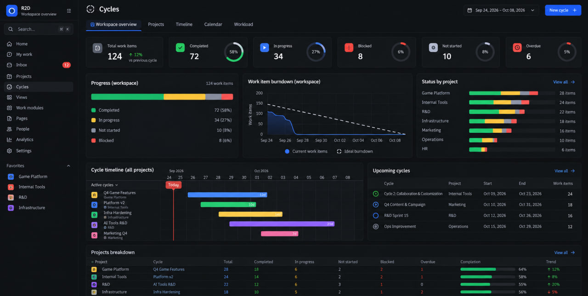

# Workspace Dashboard — Team Operations Overview

**Trạng thái:** Đã được người dùng cho phép lập plan và giao OpenCode triển khai ngày 2026-09-27; chưa có kết quả triển khai được xác minh.
**Ngày:** 2026-09-27. **Baseline đọc code:** `master`, `5d7b1bb48b` và working tree tại thời điểm khảo sát.
**Phạm vi:** Dashboard cấp workspace của CE fork; phục vụ lead/PM và thành viên theo cùng quyền đọc hiện có.
**Thay thế:** Toàn bộ bản UX Redesign trước đó trong file này; các quyết định UX/layout/card/default của Dashboard V3 trong `docs/workspace-dashboards-analytics-v2-spec.md`. Giữ các hợp đồng Analytics V2 hiện hành trừ những extension được nêu rõ bên dưới. Plan cùng ngày cũ không còn là kế hoạch triển khai spec này.

## 1. Quyết định sản phẩm

Dashboard phải giúp người dùng trả lời trong 30 giây:

1. Team đang có bao nhiêu việc chưa xong, tiến độ và lượng việc vào/ra thế nào?
2. Ai đang xử lý gì, ai có nhiều việc đang làm hoặc việc quá hạn?
3. Những việc nào đang kẹt, không có người phụ trách hoặc sắp trễ?
4. Project/cycle nào cần chú ý, mốc tiếp theo là gì?
5. Bấm đâu để xem và xử lý đúng các việc tạo ra con số đó?

Hướng chọn: **một dashboard vận hành mặc định đẹp, dày thông tin, có các tab chuyên sâu và một tab Insights tái sử dụng Customized Insights**. Không yêu cầu người dùng tự xây dashboard mới có giá trị.

Đã cân nhắc ba hướng:

| Hướng | Lợi ích | Hạn chế | Quyết định |
|---|---|---|---|
| Chỉ sửa CSS, màu sắc và spacing của 14 card hiện tại | Ít thay đổi | Vẫn thiếu người/việc cụ thể và ngữ nghĩa cảnh báo | Không chọn |
| Overview theo nghiệp vụ + các tab chi tiết + Insights | Dùng được ngay, vẫn có khả năng phân tích sâu | Cần bổ sung read model/API vận hành | Chọn |
| Dashboard builder kéo thả tự do | Linh hoạt | Buộc người dùng thiết kế, chi phí persistence/sharing/layout lớn | Ngoài phạm vi |

Ảnh người dùng gửi là **tham chiếu visual**, không phải hợp đồng dữ liệu: học mật độ, thanh KPI nhỏ, stacked bars, timeline và bảng breakdown; không sao chép sidebar cũ hay chuyển Dashboard thành trang Cycles. Nút chính phải là tạo work item, không phải mặc định tạo cycle. Không sao chép số liệu giả trong ảnh.



## 2. Những gì code hiện tại thực sự làm

Đây là khảo sát tĩnh source, không phải kết luận về runtime production. Screenshot cũ trong repo là artifact lịch sử, không chứng minh trạng thái chạy hiện tại.

| Bằng chứng source | Hiện trạng | Hệ quả cho spec mới |
|---|---|---|
| `apps/web/core/components/dashboards/v3/dashboard-shell.tsx` | Grid KPI 5 cột; các section còn lại 2 cột, card thường tối thiểu 260px; welcome subtitle truyền `openItems: 4, inProgress: 2, dueSoon: 0` | Bỏ hero số cố định; thiết kế lại hierarchy và kích thước theo nội dung |
| `.../v3/card-registry.ts` | 14 card, trong khi nhiều comment/spec cũ vẫn nói 12/13; ba card workload theo assignee/labels/all members cùng matrix | Không giữ số card hay CSS class cũ làm tiêu chí nghiệm thu |
| `card-registry.ts` + `apps/api/plane/analytics/v2/metrics.py` | Open dùng `pending_work_items`, predicate chỉ gồm backlog/unstarted | Open phải gồm backlog + unstarted + started; không đổi ngầm nghĩa metric pending của Analytics |
| `card-registry.ts`, card `created_vs_completed_trend` | Default chỉ có `work_item_count` theo `created_date` | Muốn hai đường created/completed phải có hai truy vấn và hai date basis đúng |
| `card-registry.ts`, card `attention_required` | Lọc duy nhất priority urgent | Chưa phải danh sách các việc quá hạn/bị chặn/cần can thiệp |
| `analytics/v2/renderers/work-item-table.tsx` | Hiển thị bảng aggregate group/series hoặc nút mở drawer | Chưa phải bảng issue trực tiếp có owner, hạn, nguyên nhân |
| `dashboards/v3/dashboard-card.tsx` | Có tái sử dụng renderer, CSV, drawer; loại date dimension khỏi drilldown | Giữ nền tảng; bổ sung date-bucket drilldown nếu chart ngày có tương tác |
| `dashboards/v3/use-smart-default.ts` | ADMIN mặc định team, người khác tự lọc assignee=me | Role không đại diện job; mặc định Overview phải toàn bộ phạm vi được phép xem |
| `analytics/work-items/customized-insights.tsx`, `insight-chart.tsx`, `analytics/v2/query.ts` | Có dimension, metric, breakdown, date grouping, normalization, allocation, chart/table và drilldown | Đây là nền tảng Insights cần giữ, không xây query engine thứ hai |
| `analytics/v2/query.py`, `filters.py`, `acl.py` | Batch cap 20; structured filters allowlist; ACL public project + project membership trong workspace hợp lệ | Mở rộng có version, giữ ACL trước aggregation, tránh fan-out từng người/project |
| `analytics/v2/metrics.py` | Blocked xét quan hệ tồn tại, chưa loại blocker đã hoàn thành; due-this-week là cửa sổ today..today+7 và không tự loại completed/cancelled | Cần predicate vận hành rõ ràng, test riêng, không dùng tên metric để suy đoán nghĩa |
| `analytics/v2/query.py:AnalyticsEngineV2.drilldown` | Áp filters/time/selection rồi phân trang; metric predicate dùng khi tính contributions, không tự giới hạn tập rows | KPI drilldown phải áp chính predicate của metric, không chỉ truyền metric name |
| `app/views/workspace/cycle.py` | List project cycles và state counts; scope chỉ project đã tham gia | Tái dùng dữ liệu cycle nhưng cần thống nhất ACL và pagination/filter với dashboard |
| `app/views/cycle/base.py`, `utils/analytics_plot.py` | Có analytics/burndown cho project cycle | Không mặc định có burndown lịch sử toàn workspace chính xác |
| `db/models/issue.py` | Có IssueActivity; `completed_at` được reset khi reopen | Không dùng current completed_at để tự nhận là số lần hoàn thành lịch sử |

**Kết luận:** thay đổi này gồm UI, data contracts và predicate backend; bỏ ràng buộc cũ “không cần backend changes”.

## 3. Người dùng, mục tiêu và giới hạn

### User stories

- Lead/PM mở Overview để biết nơi cần can thiệp, bấm cảnh báo để xem ngay việc cụ thể và chủ sở hữu.
- Thành viên chọn My work để xem việc của mình, vẫn có thể trở lại Team trong phạm vi ACL.
- Người điều phối mở Workload để so sánh WIP/overdue giữa các thành viên và tìm việc chưa có người nhận.
- Người phụ trách project mở Projects/Timeline để kiểm tra tiến độ hiện tại, cycle và mốc gần nhất.
- Power user mở Insights để đổi dimension/metric/breakdown mà không phải rời ngữ cảnh đang xem.

### Mục tiêu đo được — mục tiêu nghiệm thu, chưa phải kết quả đã đo

- Với fixture đại diện, ít nhất 4/5 người thử xác định đúng project cần chú ý, một người có WIP cao và ba việc cần xử lý trong 30 giây.
- Từ KPI/risk/member/project đến đúng danh sách việc mất tối đa 2 thao tác; từ dòng việc đến detail là 1 thao tác.
- 100% KPI/risk count có định nghĩa và drilldown kiểm chứng được; không số liệu hardcode hay tỷ lệ không rõ mẫu số.
- Ở desktop 1440×900, nhìn thấy KPI, hàng biểu đồ và ít nhất 3 dòng đầu của cả Team workload và Needs attention mà không cuộn.
- Sau 2 tuần pilot, đo tỷ lệ người dùng từ Overview đi tới detail và thời gian tìm việc; chỉ dùng như chỉ báo hữu ích, không suy ra năng suất cá nhân từ lượt click.

### Ngoài phạm vi

- Builder kéo thả, resize tùy ý, dashboard CRUD, chia sẻ cấu hình được lưu trên server.
- Chấm điểm hiệu suất nhân viên, suy ra giờ làm/chất lượng từ số ticket/comment; task count không phải capacity.
- AI tự kết luận nguyên nhân hoặc tự giao lại công việc.
- Tạo mô hình WorkspaceCycle mới: Timeline ở đây tổng hợp project cycles có sẵn, không phụ thuộc triển khai `docs/workspace-cycles-spec.md`.
- Thay toàn bộ Analytics, Gantt hay issue detail hiện có.

## 4. Information architecture và scope

Route gốc giữ `/{workspaceSlug}/dashboards`; legacy `/:dashboardId` giữ hành vi tương thích hiện có. Dùng query param `tab=overview|projects|workload|timeline|insights`, không tạo dashboard instance.

Tab mặc định **Overview**. Tabs Projects, Workload, Timeline, Insights đều là phần của trải nghiệm đích. Chỉ hiện tab đã hoạt động, không phát hành tab giả/disabled để lấp chỗ. Calendar riêng không cần thiết; danh sách deadline trong Timeline đáp ứng nhu cầu gần hạn.

Header hai tầng:

- Tầng 1: Dashboard · workspace; bên phải thời điểm cập nhật, Refresh, New work item (theo quyền tạo và project được chọn trong modal).
- Tầng 2: tabs; scope Projects, Team/My work, Period; Filters mở popover cho assignees, priority, labels, state group, cycle, module, created by. Chip đang chọn hiện rõ, có xóa từng chip và Clear filters.

Mặc định: Team = tất cả việc được phép xem, Period = tháng hiện tại. Không tự chọn My work theo role. Không giả định workspace có thực thể team/org chart; Team ở đây là phạm vi công việc, muốn nhóm người thì chọn nhiều assignee.

**Phân biệt hai trục thời gian:**

- Current snapshot: tổng việc, state distribution, workload đang mở, overdue, blocked, attention — tại thời điểm cập nhật, không lọc theo created_at của kỳ.
- Period: completed trong kỳ, created/completed trend, các cột completed trong kỳ, timeline — dùng kỳ đã chọn. Badge “Hiện tại”/“Trong kỳ” bắt buộc trên panel/cột tương ứng.
- Không đặt global “Date basis” ngoài Overview; basis do ý nghĩa panel quyết định. Chỉ Insights có điều khiển kỹ thuật này.
- Khi chọn kỳ cũ, snapshot vẫn là hiện tại và phải nói rõ; không giả vờ có historical snapshot.

Mọi filter nghiệp vụ áp dụng nhất quán lên work-item scope. OR giữa giá trị cùng field, AND giữa các field; card predicate chỉ được thu hẹp. Assignee filter là ANY selected assignee. Chọn My work tương đương assignee=me; sửa sang người khác đổi mode sang Team và giữ chip người được chọn.

Cycle timeline: khi không có issue-level filters, vẫn hiển thị cycles rỗng; khi có filters, chỉ hiện cycles có ít nhất một issue khớp và ghi counts là “việc khớp bộ lọc”. Project/assignee labels không được mở rộng scope ngầm.

URL chứa tab, scope, period, sort và drawer selection hợp lệ; URL thắng preference. Preference version mới theo workspace+user lưu localStorage; chỉ lưu lựa chọn, không lưu dữ liệu kết quả. Reload/back giữ ngữ cảnh. Không tự migrate role-derived assignee=me của V3 thành ý định của người dùng: migration giữ project/filter hợp lệ khác, reset mode Team và thông báo một lần. Clear filters giữ period/tab; Reset view khôi phục toàn bộ default.

## 5. Visual direction và layout

**Cảm giác đích:** bảng điều hành chuyên nghiệp, sắc nét, tương phản tốt, giàu thông tin như ảnh. Dark và light đều hoàn chỉnh; dùng theme đang chọn của Plane. Không ép dark, không dùng gradient/glow lớn hoặc greeting hero chiếm diện tích.

```text
Dashboard                                Updated 10:42  Refresh  + Work item
Overview | Projects | Workload | Timeline | Insights    Scope / Period / Filters
[Total] [Completed now] [In progress] [Not started] [Blocked] [Overdue]
[Progress · 3/12] [Created / Completed · 5/12] [Project status · 4/12]
[Team workload · 7/12                      ] [Needs attention · 5/12]
[Cycle timeline · 7/12                     ] [Upcoming deadlines · 5/12]
[Projects breakdown · 12/12                                            ]
```

Desktop >=1280 viewport: dùng 12-column content grid, gap 12–16px, page padding 16–24px. KPI cao khoảng 88–104px; chart row 210–240px; team/attention row 260–320px. Các số này là token/layout target, không khóa height khiến chữ tràn khi zoom/i18n. Không giữ contract `lg:grid-cols-5`.

1024–1279: KPI 3×2; charts 2 cột, project status chuyển xuống nếu không đủ content width. 768–1023: các panel 1–2 cột tùy độ rộng thực tế. <768: KPI 2 cột, mỗi panel full width; table có scroll ngang trong panel hoặc compact row, không làm cả page scroll ngang. Header/filter wrap có kiểm soát.

- Title 18–20px; panel title 13–14px; số KPI 26–30px; row/body 12–14px; số dùng tabular numerals. Không thu chữ xuống 9px để nhét đủ màn hình.
- `bg-surface-*`, `bg-layer-*`, text/border tokens theo `packages/tailwind-config/AGENTS.md`; không gắn canvas mới vào trang. Thêm semantic chart tokens ở design system nếu thiếu.
- Completed xanh lá; Started xanh dương; Unstarted vàng; Backlog xám; Cancelled xám nhẹ và label riêng; risk đỏ/cam. Mapping semantic cố định, không chọn màu theo thứ tự series.
- Stacked bar cho trạng thái; line chart cho biến động; table có avatar/progress/risk badge cho người và project. Không lạm dụng pie/donut cho mọi card.
- Ring nhỏ ở KPI chỉ dùng khi có mẫu số rõ; tooltip ghi công thức. Blocked/Overdue dùng badge thay ring vì là tập chồng lấp.
- Export nằm trong menu `…`, không có 14 nút download lặp lại. Panel actions chỉ hiện View all, selector thực sự cần thiết và menu.
- Tooltip đủ tên, unit, scope và thời gian; chart có bảng tương đương truy cập bằng keyboard. Focus ring, Escape, trả focus sau drawer, reduced motion; status không truyền nghĩa chỉ bằng màu.

## 6. Overview — hợp đồng từng panel

### 6.1 Sáu KPI nhỏ

Tất cả sáu số chính thuộc **cùng current snapshot** để tránh trộn số completed trong kỳ với tổng hiện tại.

| KPI | Số chính | Nội dung phụ / hành vi |
|---|---|---|
| Total work items | Distinct issues trong scope, gồm cancelled | “Open N · Cancelled C”; click mở toàn tập |
| Completed | State completed hiện tại | `% of non-cancelled`; dòng phụ “X hoàn thành trong kỳ” có click riêng |
| In progress | State started | `% of non-cancelled`; mở đúng tập started |
| Not started | Backlog + unstarted | Tooltip tách hai nhóm; mở đúng union |
| Blocked | Open issue có blocker chưa resolved, xem §8 | “Cần gỡ phụ thuộc”; mở danh sách blocked |
| Overdue | Open issue có target_date trước hôm nay | “X đến hạn hôm nay” là link riêng; mở danh sách overdue |

Zero là `0`, không phải empty illustration. Không hiển thị delta snapshot khi chưa có snapshot lịch sử. Completed trong kỳ có so sánh kỳ trước; previous=0 hiển thị “+N so với 0”, không chia 0/hiện infinity. Snapshot percentages mẫu số `Total - Cancelled`; mẫu số 0 hiển thị `—`.

### 6.2 Progress

Một stacked bar theo 5 state groups loại trừ nhau, legend có số và tỷ lệ trên Total; tổng năm nhóm bằng Total. Hiển thị completion rate `completed/(Total-cancelled)` riêng, gọi rõ tỷ lệ này loại cancelled. Blocked/Overdue không là segment thứ sáu/thứ bảy: chúng có thể chồng lên started/unstarted/backlog.

### 6.3 Delivery trend

Hai chuỗi thực: created theo created_at; completed theo completed_at của issue hiện đang completed. Zero-fill bucket, cùng trục thời gian, line xanh dương/xanh lá; bucket day/week/month tự chọn phù hợp, có selector. Hiển thị totals trong kỳ và chênh lệch created minus completed với tên “chênh lệch tạo/hoàn thành”, không gọi đó là biến động backlog chính xác.

Tooltip nói rõ reopened items không còn được đếm là completed trong thống kê current-record này. Không gọi đây là lịch sử tất cả completion events. Date bucket click mở tập đúng bucket và metric; cần extension drilldown, không gắn handler giả.

**Burndown:** chưa dùng thay line chart mặc định. Phase sau chỉ cung cấp khi người dùng chọn một project cycle với dữ liệu đã được kiểm chứng về scope change/reopen. Không vẽ “ideal burndown” cho tập project cycles có ngày bắt đầu/kết thúc khác nhau bằng cách nối số hiện tại.

### 6.4 Status by project

Top 6 project theo overdue desc, blocked desc, open desc, name/id; mini stacked bar cùng semantic colors, tên, total và risk badges. View all sang Projects giữ scope. Top N ghi rõ N/M; KPI tổng không được tính từ Top N. Project có 0 issue vẫn hiện trong Projects nếu thuộc project scope và không có issue-level filter.

### 6.5 Team workload — panel trọng tâm

Preview 5 người, sort mặc định overdue desc → blocked desc → started desc → display name/id. Mỗi dòng: avatar/tên, mini state bar cho open work, Open, Started, Overdue, Completed trong kỳ. Risk có label, không chỉ chấm màu.

Click số mở issue list đúng người + predicate; click tên mở Workload detail trong dashboard. Có dòng Unassigned riêng. Preview ghi số người còn lại, View all mở bảng đầy đủ; không tải query từng người.

Tab Workload thêm cột Blocked, Due next 7 days, phân bố project, last activity trên việc trong scope; tùy chọn WIP threshold mặc định 5 started issues/người. Khi vượt ngưỡng, ghi “WIP cao (>5)” với tooltip ngưỡng có thể chỉnh cho view. Không ghi “quá tải 120%” khi không có capacity/giờ công. Người có 0 issue ghi “0 việc trong phạm vi”, không ghi “rảnh”.

Count per person dùng full credit: issue có 2 assignee xuất hiện ở cả 2 người; totals workspace dùng distinct issue. Caption luôn nói tổng các dòng người có thể lớn hơn tổng việc. Allocation split_equal/points chỉ ở Insights; không dùng số lẻ ticket để biểu diễn ai chịu trách nhiệm. Người có 0 việc lấy từ roster được phép đọc, không suy ra từ aggregates; khi có assignee filter, roster chỉ còn người được chọn. Người đã rời workspace nhưng còn assignment hợp lệ hiển thị inactive; không biến thành Unassigned.

### 6.6 Needs attention — danh sách việc thật

Panel luôn ở hàng đầu cùng Team workload, không nằm sau hàng loạt distribution charts. Header có count distinct issues và các chip Overdue, Blocked, Due soon, Unassigned, No update. Dùng OR giữa các rule để tạo tập cần chú ý; mỗi issue xuất hiện một lần với nhiều reason badges.

Mỗi dòng có identifier/title, project, assignee hoặc Unassigned, hạn tuyệt đối + “trễ N ngày”, tối đa hai reason badges và `+N`. Preview 5 dòng; View all mở drawer rộng có filter reason, sort và pagination 25/50. Không dùng bảng group/series thay issue rows.

Sort deterministic: overdue trước (số ngày trễ giảm dần), sau đó blocked, due soon, urgent/high unassigned, no update; cùng mức sort priority, nearest target_date (null cuối), issue id. Người dùng có thể đổi sort.

Click dòng mở issue peek/detail hiện có, giữ scope/scroll của dashboard. Thao tác thay state/assignee/due date dùng mutation hiện có và RBAC; v1 thực hiện trong issue detail, không bắt buộc xây bulk editor mới. Mutation thành công invalidates các panel liên quan; lỗi giữ trạng thái cũ và báo đúng lỗi.

### 6.7 Cycle timeline + Upcoming deadlines

Timeline preview 5 project cycles giao với period; bar có tên cycle/project, start/end, tiến độ hiện tại, today marker và overdue badge. Thứ tự cycle đang chạy trước, sau đó start_date/id. Không kéo sửa ngày trong dashboard. Cycle thiếu ngày vào nhóm “Chưa đặt lịch”, không bịa tọa độ trên trục. View all mở Timeline.

Upcoming deadlines preview 5 open issues có hạn trong 7 ngày kế tiếp, kèm owner/project/date; link chuyển danh sách giữa Issues và Upcoming cycles. Cycle sắp tới lấy start_date sau hôm nay đến today+30, trong project scope. Tách nhãn “7 ngày tới” và “30 ngày tới” rõ, không ngầm phụ thuộc period chart.

### 6.8 Projects breakdown

Bảng dưới cùng: Project, cycles đang chạy, Total, Open, Started, Completed hiện tại, Completed trong kỳ, Overdue, Blocked, completion progress, next deadline. Sort/filter server-side; 10 dòng preview. Một project có nhiều cycle hiển thị chip `N cycles`, không ghép thành một cycle giả. Không trend mũi tên nếu không có baseline phù hợp.

## 7. Các tab chuyên sâu và Insights

| Tab | Khả năng cần có | Hành vi giữ ngữ cảnh |
|---|---|---|
| Projects | Full breakdown, search/sort, project detail gồm progress/risk/cycles | Click metric mở filtered drawer; View project đi route có thật |
| Workload | Full member table, state/project matrix, search người, WIP threshold, Unassigned | Cell drilldown; không leaderboard năng suất |
| Timeline | Project-cycle timeline theo week/month/quarter, deadline list, unscheduled group | Today, zoom, project/cycle detail; không tự tạo WorkspaceCycle |
| Insights | Controls tương đương Customized Insights, chart + data table, CSV, drilldown | Kế thừa scope; local analysis config tách khỏi Overview |

Insights có presets hữu ích: Open by assignee×state, Overdue by project, Work by label, Completed by week. Có metric, dimension, breakdown, count/points khi engine hỗ trợ, value/percentage, normalization, allocation. Selector chỉ đưa tổ hợp hợp lệ; chọn metric không hợp lệ không được lặng lẽ trả 0.

“Explore in Insights” từ panel truyền query/config tương đương và chip scope. “Open in Analytics” là đường chuyển sang Analytics hiện có; nếu chưa có contract import query, phải xây và test contract trước khi hiện action. Không giả định link bất kỳ tự tái tạo được chart.

P1: tối đa 3 pinned insight presets trong tab Insights, lưu per-user localStorage có schema version; không thêm tùy ý vào Overview, không tái sinh builder. CSV phải nói exported current page/top N hay toàn bộ kết quả; không gọi truncated output là full export.

## 8. Metric dictionary và tính đúng dữ liệu

Tập cơ sở `S` = issues qua ACL/queryset chuẩn + project scope + business filters, loại soft-deleted/archived/draft/triage theo contract hiện có. `Open = S ∩ {backlog, unstarted, started}`. Current counts lấy distinct issue IDs, không đếm nhân bản do label/assignee/module joins.

| Khái niệm | Định nghĩa bắt buộc |
|---|---|
| Not started | backlog hoặc unstarted |
| Overdue | Open và target_date < ngày hiện tại của workspace timezone |
| Due today | Open và target_date = hôm nay |
| Due soon | Open và target_date trong [hôm nay, hôm nay+7), tức hôm nay cùng 6 ngày kế tiếp |
| Blocked | Open issue có IssueBlocker còn hiệu lực, trỏ tới blocker chưa completed/cancelled và còn active; liên kết đúng hướng `block`/`blocked_by` theo model |
| Unassigned attention | Open, priority urgent/high, không có active assignee relation; người inactive còn relation không tự trở thành null |
| No update | Started, mốc cập nhật nghiệp vụ gần nhất cách now >=7×24h; xem định nghĩa dưới |
| Completed in period | Hiện completed và completed_at trong [start,end); chưa phải completion-event history |
| Attention total | Distinct union của 5 rule, không cộng từng badge count |

Blocked chỉ dựa trên blocker người xem được phép đọc; không lộ tên, count hay existence của issue kín qua reason metadata. UI ghi “phụ thuộc trong phạm vi bạn được xem”; không tự mở rộng quyền để cố khớp tổng giữa hai viewer.

No update dùng max timestamp từ IssueActivity cho create, state, assignee, priority, start/target date và comment còn tồn tại; bỏ system sync/notification/view event. Fallback issue.created_at nếu chưa có activity; **không dùng updated_at chung** vì có thể đổi do tác vụ không mang ý nghĩa tiến độ. Cần audit mapping field/verb của các writer trước triển khai rule; nếu event coverage không đủ, không phát hành rule dưới tên này. Không diễn giải absence of activity thành người đó không làm việc.

Date range chuyển thành [start inclusive,end exclusive) theo `workspace.timezone`; target_date là calendar date, không cộng UTC offset lần hai. So sánh kỳ trước dùng khoảng ngay trước đó cùng độ dài đã trôi qua; tháng hiện tại chưa hết không so thẳng với toàn tháng trước. Tooltip nêu chính xác hai khoảng. Không dùng comparison cho snapshot khi không có historical snapshots.

Counts/totals và list đều dùng cùng predicate service. Với count metric, `distinct drilldown total = count`; với full-credit/member cross-tab, kiểm theo cell, không cộng toàn bộ cells. Points có unit và missing-estimate count, không biến missing thành ước lượng 0 mà không chú thích. KPI không lấy total từ aggregate có truncation; cần exact aggregate độc lập hoặc trả unavailable.

## 9. Kiến trúc và API đề xuất

### 9.1 Tái sử dụng / thay / thêm

- Giữ Analytics V2 query/filter/time/allocation/normalization/ACL, batch service, value resolver, chart primitives, CSV, drawer shell và capability/route guards.
- Thay dashboard shell, registry fixed 14 cards và renderer “one size fits all” bằng các panel theo nghiệp vụ. Chart primitives tái dùng; dashboard panel chọn layout phù hợp, không fork Analytics toàn bộ.
- Reusable UI primitives thuộc `@plane/ui` có Storybook; dùng `@plane/propel` hiện có ở nơi phù hợp. Product composition ở web; state mới theo MobX/shared-state conventions, không tạo thêm singleton ad hoc cạnh store hiện có.
- Thêm read service vận hành cho attention rows, roster workload, project summary và cycle overview. Metric/predicate nằm trong shared analytics domain; endpoint chỉ orchestration, không duplicate công thức với frontend.

### 9.2 API surface — đề xuất mới, chưa tồn tại

Giữ `/api/workspaces/{slug}/analytics/v2/{query,batch,drilldown}/` cho Insights và các aggregate phù hợp. Dashboard bổ sung:

| Endpoint | Dữ liệu | Giới hạn mặc định |
|---|---|---|
| `POST .../dashboard/overview/` | KPI/progress/trend/top projects, preview workload/attention/cycles/deadlines | Trả sections độc lập, preview tối đa 5–6 rows/section |
| `POST .../dashboard/workload/` | Roster + aggregates theo người, search/sort/pagination | 25 rows; max 100 |
| `POST .../dashboard/projects/` | Full project breakdown | 25 rows; max 100 |
| `POST .../dashboard/attention/` | Reason counts, distinct issue rows, reasons và selection | 25 rows; max 100 |
| `POST .../dashboard/timeline/` | Paginated cycle lanes + scheduled/unscheduled totals | 25 cycles; max 100 |
| `POST .../dashboard/items/` | Drilldown cho snapshot/rule/member/project/date-bucket | 25 rows; max 100 |

Request version 1: `scope` (project_ids + allowlisted business filters), `period` (preset hoặc start/end), `selection` (allowlisted metric/rule/dimension/date bucket), pagination/sort khi áp dụng. Scope timezone do server lấy từ workspace. Không nhận SQL, ORM field hay predicate tùy ý. Dashboard-specific selectors không được nhét vào Analytics V2 như key chưa hỗ trợ.

Response gồm `version`, `generated_at`, `scope_key`, `resolved_scope`, `resolved_period`, `timezone`, `sections` hoặc `rows`, `pagination`, `warnings`. Section có `status=ok|error|unavailable`, `data`, `reason` khi cần; chỉ số 0 khác error. Selection descriptor chứa metric/predicate version + bucket/membership, server validate lại scope/ACL ở mỗi lần drilldown; không tin client total/token như authorization.

`overview` orchestration tái dùng engine cho aggregate có semantics phù hợp, shared predicates/read queries cho vận hành; không HTTP loopback vào API của chính mình. Một HTTP request không bảo đảm ít SQL: đo query count, scan cost và payload. Các widget cùng scope dùng chung resolved project IDs/base queryset trong request.

Snapshot sections trong một response phải nhất quán cùng read snapshot hoặc strategy transaction phù hợp. Drilldown là dữ liệu live tại request sau: nếu issue đổi giữa hai request, hiển thị thời điểm mới và refresh summary; không hứa giữ snapshot lâu dài bằng query token.

### 9.3 Extensions bắt buộc và tương thích Analytics

- Thêm predicate operational open/blocked/due/attention; không đổi ngầm metric pending hay due_this_week hiện hữu.
- Dashboard items endpoint phải lọc theo metric predicate trước count/pagination; sửa/reuse đường Analytics drilldown chỉ khi backward compatibility được kiểm thử.
- Thêm date bucket selection có timezone/basis chính xác. Khi đưa về Analytics V2 phải version/validate extension và giữ categorical drilldown cũ hoạt động.
- Exact workspace distinct totals tách khỏi top N/full-credit group totals; không dùng `_compute_totals(rows)` như bằng chứng count unique toàn workspace.
- Workspace cycle list đang dùng joined-project scope khác Analytics; dùng shared visibility policy cho endpoint mới, test public project chưa join và private project. Không broaden route cũ thiếu đánh giá tương thích.
- Backend pagination/search cho roster/projects/cycles; không lấy toàn workspace về trình duyệt rồi cắt preview.

### 9.4 Fetch, cache và cập nhật

Overview mount: 1 overview request ngoài bootstrap app; tab khác lazy-load. Insights dùng batch/query hiện có, không vượt `MAX_BATCH_QUERIES=20`; mọi payload có budget cho cardinality/matrix/split_equal, hiển thị truncation warnings. Không nâng cap để che thiết kế N+1.

Debounce filter 250ms; request key gồm workspace/user/scope/tab/period; abort hoặc bỏ response cũ, response chỉ render cùng scope đã tạo ra nó. Không hiển thị số của filter cũ dưới chip filter mới. Refresh giữ layout/skeleton nhẹ.

Refresh thủ công, khi focus trở lại nếu quá 60 giây và khi mutation thành công; auto-refresh 60 giây lúc tab visible, pause khi hidden. Request đang chạy không bị chồng thêm timer. Nếu refresh thất bại, giữ last success với nhãn stale, lỗi ngắn và Retry; lần đầu lỗi thì giữ panel frame và error riêng.

Cache server nếu dùng phải phân theo viewer/permission scope/query/timezone/predicate version; recheck authorization trước phục vụ cache, invalidate khi membership/visibility thay đổi. Không lưu payload dự án kín vào shared anonymous cache. Filter options, roster names, counts, reasons và export đều qua ACL, không chỉ issue detail.

## 10. Empty/error và thao tác biên

- Workspace chưa có issue: KPI 0, giữ cấu trúc Overview với onboarding gọn và Create work item theo quyền; không 6 hình empty lớn.
- Bộ lọc không có kết quả: “Không có việc khớp bộ lọc”, clear filters; không nói workspace trống.
- Không có quyền/scope hợp lệ: thông báo access state; ID bị thu hồi không được âm thầm biến thành All projects.
- Không có attention: “Không có việc cần chú ý theo các quy tắc đang dùng”, không kết luận mọi project đúng tiến độ.
- Không có ngày/cycle/estimate: nhóm dữ liệu thiếu rõ ràng, không fake timeline/points.
- Một section lỗi không che các section khác; error không render thành 0 hoặc 100% completed.
- Cùng issue vừa overdue vừa blocked: 1 row, 2 reasons; count union đúng.
- Filter mâu thuẫn product predicate: kết quả rỗng; không bỏ filter để làm chart có số.
- Issue title/user/project quá dài: truncation + tooltip; số không wrap khó đọc.
- Permission mất trong khi mở drawer: đóng/clear dữ liệu không còn được đọc, phản hồi quyền truy cập; localStorage không vượt quyền.

## 11. Phân kỳ và ưu tiên

Không có deadline được cung cấp. Estimate sau khi kiểm chứng query plan và scope; không hứa số ngày trước khi làm spike dữ liệu.

| Phase | Priority | Kết quả review được | Gate |
|---|---|---|---|
| A — Data contracts | P0 | Predicate dictionary, ACL parity, count/list parity, overview response + fixtures, benchmark query plan | Không số sai do join/truncation/metric mismatch |
| B — Overview | P0 | Layout theo ảnh, 6 KPI, progress/trend/project status, workload + attention, cycle/deadline previews, project table, drilldown | Nhìn và dùng được với dữ liệu thật; screenshot ở nhiều viewport |
| C — Deep views | P0 cho bản đích | Projects/Workload/Timeline/Insights đầy đủ, URL state, preference migration, refresh, responsive | Các workflow §12 hoạt động end-to-end |
| D — Enhancements | P1 | Pin 3 insight presets, cycle burndown đã xác minh, customize WIP threshold persistence | Không ảnh hưởng semantic snapshot; không builder |
| Future | P2 | Historical snapshots, actual capacity nếu có dữ liệu giờ công, saved/shared views server-side | Spec riêng |

Preview B có thể dùng nội bộ; chưa được gọi toàn bộ redesign hoàn tất nếu thiếu Phase C. No update rule chỉ mở sau gate coverage activity ở Phase A; nếu chưa đạt phải ghi rõ deferred trong release notes, các rule khác vẫn hoạt động.

## 12. Acceptance và kiểm thử

### Data/backend — unit + contract tests

- Fixture 12 issues: backlog 2, unstarted 3, started 4, completed 2, cancelled 1 ⇒ Total 12, Open 9, Not started 5; completion rate 2/11. Trong 9 Open có 2 overdue, 3 blocked với 1 trùng ⇒ union hai nhóm =4.
- Issue có 2 assignee + 3 label + 2 module: Total chỉ tăng 1; mỗi assignee count tăng 1; per-person sum có thể >Total và label giải thích xuất hiện.
- Blocker completed/cancelled/deleted không tạo blocked; quan hệ đúng hướng; blocker kín không lộ metadata. Test quyền public/private, non-member workspace, guest/service principal theo policy hiện có.
- Started issue cũ từ tháng trước vẫn ở Open/Workload khi chọn tháng này; completed trong kỳ dùng completed_at; reopen loại khỏi current completed statistics đúng tài liệu.
- Boundary workspace timezone, midnight, DST timezone có DST, target_date null, hôm nay không overdue, hôm nay+7 không thuộc Due soon.
- Mỗi KPI/reason/cell drilldown distinct total bằng count cùng read state; pagination/sort ổn định; metric predicates không bị bỏ ở list.
- Assignee inactive, deleted relation, no assignee, roster zero row và roster ACL đều có fixture.
- Current totals chính xác khi groups vượt cap; preview có `total_count/has_more`; không tổng hợp KPI từ Top N.
- Period comparison previous=0 và kỳ hiện tại chưa hết; không snapshot delta giả.
- Activity rule chỉ xét allowlisted meaningful events; system update không reset timer.
- Regression Analytics: query/batch/comparison/allocation/normalization/drilldown và kill-switch/route guards hiện có không bị phá.

### Frontend/component

- Test scope/URL/preference version/identity isolation và out-of-order responses.
- Không fallback hardcoded numbers; 0/error/empty/stale là các trạng thái phân biệt.
- Selected filter labels đúng; keyboard mở/chọn/xóa; clear giữ period, reset khôi phục default.
- Correct series/state color mapping, mẫu số, units, labels; trend thực sự có hai date bases.
- Metric/row click mở đúng drawer/request; closed drawer trả focus. Update issue refresh các panel đúng scope.
- Thay test bám CSS `lg:grid-cols-5`/đếm 13 cards bằng assertions theo hợp đồng sản phẩm mới; giữ kiểm thử ACL/data semantics.

### Manual visual + end-to-end bắt buộc

1. Chụp full page + first viewport 1440×900, 1280×800, 1024×768, 390×844; dark và light; zoom 200%. So với ảnh tham chiếu về hierarchy/mật độ, không chỉ so màu.
2. Dataset rỗng, 1 project/3 người, và 20 projects/50 người/10.000 issues. Có tên dài, unassigned, nhiều assignee, cancelled, overdue/blocked chồng lấp, cycle không ngày.
3. Lead mở Overview → tìm 3 việc cần xử lý → mở một issue → đổi assignee đúng quyền → số liệu refresh; back không mất filter/scroll.
4. Chọn project + assignee + period → chuyển tab → reload/share URL → xác nhận scope; thử lại với viewer ít quyền hơn.
5. Click Overdue, date bucket, project segment, member Started → list đúng; hoàn thành một overdue issue → nó rời attention.
6. Một section lỗi, toàn request lỗi, slow response, đổi workspace khi request đang chạy: không stale cross-workspace leak, không blank page.
7. Insights đổi dimension/breakdown/allocation → chart/table/CSV/drilldown tương ứng; không chỉ kiểm sự tồn tại của controls.

### Performance acceptance — target phải đo

Trên môi trường benchmark được ghi cấu hình với dataset 10.000 issues/20 projects/50 người: overview API p95 <=1.5s warm, <=3s cold; first useful content <=2.5s ở mạng thử nghiệm được ghi rõ; không request riêng mỗi người/project. Query count không tăng tuyến tính theo số rows preview; báo SQL plan, payload size và timings. Nếu không đạt, tối ưu batching/index/pagination theo evidence, không thay dữ liệu thật bằng số cache không rõ freshness.

Backend tests dùng isolated stack `docker-compose-test.yml` theo `apps/api/tests/RUNNING_TESTS.md`; frontend dùng Vitest/RTL hiện có. Spec này chưa chạy suite vì chưa sửa implementation. Visual acceptance và runtime evidence là gate riêng với unit tests.

## 13. Các điểm cần chốt trong bước triển khai

- **Engineering, chặn No update rule:** audit các IssueActivity writers và coverage event mapping; không chặn các rule khác.
- **Engineering, chặn release:** benchmark/read snapshot strategy cho overview; chọn index từ query plan, kiểm migration compatibility.
- **Design/Product, không chặn draft:** tinh chỉnh mật độ với font thực tế và sidebar thực tế; mặc định theo kích thước/tokens §5.
- **Product, không chặn v1:** có cần capacity thực theo giờ/ngày hay không; hiện chỉ dùng WIP threshold có giải thích.

Không còn câu hỏi mở về hướng chính: mặc định Team overview; dữ liệu thật; attention + workload ở vị trí ưu tiên; UI theo ảnh; giữ Customized Insights; cho phép backend changes khi cần đúng semantics.
