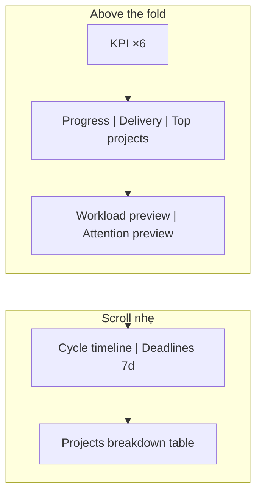

# Operations Dashboard — Layout proposal v2

**Ngày:** 2026-09-28  
**Trạng thái:** Đề xuất UX (chưa implement) — để review trước phase UI dày hơn.  
**Baseline spec:** [2026-09-27-workspace-dashboard-redesign.md](./2026-09-27-workspace-dashboard-redesign.md) §5–§7.  
**Vấn đề hiện tại:** Overview thiếu “một màn hình thấy hết”; Projects / Workload / Timeline còn bảng/list tối giản, chưa đủ chi tiết vận hành.

---

## Nguyên tắc

1. **Overview = bảng điều hành 30 giây** — trên fold (1440×900) phải thấy: KPI snapshot, tiến độ, xu hướng kỳ, ai đang quá tải, việc cần xử lý, project/cycle/deadline nóng.
2. **Deep tabs = cùng data contract, UI đầy đủ** — không thêm API mới nếu endpoint đã có; bổ sung cột, filter, sort, drawer, link project.
3. **Badge “Hiện tại” vs “Trong kỳ”** trên từng panel (spec §4).
4. **Không hero greeting** — toàn bộ chiều cao cho số liệu.

Grid desktop: **12 cột**, gap 16px, padding 20px (khớp spec §5).

---

## Tab Overview — layout đích (desktop ≥1280)

```text
┌──────────────────────────────────────────────────────────────────────────────┐
│ Dashboard          Updated 22:57   [Refresh]  [+ Work item]                  │
│ [Overview|Projects|Workload|Timeline|Insights]  Team▾ Period▾ Bucket▾ Filters│
├──────────────────────────────────────────────────────────────────────────────┤
│ KPI STRIP (6) — snapshot · Hiện tại                                          │
│ [Total][Completed][In progress][Not started][Blocked][Overdue]  ← click drill│
├───────────────────────────────┬──────────────────────────────┬───────────────┤
│ Progress (stacked 5 groups)   │ Delivery trend (2 lines)     │ Top projects  │
│ + completion rate             │ created vs completed · Kỳ    │ mini bars ×6  │
│ col 4                         │ col 4                        │ col 4         │
├───────────────────────────────┴──────────────────────────────┴───────────────┤
│ TEAM WORKLOAD (preview)                    │ NEEDS ATTENTION (preview)       │
│ 5 rows + Unassigned + "View all"           │ 5 issue rows + reason chips   │
│ col 7 · Hiện tại                           │ col 5 · Hiện tại              │
├────────────────────────────────────────────┬─────────────────────────────────┤
│ CYCLE TIMELINE (mini Gantt / lanes)        │ UPCOMING DEADLINES (7d)         │
│ 5 cycles + unscheduled hint                │ 5 rows · due date · owner       │
│ col 7 · Kỳ + snapshot markers              │ col 5 · Hiện tại              │
├──────────────────────────────────────────────────────────────────────────────┤
│ PROJECTS BREAKDOWN (preview table — 10 rows) · full width · Hiện tại + Kỳ  │
│ Project | Open | Started | Overdue | Blocked | Done(now) | Done(period) | … │
│ "View all → Projects tab"                                                  │
└──────────────────────────────────────────────────────────────────────────────┘
```

### So với build hiện tại

| Panel spec §6             | Hiện có               | Gap                                                        |
| ------------------------- | --------------------- | ---------------------------------------------------------- |
| 6.1 KPI strip             | Có                    | OK; giữ drilldown                                          |
| 6.2 Progress              | Có                    | OK                                                         |
| 6.3 Delivery              | Có                    | OK                                                         |
| 6.4 Top projects          | Có (top_projects)     | OK                                                         |
| 6.5 Team workload preview | Preview 5             | Cần risk label, Unassigned row rõ, caption distinct totals |
| 6.6 Needs attention       | Attention preview     | Cần issue rows đủ field (id, project, assignee, badges)    |
| 6.7 Timeline + deadlines  | Preview gộp một panel | **Tách 2 panel**; timeline mini lane + deadline list 7d    |
| 6.8 Projects breakdown    | **Thiếu**             | **Thêm bảng 10 dòng** cuối Overview                        |

### Above-the-fold target (1440×900, ~780px content)



---

## Tab Projects — layout đích

```text
┌──────────────────────────────────────────────────────────────────────────────┐
│ Projects · Full breakdown                                    [Export CSV]    │
│ Distinct totals: open · overdue · blocked · completed(period)                │
├──────────────────────────────────────────────────────────────────────────────┤
│ [Search project…]  Sort: Overdue▾   [Running cycles only] [At-risk only]    │
├──────────────────────────────────────────────────────────────────────────────┤
│ Project ▾ | Cycles | Total | Open | Started | Overdue | Blocked | Done | …  │
│ Platform  | 2 active | …   | …    | …       | badge   | …       | bar  | → │
│ Mobile    | …        | …   | …    | …       | …       | …       | …    | → │
│ … paginated server-side                                                      │
├──────────────────────────────────────────────────────────────────────────────┤
│ Side drawer (optional v2): project summary + link "Open project" + cycles  │
└──────────────────────────────────────────────────────────────────────────────┘
```

**Bổ sung UI (data đã có / mở rộng nhẹ):**

- Cột **completion progress** (bar), **next deadline**, chip **N cycles**.
- **Mini stacked bar** per row (giống spec 6.4).
- Click số → **items drawer** (đã có pattern KPI).
- **View project** → route project hiện có.

---

## Tab Workload — layout đích

```text
┌──────────────────────────────────────────────────────────────────────────────┐
│ Workload · By assignee                    WIP threshold [5]  [Export CSV]    │
│ Caption: row sums use full credit; distinct open = workspace total           │
├──────────────────────────────────────────────────────────────────────────────┤
│ [Search member…]  Sort: Overdue▾   [Show inactive] [Unassigned bucket]       │
├──────────────────────────────────────────────────────────────────────────────┤
│ Member | Open | Started | Overdue | Blocked | Due 7d | Done(period) | WIP  │
│ avatar + WIP dot                                                      paginate│
├──────────────────────────────────────────────────────────────────────────────┤
│ Footer: Unassigned (open/overdue) · Inactive members (open) · distinct KPIs  │
└──────────────────────────────────────────────────────────────────────────────┘
```

**Bổ sung so với bảng hiện tại:** cột **Due soon (7d)**, **WIP warning**, footer **Unassigned / Inactive** (API workload payload đã có buckets).

---

## Tab Timeline — layout đích

```text
┌──────────────────────────────────────────────────────────────────────────────┐
│ Timeline · Cycles + deadlines                                                │
├───────────────────────────────┬──────────────────────────────────────────────┤
│ Cycle lanes (scroll)          │ Deadlines · next 7 days                      │
│ Week | Month | Quarter zoom   │ sort: days until due                         │
│ Today marker · overdue badge  │ issue · project · priority · owners          │
├───────────────────────────────┴──────────────────────────────────────────────┤
│ Unscheduled cycles (grouped) · reason · link project                           │
│ Pagination: cycles | deadlines | unscheduled (3 cursors — đã có API)         │
└──────────────────────────────────────────────────────────────────────────────┘
```

**Bổ sung UI:** lane **visual bar** (không chỉ list text), **today line**, toggle zoom, tách **deadlines** thành cột phải cố định trên desktop.

---

## Tab Insights

Giữ **Customized Insights** embed; chỉ thêm strip “Inherited scope from dashboard” + presets (spec §7).

---

## Thứ tự implement đề xuất

1. Overview: **Projects breakdown table** (6.8) + tách **Timeline vs Deadlines** (6.7).
2. Attention + Workload previews: đủ cột issue / risk labels (6.5–6.6).
3. Projects tab: progress bar, cycles chip, filters, export.
4. Workload tab: due 7d, WIP column polish, inactive/unassigned footer.
5. Timeline tab: two-pane layout + mini timeline bars.

---

## Wireframe tham chiếu mật độ (ASCII compact)

Giống ảnh reference spec — một viewport:

```text
|TTTTTT|CC|II|BB|NN|OO|  ← KPI
|<<<<Progress>>>>|<<Trend>>|<<Proj×6>>|
|<<<<<< Workload ×5 + unassigned >>>>>|<<Attention×5>>|
|<<<< Cycle lanes + today >>>>>>|<<Deadlines 7d>>|
|<<<<<<<<<<<< Projects table ×10 >>>>>>>>>>>>>>|
```

Chú thích: `T`=Total … `O`=Overdue; `<` = panel width tỷ lệ 12-col.

---

## Không làm trong pass này

- Burndown workspace-wide, builder, leaderboard, AI summary.
- Thay đổi predicate backend (trừ field hiển thị đã có trong payload).

Review xong: implement theo thứ tự § “Thứ tự implement” hoặc chỉnh wireframe rồi lock spec v2.
