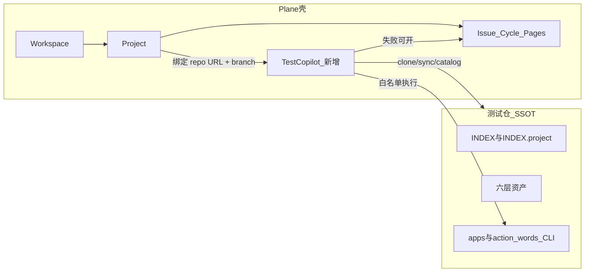
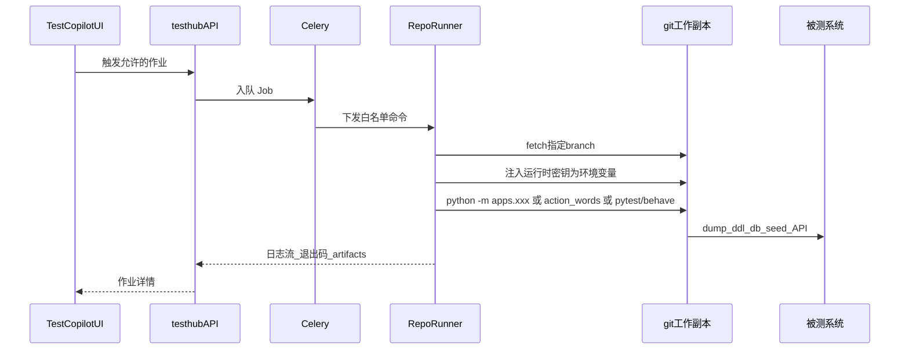

# TestCopilot 架构与计划

本文件是 Plane fork 上 **TestCopilot** 的设计正文。作者：**tuner**。入口见仓库根 [`TESTCOPILOT.md`](../../TESTCOPILOT.md)。

基线：官方 release **v1.4.1**（2026-08-07），开发分支 `testcopilot/v1.4.1`。

许可证：上游 **AGPL-3.0**。自研模块同样受约束；公开 GitHub fork 会把 overlay 一并公开。

对外产品名是 **TestCopilot**。代码、URL、Django app 仍用 `testhub`，避免大面积改内部标识、方便继续 merge 官方 tag。

---

## 世界观

测试仓是 **repo as a platform**：能力在 git（六层目录 + CLI + INDEX），不在数据库。

Plane 是类 Linear 的项目管理工具（Workspace / Project / Issue / Cycle / Pages），**没有** pytest、Gherkin、CLI runner、造数编排。

关系：

- **测试仓** = 测试平台本体（SSOT）
- **本 fork** = 壳 + 项目管理 + 把绑定仓「实现了什么」可视化，并安全触发已有 CLI
- **Issue** = 缺陷/任务，**不是**测试用例副本



绑定：**一个 Project ↔ 一个 git URL + 一个 branch**。与测试仓 `init_repo`「一 SUT 一项目仓」一致。

---

## 可复用 vs 必须新建

可直接借：Workspace/Project/RBAC、Issue/Cycle/Module/Views/Pages、Webhook、API Token、Session + `X-Api-Key`、Celery、MinIO、OpenAPI、前端壳（侧栏、列表、MobX）。

社区版扩展点 [`apps/web/app/routes/extended.ts`](../../apps/web/app/routes/extended.ts) 目前是空数组，不能当稳定插件 API；侧栏入口要自己打一小块 adapter。

**不要塞进 Issue 模型**：测试用例、feature 步骤、pytest 节点、造数参数、DDL、api_objects。这些留在测试仓文件里。

---

## Git 拓扑（已就绪）

```text
makeplane/plane                 = upstream（只读；push 已设为 no_push）
chenjianpeng97/plane            = origin
C:\dev\repo\plane               = 本工作副本（只在这里写 TestCopilot overlay）
绑定的测试 git 仓               = 测试平台仓（SSOT；路径由项目绑定与 TESTHUB_HOST_REPO 决定）
C:\dev\sourcecode\plane         = 上游只读参考，不要在那里开发
```

稳定 tag：`vX.Y.Z`（忽略 `*-dev` / `*-rc*` / `*-hotfix`）。当前 Latest = **v1.4.1**。

Windows 上 `git fetch upstream` 可能因远程分支名大小写冲突失败，**tags 仍能拉到**。吸收修复：

```bash
git fetch upstream --tags
git merge v1.x.y
```

合入节奏：每 1–2 个官方 patch/minor merge 一次 tag，跑官方测试 + TestCopilot 冒烟。不要长期跟踪 `preview`。

---

## 本仓要新增的域

独立 Django app `plane.testhub`（不要改 Issue 语义）。前端独立目录 + 项目侧栏 **TestCopilot**。

### 1. ProjectTestRepo

一对一挂在现有 `plane.db.models.project.Project`：

- `repo_url` / `branch`（必填）
- 只读凭证：deploy token / SSH 引用（密文进密钥库，禁止明文进 Issue/日志）
- Runner 上的 clone 路径
- 最近 sync：commit SHA、时间、状态
- 可选：默认 Python extra

项目设置增加「测试仓库」卡片。未绑定则 TestCopilot 显示引导，不报错。

### 2. CatalogSnapshot

UI 不要每次全量扫树。测试仓应提供机器可读 catalog（测试仓侧建议 `python -m apps.index_platform`，**在测试仓实现，不在本仓重写扫描逻辑**）。

快照建议字段：

- 知识层：DDL 按 datasource 的表文件数、`assets/sql` 列表
- 组件层：api_objects 条数/前缀、page_objects、action words（`word_id` / `name` / `category` / JSON Schema）
- 工具层：app id、参数 schema、是否破坏性、README 路径
- 测试层：`.feature` 的 Feature/Scenario/Tags；pytest 收集节点
- 数据层：`data/` 文件列表
- git：branch、HEAD sha

本仓只存 **CatalogSnapshot**（project + sha）。列表数字全部来自快照。

造数表单直接消费测试仓 `packages.action_words.export_catalog()` + `Params.model_json_schema()`，不要再发明参数模型。

### 3. RepoRunner（Plane 没有的能力）

API 容器默认到不了 SUT，也不该任意 `subprocess`。执行必须是旁路 Agent：



硬约束：

- 命令白名单：catalog 已登记的 `apps.*`、`packages.action_words`、指定路径的 pytest/behave；禁止自由 shell
- 密钥：项目密钥库或 Runner 本机 `env_local.py`，映射 `ARGON_DB_*` / `TEST_*`；永不写回 git、不进 Job 日志
- 破坏性操作默认 dry-run，需 Admin 二次确认
- 同一 Project 默认串行
- 产物：测试仓 `logs/` / `artifacts/`；大文件进 MinIO

`apps.recorder` 是长驻代理，不是一次性 Job；P2 不做，P4 单独立项。

### 4. UI 信息架构

项目侧栏 **TestCopilot** 子页：

1. 总览 — 绑定信息、HEAD、六层计数
2. 知识 — DDL/SQL/usecases 只读（分页，勿一次拉全部表正文）
3. 组件 — api_objects 路由树、page_objects、action words
4. 工具 — apps 卡片 + 运行表单
5. 造数/动作 — 按 `db_seed` / `db_assert` / `api_request` / `api_assert`；结果展示 `cleanup`
6. 测试 — Feature 树 + pytest 收集树；按 tag/路径筛选后运行
7. 作业 — 历史、日志、产物；失败一键创建 Issue（链到 Job，不复制用例正文）
8. 环境 — 数据源别名、连通性（不显示密码）

后期 xmind 等：作为测试仓知识层新类型进入 catalog，不必改 Plane 核心。

---

## 隔离策略（否则合不进上游）

- 自研放 `apps/api/plane/testhub/`、前端 testhub 目录；少改同一上游文件
- 必须改的核心文件收成最小 adapter（侧栏常量 + route 合并 + `INSTALLED_APPS` 一行）
- 不改 Issue/Cycle 表语义

### 明确不做

- 不在 Plane DB 编辑/保存 `.feature` 或 pytest 作为主副本
- 不把测试仓 `.cursor` skill/agent 搬进 Web
- 不在 Web 重写测试仓 `packages.db` / 造数 SQL
- 首期：不多 branch 并行绑定、无任意 SQL 控制台、无 recorder 常驻

---

## 阶段

### P0 — 绑定与总览

- `plane.testhub` + 项目设置「测试仓库」
- Runner clone/fetch 指定 branch，跑测试仓 `index_platform`，写入 CatalogSnapshot
- 总览：工具数、api_objects、action words、feature/pytest 计数
- 测试仓并行：`apps/index_platform` + apps manifest（在**测试平台仓**实现，不在本仓）

### P1 — 只读可视化

- Gherkin：Feature/Scenario/Tags
- pytest：`--collect-only` 或静态收集
- api_objects 路由树、action words describe + schema
- DDL/SQL 索引（点开再拉单文件）

### P2 — 编排执行

- Job + 日志流 + 白名单
- `python -m packages.action_words run <id> --params ...`（造数主路径）
- 已登记 apps：`dump_ddl`、`index_ai`；`init_repo` 仅 Admin
- 密钥注入与 dry-run；展示 cleanup

### P3 — 跑测与缺陷闭环

- `behave --stage api|ui`、`pytest <nodeid>`
- JUnit/JSON 入库；失败创建 Issue（Job 链接 + 场景名 + 日志片段）
- artifacts → MinIO

### P4

- recorder 生命周期、xmind、多 Runner、git webhook 自动 sync、通过率图表（不是 Plane 自带 burndown）

---

## 风险

- Runner 必须能访问 SUT；Plane Web 不必
- 团队共用 Runner 时密钥必须在项目密钥库，不能只靠工程师本机 `env_local.py`
- 工作副本以绑定 branch 的最新 fetch 为准，不含未推送的本地脏文件
- Plane 官方建议约 12GB RAM；不要把 pytest 跑进 API 容器
- 大面积改核心文件 = fork 失去「吸收官方 bugfix」的意义
