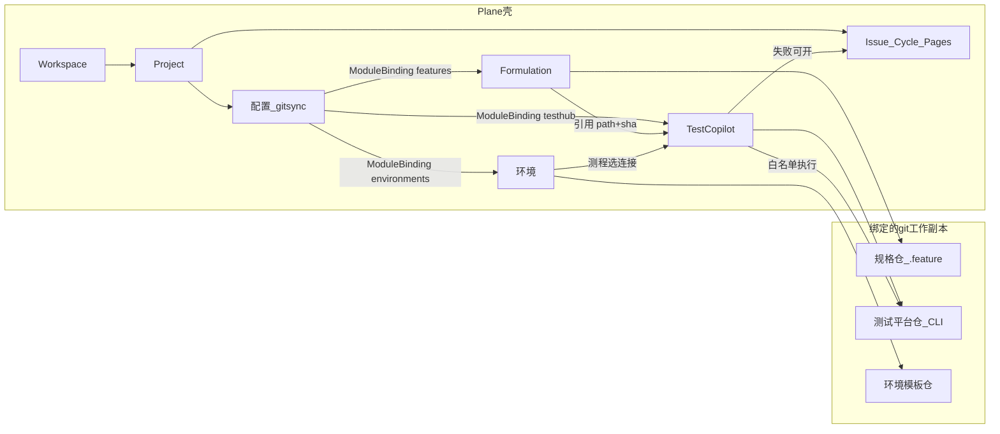
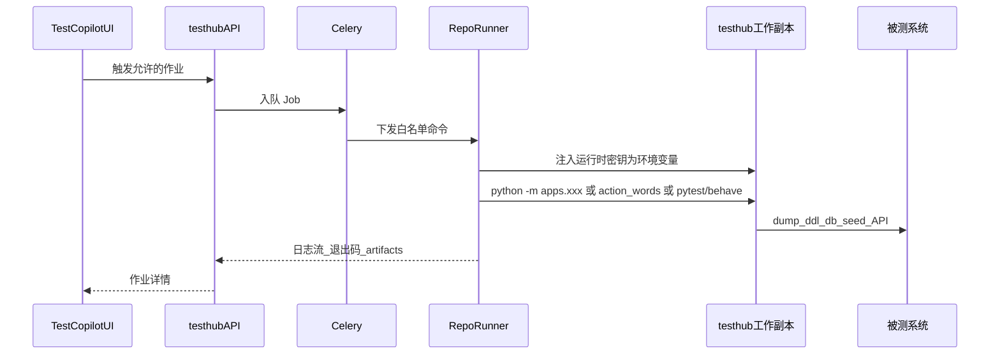

# TestCopilot 架构与计划

本文件是 Plane fork 上 **TestCopilot** 的设计正文。作者：**tuner**。入口见仓库根 [`TESTCOPILOT.md`](../../TESTCOPILOT.md)。

基线：官方 release **v1.4.1**（2026-08-07），开发分支 `testcopilot/v1.4.1`。

许可证：上游 **AGPL-3.0**。自研模块同样受约束；公开 GitHub fork 会把 overlay 一并公开。

对外产品名是 **TestCopilot**。执行相关代码、URL、Django app 仍用 `testhub`。数据源绑定走 `plane.gitsync`。

---

## 世界观

测试与规格仓是 **repo as a platform**：能力在 git（约定目录 + CLI + INDEX），不在数据库。

Plane 是类 Linear 的项目管理工具（Workspace / Project / Issue / Cycle / Pages）。本 fork 按 **项目成分** 展示绑定仓，而不是把仓里所有文件堆进 TestCopilot。

- **规格 / 测试 git 仓** = SSOT（可一条仓，也可分仓）
- **配置（gitsync）** = 数据源登记 + 模块绑定 + Sync
- **Formulation** = 被测系统有哪些场景与可复用操作
- **环境** = 这个系统连到哪（脱敏）
- **TestCopilot** = 引用 feature、跑白名单命令、测程与报告
- **Issue** = 缺陷/任务，**不是**测试用例副本



绑定：**一个 Project 下多条 `ProjectGitRemote`，每个产品模块至多绑一条**。允许三条模块指向同一条 local_mount（测试平台仓同时满足三种约定）。不再要求「一个 Project ↔ 一个 git URL」。

---

## 可复用 vs 必须新建

可直接借：Workspace/Project/RBAC、Issue/Cycle/Module/Views/Pages、Webhook、API Token、Session + `X-Api-Key`、Celery、MinIO、OpenAPI、前端壳（侧栏、列表、MobX）。

社区版扩展点 [`apps/web/app/routes/extended.ts`](../../apps/web/app/routes/extended.ts) 目前是空数组，不能当稳定插件 API；侧栏入口要自己打一小块 adapter。

**不要塞进 Issue 模型**：测试用例、feature 步骤、pytest 节点、造数参数、DDL、api_objects、env 正文。这些留在 git 文件里。

---

## Git 拓扑（已就绪）

```text
makeplane/plane                 = upstream（只读；push 已设为 no_push）
chenjianpeng97/plane            = origin
C:\dev\repo\plane               = 本工作副本（只在这里写 TestCopilot overlay）
绑定的 git 仓                   = 由配置模块的 ProjectGitRemote 指向
C:\dev\sourcecode\plane         = 上游只读参考，不要在那里开发
```

稳定 tag：`vX.Y.Z`（忽略 `*-dev` / `*-rc*` / `*-hotfix`）。当前 Latest = **v1.4.1**。

Windows 上 `git fetch upstream` 可能因远程分支名大小写冲突失败，**tags 仍能拉到**。吸收修复：

```bash
git fetch upstream --tags
git merge v1.x.y
```

合入节奏：每 1–2 个官方 patch/minor merge 一次 tag，跑官方测试 + TestCopilot 冒烟。不要长期跟踪 `preview`。

---

## 本仓要新增的域

独立 Django app `plane.testhub` + `plane.gitsync`。前端：`testhub` / `formulation` / `environments` / `gitsync`。

### 1. 配置：ProjectGitRemote + ModuleBinding

见 [`apps/api/plane/gitsync/`](../../apps/api/plane/gitsync/)。

- **ProjectGitRemote**：`local_mount`（本阶段）/ 预留 `git_url`
- **ModuleBinding**：`testhub` | `features`（Formulation）| `environments` | `wiki` | `prd` 各指向一条 Remote
- 文件夹靠 registry 约定发现，不入库
- 历史 `ProjectTestRepo` 仍可被 testhub catalog 回退

未绑定则对应产品页显示引导，链到配置，不报错。

### 2. 约定目录

| 产品模块    | `module_key`   | 约定                                                                                                            |
| ----------- | -------------- | --------------------------------------------------------------------------------------------------------------- |
| Formulation | `features`     | `./*/feature/**/*.feature`；若存在则读 `packages/action_words`、`packages/api_objects`、`packages/page_objects` |
| 环境        | `environments` | `config/env.py`、`env/*.yaml`（非 `*local*`）；`assets/ddl/`、`assets/sql/`。永不读 `env_local.py` 或密钥值     |
| TestCopilot | `testhub`      | 测试平台仓 + `apps.index_platform` + 白名单 CLI                                                                 |
| Wiki / PRD  | `wiki` / `prd` | `docs/` 或 `wiki/`；`prd/`。本阶段无独立产品页                                                                  |

**只读自己绑定的 workdir。** 共仓时磁盘上自然能看到全套目录；分仓时各看各的。Formulation 不偷偷读 testhub catalog。

测程引用存 `module_key=features`、相对路径、Formulation remote 的 git sha。执行仍在 testhub workdir。分仓时由测试平台仓解析同名场景；对不齐则报告标未找到。

### 3. Catalog

- **TestCopilot**：测试仓 `python -m apps.index_platform` 写入 `CatalogSnapshot`。本仓不重写那套扫描。
- **Formulation / 环境**：本仓薄约定扫描，经 `GET .../gitsync/modules/<key>/catalog/` 暴露。规格仓往往没有 `index_platform`。

造数表单仍消费 testhub catalog 里测试仓 `export_catalog()` + JSON Schema。

### 4. RepoRunner（Plane 没有的能力）

API 容器默认到不了 SUT，也不该任意 `subprocess`。执行必须是旁路 Agent：



硬约束：

- 命令白名单：catalog 已登记的 `apps.*`、`packages.action_words`、指定路径的 pytest/behave；禁止自由 shell
- 密钥：项目密钥库或 Runner 本机 `env_local.py`，映射 `ARGON_DB_*` / `TEST_*`；永不写回 git、不进 Job 日志
- 破坏性操作默认 dry-run，需 Admin 二次确认
- 同一 Project 默认串行
- 产物：测试仓 `logs/` / `artifacts/`；大文件进 MinIO

`apps.recorder` 是长驻代理，不是一次性 Job；P2 不做，P4 单独立项。

### 5. UI 信息架构

项目侧栏与 Work items 同级：

1. **Formulation** — 场景 / 动作 / 实现（只读）。不跑测。
2. **环境** — 连接（脱敏）/ 结构（DDL、SQL）。无仓库绑定 Tab。
3. **TestCopilot** — 测程与报告、作业、工具、造数、pytest 节点。
4. **配置** — 数据源 + 模块绑定 + Sync。

旧 URL：`/testhub/tests` → Formulation 场景；`/testhub/components` → 实现；`/testhub/knowledge` → 环境结构。

测程（`TesthubSession`）存引用，不存 Gherkin 正文。失败一键开 Issue（链 Job + 场景名）。

---

## 隔离策略（否则合不进上游）

- 自研放 `apps/api/plane/testhub/`、`apps/api/plane/gitsync/`、对应前端目录；少改同一上游文件
- 必须改的核心文件收成最小 adapter（侧栏常量 + route 合并 + `INSTALLED_APPS` 一行）
- 不改 Issue/Cycle 表语义

### 明确不做

- 不在 Plane DB 编辑/保存 `.feature` 或 pytest 或 env 作为主副本
- 不把测试仓 `.cursor` skill/agent 搬进 Web
- 不在 Web 重写测试仓 `packages.db` / 造数 SQL
- 不在 Formulation 做编辑器，不回写 git
- 不为 Formulation / 环境再拆 Django app
- 首期：无任意 SQL 控制台、无 recorder 常驻

---

## 阶段

### P0 — 绑定与总览

- `plane.testhub` + 项目设置「测试仓库」
- Runner clone/fetch 指定 branch，跑测试仓 `index_platform`，写入 CatalogSnapshot
- 总览：工具数、api_objects、action words、feature/pytest 计数
- 测试仓并行：`apps/index_platform` + apps manifest（在**测试平台仓**实现，不在本仓）

### P1 — 只读可视化

- Gherkin：Feature/Scenario/Tags
- pytest：`--collect-only` 或静态收集
- api_objects 路由树、action words describe + schema
- DDL/SQL 索引（点开再拉单文件）

### P1b — 项目成分与分模块绑定

- `plane.gitsync` 多 Remote + ModuleBinding
- Formulation / 环境 / TestCopilot 一级入口
- 约定 catalog/files；Sync fan-out
- 测程引用 stub（空报告，尚未接 behave）

### P2 — 编排执行

- Job + 日志流 + 白名单
- `python -m packages.action_words run <id> --params ...`（造数主路径）
- 已登记 apps：`dump_ddl`、`index_ai`；`init_repo` 仅 Admin
- 密钥注入与 dry-run；展示 cleanup

### P3 — 跑测与缺陷闭环

- `behave --stage api|ui`、`pytest <nodeid>`
- JUnit/JSON 入库；失败创建 Issue（Job 链接 + 场景名 + 日志片段）
- artifacts → MinIO

### P4

- recorder 生命周期、xmind、多 Runner、git webhook 自动 sync、通过率图表（不是 Plane 自带 burndown）

---

## 风险

- Runner 必须能访问 SUT；Plane Web 不必
- 团队共用 Runner 时密钥必须在项目密钥库，不能只靠工程师本机 `env_local.py`
- 工作副本以绑定 branch 的最新 fetch 为准，不含未推送的本地脏文件
- Formulation 与 testhub 分仓时，feature 路径必须在执行仓能解析
- Plane 官方建议约 12GB RAM；不要把 pytest 跑进 API 容器
- 大面积改核心文件 = fork 失去「吸收官方 bugfix」的意义
