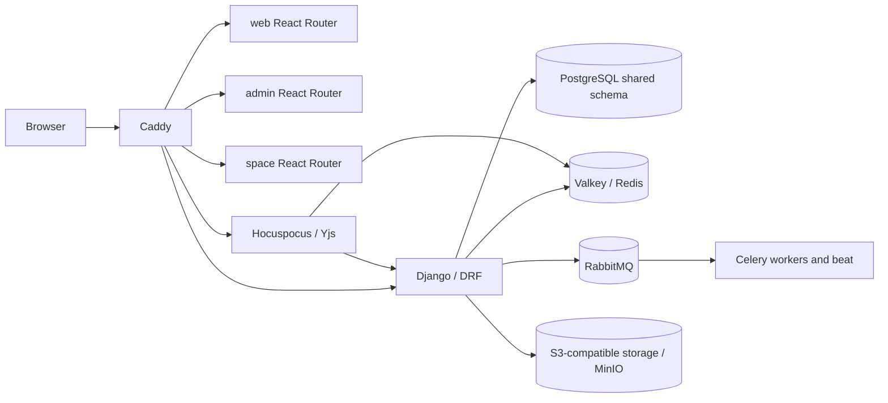
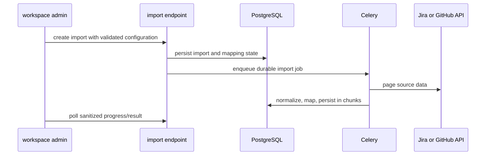

# Unlimited Self-Hosted Target Specification

## 1. Executive Summary

This specification defines an authorized, unrestricted self-hosted target for the checked-out Community deployment. It does **not** propose a new subscription, plan, seat, or entitlement system. Phase 1 found no enforced Community cap on members, projects, teams, work items, aggregate storage, or API access; Phase 2 found that many upgrade labels are presentation rather than backend authorization.

The target separates four independent questions:

1. **Implementation availability:** does this checkout contain a working feature?
2. **Instance configuration:** are the required local services and credentials configured?
3. **Authorization:** may this authenticated user act on this object?
4. **Workspace/project preference:** has the tenant enabled a supported feature for this project?

It preserves finite operational and security controls, including throttling, request/upload bounds, pagination, background-work concurrency, signed URLs, and tenant authorization. “Unlimited” describes business-object counts, not unbounded requests, connection use, or unsafe database operations.

The first implementation should be **P3A — capability and configuration normalization**. It is low-risk foundation work: make the existing configuration truth legible to server and clients, retain project toggles, and eliminate misleading plan-shaped UI decisions only when a later feature-specific review establishes that the implementation is actually available.

## 2. Architecture Baseline

The target retains the current modular-monolith shape:



The React applications are `apps/web`, `apps/admin`, and `apps/space`; the API is `apps/api`; the independently deployable collaboration service is `apps/live`. Tenant isolation remains shared-schema and query/membership based: workspace UUID/slug plus active membership and project scope are the boundary (`apps/api/plane/app/permissions/`, `apps/api/plane/db/models/workspace.py`, and `project.py`). Browser API requests use database-backed sessions; API tokens have separate middleware (`apps/api/plane/api/middleware/api_authentication.py`).

This specification deliberately keeps server-side Admin/Member/Guest authorization authoritative. It does not make frontend route visibility an access control.

## 3. Phase 2 Findings Used by This Specification

| Finding                                                                                                                                   | Target implication                                                                                   | Evidence baseline                                                                                                      |
| ----------------------------------------------------------------------------------------------------------------------------------------- | ---------------------------------------------------------------------------------------------------- | ---------------------------------------------------------------------------------------------------------------------- |
| No backend subscription/seat/entitlement evaluator was found.                                                                             | Do not introduce synthetic plans to govern Community capability.                                     | `docs/architecture.md` §§13–15; `packages/constants/src/{subscription,payment}.ts` are presentation data.              |
| Cycles, modules, views, pages, and intake are persisted project settings.                                                                 | Preserve their project ownership; do not move them into an instance entitlement map.                 | `apps/api/plane/db/models/project.py`; `apps/web/core/components/project/settings/features-list.tsx`.                  |
| Bulk work-item API support is narrow, while the general UI is upgrade-oriented.                                                           | Treat exposure as an operation-by-operation API/security project.                                    | `app/views/issue/{base,archive,label}.py`; `app/urls/issue.py`; `web/core/components/issues/bulk-operations/root.tsx`. |
| Workspace Active Cycles has no aggregate backend implementation.                                                                          | Build it independently from existing cycle queries; do not “unlock” the CTA.                         | `web/app/(all)/[workspaceSlug]/(projects)/active-cycles/page.tsx`.                                                     |
| Analytics and saved analytic views work; dashboard browser code lacks server models/routes.                                               | Reuse analytics for a new dashboard vertical slice only after a server contract is designed.         | `db/models/analytic.py`; `app/urls/analytic.py`; `packages/services/src/dashboard/dashboard.service.ts`.               |
| Automation is scheduled auto-close/auto-archive only.                                                                                     | Design a constrained, event-driven automation MVP; do not represent it as complete.                  | `bgtasks/issue_automation_task.py`; `web/core/components/automation/`.                                                 |
| Jira/GitHub importer models/client types exist without handlers/routes/jobs.                                                              | Complete a background-import vertical slice, including idempotency and progress.                     | `db/models/importer.py`; `app/serializers/importer.py`; integration services in `apps/web`.                            |
| AI, SMTP, OAuth, storage, telemetry, and Unsplash require configuration or remote services.                                               | Present these as configured/disabled optional capabilities, with local alternatives where supported. | `utils/instance_config_variables/core.py`; `settings/storage.py`; `app/views/external/base.py`.                        |
| Custom fields, templates, Active Cycles, MFA/OIDC/SAML/LDAP/SCIM, portfolio planning, custom reports, and application restore are absent. | Treat each as independent new work, not a hidden paid edition.                                       | `docs/feature-gap-analysis.md` §§13–15.                                                                                |

## 4. Product Principles

1. No arbitrary member, seat, project, team, or work-item count cap is introduced.
2. Product capability, configuration, authorization, and project preference remain separate concepts.
3. Backend permission and tenant-scoping checks remain the security authority.
4. Frontend visibility must reflect server truth, but cannot replace server enforcement.
5. Existing project feature booleans remain project-scoped configuration.
6. Optional services are administrator-configured; core work management remains usable without vendor-hosted APIs.
7. Safety controls are bounded and observable; business counts are not used as commercial controls.
8. Missing functionality is independently designed and implemented through the public application architecture, not inferred from marketing text or proprietary editions.
9. Core operation must have no runtime dependency on vendor billing or license services.
10. All new functionality must preserve shared-schema tenant isolation, auditability, and backward compatibility.

## 5. Capability Architecture

### 5.1 Target semantic model

The current system already has the ingredients for capability resolution: instance configuration (`InstanceConfiguration` and `get_configuration_value`), project booleans, and backend permission classes. The recommended target is a small server-side **capability resolver**, not a second feature-flag or plan framework.

```text
Implemented capability      instance configuration       request authorization       project preference
        AI exists       +      LLM configured       +       user may use AI       +       applicable scope
                                                                                         = usable now
```

For each capability, server code should represent only the facts it owns:

| Dimension   | Examples                                         | Source of truth                                 | Never use it for       |
| ----------- | ------------------------------------------------ | ----------------------------------------------- | ---------------------- |
| Implemented | analytics, pages, bulk archive                   | checked-in route/view/model contract            | pricing/edition labels |
| Configured  | SMTP, AI credentials, storage, OAuth             | environment or encrypted instance configuration | object authorization   |
| Authorized  | workspace admin, project member, public anchor   | DRF permissions/decorators and scoped querysets | UI-only hiding         |
| Preferred   | `cycle_view`, `module_view`, `page_view`, intake | `Project` persisted fields                      | global product plans   |

### 5.2 Candidate internal interface

Extend the existing configuration architecture rather than creating a database feature-flag table. A candidate service adjacent to `apps/api/plane/license/utils/instance_value.py` would derive sanitized facts such as:

```python
CapabilityState(
    implemented=True,
    configured=False,
    admin_enabled=True,
    reason="LLM credentials have not been configured",
)
```

The service must not reveal secrets, raw endpoint credentials, internal network topology, or authorization decisions for another workspace. It should delegate object authorization to existing permission classes in `apps/api/plane/app/permissions/`.

### 5.3 Client contract

First evaluate the existing instance configuration read model (`apps/api/plane/license/api/views/instance.py` and `configuration.py`) before adding a new endpoint. If it cannot express sanitized capability state, extend it or add a read-only authenticated instance-capabilities response. It may report `implemented`, `configured`, `admin_enabled`, and non-sensitive reason codes; it must not report API keys, SMTP passwords, OAuth secrets, S3 keys, or provider URLs that administrators have chosen to keep private.

The endpoint is not a substitute for action-time checks. Each mutating API still evaluates its normal project/workspace permission and configuration precondition.

## 6. Configuration Hierarchy

| Layer                   | Owner            | Current examples                                                       | Target responsibilities                                                                       |
| ----------------------- | ---------------- | ---------------------------------------------------------------------- | --------------------------------------------------------------------------------------------- |
| Deployment/environment  | operator         | `DATABASE_URL`, `FILE_SIZE_LIMIT`, `AWS_*`, `RABBITMQ_*`, `SECRET_KEY` | immutable/bootstrap secrets, topology, worker/pool policy; restart or rollout as appropriate. |
| Instance administration | instance admin   | `DISABLE_WORKSPACE_CREATION`, SMTP/OAuth/AI/image configuration        | optional service enablement, non-secret metadata, safe health/configuration status.           |
| Workspace               | workspace admins | members, webhooks, workspace preferences                               | tenant behavior and integrations only within that workspace.                                  |
| Project                 | project admins   | cycles/modules/views/pages/intake booleans, archive/public publishing  | project feature choice and project-specific workflows.                                        |
| User                    | user             | notification preferences, API tokens                                   | personal behavior and credentials; no broad tenant policy.                                    |

`DISABLE_WORKSPACE_CREATION` is an instance operator policy read through `get_configuration_value` in `apps/api/plane/app/views/workspace/base.py`; it should remain so. The five existing `Project` booleans should remain stored there, surfaced consistently in navigation/settings, and checked by relevant APIs where feature availability must be enforced.

## 7. Instance Administration Target

The existing Admin application already owns routes for general settings, workspace policy, email, four OAuth providers, AI, and images (`apps/admin/app/routes.ts`). The target expands configuration visibility carefully, not by turning every environment key into a database setting.

| Setting                              | Current source                | Target source                        | Sensitive?                 | Runtime reload                             | Admin UI appropriate?                                |
| ------------------------------------ | ----------------------------- | ------------------------------------ | -------------------------- | ------------------------------------------ | ---------------------------------------------------- |
| Workspace creation policy            | instance config/env           | existing instance config             | No                         | Yes after normal config cache invalidation | Yes                                                  |
| SMTP host/port/TLS/from identity     | instance config/env           | encrypted config or secret reference | Credentials: yes           | controlled reload/test                     | Yes, including test email                            |
| S3/MinIO endpoint/bucket/region      | environment/storage settings  | deployment config + secret reference | Keys: yes                  | rollout preferred                          | status-only; edits only if secret policy supports it |
| OAuth client IDs/provider enablement | instance config/env           | encrypted config/secret reference    | secret: yes                | controlled reload                          | Yes                                                  |
| LLM provider/model/base URL          | instance config/env           | encrypted config/secret reference    | key: yes                   | controlled reload                          | Yes                                                  |
| Telemetry opt-in/exporter            | environment/instance settings | explicit operator policy             | endpoint/key: yes          | controlled reload                          | Yes for opt-in/status                                |
| Rate/body/upload limits              | Caddy/Django/storage settings | validated deployment policy          | No, but security-sensitive | rollout                                    | status and docs first; edits should be deliberate    |
| Worker concurrency/queues            | Celery/deployment             | deployment policy                    | No                         | rollout                                    | status only initially                                |

Admin configuration changes must write an audit event, validate inputs without echoing secrets, and provide status such as “configured,” “connection test failed,” or “requires restart.”

## 8. Secret Management

Existing instance configuration and encryption support lives in `apps/api/plane/license/models/instance.py`, `license/api/views/configuration.py`, and `license/utils/instance_value.py`. Build on that only after confirming encryption key rotation, access logs, and backup handling.

| Secret class                                                      | Target storage                                                                                                      | Rules                                                                                                  |
| ----------------------------------------------------------------- | ------------------------------------------------------------------------------------------------------------------- | ------------------------------------------------------------------------------------------------------ |
| Bootstrap/critical keys: Django `SECRET_KEY`, DB, RabbitMQ, Redis | environment or platform secret manager                                                                              | Never return through API/UI; rotate through deployment procedure.                                      |
| SMTP/OAuth/LLM/integration credentials                            | platform secret manager preferred; otherwise encrypted instance configuration with a deployment-held encryption key | redact on read, validate server-side, audit change metadata only, support rotation without disclosure. |
| S3 access credentials                                             | platform secret manager/environment by default                                                                      | keep endpoint/bucket status separate from credentials; prefer workload identity where available.       |
| User API tokens/webhook secrets                                   | existing domain models/secure generation                                                                            | show only once where current UX permits; store safely; rotate/revoke and audit.                        |

Do not store ordinary plaintext secrets in general settings tables, browser stores, Celery payloads, logs, telemetry, or exception messages. A secret-management upgrade must include migrations/compatibility for existing environment-based deployments and must never silently copy credentials into the database.

## 9. Operational Safeguards

| Control                                  | Why it remains                                  | Current evidence                                                          | Target configuration                                              | Unlimited allowed?                         |
| ---------------------------------------- | ----------------------------------------------- | ------------------------------------------------------------------------- | ----------------------------------------------------------------- | ------------------------------------------ |
| Anonymous/API/auth/email/asset throttles | abuse, credential stuffing, resource protection | `settings/common.py`, `api/rate_limit.py`, `authentication/rate_limit.py` | validated per-class deployment policy with metrics                | No; use explicit bounded rates.            |
| Upload/request size                      | proxy, Django memory, and S3 protection         | `apps/proxy/Caddyfile.ce`, `settings/common.py`, `settings/storage.py`    | one documented value propagated to all layers                     | No; bounded per upload.                    |
| Pagination                               | protects queries/payloads                       | `utils/paginator.py`                                                      | bounded page sizes; add cursor/keyset paths for large collections | No.                                        |
| Bulk work-item batch size                | locks, transactions, event/notification load    | bulk views in `app/views/issue/`                                          | server-enforced, documented batch size plus client chunking       | No.                                        |
| Worker concurrency and queues            | fair scheduling and downstream protection       | `celery.py`, Compose worker processes                                     | deployment-owned queue/concurrency policy                         | No.                                        |
| Signed URL expiry                        | prevents long-lived asset exposure              | `settings/storage.py`                                                     | bounded configurable expiry                                       | No.                                        |
| Retention / hard delete                  | compliance, storage, deletion semantics         | `HARD_DELETE_AFTER_DAYS`, cleanup tasks                                   | explicit operator retention policy                                | Case-specific; never silently “unlimited.” |
| WebSocket capacity                       | memory/connection protection                    | `apps/live/src/{server,hocuspocus}.ts`                                    | proxy/live node limits, load test threshold, alerts               | No.                                        |

These are operational policies, not commercial entitlements. A future central policy inventory should expose effective non-secret values and validate cross-layer consistency rather than treating `0` as unlimited by default.

## 10. Feature-State UX

Replace ambiguous upgrade language only after individual feature verification. The target vocabulary is:

| State                                 | UI behavior                                                                           | API behavior                                    |
| ------------------------------------- | ------------------------------------------------------------------------------------- | ----------------------------------------------- |
| Available                             | normal navigation/action                                                              | successful when authorized                      |
| Disabled by administrator             | visible explanation to authorized users; link to admin guidance where appropriate     | stable capability/configuration error code      |
| Requires configuration                | explain the missing non-secret prerequisite                                           | reject action without leaking credential detail |
| Disabled for this project             | show project-setting explanation to authorized project admins                         | respect project preference and permissions      |
| Not implemented                       | no faux purchase path; hide from normal navigation or show explicit unavailable state | no unsupported endpoint                         |
| License-controlled external component | explain authorization/deployment requirement without bypass guidance                  | no local simulation/fake entitlement            |

The existing `PaidPlanUpgradeModal`, `WorkspaceActiveCyclesUpgrade`, and bulk upgrade banner (`apps/web/core/components/license/`, `active-cycles/`, and `issues/bulk-operations/`) require a feature-by-feature disposition, not a global deletion.

## 11. Existing Feature Exposure Strategy

### 11.1 Bulk work items

Existing endpoints include `BulkDeleteIssuesEndpoint`, `BulkArchiveIssuesEndpoint`, `BulkCreateIssueLabelsEndpoint`, and `IssueBulkUpdateDateEndpoint` in `apps/api/plane/app/views/issue/{base,archive,label}.py`, registered by `app/urls/issue.py`. The browser service/store also calls deletion and archive endpoints (`apps/web/core/services/issue/issue.service.ts`, `web/core/store/issue/helpers/base-issues.store.ts`). The general bulk root nevertheless renders an upgrade banner.

Target scope for a later exposure phase:

- inventory each existing operation and its exact allowed role/project-membership behavior;
- make only verified operations discoverable; do not claim generic multi-property editing before server support exists;
- use a server batch ceiling and client chunking, with a deterministic response per item or per chunk;
- define transaction boundaries: atomic per single operation/chunk where feasible, never a falsely atomic cross-chunk request;
- reject IDs outside the addressed workspace/project, report failed IDs without leaking inaccessible object data, and preserve soft-delete semantics;
- emit existing activity/audit events consistently and deliberately decide notification suppression/coalescing;
- use idempotency or safe repeat semantics for retries, especially archive/label operations;
- cover Admin/Member/Guest, non-member, cross-workspace, cross-project, stale-ID, and partial-failure paths.

The initial target should be a small operation matrix (archive, delete where currently permitted, add/remove label, and date changes only if existing validation is sufficient), not “unlimited bulk mutation.”

### 11.2 Analytics

Analytics and saved analytic views are already implemented in `db/models/analytic.py`, `app/urls/analytic.py`, and `app/views/analytic/`. They need configuration/permission documentation and scale hardening, not a plan gate. Retain bounded query windows, scope all analytics to workspace/project membership, and use asynchronous export already present in the exporter path for expensive delivery.

### 11.3 Project feature settings and workspace creation

Cycles, modules, views, pages, and intake are currently normal project settings. P3A should make their state consistent between project settings, sidebar/navigation, and API capability messaging, without relocating them. Workspace creation remains a self-hosted instance policy through `DISABLE_WORKSPACE_CREATION`.

## 12. Partial Feature Completion Strategy

### 12.1 Importers

`Importer` and its serializer exist (`apps/api/plane/db/models/importer.py`, `app/serializers/importer.py`), and frontend Jira/GitHub client/types exist, but the Phase 2 route search found no registered server handler/job. A completion phase should create one vertical flow:



Required design details: workspace/project authorization; encrypted/temporary source credentials; source-to-local ID mapping; source pagination; checkpointing and idempotency; bounded chunks; retry classification; cancellation; duplicate/mapping policy; progress/error report; activity/audit log; and safe cleanup of credentials. Start with one provider and a deliberately narrow mapping before exposing a nominal Jira/GitHub importer.

### 12.2 Dashboards

The dashboard service/store calls endpoints absent from the registered backend/models (`packages/services/src/dashboard/dashboard.service.ts`; contrast `UserWorkspaceDashboardEndpoint` in `app/views/workspace/base.py`). Recommendation: complete dashboards as a **new workspace-scoped feature built on analytics APIs**, rather than preserving a dangling client contract or inventing a second analytics engine.

MVP architecture:

- `Dashboard` belongs to a workspace, with owner, visibility, timestamps, soft deletion, and optimistic-lock/version field;
- `DashboardWidget` belongs to a dashboard and stores layout plus a validated analytic-query definition, not arbitrary SQL;
- widget definitions reuse supported filters, dimensions, measures, and visualization contracts from analytics;
- views/editing obey workspace membership and a clearly defined owner/admin sharing policy;
- use cached/async refresh only for expensive widgets, with bounded fan-out and no unscoped aggregation.

### 12.3 Automation

The existing auto-close/auto-archive task is not a generic automation system (`bgtasks/issue_automation_task.py`). A future MVP should add durable, workspace/project-scoped `AutomationRule`, condition, action, execution, and failure-history concepts, while preserving the existing scheduled behavior until a compatibility migration is proven.

Recommended MVP:

- triggers: scheduled due-date evaluation, work item created, status changed, and assignee changed;
- conditions: project, state/status, priority, assignee, label, and due-date checks;
- actions: status update, assignment, label add/remove, comment, archive, and webhook;
- event dispatch from existing mutation/service boundaries, with Celery execution for non-trivial actions;
- idempotency key per rule/event/work item, depth/recursion limit, self-trigger prevention, retries with bounded backoff, and durable failure records;
- execute actions under a defined system actor constrained to the rule creator/workspace policy—not an unrestricted superuser;
- audit rule changes and executions; notify rule admins on terminal failures.

This is intentionally not a BPM/approval platform. Approvals and arbitrary script execution are out of MVP scope.

## 13. External Dependency Strategy

### 13.1 SMTP

SMTP is needed for magic links, resets, invitations, and email notifications; core local work management can otherwise run without it. Use the current email configuration surface in `utils/instance_config_variables/core.py` and Admin routes as a basis. Target Admin UX: host, port, TLS mode, username, secret reference, from address/name, a redacted status, and admin-only test email. Never return the stored password.

### 13.2 Object storage

The current storage adapter supports S3-compatible storage and Compose supplies MinIO (`apps/api/plane/settings/storage.py`, `docker-compose.yml`). Treat S3/MinIO as the supported self-hostable path for attachments/exports. Retain workspace-keyed paths, presigned upload content-length conditions, signed downloads, lifecycle cleanup, and a bounded per-upload policy. Infrastructure backup must cover both PostgreSQL and object data.

### 13.3 AI

The current external endpoint reads `LLM_API_KEY`, `LLM_PROVIDER`, and `LLM_MODEL` and constructs an OpenAI SDK client (`apps/api/plane/app/views/external/base.py`). The provider labels do not themselves prove Anthropic/Gemini adapters. Future work should introduce a narrow provider interface, initially preserving an OpenAI-compatible adapter with configurable base URL, model, timeout, and retry policy. It can then support a local compatible inference server only when an administrator configures it. AI remains optional, permission-scoped, rate/cost bounded, and must not send data to a provider without an explicit operator configuration.

### 13.4 OAuth

Google, GitHub, GitLab, and Gitea sign-in are configured under the existing authentication/admin configuration paths. Password/magic authentication remains the non-provider core. A self-hosted IdP needs a separate OIDC/SAML track; do not label an OAuth provider form as enterprise SSO.

### 13.5 Telemetry

Telemetry/APM support is optional (`settings/production.py`, `license/bgtasks/telemetry_metrics.py`). Operators need explicit opt-in/out, data inventory, destination, failure isolation, and local collector guidance. Keep local logs/health diagnostics even when outbound telemetry is disabled.

### 13.6 External media and integrations

Unsplash uses `api.unsplash.com` through `UnsplashEndpoint`; it is decorative/optional and should degrade to no search or a separately implemented local asset catalog. Webhooks, GitHub, and Slack target customer-chosen remote services and must retain SSRF defenses (`app/views/webhook/base.py`, `bgtasks/webhook_task.py`, and relevant settings).

## 14. New Feature Architecture

### 14.1 Custom fields

Custom fields are source absent. Use typed definition/value tables rather than dynamically altering PostgreSQL columns per field.

MVP design:

- workspace-owned definitions, with optional project applicability; immutable internal key plus display name, type, required flag, ordering, and archived state;
- types: short text, number, boolean, date, single select, multi select, user, and URL; defer formula, rollup, and arbitrary relation fields;
- value table scoped to workspace/project/work item with typed columns or a validated JSON payload plus selectively indexed normalized fields; enforce a unique `(field, work_item)` value;
- server validation in serializers/services, permissioned definition administration, and deterministic API serialization;
- filters/sorts only for types/indexes explicitly supported by the MVP; no slow unbounded JSON scans;
- import/export mappings and analytics support added incrementally after the value contract is stable.

Every query must include workspace/project scope before field joins. Definition removal should archive fields first and use an explicit data-retention policy.

### 14.2 Templates

Templates are source absent. Start with project and work-item templates, not workspace/page templates.

- templates are workspace-owned, permissioned, and versioned snapshots;
- applying a template creates new entities transactionally from a snapshot; it must not establish accidental mutable references to the template;
- project templates may snapshot states, labels, estimates, feature preferences, and selected settings; work-item templates snapshot supported work-item fields, labels, and optionally child items;
- attachments, external integrations, members, secrets, and public anchors are out of initial cloning scope;
- imports/exports and sharing follow only after ownership/versioning semantics are tested.

### 14.3 Active Cycles

Build Workspace Active Cycles as a read aggregate over existing cycle data, not a duplicate cycle store. A workspace-scoped endpoint should filter cycles by workspace and the caller’s project membership/role, support state/project/assignee filters, order deterministically, and paginate. Cache only scoped aggregate results with invalidation tied to cycle/work-item updates. The current upgrade route can later be replaced only once this endpoint, permission coverage, and UI are complete.

### 14.4 Identity: MFA, OIDC, SAML, LDAP, and SCIM

These are separate tracks:

1. **MFA:** highest security value and comparatively independent. Design enrollment, recovery, challenge, reset/admin recovery, audit, rate limiting, and session/token interaction.
2. **OIDC:** preferred first external-IdP integration for self-hosted deployments; support discovery, issuer/audience validation, state/nonce/PKCE, identity linking, domain policy, and configuration rotation.
3. **SAML:** later protocol-specific work with signed assertion validation, metadata lifecycle, strict audience/recipient checks, and account-linking policy.
4. **LDAP:** separate directory lookup/auth synchronization with TLS, bind-secret safeguards, mapping, and failure isolation.
5. **SCIM:** lifecycle provisioning only after identity identifiers, deprovision semantics, group/role mapping, audit, and external-id idempotency are stable.

No identity implementation may weaken local auth, workspace tenancy, session security, or Admin recovery protections.

### 14.5 Portfolio planning

The current higher-level planning entity is `Module`; there is no verified Epic/Initiative model. A future design should avoid copying Jira terminology by default. A viable independent hierarchy is workspace-scoped **Initiative** (optional parent) linked to projects/modules, with work items continuing under projects/modules. It needs explicit cross-project membership rules, aggregate progress semantics, read-only/reporting first, and strict workspace scoping. Do not start with arbitrary hierarchy depth or cross-tenant sharing.

### 14.6 Custom reporting

Extend analytics rather than create another query engine. A report definition should store validated dimensions, measures, filters, visualization type, and scope; its executor should call shared analytics query builders. MVP: saved reports, selected supported dimensions/measures, workspace/project filters, CSV export, and member/admin visibility. Expensive reports need pagination/caching/asynchronous export, query cost guards, and no raw SQL expression UI.

### 14.7 Backup and restore

Prioritize documented **infrastructure backup** first: PostgreSQL-consistent backup/PITR, object-storage versioning/replication, configuration/secrets recovery procedures, and restore drills. Redis is generally reconstructed cache/state unless a deployment-specific dependency requires capture. Application-level export/restore is a separate, high-risk feature: it must package workspace data, attachment references/content, pages/Yjs compatibility data, mappings, validation, and conflict strategy. Do not build an in-product restore button before a safe isolated restore workflow is designed and tested.

## 15. Security Requirements

Every future capability exposure or new endpoint must meet this checklist:

1. Authenticate using the existing session/API-token model as appropriate.
2. Resolve workspace by slug/UUID and constrain the base queryset before object lookup.
3. Apply active workspace membership and project membership/role checks through existing permission mechanisms.
4. Enforce object-level access for pages, assets, public anchors, imports, reports, and dashboard widgets.
5. Preserve CSRF, CORS, signed URL, upload validation, SSRF/webhook, and throttle protections.
6. Return non-enumerating errors for inaccessible cross-tenant object IDs.
7. Ensure Celery tasks carry workspace/project IDs and revalidate relevant state rather than trusting browser payloads.
8. Include direct API authorization and cross-workspace tests; navigation visibility is not test evidence.

The `space` public-sharing model based on `DeployBoard` is an intentional exception boundary, not a way to bypass private project checks. Hocuspocus document authorization remains a dedicated test target because it delegates identity validation through API callbacks (`apps/live/src/lib/auth.ts`, `apps/live/src/extensions/database.ts`).

## 16. Audit Requirements

Reuse current activity/log patterns where applicable, but design a normalized audit event stream before claiming a unified audit-log feature. At minimum, future work should record actor, workspace, object type/ID, action, timestamp, request/correlation ID where available, non-secret before/after summary, and result/failure class.

Audit-required actions include bulk work-item actions; automation rule edits/executions; importer start/progress/completion/failure; admin configuration changes; identity-provider changes; custom-field definition changes; template application; workspace export; dashboard/report sharing; and security recovery actions. Preserve existing page/API/webhook/activity logs (`db/models/page.py`, `db/models/webhook.py`, `bgtasks/logger_task.py`) during any unification migration.

## 17. Offline / Air-Gapped Strategy

| Dependency                                   | Core requirement?                 | Can disable?                            | Local replacement / behavior                               |
| -------------------------------------------- | --------------------------------- | --------------------------------------- | ---------------------------------------------------------- |
| PostgreSQL, RabbitMQ, Valkey, object storage | Yes for full deployed feature set | No                                      | self-operated PostgreSQL/RabbitMQ/Valkey/MinIO.            |
| SMTP                                         | No for local work management      | Yes                                     | disable email workflows or use internal SMTP.              |
| OAuth                                        | No                                | Yes                                     | password/magic; later local OIDC provider.                 |
| AI                                           | No                                | Yes                                     | local OpenAI-compatible endpoint after adapter work.       |
| Unsplash                                     | No                                | Yes                                     | no image search/local asset catalog.                       |
| Telemetry/APM                                | No                                | Yes                                     | local collector or local logs/metrics.                     |
| Upgrade/pricing URLs                         | No                                | Yes from normal product UX after review | no core dependency.                                        |
| Webhooks/integrations                        | No                                | Yes                                     | local endpoints/integrations where operator supplies them. |

An air-gapped acceptance profile should prove that workspace/project/work-item lifecycle, internal pages, local object storage, notifications without outbound delivery, and public sharing (if policy permits) operate without outbound vendor traffic.

## 18. Scalability Architecture

Scalability comes from bounded operations and deployment sizing, not business caps. Current risks documented in `docs/architecture.md` include offset pagination/counts, database-backed search, per-project issue-sequence advisory locks, one undifferentiated Celery worker shape, and unprescribed live-service capacity.

Principles:

- paginate all list APIs; prefer cursor/keyset pagination for deep high-cardinality collections;
- scope/filter before count, join, aggregation, or export;
- run imports, exports, large analytics, automation, notifications, and AI asynchronously where request latency is unsuitable;
- use bounded chunks and idempotency for large operations;
- index new multi-tenant query paths with workspace/project leading columns where query plans justify it;
- isolate queue workloads and observe backlog age/depth;
- horizontally scale API/live nodes with shared dependencies and tested load-balancer WebSocket behavior;
- measure query time/rows, DB lock waits, storage errors, cache evictions, and queue lag before changing limits.

## 19. Database Hardening Backlog

| Area                              | Evidence                                 | Future work                                                                                                            |
| --------------------------------- | ---------------------------------------- | ---------------------------------------------------------------------------------------------------------------------- |
| Work-item list/search             | offset paginator and queryset search     | introduce cursor/keyset paths for deep feeds; run `EXPLAIN` on tenant/project filters before indexes.                  |
| Issue sequence writes             | advisory lock in `db/models/issue.py`    | measure lock contention per busy project; preserve correctness while considering allocation strategies only if needed. |
| Activities/notifications/comments | high-volume models and log tasks         | retention/index review, scoped archival strategy, and query-plan tests.                                                |
| Analytics/reporting               | analytics and planned dashboards/reports | enforce filter cardinality, preaggregation/caching only after measured need, and separate export jobs.                 |
| Custom fields (new)               | absent feature                           | design indexes by supported type/filter; do not rely on unindexed generic JSON queries.                                |
| Importer mappings (new)           | importer model exists                    | unique source IDs per provider/workspace/project; checkpoints and idempotent constraints.                              |
| Audit stream (new)                | fragmented logs                          | append-focused, tenant-indexed schema with retention/export strategy.                                                  |

All migrations need backward-compatible defaults, data backfill strategy, rollback consideration, and tenant-aware performance testing on representative data.

## 20. API Hardening Backlog

- Define stable pagination behavior and cursor semantics for high-volume routes while preserving existing offset contracts during transition (`apps/api/plane/utils/paginator.py`).
- Keep hard maximum page and bulk sizes; expose validation errors and client chunking guidance.
- Add idempotency keys to imports, exports, bulk mutation, and selected integration calls where retries can duplicate effects.
- Standardize async job status resources for import/export/automation rather than holding long HTTP requests.
- Add correlation/request IDs to auditable long-running operations.
- Establish versioning/deprecation guidance before adding broad new public API surface; the current API is REST route-family based, not GraphQL.
- Add contract tests for scope/permission parity between browser and API-token access.

## 21. Background Jobs

Celery currently handles invitations, mail, notifications, activities/webhooks, exports, cleanup, analytics, and telemetry (`apps/api/plane/bgtasks/`). The future target uses dedicated queues at least for latency-sensitive notifications/email, webhook delivery, long-running imports/exports, automation, AI, and maintenance. Each job family needs explicit concurrency, time limits, retry/backoff classification, idempotency, observability, and failure/dead-letter handling. Existing worker behavior must remain compatible until routing is introduced through an incremental deployment configuration change.

## 22. Realtime Scaling

`apps/live` uses Hocuspocus/Yjs, Redis coordination, API session validation, and a save debounce. Before scaling document collaboration, define: session/document authorization test suite, shared Redis resilience, WebSocket upgrade/timeout settings in Caddy/load balancer, node connection/memory limits, graceful drain behavior, document persistence recovery, and per-tenant connection metrics. Sticky sessions are not assumed to be required with correct shared Hocuspocus/Redis coordination, but this must be verified by multi-node integration tests rather than deployment folklore.

## 23. Deployment Profiles

These are sizing examples, not product tiers or enforced limits.

| Profile | Typical use                                  | Shape                                                                                                                                          | Operational focus                                                                             |
| ------- | -------------------------------------------- | ---------------------------------------------------------------------------------------------------------------------------------------------- | --------------------------------------------------------------------------------------------- |
| Small   | up to roughly 50 active users                | one API/web stack, one worker, PostgreSQL, Valkey, RabbitMQ, MinIO                                                                             | backups, SMTP/storage configuration, monitoring, tested restores.                             |
| Medium  | hundreds of active users                     | multiple API processes/nodes, separated worker roles, external/managed PostgreSQL and scalable object storage                                  | connection pools, queue routing, DB monitoring, backup/PITR, live load tests.                 |
| Large   | thousands of active users and heavy activity | horizontally scaled API/live, dedicated worker pools, PgBouncer or equivalent, HA/managed database, scalable Redis/RabbitMQ and object storage | capacity planning, replicas/PITR, queue SLOs, tracing, load/failure tests, disaster recovery. |

Actual capacity depends on workload mix, attachments, automation, concurrent editing, query shape, and hardware. Measure rather than convert these examples into admission limits.

## 24. Master Implementation Backlog

| Category                      | Candidate                                        | Value    | Complexity | Security risk | Dependency  | Readiness |
| ----------------------------- | ------------------------------------------------ | -------- | ---------- | ------------- | ----------- | --------- |
| A Configuration normalization | instance capability resolver/read model          | High     | Low        | Low           | Independent | High      |
| A Configuration normalization | effective-policy inventory and docs              | High     | Low        | Low           | Independent | High      |
| B Existing exposure           | scoped bulk work-item UX/API parity              | High     | Medium     | Medium        | Moderate    | Medium    |
| B Existing exposure           | project toggle consistency                       | Medium   | Low        | Low           | Independent | High      |
| C Partial completion          | importer backend, one provider                   | High     | High       | High          | Heavy       | Low       |
| C Partial completion          | dashboard backend on analytics                   | Medium   | High       | Medium        | Heavy       | Low       |
| C Partial completion          | automation MVP                                   | High     | High       | High          | Heavy       | Low       |
| D External dependency         | admin SMTP/AI/OAuth status and secret governance | High     | Medium     | High          | Moderate    | Medium    |
| D External dependency         | OpenAI-compatible configurable base URL adapter  | Medium   | Medium     | Medium        | Moderate    | Medium    |
| E New feature                 | Active Cycles aggregate                          | Medium   | Medium     | Medium        | Moderate    | Medium    |
| E New feature                 | templates MVP                                    | Medium   | High       | Medium        | Heavy       | Low       |
| E New feature                 | custom fields MVP                                | High     | Very High  | High          | Heavy       | Low       |
| E New feature                 | custom reporting/portfolio                       | Medium   | High       | Medium        | Heavy       | Low       |
| F Scale                       | pagination/query/queue hardening                 | Critical | High       | Medium        | Heavy       | Medium    |
| G Security                    | MFA                                              | High     | High       | High          | Moderate    | Low       |
| G Security                    | OIDC, then SAML/LDAP/SCIM                        | High     | High       | High          | Heavy       | Low       |

## 25. Prioritized Roadmap

1. **P3A — Capability and configuration normalization.** Establish the common terms/read model without changing feature availability.
2. **P3B — Operator configuration and secret-status UX.** Make existing SMTP/storage/OAuth/AI/telemetry policy understandable and safely administrable.
3. **P4A — Bulk work-item operation verification and exposure.** Only expose the verified existing operation set after API/permission/audit coverage.
4. **P4B — Active Cycles aggregate.** A bounded, clear new read feature leveraging existing cycle data.
5. **P5A — Importer vertical slice.** Complete one provider end-to-end with durable job semantics.
6. **P5B — Dashboard server contract.** Build on analytics, with safe saved widgets/layouts.
7. **P6A — Automation MVP.** Add a constrained event/action engine with guardrails.
8. **P6B — Templates MVP.** Snapshot-based project/work-item reuse.
9. **P7A — MFA.** Strengthen local account security before broad enterprise directory work.
10. **P7B — OIDC.** Then assess SAML, LDAP, and SCIM as independent tracks.
11. **P8A — Custom fields MVP.** Only with agreed filtering/index/migration design.
12. **P8B — Custom reports and portfolio planning.** Reuse analytics and existing modules/projects deliberately.
13. **P9 — Continuous scale, audit, backup/restore, and realtime hardening.** Deliver in measurable, operational micro-phases.

## 26. Detailed Phase Specifications

### P3A — Capability and configuration normalization

**Objective:** Establish consistent capability state without plans/entitlements or runtime feature exposure.

**Scope:** Inventory existing instance configuration, add/extend a sanitized capability read model if the current instance endpoint cannot express it, define project-toggle semantics, and establish frontend/server consumption rules.

**Out of scope:** changing upgrade UI, enabling bulk operations, new flags, new product features, secret migration.

**Existing components reused:** `InstanceConfiguration`, `get_configuration_value`, instance/configuration API views, project booleans, DRF permissions.

**New components:** minimal resolver/read serializer only if the current endpoint is insufficient; shared reason-code vocabulary.

**Database changes:** none expected.

**Backend changes:** sanitized capability resolution and tests; no action authorization change.

**Frontend changes:** consume state only in later feature-specific work; no navigation exposure in this phase.

**Admin changes:** configuration status inventory, if supported without secret disclosure.

**Permissions / security:** admin-only instance data; preserve per-action permission enforcement.

**Tests:** resolver precedence, environment/config behavior, secret redaction, Admin/Member/Guest visibility, no cross-tenant detail.

**Migration / compatibility risks:** environment-vs-database precedence and configuration caching; document unchanged defaults.

**Documentation:** effective configuration hierarchy and capability-state meanings.

**Dependencies:** none beyond confirmed current configuration paths.

**Completion criteria:** a reviewed source-of-truth map; tested, non-secret capability states where required; project toggles still project-scoped; no plan evaluator introduced.

### P3B — Operator service configuration UX and secret governance

**Objective:** Make currently external-dependent functionality safe to configure and diagnose.

**Scope:** SMTP, OAuth, LLM, storage status, telemetry policy, validation/test operations, secret redaction/audit.

**Out of scope:** new OAuth protocols, LLM provider adapters, vendor integrations, plaintext secret migration.

**Existing components reused:** Admin routes/forms, instance configuration variables, storage/email/auth settings.

**New components:** health/configuration status checks, safe test-email task, audit records as applicable.

**Database changes:** only if secure secret reference metadata is necessary; avoid storing environment secrets by default.

**Backend changes:** server-side validation/redaction/test endpoints with throttling.

**Frontend changes:** Admin configuration status and non-secret error states.

**Admin changes:** provider setup, rotation/status, restart requirement guidance.

**Permissions / security:** instance-admin only; redact all reads/logs; SSRF/network policy for connection tests.

**Tests:** invalid config, secret redaction, permission denial, test task failure/timeout, unchanged environment deployments.

**Migration / compatibility risks:** credentials/precedence; feature must remain optional when unconfigured.

**Documentation:** SMTP, MinIO/S3, OAuth, AI, telemetry runbooks.

**Dependencies:** P3A capability/read model.

**Completion criteria:** an administrator can determine readiness without revealing a secret; no vendor runtime requirement for core work management.

### P4A — Bulk work-item operation verification and exposure

**Objective:** Provide only the already-supported, security-validated bulk operations to authorized self-hosted users.

**Scope:** endpoint operation matrix, bounded chunks, UI/API parity, activity/audit, partial-result semantics.

**Out of scope:** a generic bulk property editor, unbounded payloads, workflow engine.

**Existing components reused:** existing bulk issue endpoints, browser issue service/store, project permissions, activity machinery.

**New components:** capability/operation metadata if necessary; result schema and client chunking helper.

**Database changes:** none expected initially.

**Backend changes:** normalize validation/transaction behavior, add missing operation-specific guards, emit events deliberately.

**Frontend changes:** replace only the corresponding CTA path after backend verification; surface progress/partial failures.

**Admin changes:** optional effective batch-policy status only.

**Permissions / security:** direct endpoint tests for Admin/Member/Guest and cross-project/workspace IDs; no UI-only protection.

**Tests:** valid chunks, oversized batch, retry, stale/missing IDs, partial failure, audit/activity, notification behavior.

**Migration / compatibility risks:** preserve existing endpoint contracts and soft-delete semantics.

**Documentation:** supported operations, role behavior, batch policy, retry semantics.

**Dependencies:** P3A; verified activity/audit integration.

**Completion criteria:** each exposed control has a tested server endpoint and no remaining upgrade-only UI for that exact supported action.

### P4B — Workspace Active Cycles aggregate

**Objective:** Add a workspace-scoped read aggregate over existing cycles.

**Scope:** scoped endpoint, filters, pagination, navigation/page implementation, authorization/cache tests.

**Out of scope:** recurring cycles, new cycle storage, cross-workspace portfolio planning.

**Existing components reused:** `Cycle` model/views/query patterns, workspace/project permissions, existing CTA route.

**New components:** aggregate query/serializer/endpoint and actual page data view.

**Database changes:** none initially; add measured indexes only after query-plan evidence.

**Backend changes:** tenant/project-membership-aware aggregate route.

**Frontend changes:** replace CTA only after server contract works.

**Admin changes:** none.

**Permissions / security:** only cycles from visible projects; non-enumerating cross-project behavior.

**Tests:** project visibility matrix, pagination/filtering, cache invalidation, cross-workspace isolation.

**Migration / compatibility risks:** no duplicated source of truth.

**Documentation:** scope and aggregation behavior.

**Dependencies:** P3A capability UX vocabulary.

**Completion criteria:** CTA is not treated as an upgrade shortcut; a tested aggregate uses existing data only.

### P5A — Importer vertical slice

**Objective:** Deliver one secure, resumable source importer end-to-end.

**Scope:** API, job, mapping, progress, cancel, report, idempotency, one provider.

**Out of scope:** multiple providers, arbitrary credential storage, full migration parity.

**Existing components reused:** `Importer` model/serializer, Celery, browser integration client/types, work-item/project services.

**New components:** URL/view, job state/checkpoints, provider adapter, mapping tables/constraints as needed.

**Database changes:** importer status/progress/source mapping only if current model cannot safely represent them.

**Backend changes:** authorization, config validation, enqueue, chunked persistence, retry/cancel policy.

**Frontend changes:** import wizard/progress only for supported provider.

**Admin changes:** provider credential/status guidance where instance credentials are relevant.

**Permissions / security:** workspace/project admin; encrypted short-lived credentials; inbound data validation; audit.

**Tests:** idempotent restart, paging, partial failure, cancellation, duplicate mapping, cross-tenant denial, Celery retry.

**Migration / compatibility risks:** no mutation until mapping validation; avoid duplicate issues/users.

**Documentation:** supported source/version, mapping limits, recoverability.

**Dependencies:** P3B secret posture, dedicated long-running queue policy.

**Completion criteria:** one provider imports a documented supported subset safely, reports result, and survives retry without duplication.

### P5B — Dashboard backend on analytics

**Objective:** Replace the dangling dashboard client contract with a workspace-scoped, analytics-backed dashboard MVP.

**Scope:** dashboard/widget persistence, validated widget query contract, layout, sharing, UI.

**Out of scope:** arbitrary SQL, public dashboards, cross-workspace widgets, unbounded refresh.

**Existing components reused:** analytics models/routes/query logic, dashboard service/store, workspace permissions.

**New components:** dashboard/widget models, serializers/endpoints, cache/refresh behavior.

**Database changes:** new tenant-scoped dashboard/widget tables and indexes.

**Backend changes:** validated query definitions and sharing/ownership enforcement.

**Frontend changes:** align service paths/contracts and route UI.

**Admin changes:** none initially.

**Permissions / security:** workspace-only queries; widget config cannot escape analytics authorization.

**Tests:** sharing roles, query validation, cross-workspace deny, soft deletion, cache/refresh limits.

**Migration / compatibility risks:** preserve/remove orphan browser paths deliberately.

**Documentation:** supported widget types and data freshness.

**Dependencies:** analytics contract review; P3A state definitions.

**Completion criteria:** a dashboard is persisted, authorized, and renders supported analytics without missing routes.

### P6A — Automation MVP

**Objective:** Add a constrained event/schedule rule engine with durable safety controls.

**Scope:** MVP triggers/conditions/actions defined in §12.3, Celery execution, audit/failure history.

**Out of scope:** approvals, arbitrary scripts, arbitrary HTTP code execution, unlimited recursion.

**Existing components reused:** scheduled automation, issue mutation services, Celery, activities/webhooks.

**New components:** rule/condition/action/execution models, dispatcher, evaluator, admin/project UI.

**Database changes:** tenant/project-scoped rule/execution tables and idempotency constraints.

**Backend changes:** event hooks, permissioned CRUD, asynchronous executor.

**Frontend changes:** project automation rule management/history.

**Admin changes:** instance policy for automation availability/concurrency only.

**Permissions / security:** system actor constraints, recursion/depth controls, webhook SSRF controls, audit.

**Tests:** trigger/action matrix, recursion, duplicate events, retries, disabled project/rule, scope/role denial.

**Migration / compatibility risks:** preserve auto-close/auto-archive behavior and migrate only with explicit equivalence tests.

**Documentation:** supported actions/limits/failure semantics.

**Dependencies:** queue separation, audit-event design, capability normalization.

**Completion criteria:** deterministic MVP rules execute once per qualifying event with traceable outcome and no privilege escalation.

### P6B — Templates MVP

**Objective:** Provide safe snapshot-based project and work-item templates.

**Scope:** owned templates, versioned snapshot, apply/clone, permissions, tests.

**Out of scope:** pages/workspaces, integration/secret cloning, public template marketplace.

**Existing components reused:** project/work-item serializers/services, labels/states/settings, asset policy.

**New components:** template models, snapshot schema, apply service/API/UI.

**Database changes:** workspace-scoped template/version tables.

**Backend changes:** validated snapshot/create transaction and permission checks.

**Frontend changes:** template management/apply UI.

**Admin changes:** none initially.

**Permissions / security:** workspace ownership, apply authorization, no leaked private members/assets.

**Tests:** snapshot immutability, apply isolation, unsupported fields, role/cross-tenant denial.

**Migration / compatibility risks:** no rewriting existing projects/issues.

**Documentation:** copied/not-copied field matrix.

**Dependencies:** stable project/work-item configuration semantics.

**Completion criteria:** a template creates a correct independent entity with deterministic supported content.

### P7A — MFA

**Objective:** Add optional local multi-factor authentication without weakening current session/password/OAuth behavior.

**Scope:** enrollment, challenge, recovery, reset/recovery governance, audit, throttling, and account-security UX.

**Out of scope:** OIDC, SAML, LDAP, SCIM, mandatory rollout, and a forced migration away from password authentication.

**Existing components reused:** custom User/session/auth URLs, Admin configuration, email tasks.

**New components:** encrypted MFA secret/recovery models, enrollment and session-challenge flow, security audit records.

**Database changes:** additive encrypted MFA/recovery state only.

**Backend changes:** authenticated enrollment, secure verification, session transition logic, recovery controls.

**Frontend changes:** account-security enrollment, recovery, and challenge pages.

**Admin changes:** recovery/enforcement policy with auditable break-glass controls.

**Permissions / security:** high; explicit threat model, CSRF, throttles, recovery safeguards, and no plaintext secrets.

**Tests:** replay, invalid challenge, recovery, session transitions, account lockout/rate behavior, admin/user authorization.

**Migration / compatibility risks:** existing sessions and OAuth accounts remain valid; enforcement stays opt-in until migration policy is approved.

**Documentation:** enrollment, recovery, administrator recovery, rollback.

**Dependencies:** secret governance and audit requirements.

**Completion criteria:** MFA is optional, independently secure, tested, and does not weaken existing authentication.

### P7B — OIDC

**Objective:** Support standards-based login through a self-hosted or external OpenID Connect identity provider.

**Scope:** discovery, issuer/audience validation, state/nonce/PKCE, callback/linking policy, configuration, and audit.

**Out of scope:** SAML, LDAP, SCIM, bulk directory provisioning, and removal of password/magic login.

**Existing components reused:** authentication provider patterns, session/callback handling, Admin configuration routes.

**New components:** OIDC provider configuration and identity-link models, discovery/validation service, Admin and login UI.

**Database changes:** additive provider and external-identity mapping tables with stable external IDs.

**Backend changes:** standards-compliant authorization-code callback, identity linking, account collision handling, and configuration validation.

**Frontend changes:** provider sign-in action and Admin IdP configuration/status.

**Admin changes:** issuer/client metadata, secret reference, allowed domain/linking policy, audit and disable/rotation controls.

**Permissions / security:** high; strict issuer/audience/redirect validation, PKCE/state/nonce, no token leakage, throttled callbacks.

**Tests:** discovery errors, invalid issuer/audience/state/nonce, account collision, disabled provider, Admin/non-admin paths.

**Migration / compatibility risks:** preserve current provider/local identities and explain account-linking choices before activation.

**Documentation:** IdP setup, redirect URLs, secret rotation, identity-linking and rollback.

**Dependencies:** P3B secret posture and P7A account-security/audit patterns where reusable.

**Completion criteria:** an authorized administrator can configure OIDC safely and users can sign in without cross-account or tenant leakage.

### P8A — Custom fields MVP

**Objective:** Add typed, indexed, workspace-owned custom fields to work items.

**Scope:** definition/value storage, supported types, validation, work-item UI, first filters/sorts, and phased import/export support.

**Out of scope:** formulas, rollups, arbitrary relation graph, unindexed generic JSON querying, and automatic conversion of existing fields.

**Existing components reused:** work-item APIs/filtering, workspace/project permission patterns, exporter/importer infrastructure.

**New components:** field definition/option/value models, serializer/service/query support, workspace settings and work-item UI.

**Database changes:** tenant/project-scoped typed value tables/constraints and measured indexes.

**Backend changes:** validation, scoped CRUD, supported filter/sort semantics, safe archival of definitions.

**Frontend changes:** definition management, value input/rendering, supported filters.

**Admin changes:** none initially; workspace owns definitions.

**Permissions / security:** field-definition admin controls, project applicability checks, object-level query scope.

**Tests:** each field type, option validation, indexed filters, cross-tenant/project isolation, archive/retention behavior.

**Migration / compatibility risks:** query/index load and API serialization compatibility.

**Documentation:** supported type/filter matrix, data retention, import/export coverage.

**Dependencies:** API/database hardening and audit strategy.

**Completion criteria:** supported fields work safely at scale without plan gates or unbounded scans.

### P8B — Custom reporting and portfolio planning

**Objective:** Add analytics-backed saved reports and a limited workspace planning hierarchy as separately reviewable slices.

**Scope:** report definitions using supported analytics dimensions/measures; later a workspace Initiative linked to projects/modules with aggregate progress.

**Out of scope:** arbitrary SQL, deep unlimited hierarchy, cross-workspace widgets, financial portfolio management, and formulas/rollups.

**Existing components reused:** analytics APIs, saved analytic views, projects/modules, export job patterns.

**New components:** report definition/execution/visibility model and, in a separate sub-phase, initiative/link/progress model.

**Database changes:** new tenant-scoped report and initiative/link tables with query-driven indexes.

**Backend changes:** validated report query contract, scoped sharing, initiative aggregation/query APIs.

**Frontend changes:** report builder/list/view and later initiative/planning view.

**Admin changes:** none initially; workspace policy may later control public sharing only.

**Permissions / security:** report-sharing policy, query-cost guards, workspace-only initiative links and aggregation.

**Tests:** report query validation/cost limits, role sharing, cross-tenant denial, initiative/project membership and progress semantics.

**Migration / compatibility risks:** analytics query load and ambiguity in module/project mapping; ship report and portfolio slices independently.

**Documentation:** supported dimensions/measures, data freshness, initiative hierarchy semantics.

**Dependencies:** analytics contract, API/database hardening, audit strategy; custom fields integration is optional and later.

**Completion criteria:** each slice is usable, bounded, tenant-safe, and does not create a duplicate analytics engine.

## 27. Testing Strategy

Every future phase requires model/service/API/permission/frontend tests proportionate to its scope. The minimum common suite is:

- unit tests for resolver, validation, serializers, and state transitions;
- API contract tests for authentication, Admin/Member/Guest behavior, direct access to hidden/disabled UI paths, API-token access where relevant, and error codes;
- cross-workspace/project object-ID tests, including async job payload handling;
- migration tests and backward-compatible configuration defaults;
- async task tests for retries, idempotency, cancellation, and terminal failures;
- frontend tests for capability states, not-configured messages, and no secret rendering;
- integration/load tests for imports, exports, live collaboration, and bulk chunking where relevant.

Existing contract-test patterns under `apps/api/plane/tests/contract/` should be extended rather than duplicated. A feature is not ready for exposure because a route renders; its action endpoint, permission matrix, tenant scope, and failure path must be tested.

## 28. Backward Compatibility

- Keep environment-based deployment configuration working while introducing status/read models; define precedence explicitly before any database configuration change.
- Do not reinterpret existing project booleans as instance plans or alter their persisted defaults without migration review.
- Preserve REST routes/response fields while adding capability information; deprecate client-only orphan contracts deliberately.
- Use additive migrations, staged indexes, batch backfills, and rollback/runbook planning for high-volume tables.
- Preserve stored page/Yjs content and live-service callback contracts during document-related work.
- Maintain existing public `DeployBoard` anchor behavior unless a security-reviewed migration changes it.
- Preserve the lack of business count limits; do not let new import, custom-field, or report work introduce accidental total-object quotas.

## 29. Operator Documentation Requirements

Future operator documentation should cover: installation/topology; environment and configuration precedence; SMTP; MinIO/S3; OAuth; AI providers; telemetry; air-gapped deployment; Caddy/body/upload and rate policy; queue/worker sizing; PostgreSQL/connection pooling; live-service scaling; backups/PITR and restore drills; secret rotation; security hardening; public sharing; webhooks/SSRF; upgrade/migration runbooks; and capability-state troubleshooting.

The documentation must state which controls are technical safeguards and which capabilities are optional/configuration-dependent. It must not promise unimplemented features or imply that an external paid edition can be bypassed.

## 30. Open Questions

1. What exact `InstanceConfiguration` encryption/key-rotation guarantees exist in the deployed configuration path, and can they meet the proposed secret-management requirements?
2. Which existing bulk endpoints emit activities/notifications and what are their atomicity/partial-failure semantics today?
3. Is `UserWorkspaceDashboardEndpoint` intentionally a replacement for the orphan dashboard client contract, or residual unrelated API surface?
4. Which provider should be the first importer vertical slice, based on maintained browser contracts and licensing/API access?
5. What are the production Celery retry, concurrency, and queue-routing values outside checked-in Compose configuration?
6. What live-service multi-node behavior is validated in the actual Helm/Kubernetes deployment, which was not fully present in the reviewed checkout?
7. What backup/PITR and object-store replication obligations apply to the intended deployment/compliance environment?
8. Which absent capabilities have separately licensed implementations outside this checkout? Obtain legal authorization before interacting with any such source or service.

## Important Source References

- `docs/architecture.md`; `docs/feature-gap-analysis.md`
- `apps/api/plane/license/models/instance.py`; `apps/api/plane/license/utils/instance_value.py`; `apps/api/plane/license/api/views/{instance,configuration}.py`
- `apps/api/plane/utils/instance_config_variables/core.py`; `apps/api/plane/settings/{common,storage,production}.py`
- `apps/api/plane/app/permissions/`; `apps/api/plane/app/views/workspace/{base,invite}.py`
- `apps/api/plane/db/models/{project,issue,cycle,module,analytic,importer,exporter,deploy_board,page}.py`
- `apps/api/plane/app/urls/{issue,analytic,project}.py`; `apps/api/plane/app/views/issue/{base,archive,label}.py`
- `apps/api/plane/bgtasks/{issue_automation_task,export_task,webhook_task}.py`; `apps/api/plane/utils/paginator.py`
- `apps/web/app/routes/core.ts`; `apps/web/core/components/{license,active-cycles,issues/bulk-operations,project/settings}/`
- `apps/web/core/services/issue/issue.service.ts`; `packages/services/src/dashboard/dashboard.service.ts`
- `apps/admin/app/routes.ts`; `apps/live/src/{server,hocuspocus}.ts`; `apps/live/src/lib/auth.ts`; `apps/live/src/extensions/{database,redis}.ts`
