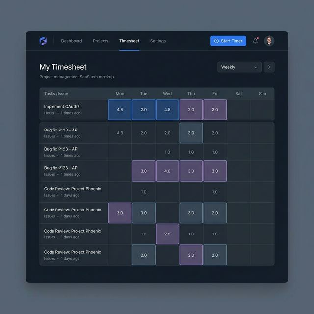
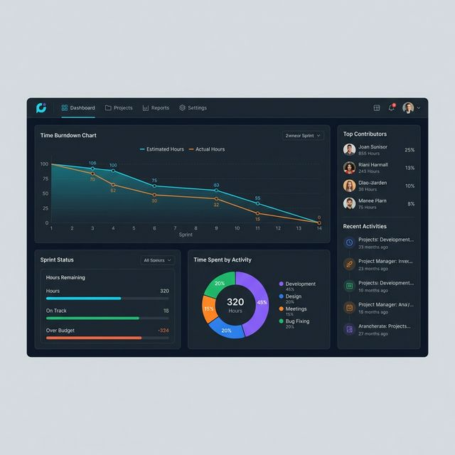

# Đề Xuất Nâng Cấp Tính Năng Time Tracking (Quản lý Thời Gian)

Dựa trên việc phân tích các tính năng của **Plane Pro**, các công cụ time tracking phổ biến trên thị trường (như **Jira Tempo, Clockify, Harvest**) và hiện trạng triển khai hiện tại (Phase 1-6), dưới đây là phương án đề xuất nâng cấp toàn diện giúp hệ thống trở nên chuyên nghiệp và hữu ích hơn cho mục đích quản trị tại dự án.

## 1. Phân tích hiện trạng & Hạn chế

Tính năng hiện tại đang triển khai ở mức độ ghi nhận cơ bản (Manual Entry theo từng Issue) và báo cáo xuất dạng liệt kê. Những điểm yếu gây cảm giác "chưa chuyên nghiệp":
*   **User Experience (UX) cho người nhập**: Mỗi lần muốn log time, user phải vào từng Issue cụ thể. Cuối ngày, nếu làm 4-5 task khác nhau, việc đi tìm và log time rất mất thời gian.
*   **Góc nhìn Quản Lý (Người xem)**: Báo cáo chỉ hiện tổng hợp theo Member hoặc Top 10 Issue. Rất khó để một Manager nhìn lướt qua để biết: *"Ngày hôm qua, Nhân viên A đã làm chính xác những gì và tiêu tốn bao nhiêu thời gian?"*.
*   **Đánh giá tình trạng dự án (Project Health)**: Chỉ so sánh `Estimate` vs `Logged` ở cấp độ Issue đơn lẻ. Thiếu cái nhìn tổng quan toàn dự án.
*   **Phân loại công việc (Activity Types)**: Không biết thời gian đó dành cho Việc Code, Test, Họp hành, hay Fix Bug.

---

## 2. Phương Án Nâng Cấp (Đề Xuất kèm Prototype)

Để giải quyết các vấn đề trên, tôi đề xuất nâng cấp theo 3 luồng tính năng chính:

### A. Cải tiến trải nghiệm nhập Log (Dành cho Member)

**1. Màn hình "My Timesheet" (Bảng chấm công cá nhân)**
- Giống hệt tính năng cốt lõi của Jira Tempo hay Clockify. Màn hình cung cấp lưới (Grid) hoặc Danh sách theo tuần cho mỗi User.
- Trục dọc là các Issue đang được giao, trục ngang là các ngày trong tuần. User có thể nhập thời gian trực tiếp trên lưới thay vì chui vào từng Issue.
- **Giá trị:** Tiết kiệm rất nhiều thời gian khai báo cuối ngày của member, tăng tỷ lệ khai báo đầy đủ.

**2. Global Timer & Phân loại Time Log**
- Thêm một nút **"Start Timer"** ở thanh Top Navigation.
- Khi log time, cho phép chọn **Category**: `Development`, `Meeting`, `Design`, `Bug Fixing`.

### B. Màn Hình Quản Lý Nguồn Lực (Dành cho Manager)

**1. Trình xem Timesheet Toàn Dự Án (Project/Workspace Timesheet)**
- Cung cấp lưới tổng hợp cho Manager: Trục dọc là Member, trục ngang là Ngày.
- Báo cáo hiển thị màu nổi bật (Color coding): **Đỏ (Overload - >8h/ngày)**, **Xanh lá (Chuẩn)**.
- Tương tác: Nhấp vào một ô để kiểm tra chi tiết các Issue mà member đó đã thực hiện.
- **Giá trị:** Trả lời trực quan câu hỏi: *"Ngày qua ai chưa đủ giờ, ai làm việc quá sức (overload)?"*.

---

### 🖥️ Prototype High-Fidelity: Capacity Dashboard
> **Lưu ý:** Tính năng tạo ảnh hiện đang được bảo trì. Tôi đã thiết kế một bản **Prototype HTML/CSS tương tác** cực kỳ chi tiết thay thế, bao gồm đầy đủ **Bộ lọc (Filter)**, **Date Range** và **Heatmap Grid**.

#### 🔗 [NHẤP VÀO ĐÂY ĐỂ MỞ PROTOTYPE CHI TIẾT](./prototype-capacity.html)

**Các thành phần chính trong bản thiết kế:**
1.  **Title & Description Section**: Định nghĩa bối cảnh và mục tiêu của dashboard.
2.  **Summary Analytics (Charts Section)**: Hiển thị ngay sau tiêu đề để cung cấp cái nhìn tổng quan nhất về dung lượng dự án.
3.  **Contextual Filters Bar (Sticky Below Charts)**: 
    - **Vị trí**: Đặt giữa phần Biểu đồ và Bảng dữ liệu để phục vụ việc lọc dữ liệu chi tiết cho bảng bên dưới.
    - **Thành phần**: `MemberSelect` (Lọc theo thành viên) và `DateRangePicker` (Lọc theo khoảng thời gian tùy chỉnh).
    - **Chức năng**: Cập nhật trực tiếp kết quả hiển thị trong 2D Heatmap Grid.
4.  **2D Resource Heatmap (Member Table)**: 
    - Lưới hiển thị chi tiết số giờ log theo từng ngày của mỗi thành viên.
    - Màu sắc hiển thị theo trạng thái: 🔴 **Quá tải (>8h)** | 🟢 **Bình thường (7-8h)** | 🟡 **Dưới công suất (<7h)**.
    - Hiệu ứng tương tác: Hover bật to ô dữ liệu, dính (sticky) cột thành viên khi cuộn ngang.

---
**2. Quản lý dung lượng (Capacity engine)**
- Thiết lập định mức mỗi member là **8h/ngày** hoặc **40h/tuần**.
- Cảnh báo Overload trực tiếp trong lúc lập kế hoạch Sprint/Cycle.

### C. Nâng cấp Báo cáo Dự án (Dành cho PM/Lead)

**1. Biểu đồ Time Burndown & Phân bổ thời gian**
- Bổ sung biểu đồ **Time Burndown** cho Cycle (Đường Estimate lý tưởng vs Thực tế đã log) thay vì chỉ có Issue Burndown Chart.
- Biểu đồ Pie/Donut Chart thể hiện thời gian phân bổ (dựa vào Category khi khai báo log time). Giúp biết dự án đang "tiêu tiền" vào việc gì (Code feature hay Fix bug).

---

## 3. Khuyến nghị cập nhật Roadmap

Nếu bạn đồng ý với hướng tối ưu này, chúng ta có thể bổ sung thêm các Phase phụ vào luồng kiến trúc hiện tại để nâng cấp:

## 4. Kiến trúc Kỹ thuật (Tích hợp theo Plane DNA)

Để đảm bảo proposal này hòa nhập tự nhiên vào hệ thống hiện tại của Plane (được trình bày trong folder `docs/`), quá trình phát triển cần tuân thủ nghiêm ngặt các tiêu chuẩn **Architecture** và **Design System** của Plane:

### A. Frontend (apps/web/)
- **UI Components (`@plane/propel`)**: Xây dựng màn hình Timesheet và Dashboard hoàn toàn bằng các component hiện đại từ `@plane/propel` (Button, Select, Modal, Table). **Tuyệt đối không sử dụng** thư viện legacy `@plane/ui`.
- **Styling (Tailwind v4 & Semantic Colors)**: Giao diện (đặc biệt là màu cảnh báo Overload) phải dùng semantic tokens (ví dụ: `bg-error-500`, `text-success-500`), không dùng hardcoded colors (`bg-red-500`) hay `dark:` variants thủ công.
- **State Management (MobX)**: 
  - Mở rộng `WorklogStore` (`apps/web/ce/store/`) và `WorklogService` để bao gồm logic aggregate cho Timesheet và Capacity.
  - Bọc tất cả component hiển thị data bằng `observer` từ `mobx-react`.
- **CE Override**: Vì đây là bản cho Shinhan Bank VN (dựa trên Community Edition), các code component/hook mới đè lên flow hiện tại sẽ được đặt gọn gàng trong thư mục `apps/web/ce/` (ví dụ: `apps/web/ce/components/time-tracking/`).

### B. Backend (apps/api/)
- **API Endpoints (v0 vs v1)**: Kế thừa pattern của `IssueComment`, Worklog API sẽ được đặt trong `plane/app/` (internal v0 API), không trộn lẫn với `plane/api/` (external v1).
- **ORM & Custom Managers**:
  - Khi query Issue cho Timesheet hay Overload calculation, **bắt buộc** dùng `Issue.issue_objects` (lọc bỏ các issue đã lưu trữ/nháp/triage) thay vì `Issue.objects` mặc định.
  - Các query phức tạp (như tính tổng giờ cho Burndown Chart) cần tận dụng `select_related`/`prefetch_related` để tránh N+1.
- **Background Tasks (Celery)**: Bất kỳ tính toán aggregate nặng nào (ví dụ tính toán Overload hàng tuần cho email report) nên được offload sang Celery tasks (`@shared_task`).
- **Permissions**: Các endpoint báo cáo tổng thể sẽ áp dụng permission roles chuẩn là `ROLE.ADMIN` và `ROLE.MEMBER`, sử dụng decorator `@allow_permission([ROLE.ADMIN, ROLE.MEMBER], level="WORKSPACE")`.

---

Khuyến nghị cập nhật lộ trình:
*   **Bổ sung Phase 7 - Bảng chấm công (Timesheets):** Xây dựng trang "Timesheet" Grid toàn cục và cá nhân.
*   **Bổ sung Phase 8 - Dashboard Quản lý Capacity (Overload):** Thêm định mức giờ làm, logic cảnh báo xanh/đỏ cho Manager, Dashboard Analytics với Chart.
*   **Bổ sung Phase 9 - Global Timer & Phân loại Activity:** Tích hợp Timer chạy ngầm.

Xin mời xem cấu trúc thư mục của plan này tại `plans/260224-0840-time-tracking-dashboard-proposal/`.

Xin mời xem cấu trúc thư mục của plan này tại `plans/260224-0840-time-tracking-dashboard-proposal/`.
