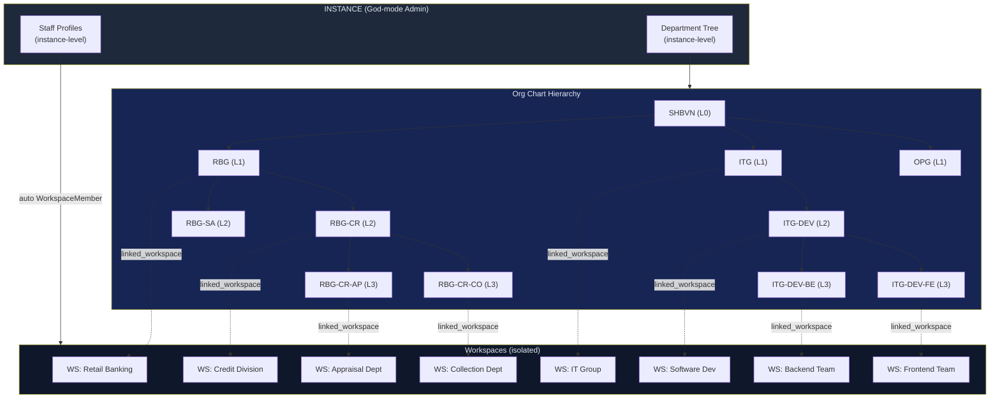
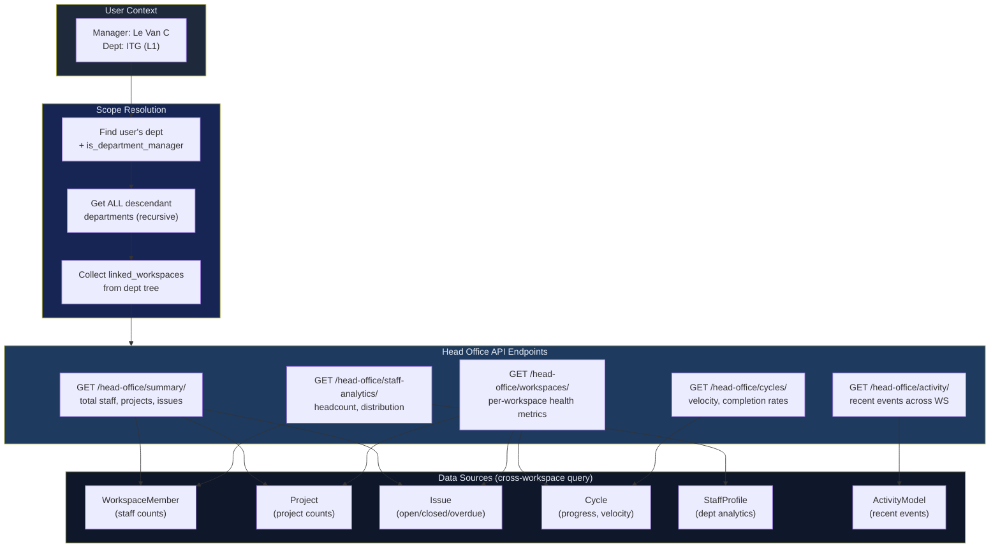
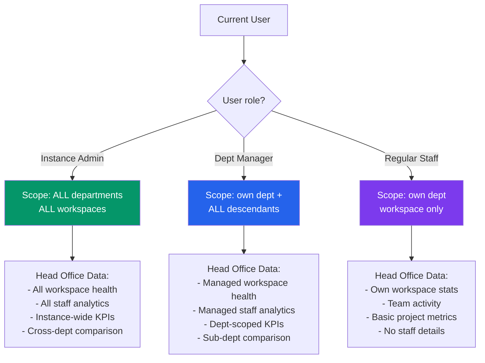
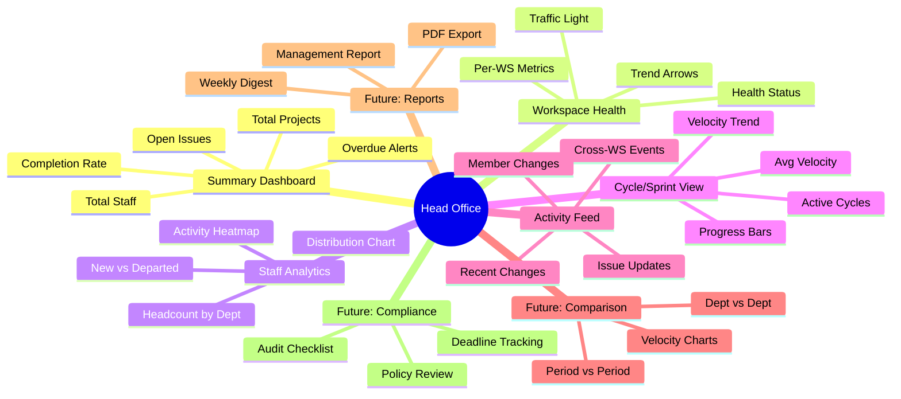

# Diagram: Department-Workspace Migration Flow + Head Office Feature

---

## 1. Architecture: BEFORE vs AFTER

### BEFORE: Single Workspace Model

```
                    ┌──────────────────────────────────────────────┐
                    │              INSTANCE (Plane)                │
                    └──────────────────┬───────────────────────────┘
                                       │
                    ┌──────────────────▼───────────────────────────┐
                    │     WORKSPACE: "Shinhan Bank VN" (duy nhat)  │
                    │                                              │
                    │  ┌─ Dept Tree (metadata) ──────────────────┐ │
                    │  │ RBG (L1)                                │ │
                    │  │  └─ RBG-CR (L2)                         │ │
                    │  │      ├─ RBG-CR-AP (L3) ──► Project [A]  │ │
                    │  │      └─ RBG-CR-CO (L3) ──► Project [C]  │ │
                    │  │ ITG (L1)                                │ │
                    │  │  └─ ITG-DEV (L2)                        │ │
                    │  │      └─ ITG-DEV-BE (L3) ─► Project [B]  │ │
                    │  └─────────────────────────────────────────┘ │
                    │                                              │
                    │  ┌─ Projects ─────────────────────────────┐  │
                    │  │ [A] Appraisal     ← ProjectMember      │  │
                    │  │ [C] Collection    ← ProjectMember      │  │
                    │  │ [B] Backend       ← ProjectMember      │  │
                    │  └────────────────────────────────────────┘  │
                    │                                              │
                    │  Access: Staff ──► linked_project ──► auto   │
                    │          ProjectMember (project-level only)  │
                    └──────────────────────────────────────────────┘

                    Han che:
                    - Moi staff chi co the o 1 workspace
                    - Access control = project-level, khong co workspace isolation
                    - Dept & Staff quan ly trong Workspace Settings
                    - Khong co cross-workspace analytics
```

### AFTER: Department-per-Workspace Model

```
┌──────────────────────────────────────────────────────────────────────────┐
│                         INSTANCE (Plane - God Mode)                     │
│                                                                         │
│  ┌─ Department Tree (instance-level, god-mode manages) ──────────────┐  │
│  │                                                                    │  │
│  │  SHBVN (L0)                                                       │  │
│  │   ├─ RBG (L1) ─────────────────► WS: "Retail Banking Group"      │  │
│  │   │   ├─ RBG-CR (L2) ──────────► WS: "Credit Division"           │  │
│  │   │   │   ├─ RBG-CR-AP (L3) ───► WS: "Appraisal Dept"           │  │
│  │   │   │   └─ RBG-CR-CO (L3) ───► WS: "Collection Dept"          │  │
│  │   │   └─ RBG-SA (L2) ──────────► WS: "Sales Division"           │  │
│  │   │                                                               │  │
│  │   ├─ ITG (L1) ─────────────────► WS: "IT Group"                  │  │
│  │   │   └─ ITG-DEV (L2) ─────────► WS: "Software Development"     │  │
│  │   │       ├─ ITG-DEV-BE (L3) ──► WS: "Backend Team"             │  │
│  │   │       └─ ITG-DEV-FE (L3) ──► WS: "Frontend Team"            │  │
│  │   │                                                               │  │
│  │   └─ OPG (L1) ─────────────────► WS: "Operations Group"         │  │
│  │       └─ OPG-HR (L2) ──────────► (no workspace - optional)       │  │
│  │                                                                    │  │
│  └────────────────────────────────────────────────────────────────────┘  │
│                                                                         │
│  ┌─ Staff Profiles (instance-level) ─────────────────────────────────┐  │
│  │  Nguyen Van A  │ dept: ITG-DEV-BE │ auto ──► WS: Backend Team    │  │
│  │  Tran Thi B    │ dept: RBG-CR-AP  │ auto ──► WS: Appraisal Dept  │  │
│  │  Le Van C      │ dept: RBG (mgr)  │ auto ──► WS: RBG + all child │  │
│  └───────────────────────────────────────────────────────────────────┘  │
│                                                                         │
│  Access: Staff ──► dept.linked_workspace ──► auto WorkspaceMember       │
│          Manager ──► auto-join ALL descendant workspaces                │
│          Each workspace = isolated projects, issues, cycles             │
└─────────────────────────────────────────────────────────────────────────┘
```



---

## 2. Auto-Membership Flow

### Staff Assignment Flow

```
┌──────────────────────────────────────────────────────────────────┐
│                   STAFF ASSIGNMENT FLOW                          │
├──────────────────────────────────────────────────────────────────┤
│                                                                  │
│  God-mode Admin                                                  │
│       │                                                          │
│       ▼                                                          │
│  ┌─────────────────┐     ┌───────────────┐                      │
│  │ Create Staff     │────►│ StaffProfile  │                      │
│  │ "Nguyen Van A"   │     │ dept: BE Team │                      │
│  │ dept: BE Team    │     └───────┬───────┘                      │
│  └─────────────────┘             │                               │
│                                   ▼                               │
│                          dept.linked_workspace?                   │
│                         ┌────┴────┐                              │
│                        YES       NO                              │
│                         │         │                              │
│                         ▼         ▼                              │
│              ┌──────────────┐  (done, no                        │
│              │ WorkspaceMem │   auto-join)                       │
│              │ .get_or_cre  │                                    │
│              │  ws=BE Team  │                                    │
│              │  user=NVA    │                                    │
│              │  role=15     │                                    │
│              └──────┬───────┘                                    │
│                     │                                            │
│                     ▼                                            │
│              is_department_manager?                               │
│              ┌────┴────┐                                        │
│             YES       NO                                        │
│              │         │                                        │
│              ▼         ▼                                        │
│   ┌───────────────┐  (done)                                     │
│   │ Recursive:    │                                             │
│   │ join ALL desc │                                             │
│   │ linked_ws     │                                             │
│   │ (max 6 lvls)  │                                             │
│   └───────────────┘                                             │
│                                                                  │
└──────────────────────────────────────────────────────────────────┘
```

### Transfer, Deactivation & Link-Workspace

```mermaid
flowchart TD
    subgraph Transfer["Staff Transfer Flow"]
        T1["Admin: Transfer staff<br/>Old Dept → New Dept"] --> T2{"old_ws == new_ws?"}
        T2 -->|Yes| T3["Skip<br/>(no change)"]
        T2 -->|No| T4{"old_ws exists?"}
        T4 -->|Yes| T5{"Member role == 15?"}
        T5 -->|Yes| T6["Remove from old_ws"]
        T5 -->|No - Admin| T7["Keep in old_ws<br/>(safe)"]
        T4 -->|No| T8["Skip removal"]
        T6 --> T9{"new_ws exists?"}
        T7 --> T9
        T8 --> T9
        T9 -->|Yes| T10["WorkspaceMember<br/>.get_or_create(new_ws)"]
        T9 -->|No| T11["Done"]
        T10 --> T11
    end

    subgraph Deactivate["Staff Deactivation Flow"]
        D1["Admin: Deactivate staff"] --> D2["Remove ALL<br/>WorkspaceMember(s)"]
        D2 --> D3["User.is_active = False"]
        D3 --> D4["staff.status = resigned"]
        D4 --> D5["Done - user locked out<br/>of entire instance"]
    end

    subgraph LinkWS["Link Workspace to Dept"]
        L1["Admin: Link WS to Dept"] --> L2["dept.linked_workspace = ws"]
        L2 --> L3{"staff_count > 10?"}
        L3 -->|Yes| L4["Celery Task<br/>(async bulk add)"]
        L3 -->|No| L5["Inline sync<br/>(atomic)"]
        L4 --> L6["For each active staff:<br/>WorkspaceMember.get_or_create"]
        L5 --> L6
        L6 --> L7["Add ancestor managers<br/>to this workspace"]
    end

    style Transfer fill:#1e3a5f,color:#e2e8f0
    style Deactivate fill:#5f1e1e,color:#e2e8f0
    style LinkWS fill:#1e5f3a,color:#e2e8f0
```



### Manager Auto-join (Recursive)

```
  Manager assigned to ITG (L1)
       │
       ▼
  Auto-join linked_ws of:
  ┌────────────────────────────────────────────────────┐
  │  ITG ─────────────► WS: "IT Group"           ✅   │
  │   └─ ITG-DEV ─────► WS: "Software Dev"       ✅   │
  │       ├─ ITG-DEV-BE ► WS: "Backend Team"     ✅   │
  │       └─ ITG-DEV-FE ► WS: "Frontend Team"    ✅   │
  └────────────────────────────────────────────────────┘

  Result: Manager of ITG becomes WorkspaceMember
          in 4 workspaces automatically

  Note: max depth = 6 levels, get_or_create = idempotent
```

---

## 3. Feature Development Overview

### System Navigation Map

```
┌─────────────────────────────────────────────────────────────────────────┐
│                        PLANE INSTANCE                                   │
│                                                                         │
│  ┌─ GOD-MODE ADMIN (/admin) ──────────────────────────────────────┐    │
│  │  Sidebar:                                                       │    │
│  │  ┌──────────────────┐                                           │    │
│  │  │ General          │                                           │    │
│  │  │ Users            │                                           │    │
│  │  │ ▶ Departments ◀  │ ← NEW: tree view + CRUD + link WS       │    │
│  │  │ ▶ Staff        ◀  │ ← NEW: table + CRUD + import/export     │    │
│  │  │ Authentication   │                                           │    │
│  │  │ Email            │                                           │    │
│  │  │ AI Features      │                                           │    │
│  │  └──────────────────┘                                           │    │
│  └─────────────────────────────────────────────────────────────────┘    │
│                                                                         │
│  ┌─ WORKSPACE: "Backend Team" (/backend-team) ────────────────────┐    │
│  │  Sidebar:                                                       │    │
│  │  ┌──────────────────┐                                           │    │
│  │  │ ▶ Head Office  ◀  │ ← NEW: analytics dashboard              │    │
│  │  │ ▶ Org Chart    ◀  │ ← NEW: read-only dept tree              │    │
│  │  │ Projects         │                                           │    │
│  │  │ Issues           │                                           │    │
│  │  │ Cycles           │                                           │    │
│  │  │ Modules          │                                           │    │
│  │  │ Views            │                                           │    │
│  │  │ Pages            │                                           │    │
│  │  │ Active Cycles    │                                           │    │
│  │  │ ─────────────    │                                           │    │
│  │  │ Settings         │ ← REMOVED: Departments, Staff tabs       │    │
│  │  └──────────────────┘                                           │    │
│  │                                                                  │    │
│  │  ┌─ My Profile Section (Settings) ──────────────────────────┐   │    │
│  │  │  Staff ID: NV001                                          │   │    │
│  │  │  Department: ITG-DEV-BE (Backend Team)                    │   │    │
│  │  │  Position: Senior Developer                               │   │    │
│  │  │  Manager: Le Van C                                        │   │    │
│  │  │  (read-only, data from instance-level StaffProfile)       │   │    │
│  │  └──────────────────────────────────────────────────────────┘   │    │
│  └─────────────────────────────────────────────────────────────────┘    │
│                                                                         │
└─────────────────────────────────────────────────────────────────────────┘
```

### Development Phase Sequence

```mermaid
gantt
    title Development Timeline - 6 Phases (32h total)
    dateFormat X
    axisFormat %s

    section Phase 1: DB Migration
    Remove workspace FK, add linked_workspace     :p1, 0, 4

    section Phase 2: Backend API
    Instance-level endpoints + auto-membership     :p2, 4, 12

    section Phase 3: God-mode UI
    Admin pages for dept and staff management       :p3, 12, 20

    section Phase 4: Cleanup
    Remove old workspace settings pages            :p4, 12, 15

    section Phase 5: Org Chart
    Workspace org chart page                       :p5, 12, 17

    section Phase 6: Auto-join Polish
    Harden membership logic + Celery tasks         :p6, 12, 16
```



```
Phase Dependencies:
  P1 ──► P2 ──► P3 ──┐
                  │    ├──► (all complete)
                  ├──► P4 (parallel with P3)
                  ├──► P5 (parallel)
                  └──► P6 (parallel)
```

---

## 4. HEAD OFFICE - Analytics Dashboard Concept

### What is Head Office?

```
┌─────────────────────────────────────────────────────────────────────────┐
│                                                                         │
│  HEAD OFFICE = Management Dashboard cho Leaders/Managers                │
│                                                                         │
│  Muc dich:                                                              │
│  - Xem tong quan cac workspace/phong ban duoi quyen quan ly             │
│  - Theo doi tien do du an across workspaces                             │
│  - Phan tich hieu suat nhan su                                          │
│  - Ra quyet dinh dua tren data (data-driven management)                 │
│                                                                         │
│  Ai duoc truy cap:                                                      │
│  - Manager cua dept: thay tat ca workspace con (org chart scope)        │
│  - Regular staff: chi thay workspace cua minh                           │
│  - Instance admin: thay tat ca                                          │
│                                                                         │
│  URL: /:workspaceSlug/head-office                                       │
│  Vi tri: Main sidebar, ngang hang Projects                              │
│                                                                         │
└─────────────────────────────────────────────────────────────────────────┘
```

### Head Office UI Layout

```
┌─────────────────────────────────────────────────────────────────────────┐
│  HEAD OFFICE - IT Group                                    👤 Le Van C  │
├─────────────────────────────────────────────────────────────────────────┤
│                                                                         │
│  ┌─ YOUR MANAGEMENT SCOPE ─────────────────────────────────────────┐   │
│  │                                                                  │   │
│  │   ITG (you) ──► Software Dev ──► Backend Team                   │   │
│  │                              └──► Frontend Team                  │   │
│  │   4 workspaces  │  47 staff  │  23 active projects              │   │
│  │                                                                  │   │
│  └──────────────────────────────────────────────────────────────────┘   │
│                                                                         │
│  ┌─ SUMMARY CARDS ─────────────────────────────────────────────────┐   │
│  │                                                                  │   │
│  │  ┌──────────────┐  ┌──────────────┐  ┌──────────────┐          │   │
│  │  │   47         │  │   23         │  │   156        │          │   │
│  │  │   Staff      │  │   Projects   │  │   Open       │          │   │
│  │  │   +3 new     │  │   +2 new     │  │   Issues     │          │   │
│  │  └──────────────┘  └──────────────┘  └──────────────┘          │   │
│  │                                                                  │   │
│  │  ┌──────────────┐  ┌──────────────┐  ┌──────────────┐          │   │
│  │  │   12         │  │   78%        │  │   4          │          │   │
│  │  │   Active     │  │   Completion │  │   Overdue    │          │   │
│  │  │   Cycles     │  │   Rate       │  │   Issues     │          │   │
│  │  └──────────────┘  └──────────────┘  └──────────────┘          │   │
│  │                                                                  │   │
│  └──────────────────────────────────────────────────────────────────┘   │
│                                                                         │
│  ┌─ WORKSPACE HEALTH ──────────────────────────────────────────────┐   │
│  │                                                                  │   │
│  │  Workspace          │ Projects │ Issues │ Completion │ Status   │   │
│  │  ─────────────────────────────────────────────────────────────   │   │
│  │  IT Group           │    5     │   23   │   85%      │ 🟢 Good │   │
│  │  Software Dev       │    8     │   45   │   72%      │ 🟡 Fair │   │
│  │  Backend Team       │    6     │   52   │   68%      │ 🟡 Fair │   │
│  │  Frontend Team      │    4     │   36   │   91%      │ 🟢 Good │   │
│  │                                                                  │   │
│  └──────────────────────────────────────────────────────────────────┘   │
│                                                                         │
│  ┌─ RECENT ACTIVITY ─────────────┐  ┌─ CYCLE PROGRESS ────────────┐   │
│  │                                │  │                              │   │
│  │  ● Backend: API v2 released   │  │  Sprint 24 ████████░░ 80%   │   │
│  │  ● Frontend: UI redesign PR   │  │  Sprint 23 ██████████ 100%  │   │
│  │  ● BE: 5 issues closed today  │  │  Sprint 22 ██████████ 100%  │   │
│  │  ● FE: New member joined      │  │                              │   │
│  │  ● Dev: Cycle 12 completed    │  │  Avg velocity: 34 pts/sprint│   │
│  │                                │  │                              │   │
│  └────────────────────────────────┘  └──────────────────────────────┘   │
│                                                                         │
│  ┌─ STAFF ANALYTICS ──────────────────────────────────────────────┐    │
│  │                                                                  │   │
│  │  Department Breakdown:           Activity Heatmap (7 days):     │   │
│  │                                                                  │   │
│  │  IT Group      ████  5 staff     Mon ████████████               │   │
│  │  Software Dev  ██████  8 staff   Tue ██████████████             │   │
│  │  Backend Team  ████████████  18  Wed ████████████████           │   │
│  │  Frontend Team ████████  16      Thu ██████████████             │   │
│  │                                  Fri ████████████               │   │
│  │  Total: 47 active staff          Sat ████                       │   │
│  │  New this month: +3              Sun ██                         │   │
│  │  Departed: -1                                                    │   │
│  │                                                                  │   │
│  └──────────────────────────────────────────────────────────────────┘   │
│                                                                         │
└─────────────────────────────────────────────────────────────────────────┘
```

### Head Office - Data Flow Architecture



---

## 5. Permission Model

### Who Sees What?

```
┌─────────────────────────────────────────────────────────────────────────┐
│                      PERMISSION MODEL                                   │
├─────────────────────────────────────────────────────────────────────────┤
│                                                                         │
│  ┌─ ROLE HIERARCHY ──────────────────────────────────────────────┐     │
│  │                                                                │     │
│  │  Instance Admin (God-mode)                                     │     │
│  │  ├── Sees: EVERYTHING (all depts, all workspaces, all staff)  │     │
│  │  ├── Can: CRUD departments, staff, link workspaces            │     │
│  │  └── Head Office: full instance analytics                     │     │
│  │                                                                │     │
│  │  Department Manager (is_department_manager=True)               │     │
│  │  ├── Sees: own dept + ALL descendant depts                    │     │
│  │  ├── Auto-join: all descendant linked_workspaces              │     │
│  │  ├── Head Office: analytics of managed scope only             │     │
│  │  └── Org Chart: full tree scoped to workspace                 │     │
│  │                                                                │     │
│  │  Regular Staff                                                 │     │
│  │  ├── Sees: own dept + parent chain (read-only)                │     │
│  │  ├── Auto-join: own dept's linked_workspace only              │     │
│  │  ├── Head Office: own workspace stats only                    │     │
│  │  └── Org Chart: tree scoped to workspace                      │     │
│  │                                                                │     │
│  └────────────────────────────────────────────────────────────────┘     │
│                                                                         │
│  ┌─ HEAD OFFICE SCOPE EXAMPLES ──────────────────────────────────┐     │
│  │                                                                │     │
│  │  CEO (manager of SHBVN L0):                                    │     │
│  │  └── Head Office shows: ALL 10+ workspaces, 200+ staff,       │     │
│  │      50+ projects, aggregated KPIs                             │     │
│  │                                                                │     │
│  │  CTO (manager of ITG L1):                                     │     │
│  │  └── Head Office shows: ITG + Dev + BE + FE workspaces,       │     │
│  │      47 staff, 23 projects                                     │     │
│  │                                                                │     │
│  │  BE Team Lead (manager of ITG-DEV-BE L3):                     │     │
│  │  └── Head Office shows: Backend Team workspace only,           │     │
│  │      18 staff, 6 projects                                      │     │
│  │                                                                │     │
│  │  Regular Dev (staff in ITG-DEV-BE):                            │     │
│  │  └── Head Office shows: Backend Team workspace only,           │     │
│  │      basic stats (no staff details)                            │     │
│  │                                                                │     │
│  └────────────────────────────────────────────────────────────────┘     │
│                                                                         │
└─────────────────────────────────────────────────────────────────────────┘
```



---

## 6. Head Office API Design

```
┌─────────────────────────────────────────────────────────────────────────┐
│                    HEAD OFFICE API ENDPOINTS                             │
├─────────────────────────────────────────────────────────────────────────┤
│                                                                         │
│  Base: /api/v1/workspaces/<slug>/head-office/                          │
│  Permission: WorkspaceEntityPermission (any member)                     │
│  Scoping: server-side based on user's dept manager status              │
│                                                                         │
│  GET /head-office/summary/                                              │
│  Response: {                                                            │
│    managed_workspaces: 4,                                               │
│    total_staff: 47,                                                     │
│    total_projects: 23,                                                  │
│    open_issues: 156,                                                    │
│    overdue_issues: 4,                                                   │
│    avg_completion_rate: 78.5,                                           │
│    active_cycles: 12                                                    │
│  }                                                                      │
│                                                                         │
│  GET /head-office/workspaces/                                           │
│  Response: [{                                                           │
│    workspace: { id, name, slug },                                       │
│    department: { name, code, level },                                   │
│    projects_count: 6,                                                   │
│    open_issues: 52,                                                     │
│    closed_issues_30d: 120,                                              │
│    completion_rate: 68,                                                  │
│    health_status: "fair",     // good | fair | at_risk | critical       │
│    active_members: 18,                                                  │
│    current_cycle: { name, progress: 80 }                                │
│  }]                                                                     │
│                                                                         │
│  GET /head-office/activity/?limit=20                                    │
│  Response: [{                                                           │
│    workspace: "Backend Team",                                           │
│    event: "issue_closed",                                               │
│    summary: "API v2 endpoint completed",                                │
│    actor: "Nguyen Van A",                                               │
│    timestamp: "2026-03-08T10:30:00Z"                                    │
│  }]                                                                     │
│                                                                         │
│  GET /head-office/staff-analytics/                                      │
│  Response: {                                                            │
│    by_department: [{ dept, count, new_30d, departed_30d }],             │
│    total_active: 47,                                                    │
│    new_this_month: 3,                                                   │
│    departed_this_month: 1,                                              │
│    activity_heatmap: { mon: 45, tue: 52, ... }                          │
│  }                                                                      │
│                                                                         │
│  GET /head-office/cycles/                                               │
│  Response: {                                                            │
│    active_cycles: [{ workspace, name, progress, velocity }],            │
│    avg_velocity: 34,                                                    │
│    completed_cycles_30d: 8                                              │
│  }                                                                      │
│                                                                         │
└─────────────────────────────────────────────────────────────────────────┘
```

---

## 7. Enterprise Management Consulting - Recommendations

### Banking-Specific Features Worth Considering

```
┌─────────────────────────────────────────────────────────────────────────┐
│                ENTERPRISE MANAGEMENT RECOMMENDATIONS                    │
│                (for Banking/Financial Organization)                      │
├─────────────────────────────────────────────────────────────────────────┤
│                                                                         │
│  ┌─ P1: MUST HAVE (implement now) ───────────────────────────────┐     │
│  │                                                                │     │
│  │  1. Cross-workspace Overview                                   │     │
│  │     Managers see aggregated KPIs of all managed workspaces     │     │
│  │     Why: Core value of Head Office - bird's eye view           │     │
│  │                                                                │     │
│  │  2. Workspace Health Status                                    │     │
│  │     Traffic light system (Good/Fair/At Risk/Critical)          │     │
│  │     Based on: completion rate, overdue issues, velocity trend  │     │
│  │     Why: Quick identification of problem areas                 │     │
│  │                                                                │     │
│  │  3. Staff Distribution & Headcount                             │     │
│  │     Real-time view of staff across departments                 │     │
│  │     Why: Resource allocation visibility                        │     │
│  │                                                                │     │
│  │  4. Active Cycle/Sprint Progress                               │     │
│  │     Progress bars for all active cycles across workspaces      │     │
│  │     Why: Sprint health monitoring across teams                 │     │
│  │                                                                │     │
│  └────────────────────────────────────────────────────────────────┘     │
│                                                                         │
│  ┌─ P2: SHOULD HAVE (next iteration) ────────────────────────────┐     │
│  │                                                                │     │
│  │  5. Cross-workspace Search                                     │     │
│  │     Search issues/projects across all managed workspaces       │     │
│  │     Why: Managers need to find things without switching WS     │     │
│  │                                                                │     │
│  │  6. Comparative Analytics                                      │     │
│  │     Compare performance between departments/workspaces         │     │
│  │     Charts: velocity trends, completion rates over time        │     │
│  │     Why: Identify best practices & underperforming areas       │     │
│  │                                                                │     │
│  │  7. Export/Report Generation                                   │     │
│  │     Export PDF/Excel reports for management meetings           │     │
│  │     Weekly/monthly summary auto-generation                     │     │
│  │     Why: Banking culture requires formal reporting             │     │
│  │                                                                │     │
│  │  8. Goal/OKR Tracking                                          │     │
│  │     Department-level goals linked to workspace metrics         │     │
│  │     Why: Align work with organizational objectives             │     │
│  │                                                                │     │
│  └────────────────────────────────────────────────────────────────┘     │
│                                                                         │
│  ┌─ P3: NICE TO HAVE (future) ───────────────────────────────────┐     │
│  │                                                                │     │
│  │  9. Notification Digest                                        │     │
│  │     Daily/weekly digest of managed workspace activities        │     │
│  │     Critical alerts: overdue items, blocked issues             │     │
│  │                                                                │     │
│  │  10. Resource Allocation View                                  │     │
│  │      Workload per staff across workspaces                      │     │
│  │      Who's overloaded? Who has capacity?                       │     │
│  │                                                                │     │
│  │  11. Compliance Dashboard (Banking-specific)                   │     │
│  │      Regulatory deadline tracking                              │     │
│  │      Audit checklist completion                                │     │
│  │      Policy document review status                             │     │
│  │                                                                │     │
│  │  12. Meeting/Decision Log                                      │     │
│  │      Track key decisions made across departments               │     │
│  │      Link decisions to issues/projects                         │     │
│  │                                                                │     │
│  └────────────────────────────────────────────────────────────────┘     │
│                                                                         │
└─────────────────────────────────────────────────────────────────────────┘
```

### Complete Feature Map



---

## 8. Implementation Recommendation

```
┌─────────────────────────────────────────────────────────────────────────┐
│                    RECOMMENDED IMPLEMENTATION ORDER                      │
├─────────────────────────────────────────────────────────────────────────┤
│                                                                         │
│  PHASE 1-6: Current Migration Plan (32h)                               │
│  ├── DB Model Migration                                                │
│  ├── Backend API Migration                                             │
│  ├── God-mode Frontend                                                  │
│  ├── Cleanup Workspace Settings                                         │
│  ├── Org Chart Page                                                     │
│  └── Auto-join Logic                                                    │
│                                                                         │
│  PHASE 7: Head Office - MVP (NEW, ~12h)                                │
│  ├── Backend: Head Office API endpoints (scope resolution + queries)   │
│  ├── Frontend: Summary cards + workspace health table                  │
│  ├── Frontend: Active cycles progress view                             │
│  └── Frontend: Recent activity feed                                    │
│                                                                         │
│  PHASE 8: Head Office - Analytics (NEW, ~8h)                           │
│  ├── Backend: Staff analytics aggregation                              │
│  ├── Frontend: Staff distribution charts                               │
│  ├── Frontend: Activity heatmap                                        │
│  └── Frontend: Trend indicators (arrows, sparklines)                   │
│                                                                         │
│  Total: ~52h (migration 32h + Head Office 20h)                         │
│                                                                         │
└─────────────────────────────────────────────────────────────────────────┘
```
