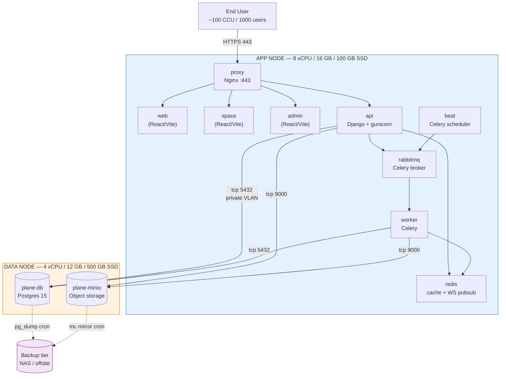

# Plane.so — Mô hình triển khai 2-node cho SHBVN

**Ngày:** 2026-05-13
**Tác giả:** duonglx
**Mục đích:** Tài liệu thiết kế triển khai production cho 1000 user / 100 CCU
**Trạng thái:** Đề xuất, chờ phê duyệt

---

## 1. Tổng quan kiến trúc

Tách 2 VM trên Hyper-V theo nguyên tắc **tier separation**:

- **APP NODE** — chứa toàn bộ service stateless + state tạm thời (cache, queue)
- **DATA NODE** — chứa toàn bộ state bền vững (database + object storage), cần backup

Lý do tách: cô lập tài nguyên Postgres khỏi gunicorn/Celery (tránh tranh CPU), đơn giản hóa backup (chỉ DATA node cần snapshot), tăng bảo mật (DATA node chặn mọi inbound trừ APP node).

---

## 2. Sơ đồ tổng thể

```
                            ┌─────────────────────┐
                            │   End User (Bank)    │
                            │   ~100 CCU / 1000U   │
                            └──────────┬──────────┘
                                       │ HTTPS 443
                                       │ (LDAP/SSO Auth)
                                       ▼
              ┌────────────────────────────────────────────────┐
              │  APP NODE  (Hyper-V VM)                         │
              │  8 vCPU / 16 GB RAM / 100 GB SSD                │
              │  Hostname: plane-app-prd                        │
              │  IP: 10.x.x.10  (LAN)                           │
              │                                                 │
              │  ┌──────────────────────────────────────────┐   │
              │  │  Docker Engine + Compose                  │   │
              │  │                                            │   │
              │  │  ┌─────────┐  ┌─────────┐  ┌─────────┐    │   │
              │  │  │ proxy   │  │  web    │  │  admin  │    │   │
              │  │  │ (Nginx) │  │ (Vite)  │  │ (Vite)  │    │   │
              │  │  └────┬────┘  └─────────┘  └─────────┘    │   │
              │  │       │                                    │   │
              │  │       ▼          ┌─────────┐               │   │
              │  │  ┌─────────┐    │  space  │               │   │
              │  │  │   api   │    │ (Vite)  │               │   │
              │  │  │(Django) │    └─────────┘               │   │
              │  │  │gunicorn │                              │   │
              │  │  └────┬────┘                              │   │
              │  │       │                                   │   │
              │  │       ├──► ┌──────────┐                  │   │
              │  │       │    │  redis   │  (cache + WS)    │   │
              │  │       │    └──────────┘                  │   │
              │  │       │                                   │   │
              │  │       └──► ┌──────────┐                  │   │
              │  │            │ rabbitmq │  (Celery broker) │   │
              │  │            └────┬─────┘                  │   │
              │  │                 │                        │   │
              │  │       ┌─────────┴─────────┐              │   │
              │  │       ▼                   ▼              │   │
              │  │  ┌─────────┐         ┌─────────┐         │   │
              │  │  │ worker  │         │  beat   │         │   │
              │  │  │(Celery) │         │(Celery) │         │   │
              │  │  └─────────┘         └─────────┘         │   │
              │  └──────────────────────────────────────────┘   │
              └─────────────────┬───────────────┬───────────────┘
                                │               │
                  Postgres 5432 │               │ MinIO 9000
                  (TLS / mTLS)  │               │ (HTTP private)
                                ▼               ▼
              ┌────────────────────────────────────────────────┐
              │  DATA NODE  (Hyper-V VM)                        │
              │  4 vCPU / 12 GB RAM / 500 GB SSD (RAID-1)       │
              │  Hostname: plane-data-prd                       │
              │  IP: 10.x.x.11  (LAN, no public access)         │
              │                                                 │
              │  ┌──────────────────────────────────────────┐   │
              │  │  Docker Engine + Compose                  │   │
              │  │                                            │   │
              │  │  ┌─────────────────┐  ┌─────────────────┐ │   │
              │  │  │  plane-db       │  │  plane-minio    │ │   │
              │  │  │  Postgres 15    │  │  MinIO          │ │   │
              │  │  │  4 GB shared    │  │  1 GB           │ │   │
              │  │  │  buffer         │  │                 │ │   │
              │  │  └─────────────────┘  └─────────────────┘ │   │
              │  │                                            │   │
              │  │  Volume mounts (host paths):              │   │
              │  │  /data/postgres → pgdata                  │   │
              │  │  /data/minio    → uploads                 │   │
              │  └──────────────────────────────────────────┘   │
              │                                                 │
              │  Backup tier:                                   │
              │  /backup → daily pg_dump + MinIO sync           │
              │  → NAS (offsite, encrypted)                     │
              └────────────────────────────────────────────────┘
```

---

## 3. Sơ đồ Mermaid (cho slide / Confluence)



---

## 4. Bảng spec phần cứng

| Node     | vCPU | RAM   | Disk OS    | Disk Data                   | Network    | Hyper-V config                              |
| -------- | ---- | ----- | ---------- | --------------------------- | ---------- | ------------------------------------------- |
| **APP**  | 8    | 16 GB | 100 GB SSD | —                           | 1 Gbps LAN | Dynamic Memory: **OFF** (fixed)             |
| **DATA** | 4    | 12 GB | 80 GB SSD  | **500 GB SSD** (riêng VHDX) | 1 Gbps LAN | Dynamic Memory: **OFF**, disk write-through |

**Tại sao DATA node tách Disk Data riêng?** Để Postgres và MinIO ghi vào VHDX riêng, dễ mở rộng, snapshot riêng, IOPS không bị nghẽn bởi OS.

---

## 5. Phân bổ tài nguyên container

### APP node (16 GB RAM)

| Container               | CPU   | RAM         | Ghi chú                         |
| ----------------------- | ----- | ----------- | ------------------------------- |
| proxy (Nginx)           | 0.5   | 256 MB      | Reverse proxy + TLS termination |
| web                     | 0.5   | 512 MB      | Static assets                   |
| space                   | 0.3   | 256 MB      | Public space frontend           |
| admin                   | 0.3   | 256 MB      | God-mode panel                  |
| **api** (gunicorn)      | **3** | **6 GB**    | 8 workers, sync class           |
| **worker** (Celery)     | 1.5   | 2 GB        | 4 concurrency                   |
| beat                    | 0.2   | 256 MB      | Cron scheduler                  |
| redis                   | 0.5   | 1 GB        | maxmemory=1g, allkeys-lru       |
| rabbitmq                | 0.7   | 1 GB        | Default policies                |
| **Buffer (OS, Docker)** | 0.5   | 4 GB        | Headroom cho spike + page cache |
| **Tổng**                | **8** | **15.5 GB** |                                 |

### DATA node (12 GB RAM)

| Container                           | CPU   | RAM       | Ghi chú                                                                                  |
| ----------------------------------- | ----- | --------- | ---------------------------------------------------------------------------------------- |
| **plane-db** (Postgres 15)          | 3     | 8 GB      | `shared_buffers=2GB`, `effective_cache_size=6GB`, `work_mem=16MB`, `max_connections=200` |
| plane-minio                         | 0.5   | 1 GB      | Single drive mode                                                                        |
| **Buffer (OS, Docker, page cache)** | 0.5   | 3 GB      | Page cache cho Postgres rất quan trọng                                                   |
| **Tổng**                            | **4** | **12 GB** |                                                                                          |

---

## 6. Network & bảo mật

### Mạng nội bộ

- **VLAN riêng** giữa APP và DATA node — không định tuyến public
- APP → DATA: chỉ mở port **5432** (Postgres) và **9000** (MinIO) qua firewall
- DATA → APP: **block toàn bộ inbound** (chỉ APP gọi xuống)

### Public-facing

- Chỉ APP node expose **443** (HTTPS) qua WAF/reverse proxy của bank
- Cert: bank CA hoặc Let's Encrypt qua DNS-01
- Admin panel (`/god-mode`): giới hạn theo IP nội bộ qua Nginx allowlist

### Auth

- Kế thừa **LDAP + SwingSSO** đã có trong codebase SHBVN fork
- Audit log → forward syslog về SIEM của bank

### TLS giữa node

- Postgres: bật `ssl=on`, client cert (mTLS) — APP node chỉ kết nối được bằng cert hợp lệ
- MinIO: HTTP nội bộ (đã ở VLAN private), nếu yêu cầu compliance thì bật TLS

---

## 7. Volume & backup

### Docker volumes trên DATA node

```
Host path                  Container mount         Mục đích
/data/postgres/        →   /var/lib/postgresql/   Postgres data
/data/minio/           →   /export/               MinIO objects
/backup/postgres/      →   (host only)            pg_dump output
/backup/minio/         →   (host only)            mc mirror output
```

### Chiến lược backup

- **Postgres:** `pg_dump -Fc` hàng đêm 02:00 → giữ 7 daily + 4 weekly + 12 monthly
- **MinIO:** `mc mirror` incremental hàng đêm 02:30
- **WAL archiving** (option nâng cao): bật cho RPO < 5 phút
- **Offsite:** rsync sang NAS bank, mã hóa AES-256
- **Hyper-V checkpoint:** thủ công trước mỗi release (rollback nhanh)

### Cleanup sau load test (cho prod)

- Dùng **Hyper-V production checkpoint** trên DATA node trước test → revert sau test
- Hoặc `pg_restore` + `mc mirror --remove` từ snapshot

---

## 8. Khả năng mở rộng (future)

| Kịch bản        | Hành động                                                              |
| --------------- | ---------------------------------------------------------------------- |
| CCU > 200       | Tăng RAM APP node lên 24 GB, gunicorn workers 12                       |
| CCU > 500       | Thêm APP node thứ 2 + HAProxy LB, Postgres connection pool (PgBouncer) |
| DB > 100 GB     | Bật partitioning trên bảng `issue`, `issue_activity`                   |
| HA yêu cầu      | Postgres streaming replication sang DATA node standby (4 vCPU/12 GB)   |
| Backup RPO < 5p | Bật WAL archiving → NAS, point-in-time recovery                        |

---

## 9. So sánh với phương án 1-VM hiện tại

| Tiêu chí                | 1-VM (cũ)                 | 2-node (đề xuất)                             |
| ----------------------- | ------------------------- | -------------------------------------------- |
| Tài nguyên tổng         | 8 vCPU / 16 GB            | 12 vCPU / 28 GB                              |
| Cô lập DB               | ❌ Tranh CPU với API      | ✅ Riêng VM                                  |
| Backup                  | Snapshot toàn VM (~16 GB) | Chỉ DATA node (~12 GB)                       |
| Khả năng mở rộng        | Phải nâng cả VM           | Mở rộng từng tier riêng                      |
| Blast radius khi sự cố  | Toàn bộ Plane chết        | DB chết → app degrade; app chết → DB an toàn |
| Bảo mật                 | DB cùng VM với web        | DB cô lập VLAN, không expose                 |
| Chi phí license HV      | 1 VM                      | 2 VM                                         |
| Phù hợp compliance bank | ⚠️ Trung bình             | ✅ Tốt (tách tier rõ ràng)                   |

---

## 10. Rủi ro & giảm thiểu

| Rủi ro                                   | Mức        | Giảm thiểu                                          |
| ---------------------------------------- | ---------- | --------------------------------------------------- |
| Network giữa 2 node bị nghẽn → API chậm  | Trung bình | 1 Gbps LAN nội bộ, monitor RTT < 1 ms               |
| DATA node down → toàn hệ thống down      | Cao        | Setup standby + automated failover (giai đoạn 2)    |
| Postgres connection pool cạn             | Trung bình | max_connections=200, app pool=50, future: PgBouncer |
| MinIO volume đầy                         | Trung bình | Alert disk > 80%, lifecycle policy xóa file cũ      |
| Restore từ pg_dump chậm (>1h cho 100 GB) | Trung bình | Bật WAL archiving cho PITR, test restore monthly    |

---

## 11. Lộ trình triển khai đề xuất

1. **Tuần 1:** Tạo 2 VM, cài Docker, network VLAN, firewall
2. **Tuần 2:** Deploy stack, smoke test, verify connectivity, TLS
3. **Tuần 3:** Migrate data từ môi trường hiện tại (nếu có), load test 100 CCU
4. **Tuần 4:** Tuning Postgres/Celery dựa kết quả test, security review
5. **Tuần 5:** UAT với 20-30 user thật, fix issue
6. **Tuần 6:** Go-live, monitoring 24/7 tuần đầu

---

## 12. Câu hỏi mở chờ phê duyệt

1. **Cần HA (high availability)** ngay từ đầu hay giai đoạn 2? → Ảnh hưởng đến số VM (2 hay 4) và cost.
2. **Backup target:** NAS bank đã có hay cần đầu tư riêng?
3. **Monitoring stack:** dùng Prometheus/Grafana sẵn của bank hay setup mới trên APP node?
4. **TLS cho Postgres** (mTLS): bank có CA nội bộ phát cert được không?
5. **Disk type cho DATA node:** SSD enterprise (Intel/Samsung DC) hay SSD thường? Ảnh hưởng tới IOPS Postgres.
6. **Snapshot policy Hyper-V:** production checkpoint (offline 30s) hay standard checkpoint (online, có thể không nhất quán)?
